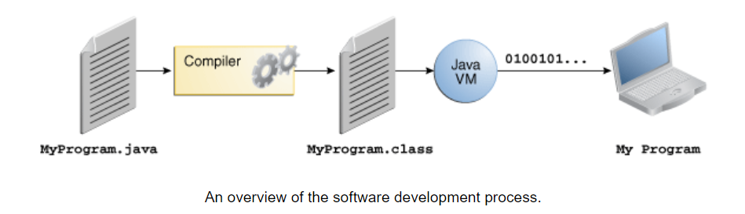
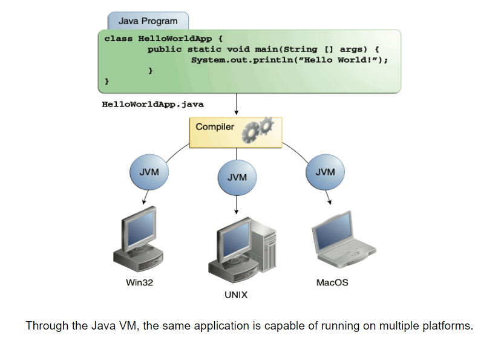
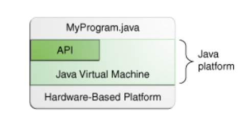

<style>
code {
    font-family: Monaco,Courier,"Courier New";
}    
</style>

## The Java Technology Phenomenon

Talk about Java technology seems to be everywhere, but what exactly is it? The following sections explain how Java technology is both a programming language and a platform, and provide an overview of what this technology can do for you.

### About the Java Technology

Java technology is both a programming language and a platform.

**The Java Programming Language**

The Java programming language is a high-level language that can be characterized by all of the following buzzwords:

- Simple
- Object oriented
- Distributed
- Multithreaded
- Dynamic
- Architecture neutral
- Portable
- High performance
- Robust
- Secure

Each of the preceding buzzwords is explained in *The Java Language Environment* , a white paper written by James Gosling and Henry McGilton.

In the Java programming language, all source code is first written in plain text files ending with the `.java` extension. Those source files are then compiled into `.class` files by the `javac` compiler. A `.class` file does not contain code that is native to your processor; it instead contains bytecodes — the machine language of the Java Virtual Machine<sup>1</sup> (Java VM). The java launcher tool then runs your application with an instance of the Java Virtual Machine.



Because the Java VM is available on many different operating systems, the same `.class` files are capable of running on Microsoft Windows, the Solaris™ Operating System (Solaris OS), Linux, or Mac OS. Some virtual machines, such as the Java SE HotSpot at a Glance, perform additional steps at runtime to give your application a performance boost. This includes various tasks such as finding performance bottlenecks and recompiling (to native code) frequently used sections of code.



**The Java Platform**

A platform is the hardware or software environment in which a program runs. We've already mentioned some of the most popular platforms like Microsoft Windows, Linux, Solaris OS, and Mac OS. Most platforms can be described as a combination of the operating system and underlying hardware. The Java platform differs from most other platforms in that it's a software-only platform that runs on top of other hardware-based platforms.

The Java platform has two components:

- *The Java Virtual Machine*
- *The Java Application Programming Interface (API)*

You've already been introduced to the Java Virtual Machine; it's the base for the Java platform and is ported onto various hardware-based platforms.

The API is a large collection of ready-made software components that provide many useful capabilities. It is grouped into libraries of related classes and interfaces; these libraries are known as packages. The next section, What Can Java Technology Do? highlights some of the functionality provided by the API.



The API and Java Virtual Machine insulate the program from the underlying hardware.

As a platform-independent environment, the Java platform can be a bit slower than native code. However, advances in compiler and virtual machine technologies are bringing performance close to that of native code without threatening portability.

The terms"Java Virtual Machine" and "JVM" mean a Virtual Machine for the Java platform.

### What Can Java Technology Do?

The general-purpose, high-level Java programming language is a powerful software platform. Every full implementation of the Java platform gives you the following features:

- **Development Tools**: The development tools provide everything you'll need for compiling, running, monitoring, debugging, and documenting your applications. As a new developer, the main tools you'll be using are the `javac` compiler, the `java` launcher, and the `javadoc` documentation tool.

- **Application Programming Interface (API)**: The API provides the core functionality of the Java programming language. It offers a wide array of useful classes ready for use in your own applications. It spans everything from basic objects, to networking and security, to XML generation and database access, and more. The core API is very large; to get an overview of what it contains, consult the Java Platform Standard Edition 8 Documentation.

- **Deployment Technologies**: The JDK software provides standard mechanisms such as the Java Web Start software and Java Plug-In software for deploying your applications to end users.

- **User Interface Toolkits**: The JavaFX, Swing, and Java 2D toolkits make it possible to create sophisticated Graphical User Interfaces (GUIs).

- **Integration Libraries**: Integration libraries such as the Java IDL API, JDBC API, Java Naming and Directory Interface (JNDI) API, Java RMI, and Java Remote Method Invocation over Internet Inter-ORB Protocol Technology (Java RMI-IIOP Technology) enable database access and manipulation of remote objects.

### How Will Java Technology Change My Life?

We can't promise you fame, fortune, or even a job if you learn the Java programming language. Still, it is likely to make your programs better and requires less effort than other languages. We believe that Java technology will help you do the following:

- **Get started quickly**: Although the Java programming language is a powerful object-oriented language, it's easy to learn, especially for programmers already familiar with C or C++.

- **Write less code**: Comparisons of program metrics (class counts, method counts, and so on) suggest that a program written in the Java programming language can be four times smaller than the same program written in C++.

- **Write better code**: The Java programming language encourages good coding practices, and automatic garbage collection helps you avoid memory leaks. Its object orientation, its JavaBeans™ component architecture, and its wide-ranging, easily extendible API let you reuse existing, tested code and introduce fewer bugs.

- **Develop programs more quickly**: The Java programming language is simpler than C++, and as such, your development time could be up to twice as fast when writing in it. Your programs will also require fewer lines of code.

- **Avoid platform dependencies**: You can keep your program portable by avoiding the use of libraries written in other languages.

- **Write once, run anywhere**: Because applications written in the Java programming language are compiled into machine-independent bytecodes, they run consistently on any Java platform.

- **Distribute software more easily**: With Java Web Start software, users will be able to launch your applications with a single click of the mouse. An automatic version check at startup ensures that users are always up to date with the latest version of your software. If an update is available, the Java Web Start software will automatically update their installation.

## The "Hello World!" Application

The sections listed below provide detailed instructions for compiling and running as simple "Hello World!" application. The first section provides information on getting started with the NetBean IDE, an integrated developement environment that greatly simplifies the software developement process.The NetBeans IDE runs on all of the platforms listed below. The remaining sections provide platform-specific instructions for getting started without an integrated developement enviranment.If you run into problems, be sure to consult the common problems section; ot provides solution for many issues encountered by new users.

**"Hello World!" for the NetBeans IDE** The instruction are for users of the NetBeans IDE runs on the Java platform ,which means that you can use it with any operating system for which there is a JDK 7 available. These operating systems include Microsoft Windows,Solaris OS,Linux, and Mac OS X. We recomment using the NetBeans IDE instead of the command line whenever possible.

**"Hello WOrld" for Microsoft Windows** These command-line instructions are for users of Windows XP Professional,Windows XP Home,Windows Server 2003,Windows 2000 Professional, and Windows Vista.

**"Hello World!" for solaris OS, Linux, and Mac OS X** These command-line instructions are for users of users of Solaris OS, Linux, and Mac OS X. Comman Problems(and Their Solutions) Consult this page if you have problems compiling or running tour application. 

### "Hello World!" for the NetBeans IDE

It's time to write your first application! These detailed instructions are for users of the NetBeans IDE. The NetBeans IDE runs on the Java platform, which means that you can use it with any operating system for which there is a JDK available. These operating systems include Microsoft Windows, Solaris OS, Linux, and Mac OS X.

- A Checklist
- Creating Your First Application
    - Create an IDE Project
    - Add JDK 8 to the Platform List (if necessary)
    - Add Code to the Generated Source File
    - Compile the Source File
    - Run the Program
- Continuing the Tutorial with the NetBeans IDE

#### A Checklist

To write your first program, you'll need:

1. **The Java SE Development Kit (JDK 7 has been selected in this example)**

    - For Microsoft Windows, Solaris OS, and Linux: **Java SE Downloads Index** page
    - For Mac OS X: developer.apple.com

2. **The NetBeans IDE**

    - For all platforms: **NetBeans IDE Downloads Index** page

#### Creating Your First Application

Creating Your First Application
Your first application, `HelloWorldApp`, will simply display the greeting "Hello World!" To create this program, you will:

- **Create an IDE project**

    When you create an IDE project, you create an environment in which to build and run your applications. Using IDE projects eliminates configuration issues normally associated with developing on the command line. You can build or run your application by choosing a single menu item within the IDE.

- **Add code to the generated source file**

    A source file contains code, written in the Java programming language, that you and other programmers can understand. As part of creating an IDE project, a skeleton source file will be automatically generated. You will then modify the source file to add the "Hello World!" message.

- **Compile the source file into a .class file**

    The IDE invokes the Java programming language compiler (javac), which takes your source file and translates its text into instructions that the Java virtual machine can understand. The instructions contained within this file are known as bytecodes.

- **Run the program**

    The IDE invokes the Java application launcher tool (java), which uses the Java virtual machine to run your application.

**Create an IDE Project**

To create an IDE project:

1. Launch the NetBeans IDE.

    - On Microsoft Windows systems, you can use the NetBeans IDE item in the Start menu.

    - On Solaris OS and Linux systems, you execute the IDE launcher script by navigating to the IDE's `bin` directory and typing `./netbeans`.

    - On Mac OS X systems, click the NetBeans IDE application icon.

2. In the NetBeans IDE, choose File | New Project....

<!-- image -->

3. In the **New Project** wizard, expand the **Java** category and select **Java Application** as shown in the following figure:

<!-- image -->

4. In the **Name and Location** page of the wizard, do the following (as shown in the figure below):

- In the **Project Name** field, type `Hello World App`.

- In the **Create Main Class** field, type `helloworldapp.HelloWorldApp.`

<!-- image -->

5. Click Finish.

The project is created and opened in the IDE. You should see the following components:

- The **Projects** window, which contains a tree view of the components of the project, including source files, libraries that your code depends on, and so on.

- The **Source Editor** window with a file called `HelloWorldApp.java` open.

- The **Navigator** window, which you can use to quickly navigate between elements within the selected class.

<!-- image -->

**Add JDK 8 to the Platform List (if necessary)**

It may be necessary to add JDK 8 to the IDE's list of available platforms. To do this, choose Tools | Java Platforms as shown in the following figure:

<!-- image -->

If you don't see JDK 8 (which might appear as 1.8 or 1.8.0) in the list of installed platforms, click **Add Platform**, navigate to your JDK 8 install directory, and click **Finish**. You should now see this newly added platform:

<!-- image -->

To set this JDK as the default for all projects, you can run the IDE with the --jdkhome switch on the command line, or by entering the path to the JDK in the netbeans_j2sdkhome property of your INSTALLATION_DIRECTORY/etc/netbeans.conf file.

To specify this JDK for the current project only, select **Hello World App** in the Projects pane, choose **File | Project Properties (Hello World App)**, click Libraries, then select **JDK 1.8** in the **Java Platform** pulldown menu. You should see a screen similar to the following:

<!-- image -->

**Add Code to the Generated Source File**

When you created this project, you left the **Create Main Class** checkcbox selected in the **New Project** wizard. The IDE has therefore created a skeleton class for you. You can add the "Hello World!" message to the skeleton code by replacing the line:

    // TODO code application logic here
with the line:

    System.out.println("Hello World!"); // Display the string.

Optionally, you can replace these four lines of generated code:

```java
/**
*
* @author
*/
```

with these lines:
```java
/**
* The HelloWorldApp class implements an application that
* simply prints "Hello World!" to standard output.
*/
```
These four lines are a code comment and do not affect how the program runs. Later sections of this tutorial explain the use and format of code comments.

**Be Careful When You Type**

**Note:** Type all code, commands, and file names exactly as shown. Both the compiler (`javac`) and launcher (`java`) are *case-sensitive*, so you must capitalize consistently.

`HelloWorldApp` is not the same as `helloworldapp`.

Save your changes by choosing File | Save.

The file should look something like the following:
```java
/*
* To change this template, choose Tools | Templates
* and open the template in the editor.
*/
```
package helloworldapp;

```java
/**
* The HelloWorldApp class implements an application that
* simply prints "Hello World!" to standard output.
*/


public class HelloWorldApp {

/**
* @param args the command line arguments
*/

    
    public static void main(String[] args) {

    System.out.println("Hello World!"); // Display thestring.

    }
}
```

**Compile the Source File into a .class File**

To compile your source file, choose **Run | Build Project (Hello World App)** from the IDE's main menu.

The Output window opens and displays output similar to what you see in the following figure:

<!-- image -->

Output window showing results of building the HelloWorld project.

If the build output concludes with the statement `BUILD SUCCESSFUL`, congratulations! You have successfully compiled your program!

If the build output concludes with the statement `BUILD FAILED`, you probably have a syntax error in your code. Errors are reported in the Output window as hyperlinked text. You double-click such a hyperlink to navigate to the source of an error. You can then fix the error and once again choose **Run | Build Project**.

When you build the project, the bytecode file `HelloWorldApp.class` is generated. You can see where the new file is generated by opening the **Files** window and expanding the **Hello World App/build/classes/helloworldapp** node as shown in the following figure.

<!-- image -->

Now that you have built the project, you can run your program.

**Run the Program**

From the IDE's menu bar, choose **Run | Run Main Project**.

The next figure shows what you should now see.

<!-- image -->

Congratulations! Your program works!

#### Continuing the Tutorial with the NetBeans IDE

The next few pages of the tutorial will explain the code in this simple application. After that, the lessons go deeper into core language features and provide many more examples. Although the rest of the tutorial does not give specific instructions about using the NetBeans IDE, you can easily use the IDE to write and run the sample code. The following are some tips on using the IDE and explanations of some IDE behavior that you are likely to see:

- Once you have created a project in the IDE, you can add files to the project using the New File wizard. Choose File | New File, and then select a template in the wizard, such as the Empty Java File template.

- You can compile and run an individual file (as opposed to a whole project) using the IDE's Compile File (F9) and Run File (Shift-F6) commands. If you use the Run Main Project command, the IDE will run the file that the IDE associates as the main class of the main project. Therefore, if you create an additional class in your HelloWorldApp project and then try to run that file with the Run Main Project command, the IDE will run the HelloWorldApp file instead.

- You might want to create separate IDE projects for sample applications that include more than one source file.

- As you are typing in the IDE, a code completion box might periodically appear. You can either ignore the code completion box and keep typing, or you can select one of the suggested expressions. If you would prefer not to have the code completion box automatically appear, you can turn off the feature. Choose Tools | Options | Editor, click the Code Completion tab and clear the Auto Popup Completion Window check box.

- If you want to rename the node for a source file in the Projects window, choose Refactor from IDE's main menu. The IDE prompts you with the Rename dialog box to lead you through the options of renaming the class and the updating of code that refers to that class. Make the changes and click Refactor to apply the changes. This sequence of clicks might seem unnecessary if you have just a single class in your project, but it is very useful when your changes affect other parts of your code in larger projects.

- For a more thorough guide to the features of the NetBeans IDE, see the NetBeans Documentation page.

### "Hello World!" for Microsoft Windows

It's time to write your first application! The following instructions are for users of Windows Vista, Windows 7, and Windows 8. Instructions for other platforms are in **"Hello World!" for Solaris OS, Linux, and Mac OS X and "Hello World!" for the NetBeans IDE.**

If you encounter problems with the instructions on this page, consult the **Common Problems (and Their Solutions).**

- A Checklist
- Creating Your First Application
    - Create a Source File
    - Compile the Source File into a .class File
    - Run the Program

#### A Checklist  

To write your first program, you'll need:

1. **The Java SE Development Kit 8 (JDK 8)**

You can **download the Windows version now**. (Make sure you download the **JDK**, not the JRE.) Consult the installation instructions.

2. **A text editor**

In this example, we'll use Notepad, a simple editor included with the Windows platforms. You can easily adapt these instructions if you use a different text editor.

These two items are all you'll need to write your first application.

#### Creating Your First Application

Your first application, HelloWorldApp, will simply display the greeting "Hello world!". To create this program, you will: 

- **Create a source file**

A source file contains code, written in the Java programming language, that you and other programmers can understand. You can use any text editor to create and edit source files.

- **Compile the source file into a .class file**

The Java programming language compiler (javac) takes your source file and translates its text into instructions that the Java virtual machine can understand. The instructions contained within this file are known as bytecodes.

- **Run the program**

The Java application launcher tool (java) uses the Java virtual machine to run your application.

**Create a Source File**

To create a source file, you have two options:

- You can save the file HelloWorldApp.java on your computer and avoid a lot of typing. Then, you can go straight to Compile the Source File into a .class File.

- Or, you can use the following (longer) instructions.

First, start your editor. You can launch the Notepad editor from the **Start** menu by selecting **Programs > Accessories > Notepad**. In a new document, type in the following code:

```java
/**
* The HelloWorldApp class implements an application that
* simply prints "Hello World!" to standard output.
*/

class HelloWorldApp {

public static void main(String[] args) {

    System.out.println("Hello World!"); // Display the string.   
    }
}

```

**Be Careful When You Type** `A or a`

Note: Type all code, commands, and file names exactly as shown. Both the compiler (`javac`) and launcher (`java`) are case-sensitive, so you must capitalize consistently.

`HelloWorldApp` is not the same as `helloworldapp`.

Save the code in a file with the `name HelloWorldApp.java`. To do this in Notepad, first choose the **File > Save As** ... menu item. Then, in the **Save As** dialog box:

1. Using the Save in combo box, specify the folder (directory) where you'll save your file. In this example, the directory is `myapplication` on the C drive.

2. In the **File name** text field, type "`HelloWorldApp.java`", without the quotation marks.

3. From the `Save as type` combo box, choose **Text Documents (*.txt)**.

4. In the `Encoding` combo box, leave the encoding as ANSI.

When you're finished, the dialog box should look like this.


Now click Save, and exit Notepad.

**Compile the Source File into a .class File**

Bring up a shell, or "command," window. You can do this from the **Start** menu by choosing Run... and then entering `cmd`. The shell window should look similar to the following figure.

The prompt shows your current directory. When you bring up the prompt, your current directory is usually your home directory for Windows XP (as shown in the preceding figure.

To compile your source file, change your current directory to the directory where your file is located. For example, if your source directory is myapplication on the C drive, type the following command at the prompt and press `Enter`:

`cd C:\myapplication`

Now the prompt should change to `C:\myapplication>`.

**Note:**

To change to a directory on a different drive, you must type an extra command: the name of the drive. For example, to change to the `myapplication` directory on the D drive, you must enter D:, as follows:

    C:\>D:

    D:\>cd myapplication

    D:\myapplication>

If you enter dir at the prompt, you should see your source file, as follows:

    C:\>cd myapplication

    C:\myapplication>dir
    Volume in drive C is System
    Volume Serial Number is F2E8-C8CC

    Directory of C:\myapplication

    2014-04-24  01:34 PM    <DIR>          .
    2014-04-24  01:34 PM    <DIR>          ..
    2014-04-24  01:34 PM               267 HelloWorldApp.java
                   1 File(s)            267 bytes
               2 Dir(s)  93,297,991,680 bytes free

    C:\myapplication>

Now you are ready to compile. At the prompt, type the following command and press **Enter**.

    javac HelloWorldApp.java

The compiler has generated a bytecode file, HelloWorldApp.class. At the prompt, type dir to see the new file that was generated as follows:

    C:\myapplication>javac HelloWorldApp.java

    C:\myapplication>dir
    Volume in drive C is System
    Volume Serial Number is F2E8-C8CC

    Directory of C:\myapplication

    2014-04-24  02:07 PM    <DIR>          .
    2014-04-24  02:07 PM    <DIR>          ..
    2014-04-24  02:07 PM               432 HelloWorldApp.class
    2014-04-24  01:34 PM               267 HelloWorldApp.java
                2 File(s)            699 bytes
                2 Dir(s)  93,298,032,640 bytes free

    C:\myapplication>

Now that you have a `.class` file, you can run your program.

If you encounter problems with the instructions in this step, consult the Common Problems (and Their Solutions).

**Run the Program**

In the same directory, enter the following command at the prompt:

    java -cp . HelloWorldApp

You should see the following on your screen:

    C:\myapplication>java -cp . HelloWorldApp
    Hello World!

    C:\myapplication>
    
Congratulations! Your program works!

If you encounter problems with the instructions in this step, consult the Common Problems (and Their Solutions).


### "Hello World!" for Solaris OS, Linux, and Mac OS X


## A Closer Look at "Hello World!"


### Source Code Comments

### The HelloWorldApp Class Definition

### The main Method


## Common Problems (and Their Solutions)


### Compiler Problems

### Runtime Problems
