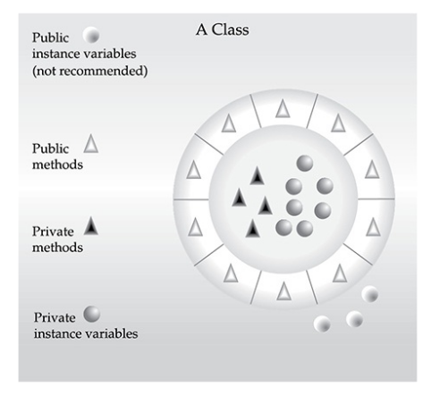
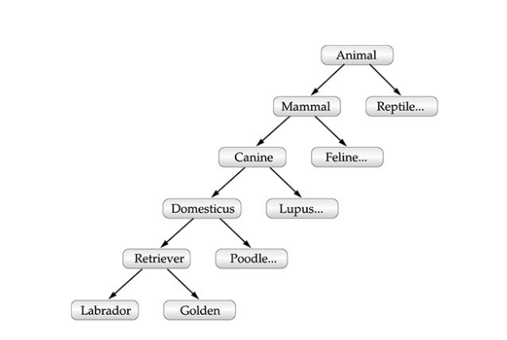
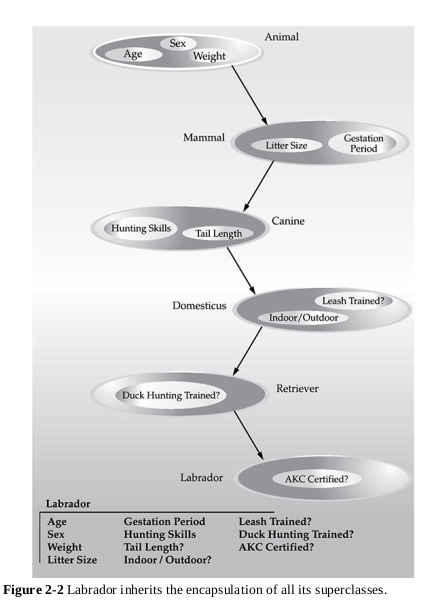
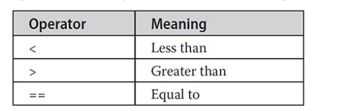
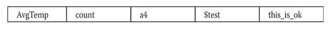
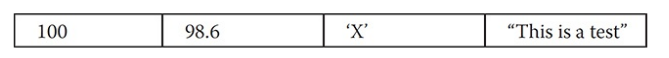
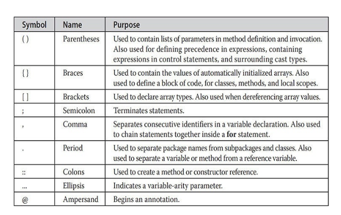
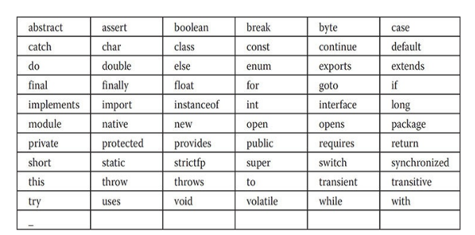

---
title: 'An Overview of Java'
weight: 2
--- 
# An Overview of Java

As in all other computer languages, the elements of Java do not exist in isolation. Rather, they work together to form the language as a whole. However, this interrelatedness can make it difficult to describe one aspect of Java without involving several others. Often a discussion of one feature implies prior knowledge of another. For this reason, this chapter presents a quick overview of several key features of Java. The material described here will give you a foothold that will allow you to write and understand simple programs. Most of the topics discussed will be examined in greater detail in the remaining chapters of Part I.

**Object-Oriented Programming** Object-oriented programming (OOP) is at the core of Java. In fact, all Java programs are to at least some extent object-oriented. OOP is so integral to Java that it is best to understand its basic principles before you begin writing even simple Java programs. Therefore, this chapter begins with a discussion of the theoretical aspects of OOP.

## Two Paradigms

 All computer programs consist of two elements: code and data. Furthermore, a program can be conceptually organized around its code or around its data. That is, some programs are written around “what is happening” and others are written around “who is being affected.” These are the two paradigms that govern how a program is constructed. The first way is called the _process- oriented model_. This approach characterizes a program as a series of linear steps (that is, code). The process-oriented model can be thought of as _code acting on data_. Procedural languages such as C employ this model to considerable success. However, as mentioned in Chapter 1, problems with this approach appear as programs grow larger and more complex.

To manage increasing complexity, the second approach, called _object- oriented programming_, was conceived. Object-oriented programming organizes a program around its data (that is, objects) and a set of well-defined interfaces to that data. An object-oriented program can be characterized as _data controlling access to code_. As you will see, by switching the controlling entity to data, you can achieve several organizational benefits.

## Abstraction

 An essential element of object-oriented programming is abstraction. Humans manage complexity through abstraction. For example, people do not think of a car as a set of tens of thousands of individual parts. They think of it as a well- defined object with its own unique behavior. This abstraction allows people to use a car to drive to the grocery store without being overwhelmed by the complexity of the individual parts. They can ignore the details of how the engine, transmission, and braking systems work. Instead, they are free to utilize the object as a whole.

A powerful way to manage abstraction is through the use of hierarchical classifications. This allows you to layer the semantics of complex systems, breaking them into more manageable pieces. From the outside, the car is a single object. Once inside, you see that the car consists of several subsystems: steering, brakes, sound system, seat belts, heating, cellular phone, and so on. In turn, each of these subsystems is made up of more specialized units. For instance, the sound system might consist of a radio, a CD player, and/or MP3 player. The point is that you manage the complexity of the car (or any other complex system) through the use of hierarchical abstractions.

Hierarchical abstractions of complex systems can also be applied to computer programs. The data from a traditional process-oriented program can be transformed by abstraction into its component objects. A sequence of process steps can become a collection of messages between these objects. Thus, each of these objects describes its own unique behavior. You can treat these objects as concrete entities that respond to messages telling them to _do something_. This is the essence of object-oriented programming.

Object-oriented concepts form the heart of Java just as they form the basis for human understanding. It is important that you understand how these concepts translate into programs. As you will see, object-oriented programming is a powerful and natural paradigm for creating programs that survive the inevitable changes accompanying the life cycle of any major software project, including conception, growth, and aging. For example, once you have well- defined objects and clean, reliable interfaces to those objects, you can gracefully decommission or replace parts of an older system without fear.  

## The Three OOP Principles

 All object-oriented programming languages provide mechanisms that help you implement the object-oriented model. They are encapsulation, inheritance, and polymorphism. Let’s take a look at these concepts now.

### Encapsulation

 Encapsulation is the mechanism that binds together code and the data it manipulates, and keeps both safe from outside interference and misuse. One way to think about encapsulation is as a protective wrapper that prevents the code and data from being arbitrarily accessed by other code defined outside the wrapper. Access to the code and data inside the wrapper is tightly controlled through a well-defined interface. To relate this to the real world, consider the automatic transmission on an automobile. It encapsulates hundreds of bits of information about your engine, such as how much you are accelerating, the pitch of the surface you are on, and the position of the shift lever. You, as the user, have only one method of affecting this complex encapsulation: by moving the gear-shift lever. You can’t affect the transmission by using the turn signal or windshield wipers, for example. Thus, the gear-shift lever is a well-defined (indeed, unique) interface to the transmission. Further, what occurs inside the transmission does not affect objects outside the transmission. For example, shifting gears does not turn on the headlights! Because an automatic transmission is encapsulated, dozens of car manufacturers can implement one in any way they please. However, from the driver’s point of view, they all work the same. This same idea can be applied to programming. The power of encapsulated code is that everyone knows how to access it and thus can use it regardless of the implementation details—and without fear of unexpected side effects.

In Java, the basis of encapsulation is the class. Although the class will be examined in great detail later in this book, the following brief discussion will be helpful now. A class defines the structure and behavior (data and code) that will be shared by a set of objects. Each object of a given class contains the structure and behavior defined by the class, as if it were stamped out by a mold in the shape of the class. For this reason, objects are sometimes referred to as _instances of a class_. Thus, a class is a logical construct; an object has physical reality.

When you create a class, you will specify the code and data that constitute that class. Collectively, these elements are called members of the class.  

Specifically, the data defined by the class are referred to as _member variables_ or _instance variables_. The code that operates on that data is referred to as _member methods_ or just methods. (If you are familiar with C/C++, it may help to know that what a Java programmer calls a method, a C/C++ programmer calls a function.) In properly written Java programs, the methods define how the member variables can be used. This means that the behavior and interface of a class are defined by the methods that operate on its instance data.

Since the purpose of a class is to encapsulate complexity, there are mechanisms for hiding the complexity of the implementation inside the class. Each method or variable in a class may be marked private or public. The public interface of a class represents everything that external users of the class need to know, or may know. The private methods and data can only be accessed by code that is a member of the class. Therefore, any other code that is not a member of the class cannot access a private method or variable. Since the private members of a class may only be accessed by other parts of your program through the class’ public methods, you can ensure that no improper actions take place. Of course, this means that the public interface should be carefully designed not to expose too much of the inner workings of a class (see Figure 2-1).  

**Figure 2-1** Encapsulation: public methods can be used to protect private data.

### Inheritance

 Inheritance is the process by which one object acquires the properties of another object. This is important because it supports the concept of hierarchical classification. As mentioned earlier, most knowledge is made manageable by hierarchical (that is, top-down) classifications. For example, a Golden Retriever is part of the classification dog, which in turn is part of the mammal class, which is under the larger class animal. Without the use of hierarchies, each object would need to define all of its characteristics explicitly. However, by use of inheritance, an object need only define those qualities that make it unique within its class. It can inherit its general attributes from its parent. Thus, it is the inheritance mechanism that makes it possible for one object to be a specific instance of a more general case. Let’s take a closer look at this process.

Most people naturally view the world as made up of objects that are related to each other in a hierarchical way, such as animals, mammals, and dogs. If you wanted to describe animals in an abstract way, you would say they have some attributes, such as size, intelligence, and type of skeletal system. Animals also have certain behavioral aspects; they eat, breathe, and sleep. This description of attributes and behavior is the class definition for animals.

If you wanted to describe a more specific class of animals, such as mammals, they would have more specific attributes, such as type of teeth and mammary glands. This is known as a subclass of animals, where animals are referred to as mammals’ superclass.

Since mammals are simply more precisely specified animals, they inherit all of the attributes from animals. A deeply inherited subclass inherits all of the attributes from each of its ancestors in the _class hierarchy_.

Inheritance interacts with encapsulation as well. If a given class encapsulates some attributes, then any subclass will have the same attributes plus any that it adds as part of its specialization (see Figure 2-2). This is a key concept that lets object-oriented programs grow in complexity linearly rather than geometrically. A new subclass inherits all of the attributes of all of its ancestors. It does not have unpredictable interactions with the majority of the rest of the code in the system.  



### Polymorphism

Polymorphism (from Greek, meaning “many forms”) is a feature that allows one interface to be used for a general class of actions. The specific action is determined by the exact nature of the situation. Consider a stack (which is a last-in, first-out list). You might have a program that requires three types of stacks. One stack is used for integer values, one for floating-point values, and one for characters. The algorithm that implements each stack is the same, even though the data being stored differs. In a non–object-oriented language, you would be required to create three different sets of stack routines, with each set using different names. However, because of polymorphism, in Java you can specify a general set of stack routines that all share the same names.

More generally, the concept of polymorphism is often expressed by the phrase “one interface, multiple methods.” This means that it is possible to design a generic interface to a group of related activities. This helps reduce complexity by allowing the same interface to be used to specify a _general class of action_. It is the compiler’s job to select the _specific action_ (that is, method) as it applies to each situation. You, the programmer, do not need to make this selection manually. You need only remember and utilize the general interface.

Extending the dog analogy, a dog’s sense of smell is polymorphic. If the dog smells a cat, it will bark and run after it. If the dog smells its food, it will salivate and run to its bowl. The same sense of smell is at work in both situations. The difference is what is being smelled, that is, the type of data being operated upon by the dog’s nose! This same general concept can be implemented in Java as it applies to methods within a Java program.

**Polymorphism, Encapsulation, and Inheritance Work Together**  
When properly applied, polymorphism, encapsulation, and inheritance combine to produce a programming environment that supports the development of far more robust and scaleable programs than does the process-oriented model. A well-designed hierarchy of classes is the basis for reusing the code in which you have invested time and effort developing and testing. Encapsulation allows you to migrate your implementations over time without breaking the code that depends on the public interface of your classes. Polymorphism allows you to create clean, sensible, readable, and resilient code.

Of the two real-world examples, the automobile more completely illustrates the power of object-oriented design. Dogs are fun to think about from an inheritance standpoint, but cars are more like programs. All drivers rely on inheritance to drive different types (subclasses) of vehicles. Whether the  

inheritance to drive different types (subclasses) of vehicles. Whether the vehicle is a school bus, a Mercedes sedan, a Porsche, or the family minivan, drivers can all more or less find and operate the steering wheel, the brakes, and the accelerator. After a bit of gear grinding, most people can even manage the difference between a stick shift and an automatic, because they fundamentally understand their common superclass, the transmission.

People interface with encapsulated features on cars all the time. The brake and gas pedals hide an incredible array of complexity with an interface so simple you can operate them with your feet! The implementation of the engine, the style of brakes, and the size of the tires have no effect on how you interface with the class definition of the pedals.

The final attribute, polymorphism, is clearly reflected in the ability of car manufacturers to offer a wide array of options on basically the same vehicle. For example, you can get an antilock braking system or traditional brakes, power or rack-and-pinion steering, and 4-, 6-, or 8-cylinder engines. Either way, you will still press the brake pedal to stop, turn the steering wheel to change direction, and press the accelerator when you want to move. The same interface can be used to control a number of different implementations.

As you can see, it is through the application of encapsulation, inheritance, and polymorphism that the individual parts are transformed into the object known as a car. The same is also true of computer programs. By the application of object-oriented principles, the various parts of a complex program can be brought together to form a cohesive, robust, maintainable whole.

As mentioned at the start of this section, every Java program is object- oriented. Or, put more precisely, every Java program involves encapsulation, inheritance, and polymorphism. Although the short example programs shown in the rest of this chapter and in the next few chapters may not seem to exhibit all of these features, they are nevertheless present. As you will see, many of the features supplied by Java are part of its built-in class libraries, which do make extensive use of encapsulation, inheritance, and polymorphism.

## A First Simple Program

 Now that the basic object-oriented underpinning of Java has been discussed, let’s look at some actual Java programs. Let’s start by compiling and running the short sample program shown here. As you will see, this involves a little more work than you might imagine.  
```
/*
This is a simple Java program.
Call this file "Example.java".
*/
class Example 
{
    // Your program begins with a call to main(). 
    public static void main(String args[]) 
    {
        System.out.println("This is a simple Java program.");
    }
}
```
**NOTE**

 The descriptions that follow use the standard Java SE Development Kit (JDK), which is available from Oracle. (Open source versions are also available.) If you are using an integrated development environment (IDE), then you will need to follow a different procedure for compiling and executing Java programs. In this case, consult your IDE’s documentation for details.

### Entering the Program

 For most computer languages, the name of the file that holds the source code to a program is immaterial. However, this is not the case with Java. The first thing that you must learn about Java is that the name you give to a source file is very important. For this example, the name of the source file should be **Example.java**. Let’s see why.

In Java, a source file is officially called a _compilation unit_. It is a text file that contains (among other things) one or more class definitions. (For now, we will be using source files that contain only one class.) The Java compiler requires that a source file use the **.java** filename extension.

As you can see by looking at the program, the name of the class defined by the program is also **Example**. This is not a coincidence. In Java, all code must reside inside a class. By convention, the name of the main class should match the name of the file that holds the program. You should also make sure that the capitalization of the filename matches the class name. The reason for this is that Java is case-sensitive. At this point, the convention that filenames correspond to class names may seem arbitrary. However, this convention makes it easier to maintain and organize your programs. Furthermore, as you will see later in this book, in some cases, it is required.

### Compiling the Program

To compile the **Example** program, execute the compiler, **javac**, specifying the name of the source file on the command line, as shown here:

C:\\>javac Example.java

The **javac** compiler creates a file called **Example.class** that contains the bytecode version of the program. As discussed earlier, the Java bytecode is the intermediate representation of your program that contains instructions the Java Virtual Machine will execute. Thus, the output of **javac** is not code that can be directly executed.

To actually run the program, you must use the Java application launcher called **java**. To do so, pass the class name **Example** as a command-line argument, as shown here:

C:\\>java Example

When the program is run, the following output is displayed:

This is a simple Java program.

When Java source code is compiled, each individual class is put into its own output file named after the class and using the **.class** extension. This is why it is a good idea to give your Java source files the same name as the class they contain—the name of the source file will match the name of the **.class** file. When you execute **java** as just shown, you are actually specifying the name of the class that you want to execute. It will automatically search for a file by that name that has the **.class** extension. If it finds the file, it will execute the code contained in the specified class.

**NOTE**

 Beginning with JDK 11, Java provides a way to run some types of simple programs directly from a source file, without explicitly invoking **javac**. This technique, which can be useful in some situations, is described in Appendix C. For the purposes of this book, it is assumed that you are using the normal compilation process just described.

### A Closer Look at the First Sample Program

 Although **Example.java** is quite short, it includes several key features that are common to all Java programs. Let’s closely examine each part of the program.

The program begins with the following lines:  
/*
This Is Simple Java Program.
Call this file "Example.java"
*/

This is a comment. Like most other programming languages, Java lets you enter a remark into a program’s source file. The contents of a comment are ignored by the compiler. Instead, a comment describes or explains the operation of the program to anyone who is reading its source code. In this case, the comment describes the program and reminds you that the source file should be called **Example.java**. Of course, in real applications, comments generally explain how some part of the program works or what a specific feature does.

Java supports three styles of comments. The one shown at the top of the program is called a _multiline comment_. This type of comment must begin with /* and end with */. Anything between these two comment symbols is ignored by the compiler. As the name suggests, a multiline comment may be several lines long.

The next line of code in the program is shown here:

class Example {

This line uses the keyword **class** to declare that a new class is being defined. **Example** is an identifier that is the name of the class. The entire class definition, including all of its members, will be between the opening curly brace ({) and the closing curly brace (}). For the moment, don’t worry too much about the details of a class except to note that in Java, all program activity occurs within one. This is one reason why all Java programs are (at least a little bit) object-oriented.

The next line in the program is the _single-line comment_, shown here:
```
// Your program begins with a call to main().
```

This is the second type of comment supported by Java. A _single-line comment_ begins with a // and ends at the end of the line. As a general rule, programmers use multiline comments for longer remarks and single-line comments for brief, line-by-line descriptions. The third type of comment, a _documentation comment_, will be discussed in the “Comments” section later in this chapter.

The next line of code is shown here:
```
public static void main(String args[ ]) {
```  

This line begins the **main()** method. As the comment preceding it suggests, this is the line at which the program will begin executing. As a general rule, a Java program begins execution by calling **main()**. The full meaning of each part of this line cannot be given now, since it involves a detailed understanding of Java’s approach to encapsulation. However, since most of the examples in the first part of this book will use this line of code, let’s take a brief look at each part now.

The **public** keyword is an _access modifier_, which allows the programmer to control the visibility of class members. When a class member is preceded by **public**, then that member may be accessed by code outside the class in which it is declared. (The opposite of **public** is **private**, which prevents a member from being used by code defined outside of its class.) In this case, **main()** must be declared as **public**, since it must be called by code outside of its class when the program is started. The keyword **static** allows **main()** to be called without having to instantiate a particular instance of the class. This is necessary since **main()** is called by the Java Virtual Machine before any objects are made. The keyword **void** simply tells the compiler that **main()** does not return a value. As you will see, methods may also return values. If all this seems a bit confusing, don’t worry. All of these concepts will be discussed in detail in subsequent chapters.

As stated, **main()** is the method called when a Java application begins. Keep in mind that Java is case-sensitive. Thus, **Main** is different from **main**. It is important to understand that the Java compiler will compile classes that do not contain a **main()** method. But **java** has no way to run these classes. So, if you had typed **Main** instead of **main**, the compiler would still compile your program. However, **java** would report an error because it would be unable to find the **main()** method.

Any information that you need to pass to a method is received by variables specified within the set of parentheses that follow the name of the method. These variables are called parameters. If there are no parameters required for a given method, you still need to include the empty parentheses. In **main()**, there is only one parameter, albeit a complicated one. **String args[ ]** declares a parameter named **args**, which is an array of instances of the class **String**. (Arrays are collections of similar objects.) Objects of type **String** store character strings. In this case, **args** receives any command-line arguments present when the program is executed. This program does not make use of this information, but other programs shown later in this book will.

The last character on the line is the {. This signals the start of **main()**’s body. All of the code that comprises a method will occur between the method’s opening curly brace and its closing curly brace.

One other point: **main()** is simply a starting place for your program. A complex program will have dozens of classes, only one of which will need to have a **main()** method to get things started. Furthermore, for some types of programs, you won’t need **main()** at all. However, for most of the programs shown in this book, **main()** is required.

The next line of code is shown here. Notice that it occurs inside **main()**.

```
System.out.println("This is a simple Java program.");
```

This line outputs the string "This is a simple Java program." followed by a new line on the screen. Output is actually accomplished by the built-in **println()** method. In this case, **println()** displays the string which is passed to it. As you will see, **println()** can be used to display other types of information, too. The line begins with **System.out**. While too complicated to explain in detail at this time, briefly, **System** is a predefined class that provides access to the system, and **out** is the output stream that is connected to the console.

As you have probably guessed, console output (and input) is not used frequently in most real-world Java applications. Since most modern computing environments are graphical in nature, console I/O is used mostly for simple utility programs, demonstration programs, and server-side code. Later in this book, you will learn other ways to generate output using Java. But for now, we will continue to use the console I/O methods.

Notice that the **println()** statement ends with a semicolon. Many statements in Java end with a semicolon. As you will see, the semicolon is an important part of the Java syntax.

The first } in the program ends **main()**, and the last } ends the **Example** class definition.

## A Second Short Program

 Perhaps no other concept is more fundamental to a programming language than that of a variable. As you may know, a variable is a named memory location that may be assigned a value by your program. The value of a variable may be changed during the execution of the program. The next program shows how a variable is declared and how it is assigned a value. The program also illustrates some new aspects of console output. As the comments at the top of the program  

state, you should call this file **Example2.java**.
```
/*
Here is another short example. Call this file "Example2.java".
*/
class Example2 
{ 
    public static void main(String args []) 
    { 
        int num; // this declares a variable called num
        num = 100; // this assigns num the value 100
        System.out.println("This is num: " + num);
        num = num * 2;
        System.out.print ("The value of num 2 is "); 
        System.out.println (num);
    }
}
```
When you run this program, you will see the following output:
```
This is num: 100

The value of num * 2 is 200
```
Let’s take a close look at why this output is generated. The first new line in the program is shown here:

int num; // this declares a variable called num

This line declares an integer variable called **num**. Java (like most other languages) requires that variables be declared before they are used.

Following is the general form of a variable declaration:

_type var-name;_

Here, type specifies the type of variable being declared, and _var-name_ is the name of the variable. If you want to declare more than one variable of the specified type, you may use a comma-separated list of variable names. Java defines several data types, including integer, character, and floating-point. The keyword **int** specifies an integer type.

In the program, the line

num = 100; // this assigns num the value 100

assigns to **num** the value 100. In Java, the assignment operator is a single equal sign.

The next line of code outputs the value of **num** preceded by the string "This is num:".

System.out.println("This is num: " + num);

In this statement, the plus sign causes the value of **num** to be appended to the string that precedes it, and then the resulting string is output. (Actually, **num** is first converted from an integer into its string equivalent and then concatenated with the string that precedes it. This process is described in detail later in this book.) This approach can be generalized. Using the + operator, you can join together as many items as you want within a single **println()** statement.

The next line of code assigns **num** the value of **num** times 2. Like most other languages, Java uses the * operator to indicate multiplication. After this line executes, **num** will contain the value 200.

Here are the next two lines in the program:
```
System.out.print ("The value of num * 2 is ");

System.out.println (num);
```
Several new things are occurring here. First, the built-in method **print()** is used to display the string "The value of num * 2 is ". This string is not followed by a newline. This means that when the next output is generated, it will start on the same line. The **print()** method is just like **println()**, except that it does not output a newline character after each call. Now look at the call to **println()**. Notice that **num** is used by itself. Both **print()** and **println()** can be used to output values of any of Java’s built-in types.

## Two Control Statements

 Although Chapter 5 will look closely at control statements, two are briefly introduced here so that they can be used in example programs in Chapters 3 and  

4. They will also help illustrate an important aspect of Java: blocks of code.

### The if Statement

 The Java **if** statement works much like the IF statement in any other language. It determines the flow of execution based on whether some condition is true or false. Its simplest form is shown here:

if_(condition) statement;_

Here, condition is a Boolean expression. (A Boolean expression is one that evaluates to either true or false.) If condition is true, then the statement is executed. If condition is false, then the statement is bypassed. Here is an example:
```
if(num < 100) 
System.out.println("num is less than 100");
```
In this case, if **num** contains a value that is less than 100, the conditional expression is true, and **println()** will execute. If **num** contains a value greater than or equal to 100, then the **println()** method is bypassed.

As you will see in Chapter 4, Java defines a full complement of relational operators which may be used in a conditional expression. Here are a few:

Notice that the test for equality is the double equal sign. Here is a program that illustrates the **if** statement:  
```
/*
Demonstrate the if.
Call this file "IfSample.java".
*/
class IfSample 
{
    public static void main(String args[]) 
    {
        int x, y;
        X = 10;
        y = 20;
        if (x < y) 
        System.out.println("x is less than y");
        X = x * 2;
        if (x == y) 
        System.out.println("x now equal to y"); 
        X = X * 2;
        if (x > y) 
        System.out.println("x now greater than y");
        
        // this won't display anything
        if (x == y) 
        System.out.println("you won't see this");
    }
}
```
The output generated by this program is shown here:
```
x is less than y

x now equal to y

x now greater than y

```
Notice one other thing in this program. The line
```
int x, y;
```
declares two variables, **x** and **y**, by use of a comma-separated list.

### The for Loop

 Loop statements are an important part of nearly any programming language because they provide a way to repeatedly execute some task. As you will see in Chapter 5, Java supplies a powerful assortment of loop constructs. Perhaps the most versatile is the **for** loop. The simplest form of the **for** loop is shown here:
```
for (initialization; condition; iteration) statement;
```

In its most common form, the initialization portion of the loop sets a loop control variable to an initial value. The condition is a Boolean expression that tests the loop control variable. If the outcome of that test is true, statement executes and the **for** loop continues to iterate. If it is false, the loop terminates. The iteration expression determines how the loop control variable is changed each time the loop iterates. Here is a short program that illustrates the **for** loop:
```
/*
Demonstrate the for loop .
Call this file "ForTest.java".
*/
class ForTest 
{
    public static void main(String args[]) 
    {
        int x;
        for( x = 0 ; x < 10 ; x = x + 1 )
            System.out.println("This Is X : "+x);
    }
}
```
This program generates the following output:
```
This is x: 0

This is x: 1

This is x: 2

This is x: 3

This is x: 4

This is x: 5

This is x: 6

This is x: 7

This is x: 8

This is x: 9
```
In this example, **x** is the loop control variable. It is initialized to zero in the initialization portion of the **for**. At the start of each iteration (including the first one), the conditional test **x < 10** is performed. If the outcome of this test is true, the **println()** statement is executed, and then the iteration portion of the loop is executed, which increases **x** by 1. This process continues until the conditional test is false.

As a point of interest, in professionally written Java programs you will almost never see the iteration portion of the loop written as shown in the preceding program. That is, you will seldom see statements like this:

x = x + 1;

The reason is that Java includes a special increment operator which performs this operation more efficiently. The increment operator is ++. (That is, two plus signs back to back.) The increment operator increases its operand by one. By use of the increment operator, the preceding statement can be written like this:

x++;

Thus, the **for** in the preceding program will usually be written like this:

for(x = 0; x<10; x++)

You might want to try this. As you will see, the loop still runs exactly the same as it did before.

Java also provides a decrement operator, which is specified as – –. This operator decreases its operand by one.

## Using Blocks of Code

 Java allows two or more statements to be grouped into _blocks of code_, also called _code blocks_. This is done by enclosing the statements between opening and closing curly braces. Once a block of code has been created, it becomes a logical unit that can be used any place that a single statement can. For example, a block can be a target for Java’s **if** and **for** statements. Consider this **if** statement:  
```
if(x<y) //Begin Of The Block
{
    x=y;
    y=0;
}//End Of The Block
```
Here, if **x** is less than **y**, then both statements inside the block will be executed. Thus, the two statements inside the block form a logical unit, and one statement cannot execute without the other also executing. The key point here is that whenever you need to logically link two or more statements, you do so by creating a block.

Let’s look at another example. The following program uses a block of code as the target of a **for** loop.
```
/*
Demonstrate a block of code.
Call this file "BlockTest.java" */
class BlockTest 
{ 
    public static void main(String args[]) 
    { 
        int x, y;
        y = 20;
        // the target of this loop is a block 
        for (x = 0; x<10; x++) 
        {
            System.out.println("This is x: + x); 
            System.out.println("This is y: " + y);
            y = y 2;
        }
    }
}
```
The output generated by this program is shown here:
```
This is x: 0

This is y: 20

This is x: 1

This is y: 18

This is x: 2

This is y: 16

This is x: 3

This is y: 14

This is x: 4

This is y: 12

This is x: 5

This is y: 10  

This is x: 6

This is y: 8

This is x: 7

This is y: 6

This is x: 8

This is y: 4

This is x: 9

This is y: 2
```
In this case, the target of the **for** loop is a block of code and not just a single statement. Thus, each time the loop iterates, the three statements inside the block will be executed. This fact is, of course, evidenced by the output generated by the program.

As you will see later in this book, blocks of code have additional properties and uses. However, the main reason for their existence is to create logically inseparable units of code.

### Lexical Issues

 Now that you have seen several short Java programs, it is time to more formally describe the atomic elements of Java. Java programs are a collection of whitespace, identifiers, literals, comments, operators, separators, and keywords. The operators are described in the next chapter. The others are described next.

### Whitespace

 Java is a free-form language. This means that you do not need to follow any special indentation rules. For instance, the **Example** program could have been written all on one line or in any other strange way you felt like typing it, as long as there was at least one whitespace character between each token that was not already delineated by an operator or separator. In Java, whitespace includes a space, tab, newline, or form feed.

### Identifiers

 Identifiers are used to name things, such as classes, variables, and methods. An identifier may be any descriptive sequence of uppercase and lowercase letters, numbers, or the underscore and dollar-sign characters. (The dollar-sign character is not intended for general use.) They must not begin with a number,  

lest they be confused with a numeric literal. Again, Java is case-sensitive, so **VALUE** is a different identifier than **Value**. Some examples of valid identifiers are

Invalid identifier names include these:


**NOTE**

 Beginning with JDK 9, the underscore cannot be used by itself as an identifier.

### Literals

 A constant value in Java is created by using a literal representation of it. For example, here are some literals:

Left to right, the first literal specifies an integer, the next is a floating-point value, the third is a character constant, and the last is a string. A literal can be used anywhere a value of its type is allowed.

### Comments

 As mentioned, there are three types of comments defined by Java. You have already seen two: single-line and multiline. The third type is called a _documentation comment_. This type of comment is used to produce an HTML file that documents your program. The documentation comment begins with a /** and ends with a */. Documentation comments are explained in Appendix A.

### Separators

 In Java, there are a few characters that are used as separators. The most commonly used separator in Java is the semicolon. As you have seen, it is often used to terminate statements. The separators are shown in the following table:  


### The Java Keywords

 There are 61 keywords currently defined in the Java language (see Table 2-1). These keywords, combined with the syntax of the operators and separators, form the foundation of the Java language. In general, these keywords cannot be used as identifiers, meaning that they cannot be used as names for a variable, class, or method. The exceptions to this rule are the context-sensitive keywords added by JDK 9 to support modules. (See Chapter 16 for details.) Also, beginning with JDK 9, an underscore by itself is considered a keyword in order to prevent its use as the name of something in your program.  

**Table 2-1** Java Keywords

The keywords **const** and **goto** are reserved but not used. In the early days of Java, several other keywords were reserved for possible future use. However, the current specification for Java defines only the keywords shown in Table 2- 1.

In addition to the keywords, Java reserves four other names. Three have been part of Java from the start: **true**, **false**, and **null**. These are values defined by Java. You may not use these words for the names of variables, classes, and so on. Beginning with JDK 10, the word **var** has been added as a context- sensitive, reserved type name. (See Chapter 3 for more details on **var**.)

## The Java Class Libraries

 The sample programs shown in this chapter make use of two of Java’s built-in methods: **println()** and **print()**. As mentioned, these methods are available through **System.out.System** is a class predefined by Java that is automatically included in your programs. In the larger view, the Java environment relies on several built-in class libraries that contain many built-in methods that provide support for such things as I/O, string handling, networking, and graphics. The standard classes also provide support for a graphical user interface (GUI). Thus, Java as a totality is a combination of the Java language itself, plus its standard classes. As you will see, the class libraries provide much of the functionality that comes with Java. Indeed, part of becoming a Java programmer is learning to use the standard Java classes. Throughout Part I of this book, various elements of the standard library classes and methods are described as needed. In Part II, several class libraries are described in detail.  