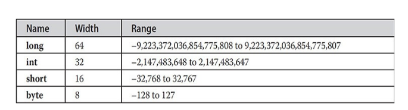
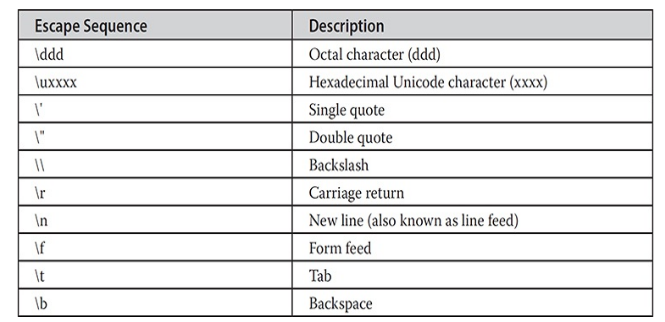
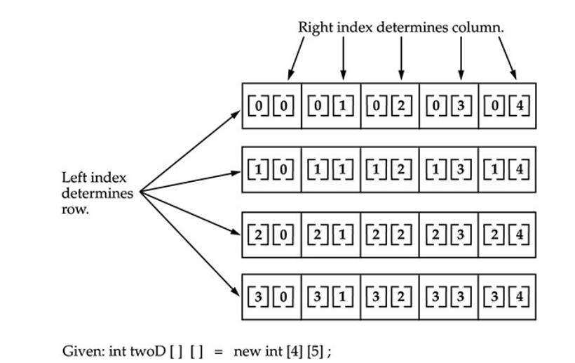
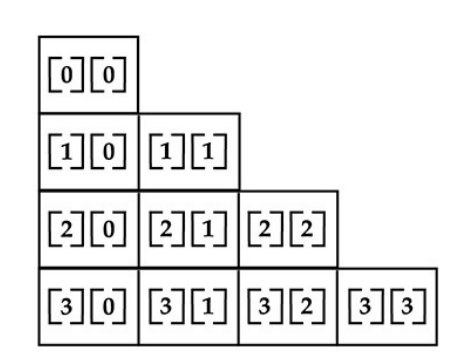

---
title: 'Data Types, Variables, and Arrays'
weight: 3
--- 

# Data Types, Variables, and Arrays

This chapter examines three of Java’s most fundamental elements: data types, variables, and arrays. As with all modern programming languages, Java supports several types of data. You may use these types to declare variables and to create arrays. As you will see, Java’s approach to these items is clean, efficient, and cohesive.

## Java Is a Strongly Typed Language

It is important to state at the outset that Java is a strongly typed language. Indeed, part of Java’s safety and robustness comes from this fact. Let’s see what this means. First, every variable has a type, every expression has a type, and every type is strictly defined. Second, all assignments, whether explicit or via parameter passing in method calls, are checked for type compatibility. There are no automatic coercions or conversions of conflicting types as in some languages. The Java compiler checks all expressions and parameters to ensure that the types are compatible. Any type mismatches are errors that must be corrected before the compiler will finish compiling the class.

## The Primitive Types

Java defines eight primitive types of data: **byte**, **short**, **int**, **long**, **char**, **float**, **double**, and **boolean**. The primitive types are also commonly referred to as simple types, and both terms will be used in this book. These can be put in four groups:

- **Integers** This group includes **byte**, **short**, **int**, and **long**, which are for whole-valued signed numbers.

- **Floating-point numbers** This group includes **float** and **double**, which represent numbers with fractional precision.

- **Characters** This group includes **char**, which represents symbols in a character set, like letters and numbers.

- **Boolean** This group includes **boolean**, which is a special type for representing true/false values.

You can use these types as-is, or to construct arrays or your own class types. Thus, they form the basis for all other types of data that you can create.

The primitive types represent single values—not complex objects. Although Java is otherwise completely object-oriented, the primitive types are not. They are analogous to the simple types found in most other non–object-oriented languages. The reason for this is efficiency. Making the primitive types into objects would have degraded performance too much.

The primitive types are defined to have an explicit range and mathematical behavior. Languages such as C and C++ allow the size of an integer to vary based upon the dictates of the execution environment. However, Java is different. Because of Java’s portability requirement, all data types have a strictly defined range. For example, an **int** is always 32 bits, regardless of the particular platform. This allows programs to be written that are guaranteed to run _without porting_ on any machine architecture. While strictly specifying the size of an integer may cause a small loss of performance in some environments, it is necessary in order to achieve portability.

Let’s look at each type of data in turn.

### Integers

Java defines four integer types: **byte**, **short**, **int**, and **long**. All of these are signed, positive and negative values. Java does not support unsigned, positive- only integers. Many other computer languages support both signed and unsigned integers. However, Java’s designers felt that unsigned integers were unnecessary. Specifically, they felt that the concept of unsigned was used mostly to specify the behavior of the _high-order bit_, which defines the sign of an integer value. As you will see in Chapter 4, Java manages the meaning of the high-order bit differently, by adding a special “unsigned right shift” operator. Thus, the need for an unsigned integer type was eliminated.

The width of an integer type should not be thought of as the amount of storage it consumes, but rather as the behavior it defines for variables and expressions of that type. The Java run-time environment is free to use whatever size it wants, as long as the types behave as you declared them. The width and ranges of these integer types vary widely, as shown in this table:  

Let’s look at each type of integer.

#### byte

The smallest integer type is **byte**. This is a signed 8-bit type that has a range from –128 to 127. Variables of type **byte** are especially useful when you’re working with a stream of data from a network or file. They are also useful when you’re working with raw binary data that may not be directly compatible with Java’s other built-in types.

Byte variables are declared by use of the **byte** keyword. For example, the following declares two **byte** variables called **b** and **c**:
```
byte b, c;
```

#### short

**short** is a signed 16-bit type. It has a range from –32,768 to 32,767. It is probably the least-used Java type. Here are some examples of **short** variable declarations:
```
short s;

short t;
```

#### int

The most commonly used integer type is **int**. It is a signed 32-bit type that has a range from –2,147,483,648 to 2,147,483,647. In addition to other uses, variables of type **int** are commonly employed to control loops and to index arrays. Although you might think that using a **byte** or **short** would be more efficient than using an **int** in situations in which the larger range of an **int** is not needed, this may not be the case. The reason is that when **byte** and **short** values are used in an expression, they are promoted to **int** when the expression is evaluated. (Type promotion is described later in this chapter.) Therefore, **int** is often the best choice when an integer is needed.

#### long

**long** is a signed 64-bit type and is useful for those occasions where an **int** type is not large enough to hold the desired value. The range of a **long** is quite large. This makes it useful when big, whole numbers are needed. For example, here is a program that computes the number of miles that light will travel in a specified number of days:
```
// Compute distance light travels using long variables. 
class Light 
{
    public static void main(String args[]) 
    {
        int lightspeed;
        long days;
        long seconds;
        long distance;
        
        // approximate speed of light in miles per second 
        lightspeed = 186000;
        days = 1000; // specify number of days here
        seconds = days* 24 * 60 * 60; // convert to seconds 
        distance = lightspeed * seconds; // compute distance
        System.out.print ("In " + days);
        System.out.print (" days light will travel about "); 
        System.out.println (distance + " miles.");
    }
}
```
This program generates the following output:
```
In 1000 days light will travel about 16070400000000 miles.
```
Clearly, the result could not have been held in an **int** variable.

**Floating-Point Types**  

**Floating-Point Types** Floating-point numbers, also known as real numbers, are used when evaluating expressions that require fractional precision. For example, calculations such as square root, or transcendentals such as sine and cosine, result in a value whose precision requires a floating-point type. Java implements the standard (IEEE– 754) set of floating-point types and operators. There are two kinds of floating- point types, **float** and **double**, which represent single- and double-precision numbers, respectively. Their width and ranges are shown here:

Each of these floating-point types is examined next.

### float

The type **float** specifies a _single-precision_ value that uses 32 bits of storage. Single precision is faster on some processors and takes half as much space as double precision, but will become imprecise when the values are either very large or very small. Variables of type **float** are useful when you need a fractional component, but don’t require a large degree of precision. For example, **float** can be useful when representing dollars and cents.

Here are some example **float** variable declarations:
```
float hightemp, lowtemp;
```

### double

Double precision, as denoted by the **double** keyword, uses 64 bits to store a value. Double precision is actually faster than single precision on some modern processors that have been optimized for high-speed mathematical calculations. All transcendental math functions, such as **sin()**, **cos()**, and **sqrt()**, return **double** values. When you need to maintain accuracy over many iterative calculations, or are manipulating large-valued numbers, **double** is the best choice.

Here is a short program that uses **double** variables to compute the area of a circle:  
```
// Compute the area of a circle. 
class Area 
{ 
    public static void main(String args[]) 
    { 
        double pi, r, a;
        r = 10.8; // radius of circle 
        pi = 3.1416; // pi, approximately 
        a = pi* r * r; // compute area
        System.out.println("Area of circle is " + a);
    }
}
```
### Characters

In Java, the data type used to store characters is **char**. A key point to understand is that Java uses Unicode to represent characters. Unicode defines a fully international character set that can represent all of the characters found in all human languages. It is a unification of dozens of character sets, such as Latin, Greek, Arabic, Cyrillic, Hebrew, Katakana, Hangul, and many more. At the time of Java’s creation, Unicode required 16 bits. Thus, in Java **char** is a 16-bit type. The range of a **char** is 0 to 65,536. There are no negative **char**s. The standard set of characters known as ASCII still ranges from 0 to 127 as always, and the extended 8-bit character set, ISO-Latin-1, ranges from 0 to 255. Since Java is designed to allow programs to be written for worldwide use, it makes sense that it would use Unicode to represent characters. Of course, the use of Unicode is somewhat inefficient for languages such as English, German, Spanish, or French, whose characters can easily be contained within 8 bits. But such is the price that must be paid for global portability.

**NOTE**

 More information about Unicode can be found at http://www.unicode.org.

Here is a program that demonstrates **char** variables:  

```
// Demonstrate char data type.
class CharDemo 
{ 
    public static void main(String args[]) 
    { 
        char ch1, ch2;

        ch1 88; // code for X 
        ch2 = 'Y';

        System.out.print ("ch1 and ch2: "); 
        System.out.println(chl + " " + ch2);
    }
}
```
This program displays the following output:
```
ch1 and ch2: X Y
```
Notice that **ch1** is assigned the value 88, which is the ASCII (and Unicode) value that corresponds to the letter X. As mentioned, the ASCII character set occupies the first 127 values in the Unicode character set. For this reason, all the “old tricks” that you may have used with characters in other languages will work in Java, too.

Although **char** is designed to hold Unicode characters, it can also be used as an integer type on which you can perform arithmetic operations. For example, you can add two characters together, or increment the value of a character variable. Consider the following program:
```
// char variables behave like integers. 
class CharDemo2 
{
    public static void main(String args[]) 
    { 
        char ch1;
        chl = 'X';
        
        System.out.println("ch1 contains " + ch1);
        
        chl++; // increment chl 
        System.out.println("chl is now " + chl) ;
    }
}
```
The output generated by this program is shown here:  
```
ch1 contains X

ch1 is now Y
```

In the program, **ch1** is first given the value X. Next, **ch1** is incremented. This results in **ch1** containing Y, the next character in the ASCII (and Unicode) sequence.

**NOTE**

 In the formal specification for Java, **char** is referred to as an _integral type_, which means that it is in the same general category as **int**, **short**, **long**, and **byte**. However, because its principal use is for representing Unicode characters, **char** is commonly considered to be in a category of its own.

### Booleans

Java has a primitive type, called **boolean**, for logical values. It can have only one of two possible values, **true** or **false**. This is the type returned by all relational operators, as in the case of **a < b**. **boolean** is also the type required by the conditional expressions that govern the control statements such as **if** and **for**.

Here is a program that demonstrates the **boolean** type:  
```
// Demonstrate boolean values.
class BoolTest 
{ 
    public static void main(String args[]) 
    { 
        boolean b;
        
        b = false;
        System.out.println("b is " + b);
        
        b = true;
        System.out.println("b is " + b);
        
        // a boolean value can control the if statement 
        if (b) 
            System.out.println("This is executed.");
        
        b = false;
        if (b) 
            System.out.println("This is not executed.");
        
        // outcome of a relational operator is a boolean value 
        System.out.println("10 > 9 is " + (10 > 9));
    }
}
```
The output generated by this program is shown here:
```
b is false

b is true

This is executed.

10 > 9 is true
```
There are three interesting things to notice about this program. First, as you can see, when a **boolean** value is output by **println()**, "true" or "false" is displayed. Second, the value of a **boolean** variable is sufficient, by itself, to control the **if** statement. There is no need to write an **if** statement like this:
```
if(b == true) …
```
Third, the outcome of a relational operator, such as **<**, is a **boolean** value. This is why the expression **10>9** displays the value "true." Further, the extra set of parentheses around **10>9** is necessary because the **+** operator has a higher precedence than the **\>**.

## A Closer Look at Literals

Literals were mentioned briefly in Chapter 2. Now that the built-in types have been formally described, let’s take a closer look at them.

### Integer Literals

Integers are probably the most commonly used type in the typical program. Any whole number value is an integer literal. Examples are 1, 2, 3, and 42. These are all decimal values, meaning they are describing a base 10 number. Two other bases that can be used in integer literals are octal (base eight) and hexadecimal (base 16). Octal values are denoted in Java by a leading zero. Normal decimal numbers cannot have a leading zero. Thus, the seemingly valid value 09 will produce an error from the compiler, since 9 is outside of octal’s 0 to 7 range. A more common base for numbers used by programmers is hexadecimal, which matches cleanly with modulo 8 word sizes, such as 8, 16, 32, and 64 bits. You signify a hexadecimal constant with a leading zero-x, (**0x** or **0X**). The range of a hexadecimal digit is 0 to 15, so A through F (or a through f) are substituted for 10 through 15.

Integer literals create an **int** value, which in Java is a 32-bit integer value. Since Java is strongly typed, you might be wondering how it is possible to assign an integer literal to one of Java’s other integer types, such as **byte** or **long**, without causing a type mismatch error. Fortunately, such situations are easily handled. When a literal value is assigned to a **byte** or **short** variable, no error is generated if the literal value is within the range of the target type. An integer literal can always be assigned to a **long** variable. However, to specify a **long** literal, you will need to explicitly tell the compiler that the literal value is of type **long**. You do this by appending an upper- or lowercase L to the literal. For example, 0x7ffffffffffffffL or 9223372036854775807L is the largest **long**. An integer can also be assigned to a **char** as long as it is within range.

You can also specify integer literals using binary. To do so, prefix the value with **0b** or **0B**. For example, this specifies the decimal value 10 using a binary literal:
```
int x = 0b1010;
```
Among other uses, the addition of binary literals makes it easier to enter values used as bitmasks. In such a case, the decimal (or hexadecimal) representation of the value does not visually convey its meaning relative to its use. The binary literal does.  

You can embed one or more underscores in an integer literal. Doing so makes it easier to read large integer literals. When the literal is compiled, the underscores are discarded. For example, given
```
int x = 123_456_789;
```
the value given to **x** will be 123,456,789. The underscores will be ignored. Underscores can only be used to separate digits. They cannot come at the beginning or the end of a literal. It is, however, permissible for more than one underscore to be used between two digits. For example, this is valid:
```
int x = 123___456___789;
```
The use of underscores in an integer literal is especially useful when encoding such things as telephone numbers, customer ID numbers, part numbers, and so on. They are also useful for providing visual groupings when specifying binary literals. For example, binary values are often visually grouped in four-digits units, as shown here:
```
int x = 0b1101_0101_0001_1010;
```
**Floating-Point Literals** Floating-point numbers represent decimal values with a fractional component. They can be expressed in either standard or scientific notation. _Standard notation_ consists of a whole number component followed by a decimal point followed by a fractional component. For example, 2.0, 3.14159, and 0.6667 represent valid standard-notation floating-point numbers. _Scientific notation_ uses a standard-notation, floating-point number plus a suffix that specifies a power of 10 by which the number is to be multiplied. The exponent is indicated by an E or e followed by a decimal number, which can be positive or negative. Examples include 6.022E23, 314159E–05, and 2e+100.

Floating-point literals in Java default to **double** precision. To specify a **float** literal, you must append an F or f to the constant. You can also explicitly specify a **double** literal by appending a D or d. Doing so is, of course, redundant. The default **double** type consumes 64 bits of storage, while the smaller **float** type requires only 32 bits.

Hexadecimal floating-point literals are also supported, but they are rarely used. They must be in a form similar to scientific notation, but a **P** or **p**, rather than an **E** or **e**, is used. For example, 0x12.2P2 is a valid floating-point literal.  

The value following the **P**, called the _binary exponent_, indicates the power-of- two by which the number is multiplied. Therefore, **0x12.2P2** represents 72.5.

You can embed one or more underscores in a floating-point literal. This feature works the same as it does for integer literals, which were just described. Its purpose is to make it easier to read large floating-point literals. When the literal is compiled, the underscores are discarded. For example, given
```
double num = 9_423_497_862.0;
```
the value given to **num** will be 9,423,497,862.0. The underscores will be ignored. As is the case with integer literals, underscores can only be used to separate digits. They cannot come at the beginning or the end of a literal. It is, however, permissible for more than one underscore to be used between two digits. It is also permissible to use underscores in the fractional portion of the number. For example,
```
double num = 9_423_497.1_0_9;
```
is legal. In this case, the fractional part is **.109**.

### Boolean Literals

Boolean literals are simple. There are only two logical values that a **boolean** value can have, **true** and **false**. The values of **true** and **false** do not convert into any numerical representation. The **true** literal in Java does not equal 1, nor does the **false** literal equal 0. In Java, the Boolean literals can only be assigned to variables declared as **boolean** or used in expressions with Boolean operators.

### Character Literals

Characters in Java are indices into the Unicode character set. They are 16-bit values that can be converted into integers and manipulated with the integer operators, such as the addition and subtraction operators. A literal character is represented inside a pair of single quotes. All of the visible ASCII characters can be directly entered inside the quotes, such as 'a', 'z', and '@'. For characters that are impossible to enter directly, there are several escape sequences that allow you to enter the character you need, such as ' \\' ' for the single-quote character itself and ' \**n**' for the newline character. There is also a mechanism for directly entering the value of a character in octal or hexadecimal. For octal notation, use the backslash followed by the three-digit number. 

For example, '\141' is the letter 'a'. For hexadecimal, you enter a backslash-u ( **\u**), then exactly four hexadecimal digits. For example, ' \_u0061_' is the ISO-Latin-1 'a' because the top byte is zero. ' \_ua432_ ' is a Japanese Katakana character. Table 3-1 shows the character escape sequences.

**Table 3-1** Character Escape Sequences

### String Literals

 String literals in Java are specified like they are in most other languages—by enclosing a sequence of characters between a pair of double quotes. Examples of string literals are
```
"Hello World" 
"two\\nlines" 
" \\"This is in quotes\\""
```

The escape sequences and octal/hexadecimal notations that were defined for character literals work the same way inside of string literals. One important thing to note about Java strings is that they must begin and end on the same line. There is no line-continuation escape sequence as there is in some other languages.

**NOTE**

 As you may know, in some other languages strings are implemented as arrays of characters. However, this is not the case in Java. Strings are actually object types. As you will see later in this book, because Java implements strings as objects, Java includes extensive string-handling capabilities that are both powerful and easy to use.

## Variables

 The variable is the basic unit of storage in a Java program. A variable is defined by the combination of an identifier, a type, and an optional initializer. In addition, all variables have a scope, which defines their visibility, and a lifetime. These elements are examined next.

### Declaring a Variable

 In Java, all variables must be declared before they can be used. The basic form of a variable declaration is shown here:
```
type identifier [ = value ][, identifier [= value ] …];
```
Here, type is one of Java’s atomic types, or the name of a class or interface. (Class and interface types are discussed later in Part I of this book.) The identifier is the name of the variable. You can initialize the variable by specifying an equal sign and a value. Keep in mind that the initialization expression must result in a value of the same (or compatible) type as that specified for the variable. To declare more than one variable of the specified type, use a comma-separated list.

Here are several examples of variable declarations of various types. Note that some include an initialization.
```
int a, b, c;                // declares three ints, a, b, and c.
int d = 3, e, f = 5;        // declares three more ints, initializing 
                            // d and f.
byte z 22;                  // initializes z.
double pi = 3.14159;       // declares an approximation of pi.
char x = 'x';              // the variable x has the value 'x'.

```
The identifiers that you choose have nothing intrinsic in their names that indicates their type. Java allows any properly formed identifier to have any declared type.

### Dynamic Initialization

Although the preceding examples have used only constants as initializers, Java allows variables to be initialized dynamically, using any expression valid at the allows variables to be initialized dynamically, using any expression valid at the time the variable is declared.

For example, here is a short program that computes the length of the hypotenuse of a right triangle given the lengths of its two opposing sides:
```
// Demonstrate dynamic initialization.
class DynInit 
{ 
    public static void main(String args[]) 
    { 
        double a = 3.0, b = 4.0;
        // c is dynamically initialized 
        double c = Math.sqrt(a* a + b * b);
        System.out.println("Hypotenuse is " + c);
    }
}
```
Here, three local variables—**a**, **b**, and **c**—are declared. The first two, **a** and **b**, are initialized by constants. However, **c** is initialized dynamically to the length of the hypotenuse (using the Pythagorean theorem). The program uses another of Java’s built-in methods, **sqrt()**, which is a member of the **Math** class, to compute the square root of its argument. The key point here is that the initialization expression may use any element valid at the time of the initialization, including calls to methods, other variables, or literals.

### The Scope and Lifetime of Variables

So far, all of the variables used have been declared at the start of the **main()** method. However, Java allows variables to be declared within any block. As explained in Chapter 2, a block is begun with an opening curly brace and ended by a closing curly brace. A block defines a scope. Thus, each time you start a new block, you are creating a new scope. A scope determines what objects are visible to other parts of your program. It also determines the lifetime of those objects.

It is not uncommon to think in terms of two general categories of scopes: global and local. However, these traditional scopes do not fit well with Java’s strict, object-oriented model. While it is possible to create what amounts to being a global scope, it is by far the exception, not the rule. In Java, the two major scopes are those defined by a class and those defined by a method. Even  

this distinction is somewhat artificial. However, since the class scope has several unique properties and attributes that do not apply to the scope defined by a method, this distinction makes some sense. Because of the differences, a discussion of class scope (and variables declared within it) is deferred until Chapter 6, when classes are described. For now, we will only examine the scopes defined by or within a method.

The scope defined by a method begins with its opening curly brace. However, if that method has parameters, they too are included within the method’s scope. A method’s scope ends with its closing curly brace. This block of code is called the _method body_.

As a general rule, variables declared inside a scope are not visible (that is, accessible) to code that is defined outside that scope. Thus, when you declare a variable within a scope, you are localizing that variable and protecting it from unauthorized access and/or modification. Indeed, the scope rules provide the foundation for encapsulation. A variable declared within a block is called a _local variable_.

Scopes can be nested. For example, each time you create a block of code, you are creating a new, nested scope. When this occurs, the outer scope encloses the inner scope. This means that objects declared in the outer scope will be visible to code within the inner scope. However, the reverse is not true. Objects declared within the inner scope will not be visible outside it.

To understand the effect of nested scopes, consider the following program:  
```
// Demonstrate block scope. 
class Scope 
{ 
    public static void main(String args[]) 
    { 
        int x; // known to all code within main
        X = 10;
        if (x == 10) 
        {
            // start new scope 
             int y = 20; // known only to this block
            
            // x and y both known here.
            System.out.println("x and y: + "+ x +" "+ y);
            x = y * 2;
        } 
        // Y = 100; // Error! y not known here
        // x is still known here. 
        System.out.println("x is " + x);
    }
}
```
As the comments indicate, the variable **x** is declared at the start of **main()**’s scope and is accessible to all subsequent code within **main()**. Within the **if** block, **y** is declared. Since a block defines a scope, **y** is only visible to other code within its block. This is why outside of its block, the line **y = 100**; is commented out. If you remove the leading comment symbol, a compile-time error will occur, because **y** is not visible outside of its block. Within the **if** block, **x** can be used because code within a block (that is, a nested scope) has access to variables declared by an enclosing scope.

Within a block, variables can be declared at any point, but are valid only after they are declared. Thus, if you define a variable at the start of a method, it is available to all of the code within that method. Conversely, if you declare a variable at the end of a block, it is effectively useless, because no code will have access to it. For example, this fragment is invalid because **count** cannot be used prior to its declaration:
```
// This fragment is wrong!

count = 100; // oops! cannot use count before it is declared!

int count;
```
Here is another important point to remember: variables are created when their scope is entered, and destroyed when their scope is left. This means that a their scope is entered, and destroyed when their scope is left. This means that a variable will not hold its value once it has gone out of scope. Therefore, variables declared within a method will not hold their values between calls to that method. Also, a variable declared within a block will lose its value when the block is left. Thus, the lifetime of a variable is confined to its scope.

If a variable declaration includes an initializer, then that variable will be reinitialized each time the block in which it is declared is entered. For example, consider the next program:
```
// Demonstrate lifetime of a variable. 
class LifeTime 
{
    public static void main(String args[]) 
    { 
        int x;
        for (x=0; x < 3; x++) 
        {
            int y = -1; // y is initialized each time block is entered 
            System.out.println("y is: " + y); // this always prints -1
            Y = 100; 
            System.out.println("y is now: " + y);
        }
    }
}
```
The output generated by this program is shown here:
```
y is: -1

y is now: 100

y is: -1

y is now: 100

y is: -1

y is now: 100
```

As you can see, **y** is reinitialized to –1 each time the inner **for** loop is entered. Even though it is subsequently assigned the value 100, this value is lost.

One last point: Although blocks can be nested, you cannot declare a variable to have the same name as one in an outer scope. For example, the following program is illegal:  

## Type Conversion and Casting

If you have previous programming experience, then you already know that it is fairly common to assign a value of one type to a variable of another type. If the two types are compatible, then Java will perform the conversion automatically. For example, it is always possible to assign an **int** value to a **long** variable. However, not all types are compatible, and thus, not all type conversions are implicitly allowed. For instance, there is no automatic conversion defined from **double** to **byte**. Fortunately, it is still possible to obtain a conversion between incompatible types. To do so, you must use a cast, which performs an explicit conversion between incompatible types. Let’s look at both automatic type conversions and casting.

**Java’s Automatic Conversions** When one type of data is assigned to another type of variable, an _automatic type conversion_ will take place if the following two conditions are met:

- The two types are compatible.
- The destination type is larger than the source type.

When these two conditions are met, a _widening conversion_ takes place. For example, the **int** type is always large enough to hold all valid **byte** values, so no explicit cast statement is required.

For widening conversions, the numeric types, including integer and floating- point types, are compatible with each other. However, there are no automatic conversions from the numeric types to **char** or **boolean**. Also, **char** and **boolean** are not compatible with each other.

As mentioned earlier, Java also performs an automatic type conversion when storing a literal integer constant into variables of type **byte**, **short**, **long**, or **char**.

### Casting Incompatible Types

Although the automatic type conversions are helpful, they will not fulfill all needs. For example, what if you want to assign an **int** value to a **byte** variable? This conversion will not be performed automatically, because a **byte** is smaller than an **int**. This kind of conversion is sometimes called a _narrowing conversion_, since you are explicitly making the value narrower so that it will fit into the target type.

To create a conversion between two incompatible types, you must use a cast. A cast is simply an explicit type conversion. It has this general form:
```
(target-type) value
```
Here, _target-type_ specifies the desired type to convert the specified value to. For example, the following fragment casts an **int** to a **byte**. If the integer’s value is larger than the range of a **byte**, it will be reduced modulo (the remainder of an integer division by the) **byte**’s range.
```
int a;

byte b;

// …

b = (byte) a;
```
A different type of conversion will occur when a floating-point value is assigned to an integer type: truncation. As you know, integers do not have fractional components. Thus, when a floating-point value is assigned to an integer type, the fractional component is lost. For example, if the value 1.23 is assigned to an integer, the resulting value will simply be 1. The 0.23 will have been truncated. Of course, if the size of the whole number component is too large to fit into the target integer type, then that value will be reduced modulo the target type’s range.

The following program demonstrates some type conversions that require casts:  
```
// Demonstrate casts.
class Conversion 
{ 
    public static void main(String args[]) 
    { 
        byte b; 
        int i= 257; 
        double d = 323.142;

        System.out.println("\nConversion of int to byte.");
        b = (byte) i; 
        System.out.println("i and b " + i +" "+ b);

        System.out.println("\nConversion of double to int."); 
        i = (int) d; 
        System.out.println("d and i " + d + " " + i);

        System.out.println("\nConversion of double to byte."); 
        b = (byte) d; 
        System.out.println("d and b " + d +" "+ b);
    }
}
```
This program generates the following output:
```
Conversion of int to byte.

i and b 257 1

Conversion of double to int.

d and i 323.142 323

Conversion of double to byte.

d and b 323.142 67
```
Let’s look at each conversion. When the value 257 is cast into a **byte** variable, the result is the remainder of the division of 257 by 256 (the range of a **byte**), which is 1 in this case. When the **d** is converted to an **int**, its fractional component is lost. When **d** is converted to a **byte**, its fractional component is lost, and the value is reduced modulo 256, which in this case is 67.

### Automatic Type Promotion in Expressions

In addition to assignments, there is another place where certain type conversions may occur: in expressions. To see why, consider the following. In an expression, the precision required of an intermediate value will sometimes exceed the range of either operand. For example, examine the following expression:
```
byte a = 40;

byte b = 50;

byte c = 100;

int d = a * b / c;
```
The result of the intermediate term **a * b** easily exceeds the range of either of its **byte** operands. To handle this kind of problem, Java automatically promotes each **byte**, **short**, or **char** operand to **int** when evaluating an expression. This means that the subexpression **a*b** is performed using integers —not bytes. Thus, 2,000, the result of the intermediate expression, **50 * 40**, is legal even though **a** and **b** are both specified as type **byte**.

As useful as the automatic promotions are, they can cause confusing compile-time errors. For example, this seemingly correct code causes a problem:
```
byte b = 50;

b = b * 2; // Error! Cannot assign an int to a byte!
```
The code is attempting to store 50 * 2, a perfectly valid **byte** value, back into a **byte** variable. However, because the operands were automatically promoted to **int** when the expression was evaluated, the result has also been promoted to **int**. Thus, the result of the expression is now of type **int**, which cannot be assigned to a **byte** without the use of a cast. This is true even if, as in this particular case, the value being assigned would still fit in the target type.

In cases where you understand the consequences of overflow, you should use an explicit cast, such as
```
byte b = 50;

b = (byte)(b * 2);
```
which yields the correct value of 100.

### The Type Promotion Rules

Java defines several _type promotion_ rules that apply to expressions. They are as follows: First, all **byte**, **short**, and **char** values are promoted to **int**, as just described. Then, if one operand is a **long**, the whole expression is promoted to **long**. If one operand is a **float**, the entire expression is promoted to **float**. If any of the operands are **double**, the result is **double**.

The following program demonstrates how each value in the expression gets promoted to match the second argument to each binary operator:
```
class Promote 
{
    public static void main(String args[]) 
    { 
    byte b = 42;
    char c ='a';
    short s = 1024;
    int i = 50000;
    float f = 5.67f;
    double d =.1234;
    
    double result = (f * b) + (i / c) - (d * s);
    System.out.println((f * b) + " + " + (i / c) + " - " + (d * s));
    System.out.println("result = "+ result); 
    }
}
```
Let’s look closely at the type promotions that occur in this line from the program:
```
double result = (f * b) + (i / c) - (d * s);
```
In the first subexpression, **f * b, b** is promoted to a **float** and the result of the subexpression is **float**. Next, in the subexpression **i/c, c** is promoted to **int**, and the result is of type **int**. Then, in **d * s**, the value of **s** is promoted to **double**, and the type of the subexpression is **double**. Finally, these three intermediate values, **float**, **int**, and **double**, are considered. The outcome of **float** plus an **int** is a **float**. Then the resultant **float** minus the last **double** is promoted to **double**, which is the type for the final result of the expression.

## Arrays

An array is a group of like-typed variables that are referred to by a common name. Arrays of any type can be created and may have one or more dimensions. A specific element in an array is accessed by its index. Arrays offer a convenient means of grouping related information.

**One-Dimensional Arrays** 

A _one-dimensional array_ is, essentially, a list of like-typed variables. To create an array, you first must create an array variable of the desired type. The general form of a one-dimensional array declaration is
```
type var-name[ ];
```
Here, type declares the element type (also called the base type) of the array. The element type determines the data type of each element that comprises the array. Thus, the element type for the array determines what type of data the array will hold. For example, the following declares an array named **month_days** with the type “array of int”:
```
int month_days[];
```
Although this declaration establishes the fact that **month_days** is an array variable, no array actually exists. To link **month_days** with an actual, physical array of integers, you must allocate one using **new** and assign it to **month_days**. **new** is a special operator that allocates memory.

You will look more closely at **new** in a later chapter, but you need to use it now to allocate memory for arrays. The general form of **new** as it applies to one-dimensional arrays appears as follows:
```
array-var = new type [size];
```
Here, type specifies the type of data being allocated, size specifies the number of elements in the array, and _array-var_ is the array variable that is linked to the array. That is, to use **new** to allocate an array, you must specify the type and number of elements to allocate. The elements in the array allocated by **new** will automatically be initialized to zero (for numeric types), **false** (for **boolean**), or **null** (for reference types, which are described in a later chapter). This example allocates a 12-element array of integers and links them to **month_days**:
```
month_days = new int[12];
```
After this statement executes, **month_days** will refer to an array of 12 integers. Further, all elements in the array will be initialized to zero.

Let’s review: Obtaining an array is a two-step process. First, you must declare a variable of the desired array type. Second, you must allocate the memory that will hold the array, using **new**, and assign it to the array variable. Thus, in Java all arrays are dynamically allocated. If the concept of dynamic allocation is unfamiliar to you, don’t worry. It will be described at length later in this book.

Once you have allocated an array, you can access a specific element in the array by specifying its index within square brackets. All array indexes start at zero. For example, this statement assigns the value 28 to the second element of **month_days**:
```
month_days[1] = 28;
```
The next line displays the value stored at index 3:
```
System.out.println(month_days[3]);
```
Putting together all the pieces, here is a program that creates an array of the number of days in each month:  
```
// Demonstrate a one-dimensional array.
class Array
{
    public static void main(String args[]) 
    {
        int month_days [];
        month_days = new int[12];
        month_days [0] = 31; 
        month_days [1] = 28;
        month_days [2] = 31;
        month_days [3] = 30;
        month_days [4] = 31;
        month_days [5] = 30;
        month_days [6] = 31; 
        month_days [7] = 31;
        month_days [8] = 30;
        month_days [9] = 31;    
        month_days [10] = 30;
        month_days [11] = 31;
        System.out.println("April has " + month_days [3] + " days.");
    }
}
```
When you run this program, it prints the number of days in April. As mentioned, Java array indexes start with zero, so the number of days in April is **month_days[3]** or 30.

It is possible to combine the declaration of the array variable with the allocation of the array itself, as shown here:
```
int month_days[] = new int[12];
```
This is the way that you will normally see it done in professionally written Java programs.

Arrays can be initialized when they are declared. The process is much the same as that used to initialize the simple types. An _array initializer_ is a list of comma-separated expressions surrounded by curly braces. The commas separate the values of the array elements. The array will automatically be created large enough to hold the number of elements you specify in the array initializer. There is no need to use **new**. For example, to store the number of days in each month, the following code creates an initialized array of integers:
```
// An improved version of the previous program. 
class AutoArray 
{
    public static void main(String args[]) 
    {
        int month_days [] = { 31, 28, 31, 30, 31, 30, 31, 31, 30, 31,30, 31 };
        System.out.println("April has " + month_days [3] + " days.");
    }
}
```
When you run this program, you see the same output as that generated by the previous version.

Java strictly checks to make sure you do not accidentally try to store or reference values outside of the range of the array. The Java run-time system will check that all array indexes are in the correct range. For example, the run- time system will check the value of each index into **month_days** to make sure that it is between 0 and 11 inclusive. If you try to access elements outside the range of the array (negative numbers or numbers greater than the length of the array), you will cause a run-time error.

Here is one more example that uses a one-dimensional array. It finds the average of a set of numbers.  
```
// Average an array of values. 
class Average 
{
    public static void main(String args[]) 
    {
        double nums [] = {10.1, 11.2, 12.3, 13.4, 14.5}; 
        double result = 0;
        int i;
        for (i=0; i<5; i++)
        result = result + nums [i];
        System.out.println("Average is " + result / 5);
    }
}
```
### Multidimensional Arrays

In Java, _multidimensional arrays_ are implemented as arrays of arrays. To declare a multidimensional array variable, specify each additional index using another set of square brackets. For example, the following declares a two- dimensional array variable called **twoD**:
```
int twoD[][] = new int[4][5];
```
This allocates a 4 by 5 array and assigns it to **twoD**. Internally, this matrix is implemented as an array of arrays of **int**. Conceptually, this array will look like the one shown in Figure 3-1.  

**Figure 3-1** A conceptual view of a 4 by 5, two-dimensional array

The following program numbers each element in the array from left to right, top to bottom, and then displays these values:  
```
// Demonstrate a two-dimensional array. 
class TwoDArray 
{
    public static void main(String args[]) 
    { 
        int twoD [] [] = new int [4] [5];
        int i, j, k = 0;
        for (i=0; i<4; i++) 
        for (j=0; j<5; j++) 
        { 
            twoD [i][j] = k;
            k++;
        }
        for (i=0; i<4; i++) 
        { 
            for(j=0; j<5; j++)
            System.out.print (twoD [i] [j] + " "); 
            System.out.println();
        }
    }
}
```
This program generates the following output:
```
0 1 2 3 4

5 6 7 8 9

10 11 12 13 14

15 16 17 18 19
```
When you allocate memory for a multidimensional array, you need only specify the memory for the first (leftmost) dimension. You can allocate the remaining dimensions separately. For example, this following code allocates memory for the first dimension of **twoD** when it is declared. It allocates the second dimension separately.
```
int twoD[][] = new int[4][];

twoD[0] = new int[5];

twoD[1] = new int[5];

twoD[2] = new int[5];

twoD[3] = new int[5];
```
While there is no advantage to individually allocating the second dimension arrays in this situation, there may be in others. For example, when you allocate dimensions individually, you do not need to allocate the same number of dimensions individually, you do not need to allocate the same number of elements for each dimension. As stated earlier, since multidimensional arrays are actually arrays of arrays, the length of each array is under your control. For example, the following program creates a two-dimensional array in which the sizes of the second dimension are unequal:
```
// Demonstrate a two-dimensional array. 
class TwoDArray 
{
    public static void main(String args[]) 
    { 
        int twoD [] [] = new int [4] [5];
        twoD[0] = new int[1];
        twoD[1] = new int[2];
        twoD[2] = new int[3];
        twoD[3] = new int[4];

        int i, j, k = 0;

        for (i=0; i<4; i++) 
        for (j=0; j<5; j++) 
        { 
            twoD [i][j] = k;
            k++;
        }
        for (i=0; i<4; i++) 
        { 
            for(j=0; j<5; j++)
            System.out.print (twoD [i] [j] + " "); 
            System.out.println();
        }
    }
}
```
This program generates the following output:
```
0

1 2

3 4 5

6 7 8 9
```
The array created by this program looks like this:  

The use of uneven (or irregular) multidimensional arrays may not be appropriate for many applications, because it runs contrary to what people expect to find when a multidimensional array is encountered. However, irregular arrays can be used effectively in some situations. For example, if you need a very large two-dimensional array that is sparsely populated (that is, one in which not all of the elements will be used), then an irregular array might be a perfect solution.

It is possible to initialize multidimensional arrays. To do so, simply enclose each dimension’s initializer within its own set of curly braces. The following program creates a matrix where each element contains the product of the row and column indexes. Also notice that you can use expressions as well as literal values inside of array initializers.  
```
// Initialize a two-dimensional array.
class Matrix 
{
    public static void main(String args[]) 
    { 
        double m[] [] { =
{0*0, 1*0, 2*0, 3*0 },
{0*1, 1*1, 2*1, 3*1 },
{0*2, 1*2, 2*2, 3*2 },
{0*3, 1*3, 2*3, 3*3 }
};
    int i, j;
    for (i=0; i<4; i++) 
    { 
        for(j=0; j<4; j++)
        System.out.print (m[i][j] + + " ");
        System.out.println();
    }
    }
}   

```
When you run this program, you will get the following output:
```
0.0 0.0 0.0 0.0

0.0 1.0 2.0 3.0

0.0 2.0 4.0 6.0

0.0 3.0 6.0 9.0
```
As you can see, each row in the array is initialized as specified in the initialization lists.

Let’s look at one more example that uses a multidimensional array. The following program creates a 3 by 4 by 5, three-dimensional array. It then loads each element with the product of its indexes. Finally, it displays these products.  
```
// Demonstrate a three-dimensional array.
class ThreeDMatrix 
{ 
    public static void main(String args[]) 
    { 
        int threeD[][][] = new int[3][4][5]; 
        int i, j, k;
        for (i=0; i<3; i++) 
            for(j=0; j<4; j++)
                for (k=0; k<5; k++) 
                    threeD [i][j] [k] = i * j * k;
        for (i=0; i<3; i++) 
        { 
            for(j=0; j<4; j++) 
            { 
                for (k=0; k<5; k++) 
                    System.out.print (threeD[i][j][k] + " ");
                    System.out.println();
                    System.out.println();
            }
        }
    }
}
```
This program generates the following output:
```
0 0 0 0 0

0 0 0 0 0

0 0 0 0 0

0 0 0 0 0

0 0 0 0 0

0 1 2 3 4

0 2 4 6 8

0 3 6 9 12

0 0 0 0 0

0 2 4 6 8

0 4 8 12 16

0 6 12 18 24
```
### Alternative Array Declaration Syntax

 There is a second form that may be used to declare an array:  
```
type[ ] var-name;
```
Here, the square brackets follow the type specifier, and not the name of the array variable. For example, the following two declarations are equivalent:
```
int al[] = new int[3];

int[] a2 = new int[3];
```
The following declarations are also equivalent:
```
char twod1[][] = new char[3][4];

char[][] twod2 = new char[3][4];
```

This alternative declaration form offers convenience when declaring several arrays at the same time. For example,
```
int[] nums, nums2, nums3; // create three arrays

creates three array variables of type **int**. It is the same as writing

int nums[], nums2[], nums3[]; // create three arrays
```
The alternative declaration form is also useful when specifying an array as a return type for a method. Both forms are used in this book.

## Introducing Type Inference with Local Variables

Recently, an exciting new feature called _local variable type inference_ was added to the Java language. To begin, let’s review two important aspects of variables. First, all variables in Java must be declared prior to their use. Second, a variable can be initialized with a value when it is declared. Furthermore, when a variable is initialized, the type of the initializer must be the same as (or convertible to) the declared type of the variable. Thus, in principle, it would not be necessary to specify an explicit type for an initialized variable because it could be inferred by the type of its initializer. Of course, in the past, such inference was not supported, and all variables required an explicitly declared type, whether they were initialized or not. Today, that situation has changed.

Beginning with JDK 10, it is now possible to let the compiler infer the type of a local variable based on the type of its initializer, thus avoiding the need to explicitly specify the type. Local variable type inference offers a number of advantages. For example, it can streamline code by eliminating the need to redundantly specify a variable’s type when it can be inferred from its initializer. It can simplify declarations in cases in which the type name is quite lengthy, such as can be the case with some class names. It can also be helpful when a type is difficult to discern or cannot be denoted. (An example of a type that cannot be denoted is the type of an anonymous class, discussed in Chapter 24.) Furthermore, local variable type inference has become a common part of the contemporary programming environment. Its inclusion in Java helps keep Java up-to-date with evolving trends in language design. To support local variable type inference, the context-sensitive identifier **var** was added to Java as a _reserved type name_.

To use local variable type inference, the variable must be declared with **var** as the type name and it must include an initializer. For example, in the past you would declare a local **double** variable called **avg** that is initialized with the value 10.0, as shown here:
```
double avg = 10.0;
```
Using type inference, this declaration can now also be written like this:
```
var avg = 10.0;
```
In both cases, **avg** will be of type **double**. In the first case, its type is explicitly specified. In the second, its type is inferred as **double** because the initializer 10.0 is of type **double**.

As mentioned, **var** was added as a context-sensitive identifier. When it is used as the type name in the context of a local variable declaration, it tells the compiler to use type inference to determine the type of the variable being declared based on the type of the initializer. Thus, in a local variable declaration, **var** is a placeholder for the actual, inferred type. However, when used in most other places, **var** is simply a user-defined identifier with no special meaning. For example, the following declaration is still valid:
```
int var = 1; // In this case, var is simply a user-defined
```
identifier.

In this case, the type is explicitly specified as **int** and **var** is the name of the variable being declared. Even though it is a context-sensitive identifier, there are a few places in which the use of **var** is illegal. It cannot be used as the name of a class, for example.

The following program puts the preceding discussion into action:
```
// A simple demonstration of local variable type inference. 
class VarDemo 
{
    public static void main(String args[])
    {
        // Use type inference to determine the type of the 
        // variable named avg. In this case, double is inferred. 
        var avg = 10.0; 
        System.out.println("Value of avg: " + avg);

        // In the following context, var is not a predefined identifier. 
        // It is simply a user-defined variable name.
        int var = 1; 
        System.out.println("Value of var: " + var);
        // Interestingly, in the following sequence, var is used 
        // as both the type of the declaration and as a variable name
        // in the initializer.
        var k = - var;
        System.out.println("Value of k: " +k);
    }
}
```
Here is the output:
```
Value of avg: 10.0

Value of var: 1

Value of k: -1
```
The preceding example uses **var** to declare only simple variables, but you can also use **var** to declare an array. For example:
```
var myArray = new int[10]; // This is valid.
```
Notice that neither **var** nor **myArray** has brackets. Instead, the type of **myArray** is inferred to be **int[ ]**. Furthermore, you cannot use brackets on the left side of a **var** declaration. Thus, both of these declarations are invalid:
```
var[] myArray = new int[10]; // Wrong  

var myArray[] = new int[10]; // Wrong
```
In the first line, an attempt is made to bracket **var**. In the second, an attempt is made to bracket **myArray**. In both cases, the use of the brackets is wrong because the type is inferred from the type of the initializer.

It is important to emphasize that **var** can be used to declare a variable only when that variable is initialized. For example, the following statement is incorrect:
```
var counter; // Wrong! Initializer required.
```
Also, remember that **var** can be used only to declare local variables. It cannot be used when declaring instance variables, parameters, or return types, for example.

Although the preceding discussion and examples have introduced the basics of local variable type inference, they haven’t shown its full power. As you will see in Chapter 7, local variable type inference is especially effective in shortening declarations that involve long class names. It can also be used with generic types (see Chapter 14), in a **try**\-with-resources statement (see Chapter 13), and with a **for** loop (see Chapter 5).

## Some var Restrictions

In addition to those mentioned in the preceding discussion, several other restrictions apply to the use of **var**. Only one variable can be declared at a time; a variable cannot use **null** as an initializer; and the variable being declared cannot be used by the initializer expression. Although you can declare an array type using **var**, you cannot use **var** with an array initializer. For example, this is valid:
```
var myArray = new int[10]; // This is valid.
```
but this is not:
```
var myArray = { 1, 2, 3 }; // Wrong
```
As mentioned earlier, **var** cannot be used as the name of a class. It also cannot be used as the name of other reference types, including an interface, enumeration, or annotation, or as the name of a generic type parameter, all of which are described later in this book. Here are two other restrictions that relate to Java features described in subsequent chapters but mentioned here in the interest of completeness. Local variable type inference cannot be used to declare the exception type caught by a **catch** statement. Also, neither lambda expressions nor method references can be used as initializers.

**NOTE**

At the time of this writing, local variable type inference is quite new, and many readers of this book will be using Java environments that don’t support it. So that as many of the code examples as possible will compile and run for all readers, local variable type inference will not be used by most of the programs in the remainder of this edition of the book. Using the full declaration syntax also makes it very clear at a glance what type of variable is being created, which is important for the example code. Of course, going forward, you should consider the use of local variable type inference where appropriate in your own code.

## A Few Words About Strings

As you may have noticed, in the preceding discussion of data types and arrays there has been no mention of strings or a string data type. This is not because Java does not support such a type—it does. It is just that Java’s string type, called **String**, is not a primitive type. Nor is it simply an array of characters. Rather, **String** defines an object, and a full description of it requires an understanding of several object-related features. As such, it will be covered later in this book, after objects are described. However, so that you can use simple strings in example programs, the following brief introduction is in order.

The **String** type is used to declare string variables. You can also declare arrays of strings. A quoted string constant can be assigned to a **String** variable. A variable of type **String** can be assigned to another variable of type **String**. You can use an object of type **String** as an argument to **println()**. For example, consider the following fragment:
```
String str = "this is a test";

System.out.println(str);
```
Here, **str** is an object of type **String**. It is assigned the string "this is a test". This string is displayed by the **println()** statement.

As you will see later, **String** objects have many special features and attributes that make them quite powerful and easy to use. However, for the next few chapters, you will be using them only in their simplest form.  