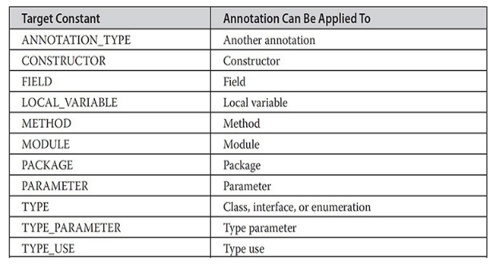
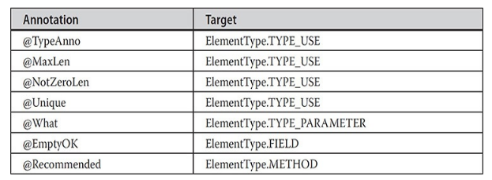

---
title: 'Enumerations, Autoboxing, and Annotations'
weight: 12
--- 

This chapter examines three features that were not originally part of Java, but over time each has become a near indispensable aspect of Java programming: enumerations, autoboxing, and annotations. Originally added by JDK 5, each is a feature upon which Java programmers have come to rely because each offers a streamlined approach to handling common programming tasks. This chapter also discusses Java’s type wrappers and introduces reflection.

## Enumerations

 In its simplest form, an enumeration is a list of named constants that define a new data type and its legal values. Thus, an enumeration object can hold only a value that was declared in the list. Other values are not allowed. In other words, an enumeration gives you a way to explicitly specify the only values that a data type can legally have. Enumerations are commonly used to define a set of values that represent a collection of items. For example, you might use an enumeration to represent the error codes that can result from some operation, such as success, failed, or pending; or a list of the states that a device might be in, such as running, stopped, or paused. In early versions of Java, such values were defined using **final** variables, but enumerations offer a far superior approach.

Although Java enumerations might, at first glance, appear similar to enumerations in other languages, this similarity may be only skin deep because, in Java, an enumeration defines a class type. By making enumerations into classes, the capabilities of the enumeration are greatly expanded. For example, in Java, an enumeration can have constructors, methods, and instance variables. Because of their power and flexibility, enumerations are widely used throughout the Java API library.

## Enumeration Fundamentals

An enumeration is created using the **enum** keyword. For example, here is a simple enumeration that lists various apple varieties:
```
//An Enumeration on apple Varieities . 
enum Apple 
{
    Jonathan,GoldenDel,RedDel,Winesap,Cortland
}
```
The identifiers **Jonathan**, **GoldenDel**, and so on, are called _enumeration constants_. Each is implicitly declared as a public, static final member of **Apple**. Furthermore, their type is the type of the enumeration in which they are declared, which is **Apple** in this case. Thus, in the language of Java, these constants are called _self-typed_, in which “self” refers to the enclosing enumeration.

Once you have defined an enumeration, you can create a variable of that type. However, even though enumerations define a class type, you do not instantiate an **enum** using **new**. Instead, you declare and use an enumeration variable in much the same way as you do one of the primitive types. For example, this declares **ap** as a variable of enumeration type **Apple**:

Apple ap;

Because **ap** is of type **Apple**, the only values that it can be assigned (or can contain) are those defined by the enumeration. For example, this assigns **ap** the value **RedDel**:

ap = Apple.RedDel;

Notice that the symbol **RedDel** is preceded by **Apple**. Two enumeration constants can be compared for equality by using the = =

relational operator. For example, this statement compares the value in **ap** with the **GoldenDel** constant:

if(ap == Apple.GoldenDel) // ...

An enumeration value can also be used to control a **switch** statement. Of course, all of the **case** statements must use constants from the same **enum** as that used by the **switch** expression. For example, this **switch** is perfectly valid:  
```
//Use enum To Control a Switch Statement
switch(ap)
{
    case 'Jonathan':
        //...
    case 'Winesap':
        //...
}
```
Notice that in the **case** statements, the names of the enumeration constants are used without being qualified by their enumeration type name. That is, **Winesap**, not **Apple.Winesap**, is used. This is because the type of the enumeration in the **switch** expression has already implicitly specified the **enum** type of the **case** constants. There is no need to qualify the constants in the **case** statements with their **enum** type name. In fact, attempting to do so will cause a compilation error.

When an enumeration constant is displayed, such as in a **println()** statement, its name is output. For example, given this statement:

_System.out.println(Apple.Winesap);_

the name **Winesap** is displayed. The following program puts together all of the pieces and demonstrates the

## Apple

 enumeration:  
```
// An enumeration of apple varieties. 
enum Apple 
{ 
    Jonathan, GoldenDel, RedDel, Winesap, Cortland
}
class EnumDemo 
{
    public static void main(String args[])
    {
        Apple ap:
        ap = Apple.RedDel;
        
        // Output an enum value. 
        System.out.println("Value of ap: "+ ap);
        System.out.println(); 
        
        ap= Apple. GoldenDel;
        
        // Compare two enum values.
        if (ap == Apple.GoldenDel) 
            System.out.println("ap contains GoldenDel.\n");
        
        // Use an enum to control a switch statement. 
        switch (ap) 
        {
            case Jonathan:
                System.out.println("Jonathan is red.");
                break; 
            case GoldenDel: 
                System.out.println("Golden Delicious is yellow."); 
                break; 
            case RedDel: 
                System.out.println("Red Delicious is red."); 
                break;
            case Winesap: 
                System.out.println("Winesap is red."); 
                break;
            case Cortland: 
                System.out.println("Cortland is red.");
                break;
        }
    }
}

```
The output from the program is shown here:
```
Value of ap: RedDel

ap contains GoldenDel.

Golden Delicious is yellow.
```
**The values() and valueOf() Methods** All enumerations automatically contain two predefined methods: **values()** and **valueOf()**. Their general forms are shown here:

public static _enum-type_ [ ] values() public static _enum-type_ valueOf(String str)

The **values()** method returns an array that contains a list of the enumeration constants. The **valueOf()** method returns the enumeration constant whose value corresponds to the string passed in str. In both cases, _enum-type_ is the type of the enumeration. For example, in the case of the **Apple** enumeration shown earlier, the return type of **Apple.valueOf("Winesap")** is **Winesap**.

The following program demonstrates the **values()** and **valueOf()** methods:  
```
// Use the built-in enumeration methods.
// An enumeration of apple varieties. 
enum Apple 
{
    Jonathan, GoldenDel, RedDel, Winesap, Cortland
}
class EnumDemo2 
{ 
    public static void main(String args[]) 
    {
        Apple ap;
        System.out.println("Here are all Apple constants: ");
        
        // use values () 
        Apple allapples [] = Apple.values();
        for (Apple a: allapples) 
            System.out.println(a);
        System.out.println();
        
        // use valueOf()
        ap = Apple.valueOf("Winesap");
        System.out.println("ap contains " +ap);
}
```

The output from the program is shown here:
```
Here are all Apple constants:

Jonathan

GoldenDel

RedDel

Winesap

Cortland

ap contains Winesap
```
Notice that this program uses a for-each style **for** loop to cycle through the array of constants obtained by calling **values()**. For the sake of illustration, the  

variable **allapples** was created and assigned a reference to the enumeration array. However, this step is not necessary because the **for** could have been written as shown here, eliminating the need for the **allapples** variable:

Now, notice how the value corresponding to the name **Winesap** was obtained by calling **valueOf()**.

ap = Apple.valueOf("Winesap");

As explained, **valueOf()** returns the enumeration value associated with the name of the constant represented as a string.

## Java Enumerations Are Class Types

 As mentioned, a Java enumeration is a class type. Although you don’t instantiate an **enum** using **new**, it otherwise has much the same capabilities as other classes. The fact that **enum** defines a class gives the Java enumeration extraordinary power. For example, you can give them constructors, add instance variables and methods, and even implement interfaces.

It is important to understand that each enumeration constant is an object of its enumeration type. Thus, when you define a constructor for an **enum**, the constructor is called when each enumeration constant is created. Also, each enumeration constant has its own copy of any instance variables defined by the enumeration. For example, consider the following version of **Apple**:  
```
// Use an enum constructor, instance variable, and method. 
enum Apple 
{
    Jonathan (10), GoldenDel (9), RedDel (12), Winesap (15), Cortland (8); 
    private int price; // price of each apple
    
    // Constructor 
    Apple (int p)
    { 
        price = p; 
    }
    int getPrice() 
    { 
        return price; 
    }
}
class EnumDemo3 
{ 
    public static void main(String args[]) 
    {
        Apple ap;
        
        // Display price of Winesap.
        System.out.println("Winesap costs " + Apple. Winesap.getPrice() + "cents.\n");
        // Display all apples and prices.
        System.out.println("All apple prices: "); 
        for (Apple a: Apple.values ())
            System.out.println(a + " costs " + a.getPrice() + "cents.");
    }
}
```
The output is shown here:
```
Winesap costs 15 cents.

All apple prices:

Jonathan costs 10 cents.

GoldenDel costs 9 cents.

RedDel costs 12 cents.

Winesap costs 15 cents.

Cortland costs 8 cents.
```
This version of **Apple** adds three things. The first is the instance variable **price**, which is used to hold the price of each variety of apple. The second is the **Apple** constructor, which is passed the price of an apple. The third is the method **getPrice()**, which returns the value of **price**.

When the variable **ap** is declared in **main()**, the constructor for **Apple** is called once for each constant that is specified. Notice how the arguments to the constructor are specified, by putting them inside parentheses after each constant, as shown here:

Jonathan(10), GoldenDel(9), RedDel(12), Winesap(15),

Cortland(8);  

These values are passed to the **p** parameter of **Apple()**, which then assigns this value to **price**. Again, the constructor is called once for each constant.

Because each enumeration constant has its own copy of **price**, you can obtain the price of a specified type of apple by calling **getPrice()**. For example, in **main()** the price of a Winesap is obtained by the following call:

_Apple.Winesap.getPrice()_

The prices of all varieties are obtained by cycling through the enumeration using a **for** loop. Because there is a copy of **price** for each enumeration constant, the value associated with one constant is separate and distinct from the value associated with another constant. This is a powerful concept, which is only available when enumerations are implemented as classes, as Java does.

Although the preceding example contains only one constructor, an **enum** can offer two or more overloaded forms, just as can any other class. For example, this version of **Apple** provides a default constructor that initializes the price to –1, to indicate that no price data is available:
```
// Use an enum constructor, instance variable, and method. 
enum Apple 
{
    Jonathan (10), GoldenDel (9), RedDel (12), Winesap (15), Cortland (8); 
    private int price; // price of each apple
    
    // Constructor 
    Apple (int p)
    { 
        price = p; 
    }
    int getPrice() 
    { 
        return price; 
    }
}
```
Notice that in this version, **RedDel** is not given an argument. This means that the default constructor is called, and **RedDel**’s price variable is given the value –1.

Here are two restrictions that apply to enumerations. First, an enumeration can’t inherit another class. Second, an **enum** cannot be a superclass. This means that an **enum** can’t be extended. Otherwise, **enum** acts much like any other class type. The key is to remember that each of the enumeration constants is an object of the class in which it is defined.

## Enumerations Inherit Enum

 Although you can’t inherit a superclass when declaring an **enum**, all enumerations automatically inherit one: **java.lang.Enum**. This class defines several methods that are available for use by all enumerations. The **Enum** class  

is described in detail in Part II, but three of its methods warrant a discussion at this time.

You can obtain a value that indicates an enumeration constant’s position in the list of constants. This is called its _ordinal value_, and it is retrieved by calling the **ordinal()** method, shown here:

final int ordinal()

It returns the ordinal value of the invoking constant. Ordinal values begin at zero. Thus, in the **Apple** enumeration, **Jonathan** has an ordinal value of zero, **GoldenDel** has an ordinal value of 1, **RedDel** has an ordinal value of 2, and so on.

You can compare the ordinal value of two constants of the same enumeration by using the **compareTo()** method. It has this general form:

final int compareTo(_enum-type e_)

Here, _enum-type_ is the type of the enumeration, and e is the constant being compared to the invoking constant. Remember, both the invoking constant and e must be of the same enumeration. If the invoking constant has an ordinal value less than e’s, then **compareTo()** returns a negative value. If the two ordinal values are the same, then zero is returned. If the invoking constant has an ordinal value greater than e’s, then a positive value is returned.

You can compare for equality an enumeration constant with any other object by using **equals()**, which overrides the **equals()** method defined by **Object**. Although **equals()** can compare an enumeration constant to any other object, those two objects will be equal only if they both refer to the same constant, within the same enumeration. Simply having ordinal values in common will not cause **equals()** to return true if the two constants are from different enumerations.

Remember, you can compare two enumeration references for equality by using = =.

The following program demonstrates the **ordinal()**, **compareTo()**, and **equals()** methods:  
```
// Demonstrate ordinal(), compareTo(), and equals().
// An enumeration of apple varieties. 
enum Apple 
{ 
    Jonathan, GoldenDel, RedDel, Winesap, Cortland
}
class EnumDemo4 
{
    public static void main(String args[]) 
    {
        Apple ap, ap2, ap3;
        // Obtain all ordinal values using ordinal(). 
        System.out.println("Here are all apple constants" + " and their ordinal values");
        
        for (Apple a: Apple.values())
            System.out.println(a + " " + a.ordinal());
        ap = Apple. RedDel;
        ap2 = Apple.GoldenDel;
        ap3 = Apple. RedDel;
        System.out.println();
        // Demonstrate compareTo() and equals() 
        if (ap.compareTo(ap2) < 0)
            System.out.println(ap+" comes before" + ap2);
        if (ap.compareTo(ap2) > 0)
            System.out.println(ap2+" comes before " + ap);
        if (ap.compareTo(ap3) == 0) 
        System.out.println(ap+" equals " + ap3);
        System.out.println();
        if (ap.equals (ap2)) 
            System.out.println("Error!");
        if (ap.equals(ap3))
            System.out.println(ap + " equals "+ap3);
        if (ap == ap3) 
            System.out.println(ap + " = "+ ap3);
    }
}
```
The output from the program is shown here:
```
Here are all apple constants and their ordinal values:

Jonathan 0

GoldenDel 1

RedDel 2

Winesap 3

Cortland 4

GoldenDel comes before RedDel

RedDel equals RedDel

RedDel equals RedDel

RedDel == RedDel
```
## Another Enumeration Example

 Before moving on, we will look at a different example that uses an **enum**. In Chapter 9, an automated “decision maker” program was created. In that version, variables called **NO**, **YES**, **MAYBE**, **LATER**, **SOON**, and **NEVER** were declared within an interface and used to represent the possible answers. While there is nothing technically wrong with that approach, the enumeration is a better choice. Here is an improved version of that program that uses an **enum** called **Answers** to define the answers. You should compare this version to the original in Chapter 9.  
```
// An improved version of the "Decision Maker"
// program from Chapter 9. This version uses an 
// enum, rather than interface variables, to
// represent the answers.

import java.util.Random;

// An enumeration of the possible answers. 
enum Answers 
{
    NO, YES, MAYBE, LATER, SOON, NEVER
}
class Question 
{
    Random rand= new Random();
    Answers ask () 
    {
        int prob= (int) (100* rand.next Double());
        
        if (prob < 15)
            return Answers.MAYBE;   // 15%
        else if (prob < 30)
            return Answers.NO;       // 15%
        else if (prob < 60)
            return Answers.YES;      // 30%
        else if (prob < 75) 
            return Answers.LATER;    // 15%
        else if (prob < 98) 
            return Answers.SOON;     // 13%
        else
            return Answers.NEVER;    // 2%
        }
}
class AskMe 
{
    static void answer (Answers result) 
    { 
        switch(result) 
        {
            case NO:
                System.out.println("No");
                break;
            case YES:
                System.out.println("Yes"); 
                break;
            case MAYBE:
                System.out.println("Maybe"); 
                break;
            case LATER:
                System.out.println("Later");
                break;
            case SOON:
                System.out.println("Soon"); 
                break;
            case NEVER: 
                System.out.println("Never"); 
                break;
        }
    }
        public static void main(String args[]) 
        { 
            Question q = new Question();
            answer (q.ask()); 
            answer (q.ask());
            answer (q.ask());
            answer (q.ask());
        }
}
```
## Type Wrappers

 As you know, Java uses primitive types (also called simple types), such as **int** or **double**, to hold the basic data types supported by the language. Primitive types, rather than objects, are used for these quantities for the sake of performance. Using objects for these values would add an unacceptable overhead to even the simplest of calculations. Thus, the primitive types are not part of the object hierarchy, and they do not inherit **Object**.

Despite the performance benefit offered by the primitive types, there are times when you will need an object representation. For example, you can’t pass a primitive type by reference to a method. Also, many of the standard data structures implemented by Java operate on objects, which means that you can’t use these data structures to store primitive types. To handle these (and other) situations, Java provides _type wrappers_, which are classes that encapsulate a primitive type within an object. The type wrapper classes are described in detail in Part II, but they are introduced here because they relate directly to Java’s autoboxing feature.

The type wrappers are **Double**, **Float**, **Long**, **Integer**, **Short**, **Byte**, **Character**, and **Boolean**. These classes offer a wide array of methods that allow you to fully integrate the primitive types into Java’s object hierarchy. Each is briefly examined next.

## Character Character

 is a wrapper around a **char**. The constructor for **Character** is

Character(char ch)

Here, ch specifies the character that will be wrapped by the **Character** object being created.

However, beginning with JDK 9, the **Character** constructor has been deprecated. Today, it is recommended that you use the static method **valueOf()** to obtain a **Character** object. It is shown here:

static Character valueOf(char ch)

It returns a **Character** object that wraps ch.  

To obtain the **char** value contained in a **Character** object, call **charValue()**, shown here:

char charValue()

It returns the encapsulated character.

## Boolean Boolean

 is a wrapper around **boolean** values. It defines these constructors:
```
Boolean(boolean boolValue) 
Boolean(String boolString)
```
In the first version, boolValue must be either **true** or **false**. In the second version, if boolString contains the string "true" (in uppercase or lowercase), then the new **Boolean** object will be true. Otherwise, it will be false.

However, beginning with JDK 9, the **Boolean** constructors have been deprecated. Today, it is recommended that you use the static method **valueOf()** to obtain a **Boolean** object. It has the two versions shown here:
```
static Boolean valueOf(boolean boolValue) 
static Boolean valueOf(String boolString)
```
Each returns a **Boolean** object that wraps the indicated value. To obtain a **boolean** value from a **Boolean** object, use **booleanValue()**,

shown here:

boolean booleanValue()

It returns the **boolean** equivalent of the invoking object.

## The Numeric Type Wrappers

 By far, the most commonly used type wrappers are those that represent numeric values. These are **Byte**, **Short**, **Integer**, **Long**, **Float**, and **Double**. All of the numeric type wrappers inherit the abstract class **Number**. **Number** declares methods that return the value of an object in each of the different number formats. These methods are shown here:
```
byte byteValue()  

byte byteValue() 
double doubleValue() 
float floatValue() 
int intValue() 
long longValue() 
short shortValue()
```
For example, **doubleValue()** returns the value of an object as a **double**, **floatValue()** returns the value as a **float**, and so on. These methods are implemented by each of the numeric type wrappers.

All of the numeric type wrappers define constructors that allow an object to be constructed from a given value, or a string representation of that value. For example, here are the constructors defined for **Integer**:
```
Integer(int num) 
Integer(String str)
```
If str does not contain a valid numeric value, then a **NumberFormatException** is thrown.

However, beginning with JDK 9, the numeric type-wrapper constructors have been deprecated. Today, it is recommended that you use one of the **valueOf()** methods to obtain a wrapper object. The **valueOf()** method is a static member of all of the numeric wrapper classes and all numeric classes support forms that convert a numeric value or a string into an object. For example, here are two of the forms supported by **Integer**:
```
static Integer valueOf(int val) 
static Integer valueOf(String valStr) throws NumberFormatException
```
Here, val specifies an integer value and valStr specifies a string that represents a properly formatted numeric value in string form. Each returns an **Integer** object that wraps the specified value. Here is an example:
```
Integer iOb = Integer.valueOf(100);
```
After this statement executes, the value 100 is represented by an **Integer** instance. Thus, **iOb** wraps the value 100 within an object. In addition to the forms **valueOf()** just shown, the integer wrappers, **Byte**, **Short**, **Integer**, and **Long**, also supply a form that lets you specify a radix.

All of the type wrappers override **toString()**. It returns the human-readable form of the value contained within the wrapper. This allows you to output the value by passing a type wrapper object to **println()**, for example, without having to convert it into its primitive type.

The following program demonstrates how to use a numeric type wrapper to encapsulate a value and then extract that value.
```
// Demonstrate a type wrapper. 
class Wrap 
{ 
    public static void main(String args[]) 
    {
        Integer iob = Integer.valueOf(100);
        int i = iob.intValue();
        System.out.println(i + " " + iob); // displays 100 100
    }
}
```
This program wraps the integer value 100 inside an **Integer** object called **iOb**. The program then obtains this value by calling **intValue()** and stores the result in **i**.

The process of encapsulating a value within an object is called boxing. Thus, in the program, this line boxes the value 100 into an **Integer**:

_Integer iOb = Integer.valueOf(100);_

The process of extracting a value from a type wrapper is called unboxing. For example, the program unboxes the value in **iOb** with this statement:

_int i = iOb.intValue();_

The same general procedure used by the preceding program to box and unbox values has been available for use since the original version of Java. However, today, Java provides a more streamlined approach, which is described next.

## Autoboxing

 Beginning with JDK 5, Java has included two important features: autoboxing and _auto-unboxing_. Autoboxing is the process by which a primitive type is automatically encapsulated (boxed) into its equivalent type wrapper whenever an object of that type is needed. There is no need to explicitly construct an object. Auto-unboxing is the process by which the value of a boxed object is automatically extracted (unboxed) from a type wrapper when its value is needed. There is no need to call a method such as **intValue()** or **doubleValue()**.

Autoboxing and auto-unboxing greatly streamline the coding of several algorithms, removing the tedium of manually boxing and unboxing values. They also help prevent errors. Moreover, they are very important to generics, which operate only on objects. Finally, autoboxing makes working with the Collections Framework (described in Part II) much easier.

With autoboxing, it is not necessary to manually construct an object in order to wrap a primitive type. You need only assign that value to a type-wrapper reference. Java automatically constructs the object for you. For example, here is the modern way to construct an **Integer** object that has the value 100:

_Integer iOb = 100; // autobox an int_

Notice that the object is not explicitly boxed. Java handles this for you, automatically.

To unbox an object, simply assign that object reference to a primitive-type variable. For example, to unbox **iOb**, you can use this line:

_int i = iOb;_ _// auto-unbox_

Java handles the details for you. Here is the preceding program rewritten to use autoboxing/unboxing:  
```
// Demonstrate autoboxing/unboxing.
class AutoBox 
{ 
    public static void main(String args[]) 
    {
        Integer i0b = 100; // autobox an int
        int i = iob; // auto-unbox
        System.out.println(i + " " + iob); // displays 100 100
    }
}
```
## Autoboxing and Methods

 In addition to the simple case of assignments, autoboxing automatically occurs whenever a primitive type must be converted into an object; auto-unboxing takes place whenever an object must be converted into a primitive type. Thus, autoboxing/unboxing might occur when an argument is passed to a method, or when a value is returned by a method. For example, consider this:
```
// Autoboxing/unboxing takes place with 
// method parameters and return values.
// Take an Integer parameter and return

class AutoBox2 
{ 
    // an int value; 
    return v; 
    // auto-unbox to int
    static int m (Integer v) 
    {
        return v ; //Auto-Unbox in Int
    }

    public static void main(String args[]) 
    {
        // Pass an int to m() and assign the return value
        // to an Integer. Here, the argument 100 is autoboxed 
        // into an Integer. The return value is also autoboxed
        // into an Integer.
        Integer iob = m (100);
        System.out.println(iob);
    }
}
```
This program displays the following result:
```
100
```
In the program, notice that **m()** specifies an **Integer** parameter and returns an **int** result. Inside **main()**, **m()** is passed the value 100. Because **m()** is expecting an **Integer**, this value is automatically boxed. Then, **m()** returns the **int** equivalent of its argument. This causes **v** to be auto-unboxed. Next, this **int** value is assigned to **iOb** in **main()**, which causes the **int** return value to be autoboxed.

**Autoboxing/Unboxing Occurs in Expressions**  

**Autoboxing/Unboxing Occurs in Expressions** In general, autoboxing and unboxing take place whenever a conversion into an object or from an object is required. This applies to expressions. Within an expression, a numeric object is automatically unboxed. The outcome of the expression is reboxed, if necessary. For example, consider the following program:
```
// Autoboxing/unboxing occurs inside expressions.
class AutoBox3 
{ 
    public static void main(String args[]) 
    {
        Integer i0b, 10b2; 
        int i;
        iob = 100;
        System.out.println("Original value of iob: "+i0b);

        // The following automatically unboxes iob, 
        // performs the increment, and then reboxes 
        // the result back into iob. 
        ++iob;
        System.out.println("After ++i0b: " + iob);

        // Here, iob is unboxed, the expression is 
        // assigned to i0b2.
        // evaluated, and the result is reboxed and
        10b2 = 10b + (iob / 3);
        System.out.println("i0b2 after expression: " + i0b2);

        // The same expression is evaluated, but the 
        // result is not reboxed.
        i = iob + (iob / 3);
        System.out.println("i after expression: " + i);
}
}
```
The output is shown here:  
```
Original value of iOb: 100

After ++iOb: 101

iOb2 after expression: 134

i after expression: 134

In the program, pay special attention to this line:

++iOb;
```
This causes the value in **iOb** to be incremented. It works like this: **iOb** is unboxed, the value is incremented, and the result is reboxed.

Auto-unboxing also allows you to mix different types of numeric objects in an expression. Once the values are unboxed, the standard type promotions and conversions are applied. For example, the following program is perfectly valid:
```
class AutoBox4
{
    public static void main(String args[])
    {
        Integer iob = 100;
        Double dob = 98.6;
        dob = dob + iob ;
        System.out.println("dob After Expression : " +dob);
    }
}
```
The output is shown here:
```
dOb after expression: 198.6
```
As you can see, both the **Double** object **dOb** and the **Integer** object **iOb** participated in the addition, and the result was reboxed and stored in **dOb**.

Because of auto-unboxing, you can use **Integer** numeric objects to control a **switch** statement. For example, consider this fragment:  
```
Integer iob = 2;
switch(iob)
{
    case 1:
        System.out.println("One ")
        break;
    case 2:
        System.out.println("two");
        break;
    default:
        System.out.println("error");
}
```
When the **switch** expression is evaluated, **iOb** is unboxed and its **int** value is obtained.

As the examples in the programs show, because of autoboxing/unboxing, using numeric objects in an expression is both intuitive and easy. In the past, such code would have involved casts and calls to methods such as **intValue()**.

**Autoboxing/Unboxing Boolean and Character Values** As described earlier, Java also supplies wrappers for **boolean** and **char**. These are **Boolean** and **Character**. Autoboxing/unboxing applies to these wrappers, too. For example, consider the following program:  
```
//AutoBoxing And Unboxing a boolean and Character 
class AutoBox5
{
    public static void main(String args[])
    {
        // Autobox/unbox a boolean. 
        Boolean b = true;
        
        // Below, b is auto-unboxed when used in 
        // a conditional expression, such as an if.
        if (b) 
            System.out.println("b is true");
        
        // Autobox/unbox a char.
        Character ch = 'x'; // box a char 
        char ch2 = ch; // unbox a char
        System.out.println("ch2 is " + ch2);
    }
}
```
The output is shown here:
```
b is true

ch2 is x
```
The most important thing to notice about this program is the auto-unboxing of **b** inside the **if** conditional expression. As you should recall, the conditional expression that controls an **if** must evaluate to type **boolean**. Because of auto- unboxing, the **boolean** value contained within **b** is automatically unboxed when the conditional expression is evaluated. Thus, with autoboxing/unboxing, a **Boolean** object can be used to control an **if** statement.

Because of auto-unboxing, a **Boolean** object can now also be used to control any of Java’s loop statements. When a **Boolean** is used as the conditional expression of a **while**, **for**, or **do/while**, it is automatically unboxed into its **boolean** equivalent. For example, this is perfectly valid code:

Boolean b;

// ...

while(b) { // ...

**Autoboxing/Unboxing Helps Prevent Errors** In addition to the convenience that it offers, autoboxing/unboxing can also help prevent errors. For example, consider the following program:  
```
// An error produced by manual unboxing. 
class UnboxingError 
{ 
    public static void main(String args[]) 
    {
        Integer iob= 1000; // autobox the value 1000
        int i = i0b.byteValue(); // manually unbox as byte !!!
        System.out.println(i); // does not display 1000 !
    }
}
```
This program displays not the expected value of 1000, but –24! The reason is that the value inside **iOb** is manually unboxed by calling **byteValue()**, which causes the truncation of the value stored in **iOb**, which is 1,000. This results in the garbage value of –24 being assigned to **i**. Auto-unboxing prevents this type of error because the value in **iOb** will always auto-unbox into a value compatible with **int**.

In general, because autoboxing always creates the proper object, and auto- unboxing always produces the proper value, there is no way for the process to produce the wrong type of object or value. In the rare instances where you want a type different than that produced by the automated process, you can still manually box and unbox values. Of course, the benefits of autoboxing/unboxing are lost. In general, you should employ autoboxing/unboxing. It is the way that modern Java code is written.

## A Word of Warning

 Because of autoboxing and auto-unboxing, some might be tempted to use objects such as **Integer** or **Double** exclusively, abandoning primitives altogether. For example, with autoboxing/unboxing it is possible to write code like this:
```
// A bad use of autoboxing/unboxing!

Double a, b, c;

a = 10.0;

b = 4.0;

c = Math.sqrt(a*a + b*b);  

System.out.println("Hypotenuse is " + c);
```
In this example, objects of type **Double** hold values that are used to calculate the hypotenuse of a right triangle. Although this code is technically correct and does, in fact, work properly, it is a very bad use of autoboxing/unboxing. It is far less efficient than the equivalent code written using the primitive type **double**. The reason is that each autobox and auto-unbox adds overhead that is not present if the primitive type is used.

In general, you should restrict your use of the type wrappers to only those cases in which an object representation of a primitive type is required. Autoboxing/unboxing was not added to Java as a “back door” way of eliminating the primitive types.

## Annotations

 Java provides a feature that enables you to embed supplemental information into a source file. This information, called an annotation, does not change the actions of a program. Thus, an annotation leaves the semantics of a program unchanged. However, this information can be used by various tools during both development and deployment. For example, an annotation might be processed by a source-code generator. The term metadata is also used to refer to this feature, but the term annotation is the most descriptive and more commonly used.

## Annotation Basics

 An annotation is created through a mechanism based on the **interface**. Let’s begin with an example. Here is the declaration for an annotation called **MyAnno**:
```
// A Simple annotation type 
@interface MyAnno
{
    String str();
    int val();
}
```
First, notice the @ that precedes the keyword **interface**. This tells the compiler that an annotation type is being declared. Next, notice the two members **str()** and **val()**. All annotations consist solely of method declarations. However, you don’t provide bodies for these methods. Instead, Java implements these methods. Moreover, the methods act much like fields, as you will see.

An annotation cannot include an **extends** clause. However, all annotation types automatically extend the **Annotation** interface. Thus, **Annotation** is a super-interface of all annotations. It is declared within the **java.lang.annotation** package. It overrides **hashCode()**, **equals()**, and **toString()**, which are defined by **Object**. It also specifies **annotationType()**, which returns a **Class** object that represents the invoking annotation.

Once you have declared an annotation, you can use it to annotate something. Prior to JDK 8, annotations could be used only on declarations, and that is where we will begin. (JDK 8 added the ability to annotate type use, and this is described later in this chapter. However, the same basic techniques apply to both kinds of annotations.) Any type of declaration can have an annotation associated with it. For example, classes, methods, fields, parameters, and **enum** constants can be annotated. Even an annotation can be annotated. In all cases, the annotation precedes the rest of the declaration.

When you apply an annotation, you give values to its members. For example, here is an example of **MyAnno** being applied to a method declaration:
```
// Annotate a method.

@MyAnno(str = "Annotation Example", val = 100)

public static void myMeth() { // ...
```
This annotation is linked with the method **myMeth()**. Look closely at the annotation syntax. The name of the annotation, preceded by an @, is followed by a parenthesized list of member initializations. To give a member a value, that member’s name is assigned a value. Therefore, in the example, the string "Annotation Example" is assigned to the **str** member of **MyAnno**. Notice that no parentheses follow **str** in this assignment. When an annotation member is given a value, only its name is used. Thus, annotation members look like fields in this context.

## Specifying a Retention Policy

 Before exploring annotations further, it is necessary to discuss _annotation retention policies_. A retention policy determines at what point an annotation is discarded. Java defines three such policies, which are encapsulated within the  

**java.lang.annotation.RetentionPolicy** enumeration. They are **SOURCE**, **CLASS**, and **RUNTIME**.

An annotation with a retention policy of **SOURCE** is retained only in the source file and is discarded during compilation.

An annotation with a retention policy of **CLASS** is stored in the **.class** file during compilation. However, it is not available through the JVM during run time.

An annotation with a retention policy of **RUNTIME** is stored in the **.class** file during compilation and is available through the JVM during run time. Thus, **RUNTIME** retention offers the greatest annotation persistence.

## NOTE

 An annotation on a local variable declaration is not retained in the **.class** file.

A retention policy is specified for an annotation by using one of Java’s built- in annotations: **@Retention**. Its general form is shown here:

@Retention(_retention-policy_)

Here, _retention-policy_ must be one of the previously discussed enumeration constants. If no retention policy is specified for an annotation, then the default policy of **CLASS** is used.

The following version of **MyAnno** uses **@Retention** to specify the **RUNTIME** retention policy. Thus, **MyAnno** will be available to the JVM during program execution.
```
@Retention (RetentionPolicy.RUNTIME)
@interface MyAnno
{
    String str();
    int val();
}
```
## Obtaining Annotations at Run Time by Use of Reflection

 Although annotations are designed mostly for use by other development or deployment tools, if they specify a retention policy of **RUNTIME**, then they can be queried at run time by any Java program through the use of reflection. Reflection is the feature that enables information about a class to be obtained at run time. The reflection API is contained in the **java.lang.reflect** package. There are a number of ways to use reflection, and we won’t examine them all here. We will, however, walk through a few examples that apply to annotations.  

The first step to using reflection is to obtain a **Class** object that represents the class whose annotations you want to obtain. **Class** is one of Java’s built-in classes and is defined in **java.lang**. It is described in detail in Part II. There are various ways to obtain a **Class** object. One of the easiest is to call **getClass()**, which is a method defined by **Object**. Its general form is shown here:

final Class<?> getClass()

It returns the **Class** object that represents the invoking object.

## NOTE

 Notice the **<?>** that follows **Class** in the declaration of **getClass()** just shown. This is related to Java’s generics feature. **getClass()** and several other reflection-related methods discussed in this chapter make use of generics. Generics are described in Chapter 14. However, an understanding of generics is not needed to grasp the fundamental principles of reflection.

After you have obtained a **Class** object, you can use its methods to obtain information about the various items declared by the class, including its annotations. If you want to obtain the annotations associated with a specific item declared within a class, you must first obtain an object that represents that item. For example, **Class** supplies (among others) the **getMethod()**, **getField()**, and **getConstructor()** methods, which obtain information about a method, field, and constructor, respectively. These methods return objects of type **Method**, **Field**, and **Constructor**.

To understand the process, let’s work through an example that obtains the annotations associated with a method. To do this, you first obtain a **Class** object that represents the class, and then call **getMethod()** on that **Class** object, specifying the name of the method. **getMethod()** has this general form:

Method getMethod(String methName, Class<?> ... paramTypes)

The name of the method is passed in methName. If the method has arguments, then **Class** objects representing those types must also be specified by paramTypes. Notice that paramTypes is a varargs parameter. This means that you can specify as many parameter types as needed, including zero. **getMethod()** returns a **Method** object that represents the method. If the method can’t be found, **NoSuchMethodException** is thrown.

From a **Class**, **Method**, **Field**, or **Constructor** object, you can obtain a specific annotation associated with that object by calling **getAnnotation()**. Its general form is shown here:  

<A extends Annotation> getAnnotation(Class<A> annoType)

Here, annoType is a **Class** object that represents the annotation in which you are interested. The method returns a reference to the annotation. Using this reference, you can obtain the values associated with the annotation’s members. The method returns **null** if the annotation is not found, which will be the case if the annotation does not have **RUNTIME** retention.

Here is a program that assembles all of the pieces shown earlier and uses reflection to display the annotation associated with a method:  
```
import java.lang.annotation.*;
import java.lang.reflect.*;

// An annotation type declaration. 
@Retention (Retention Policy.RUNTIME) 
@interface MyAnno 
{
    String str();
    int val();
}

class Meta {
    
    // Annotate a method.
    
    @MyAnno (str = "Annotation Example", val = 100) 
    public static void myMeth() 
    {
        Meta ob = new Meta();
        // Obtain the annotation for this method 
        // and display the values of the members.
        try 
        {
            // First, get a Class object that represents 
            // this class.
            Class<?> c = ob.getClass();
            
            // Now, get a Method object that represents 
            // this method. 
            Method m = c.getMethod("myMeth");
            
            // Next, get the annotation for this class. 
            MyAnno anno = m.getAnnotation (MyAnno.class);
            
            // Finally, display the values.
            System.out.println (anno.str() +"  "+ anno.val()); 
        }
        catch (NoSuchMethodException exc) 
        {
            System.out.println("Method Not Found."); 
        }
}
    public static void main(String args[]) 
    { 
        myMeth();
    }
}
```
The output from the program is shown here:
```
Annotation Example 100
```
This program uses reflection as described to obtain and display the values of **str** and **val** in the **MyAnno** annotation associated with **myMeth()** in the **Meta** class. There are two things to pay special attention to. First, in this line
```
MyAnno anno = m.getAnnotation(MyAnno.class);
```
notice the expression **MyAnno.class**. This expression evaluates to a **Class** object of type **MyAnno**, the annotation. This construct is called a classliteral. You can use this type of expression whenever a **Class** object of a known class is needed. For example, this statement could have been used to obtain the **Class** object for **Meta**:  
```
Class<?> c = Meta.class;
```
Of course, this approach only works when you know the class name of an object in advance, which might not always be the case. In general, you can obtain a class literal for classes, interfaces, primitive types, and arrays. (Remember, the **<?>** syntax relates to Java’s generics feature. It is described in Chapter 14.)

The second point of interest is the way the values associated with **str** and **val** are obtained when they are output by the following line:
```
System.out.println(anno.str() + " " + anno.val());
```
Notice that they are invoked using the method-call syntax. This same approach is used whenever the value of an annotation member is required.

## A Second Reflection Example

 In the preceding example, **myMeth()** has no parameters. Thus, when **getMethod()** was called, only the name **myMeth** was passed. However, to obtain a method that has parameters, you must specify class objects representing the types of those parameters as arguments to **getMethod()**. For example, here is a slightly different version of the preceding program:  
```
import java.lang.annotation.*; 
import java.lang.reflect.";

@Retention (RetentionPolicy.RUNTIME)
@interface MyAnno 
{
    String str();
    int val();
}
class Meta 
{
    // myMeth now has two arguments.
    @MyAnno (str = "Two Parameters", val = 19) 
    public static void myMeth (String str, int i)
    {
        Meta ob = new Meta();
        try 
        {
            Class<?> cob.getClass();
            // Here, the parameter types are specified. 
            Method = c.getMethod("myMeth", String.class, int.class);
            MyAnno anno = m.getAnnotation (MyAnno.class);
            System.out.println(anno.str() + " " + anno.val());
        }
        catch (NoSuchMethodException exc) 
        { 
            System.out.println("Method Not Found.");
        }
    }
    public static void main(String args[]) 
    { 
        myMeth("test", 10);
    }
}
```
The output from this version is shown here:
```
Two Parameters 19  
```
In this version, **myMeth()** takes a **String** and an **int** parameter. To obtain information about this method, **getMethod()** must be called as shown here:

Method m = c.getMethod("myMeth", String.class, int.class);

Here, the **Class** objects representing **String** and **int** are passed as additional arguments.

## Obtaining All Annotations

 You can obtain all annotations that have **RUNTIME** retention that are associated with an item by calling **getAnnotations()** on that item. It has this general form:

Annotation[ ] getAnnotations()

It returns an array of the annotations. **getAnnotations()** can be called on objects of type **Class**, **Method**, **Constructor**, and **Field**, among others.

Here is another reflection example that shows how to obtain all annotations associated with a class and with a method. It declares two annotations. It then uses those annotations to annotate a class and a method.  
```
// Show all annotations for a class and a method. 
import java.lang.annotation.*;
import java.lang.reflect.*;

@Retention (Retention Policy.RUNTIME) 
@interface MyAnno
{
    String str();
    int val(); 
}

@Retention (Retention Policy.RUNTIME) 
@interface What 
{ 
    String description(); 
}

@What (description = "An annotation test class") 
@MyAnno (str = "Meta2", val = 99) 

class Meta2 
{
    @What (description= "An annotation test method") 
    @MyAnno (str = "Testing", val = 100) 
    public static void myMeth() 
    {
        Meta2 ob = new Meta2();
        try 
        {
            Annotation annos []=ob.getClass().getAnnotations();
            // Display all annotations for Meta2.
            System.out.println("All annotations for Meta2:"); 
            
            for (Annotation a : annos)
                System.out.println(a);

            System.out.println();
            
            // Display all annotations for myMeth. 
            Method m = ob.getClass().getMethod("myMeth"); 
            annos = m.getAnnotations();
            System.out.println("All annotations for myMeth: "); 
            for (Annotation a: annos) 
                System.out.println(a);
            } 
            catch (NoSuchMethodException exc) 
            { 
                System.out.println("Method Not Found.");
            }
    }
            public static void main(String args[]) 
            { 
                myMeth();
            }
}
```
The output is shown here:
```
All annotations for Meta2:

@What(description=An annotation test class)

@MyAnno(str=Meta2, val=99)

All annotations for myMeth:

@What(description=An annotation test method)

@MyAnno(str=Testing, val=100)
```
The program uses **getAnnotations()** to obtain an array of all annotations associated with the **Meta2** class and with the **myMeth()** method. As explained, **getAnnotations()** returns an array of **Annotation** objects. Recall that **Annotation** is a super-interface of all annotation interfaces and that it overrides **toString()** in **Object**. Thus, when a reference to an **Annotation** is output, its **toString()** method is called to generate a string that describes the annotation, as the preceding output shows.

## The AnnotatedElement Interface

 The methods **getAnnotation()** and **getAnnotations()** used by the preceding examples are defined by the **AnnotatedElement** interface, which is defined in **java.lang.reflect**. This interface supports reflection for annotations and is implemented by the classes **Method**, **Field**, **Constructor**, **Class**, and **Package**, among others.

In addition to **getAnnotation()** and **getAnnotations()**, **AnnotatedElement**  

defines several other methods. Two have been available since annotations were initially added to Java. The first is **getDeclaredAnnotations()**, which has this general form:

Annotation[ ] getDeclaredAnnotations()

It returns all non-inherited annotations present in the invoking object. The second is **isAnnotationPresent()**, which has this general form:

default boolean isAnnotationPresent(Class<? extends Annotation> annoType)

It returns **true** if the annotation specified by annoType is associated with the invoking object. It returns **false** otherwise. To these, JDK 8 added **getDeclaredAnnotation()**, **getAnnotationsByType()**, and **getDeclaredAnnotationsByType()**. Of these, the last two automatically work with a repeated annotation.(Repeated annotations are discussed at the end of this chapter.)

## Using Default Values

 You can give annotation members default values that will be used if no value is specified when the annotation is applied. A default value is specified by adding a **default** clause to a member’s declaration. It has this general form:

type member() default value ;

Here, value must be of a type compatible with type. Here is **@MyAnno** rewritten to include default values:
```
// An Annotation type declaration that includes defaults.
@Retention (Retention Policy.RUNTIME) 
@interface MyAnno
{
    String str()  default "Testing";
    int val()     default 9000; 
}

```
This declaration gives a default value of "Testing" to **str** and 9000 to **val**. This means that neither value needs to be specified when **@MyAnno** is used. However, either or both can be given values if desired. Therefore, following are  

the four ways that **@MyAnno** can be used:
```
@MyAnno() // both str and val default

@MyAnno(str = "some string") // val defaults

@MyAnno(val = 100) // str defaults

@MyAnno(str = "Testing", val = 100) // no defaults
```
The following program demonstrates the use of default values in an annotation.  
```
import java.lang.annotation.*;
import java.lang.reflect.*;

// An annotation type declaration that includes defaults. 
@Retention (Retention Policy.RUNTIME) 
@interface MyAnno 
{ 
    String str() default "Testing"; 
    int val() default 9000;
}
class Meta3 
{
    // Annotate a method using the default values. 
    @MyAnno () 
    public static void myMeth() 
    {
        Meta3 ob = new Meta3 ();
        
        // Obtain the annotation for this method 
        // and display the values of the members. 
        try 
        {
            Class<?> = ob.getClass();
            Method m = c.getMethod("myMeth");
            MyAnno anno = m.getAnnotation (MyAnno.class);
            System.out.println(anno.str() + " " + anno.val());
        } 
        catch (NoSuchMethodException exc) 
        { 
            System.out.println("Method Not Found."); 
        }
}
    public static void main(String args[]) 
    { 
        myMeth(); 
    }
}
```
The output is shown here:
```
Testing 9000
```
## Marker Annotations

 A marker annotation is a special kind of annotation that contains no members. Its sole purpose is to mark an item. Thus, its presence as an annotation is sufficient. The best way to determine if a marker annotation is present is to use the method **isAnnotationPresent()**, which is defined by the **AnnotatedElement** interface.

Here is an example that uses a marker annotation. Because a marker interface contains no members, simply determining whether it is present or absent is sufficient.  
```
import java.lang.annotation.*; 
import java.lang.reflect.*;
// A marker annotation.
@Retention (RetentionPolicy.RUNTIME) 
@interface MyMarker 
{ 

}
class Marker 
{
    // Annotate a method using a marker. 
    // Notice that no () is needed.
    @MyMarker
    public static void myMeth() 
    { 
        Marker ob = new Marker();
        try 
        {
            Method m = ob.getClass().getMethod("myMeth");
            // Determine if the annotation is present. 
            if (m.isAnnotationPresent (MyMarker.class)) 
                System.out.println("MyMarker is present.");
        } 
        catch (NoSuchMethodException exc) 
        { 
            System.out.println("Method Not Found. ");
        }
    }
    public static void main(String args[]) 
    { 
        myMeth();
    }
}
```
The output, shown here, confirms that **@MyMarker** is present:
```
MyMarker is present.
```
In the program, notice that you do not need to follow **@MyMarker** with parentheses when it is applied. Thus, **@MyMarker** is applied simply by using its name, like this:

@MyMarker  

@MyMarker

It is not wrong to supply an empty set of parentheses, but they are not needed.

**Single-Member Annotations** A _single-member_ annotation contains only one member. It works like a normal annotation except that it allows a shorthand form of specifying the value of the member. When only one member is present, you can simply specify the value for that member when the annotation is applied—you don’t need to specify the name of the member. However, in order to use this shorthand, the name of the member must be **value**.

Here is an example that creates and uses a single-member annotation:  
```
import java.lang.annotation.*;
import java.lang.reflect.*;

// A single-member annotation.
@Retention (Retention Policy.RUNTIME)
@interface MySingle 
{ 
    int value(); // this variable name must be value
}
class Single 
{
    // Annotate a method using a single-member annotation. 
    @MySingle (100)
    public static void myMeth() 
    { 
        Single ob = new Single();
        try 
        { 
            Method m = ob.getClass().getMethod("myMeth");
            MySingle anno = m.getAnnotation (MySingle.class);
            System.out.println(anno.value()); // displays 100
        }
        catch (NoSuchMethodException exc) 
        { 
            System.out.println("Method Not Found. ");
        }
    }
        public static void main(String args[]) 
        { 
            myMeth();
        }
}
```
As expected, this program displays the value 100. In the program, **@MySingle** is used to annotate **myMeth()**, as shown here:
```
@MySingle(100)
```
Notice that **value** = need not be specified. You can use the single-value syntax when applying an annotation that has  

other members, but those other members must all have default values. For example, here the value **xyz** is added, with a default value of zero:
```
@interface SomeAnno
{
    int value();
    int xyz() default 0;
}
```
In cases in which you want to use the default for **xyz**, you can apply **@SomeAnno**, as shown next, by simply specifying the value of **value** by using the single-member syntax.
```
@SomeAnno(88)
```
In this case, **xyz** defaults to zero, and **value** gets the value 88. Of course, to specify a different value for **xyz** requires that both members be explicitly named, as shown here:
```
@SomeAnno(value = 88, xyz = 99)
```
Remember, whenever you are using a single-member annotation, the name of that member must be **value**.

**The Built-In Annotations** Java defines many built-in annotations. Most are specialized, but nine are general purpose. Of these, four are imported from **java.lang.annotation**: **@Retention**, **@Documented**, **@Target**, and **@Inherited**. Five—**@Override**, **@Deprecated**, **@FunctionalInterface**, **@SafeVarargs**, and **@SuppressWarnings**—are included in **java.lang**. Each is described here.

## NOTE

 **java.lang.annotation** also includes the annotations **Repeatable** and **Native**. **Repeatable** supports repeatable annotations, as described later in this chapter. **Native** annotates a field that can be accessed by native code.

**@Retention @Retention** is designed to be used only as an annotation to another annotation. It specifies the retention policy as described earlier in this chapter.  

**@Documented** The **@Documented** annotation is a marker interface that tells a tool that an annotation is to be documented. It is designed to be used only as an annotation to an annotation declaration.

**@Target** The **@Target** annotation specifies the types of items to which an annotation can be applied. It is designed to be used only as an annotation to another annotation. **@Target** takes one argument, which is an array of constants of the **ElementType** enumeration. This argument specifies the types of declarations to which the annotation can be applied. The constants are shown here along with the type of declaration to which they correspond:

You can specify one or more of these values in a **@Target** annotation. To specify multiple values, you must specify them within a braces-delimited list. For example, to specify that an annotation applies only to fields and local variables, you can use this **@Target** annotation:

@Target( { ElementType.FIELD, ElementType.LOCAL_VARIABLE })

If you don't use **@Target**, then, except for type parameters, the annotation can be used on any declaration. For this reason, it is often a good idea to explicitly  

specify the target or targets so as to clearly indicate the intended uses of an annotation.

**@Inherited @Inherited** is a marker annotation that can be used only on another annotation declaration. Furthermore, it affects only annotations that will be used on class declarations. **@Inherited** causes the annotation for a superclass to be inherited by a subclass. Therefore, when a request for a specific annotation is made to the subclass, if that annotation is not present in the subclass, then its superclass is checked. If that annotation is present in the superclass, and if it is annotated with **@Inherited**, then that annotation will be returned.

**@Override @Override** is a marker annotation that can be used only on methods. A method annotated with **@Override** must override a method from a superclass. If it doesn’t, a compile-time error will result. It is used to ensure that a superclass method is actually overridden, and not simply overloaded.

**@Deprecated @Deprecated** indicates that a declaration is obsolete and not recommended for use. Beginning with JDK 9, **@Deprecated** also allows you to specify the Java version in which the deprecation occurred and whether the deprecated element is slated for removal.

**@FunctionalInterface @FunctionalInterface** is a marker annotation designed for use on interfaces. It indicates that the annotated interface is a functional interface. A _functional interface_ is an interface that contains one and only one abstract method. Functional interfaces are used by lambda expressions. (See Chapter 15 for details on functional interfaces and lambda expressions.) If the annotated interface is not a functional interface, a compilation error will be reported. It is important to understand that **@FunctionalInterface** is not needed to create a functional interface. Any interface with exactly one abstract method is, by definition, a functional interface. Thus, **@FunctionalInterface** is purely informational.  

**@SafeVarargs @SafeVarargs** is a marker annotation that can be applied to methods and constructors. It indicates that no unsafe actions related to a varargs parameter occur. It is used to suppress unchecked warnings on otherwise safe code as it relates to non-reifiable vararg types and parameterized array instantiation. (A non-reifiable type is, essentially, a generic type. Generics are described in Chapter 14.) It must be applied only to vararg methods or constructors. Methods must also be **static**, **final**, or **private**.

**@SuppressWarnings @SuppressWarnings** specifies that one or more warnings that might be issued by the compiler are to be suppressed. The warnings to suppress are specified by name, in string form.

## Type Annotations

 Beginning with JDK 8, the places in which annotations can be used has been expanded. As mentioned earlier, annotations were originally allowed only on declarations. However, now, annotations can also be specified in most cases in which a type is used. This expanded aspect of annotations is called _type annotation_. For example, you can annotate the return type of a method, the type of **this** within a method, a cast, array levels, an inherited class, and a **throws** clause. You can also annotate generic types, including generic type parameter bounds and generic type arguments. (See Chapter 14 for a discussion of generics.)

Type annotations are important because they enable tools to perform additional checks on code to help prevent errors. Understand that, as a general rule, **javac** will not perform these checks, itself. A separate tool is used for this purpose, although such a tool might operate as a compiler plug-in.

A type annotation must include **ElementType.TYPE_USE** as a target. (Recall that valid annotation targets are specified using the **@Target** annotation, as previously described.) A type annotation applies to the type that the annotation precedes. For example, assuming some type annotation called **@TypeAnno**, the following is legal:
```
void myMeth() throws @TypeAnno NullPointerException { // ...  
```
Here, @**TypeAnno** annotates **NullPointerException** in the **throws** clause. You can also annotate the type of **this** (called the receiver). As you know,

## this

 is an implicit argument to all instance methods and it refers to the invoking object. To annotate its type requires the use of another recently added feature. Beginning with JDK 8, you can explicitly declare **this** as the first parameter to a method. In this declaration, the type of **this** must be the type of its class; for example:
```
class someClass
{
    int myMeth(someClass this,int i,int j){ //...

```
Here, because **myMeth()** is a method defined by **SomeClass**, the type of **this** is **SomeClass**. Using this declaration, you can now annotate the type of **this**. For example, again assuming that **@TypeAnno** is a type annotation, the following is legal:
```
int myMeth(@TypeAnno SomeClass this, int i, int j) { // ...
```
It is important to understand that it is not necessary to declare **this** unless you are annotating it. (If **this** is not declared, it is still implicitly passed, as it always has been.) Also, explicitly declaring **this** does not change any aspect of the method’s signature because **this** is implicitly declared, by default. Again, you will declare **this** only if you want to apply a type annotation to it. If you do declare **this**, it must be the first parameter.

The following program shows a number of the places that a type annotation can be used. It defines several annotations, of which several are for type annotation. The names and targets of the annotations are shown here:

Notice that **@EmptyOK**, **@Recommended**, and **@What** are not type  

annotations. They are included for comparison purposes. Of special interest is **@What**, which is used to annotate a generic type parameter declaration. The comments in the program describe each use.  
```
// Demonstrate several type annotations. 
import java.lang.annotation.*;
import java.lang.reflect.

// A marker annotation that can be applied to a type. 
@Target (ElementType.TYPE_USE)
@interface TypeAnno {}

// Another marker annotation that can be applied to a type 
@Target (ElementType.TYPE_USE)
@interface NotZeroLen {}

// Still another marker annotation that can be applied to a type. 
@Target (ElementType.TYPE_USE) 
@interface Unique ()

// A parameterized annotation that can be applied to a type. 
@Target (ElementType.TYPE_USE) 
@interface MaxLen {
    int value();
}

// An annotation that can be applied to a type parameter. 
@Target (ElementType.TYPE_PARAMETER) 
@interface What{
    String description();
}

// An annotation that can be applied to a field declaration. 
@Target (ElementType.FIELD) 
@interface Emptyok { }

// An annotation that can be applied to a method declaration. 
@Target (ElementType.METHOD) 
@interface Recommended {}

// Use an annotation on a type parameter. 
class TypeAnnoDemo< What (description "Generic data type") T> 
{
    // Use a type annotation on a constructor. 
    public Unique TypeAnnoDemo () {}

    // Annotate the type (in this case String), not the field. 
    @TypeAnno String str;

}

// This annotates the field test. 
EmptyOK String test;

// Use a type annotation to annotate this (the receiver). 
public int f(@TypeAnno TypeAnnoDemo<T> this, int x) 
{
    return 10;
}

// Annotate the return type. 
public @TypeAnno Integer f2(int j. int k) 
{
    return j+k:
}

// Annotate the method declaration. 
public @Recommended Integer f3 (String str) 
{ 
    return str.length() / 2;
}

// Use a type annotation with a throws clause. 
public void 14() throws @TypeAnno NullPointerException 
{
    //..
}

// Annotate array levels.
String @MaxLen(10) [] @NotZeroLen [] w:

// Annotate the array element type. 
@TypeAnno Integer [] vec;

public static void myMath (int i) 
{
    // Use a type annotation on a type argument.
    TypeAnnoDemo<@TypeAnno Integer> ob =new TypeAnnoDemo<@TypeAnno Integer>()

    // Use a type annotation with new. 
    @Unique TypeAnnoDemo<Integer> ob2 = new @Unique TypeAnnoDemo<Integer>()
    Object x = Integer.valueOf(10); 
    Integer y;
    
    // Use a type annotation on a cast. 
    y = (@TypeAnno Integer) x;
}
public static void main(String args[]) 
{ 
    myMeth (10):
}
    // Use type annotation with inheritance clause. 
    class Some Class extends TypeAnno TypeAnnoDemo<Boolean> ()
}
```
Although what most of the annotations in the preceding program refer to is clear, four uses require a bit of discussion. The first is the annotation of a method return type versus the annotation of a method declaration. In the program, pay special attention to these two method declarations:
```
// Annotate the return type.
public @TypeAnno Integer f2 (int j, int k) { return j+k; }
// Annotate the method declaration. public @Recommended Integer £3 (String str) { return str.length() / 2;
}
```
Notice that in both cases, an annotation precedes the method’s return type (which is **Integer**). However, the two annotations annotate two different things. In the first case, the **@TypeAnno** annotation annotates **f2()**’s return type. This is because **@TypeAnno** has its target specified as **ElementType.TYPE_USE**, which means that it can be used to annotate type uses. In the second case, **@Recommended** annotates the method declaration, itself. This is because **@Recommended** has its target specified as **ElementType.METHOD**. As a result, **@Recommended** applies to the declaration, not the return type. Therefore, the target specification is used to eliminate what, at first glance, appears to be ambiguity between the annotation of a method declaration and the annotation of the method’s return type.

One other thing about annotating a method return type: You cannot annotate a return type of **void**.

The second point of interest are the field annotations, shown here:

// Annotate the type (in this case String), not the field.

@TypeAnno String str;

// This annotates the field test.

@EmptyOK String test;

Here, **@TypeAnno** annotates the type **String**, but **@EmptyOK** annotates the field **test**. Even though both annotations precede the entire declaration, their targets are different, based on the target element type. If the annotation has the  

**ElementType.TYPE_USE** target, then the type is annotated. If it has **ElementType.FIELD** as a target, then the field is annotated. Thus, the situation is similar to that just described for methods, and no ambiguity exists. The same mechanism also disambiguates annotations on local variables.

Next, notice how **this** (the receiver) is annotated here:

public int f(@TypeAnno TypeAnnoDemo<T> this, int x) {

Here, **this** is specified as the first parameter and is of type **TypeAnnoDemo** (which is the class of which **f()** is a member). As explained, beginning with JDK 8, an instance method declaration can explicitly specify the **this** parameter for the sake of applying a type annotation.

Finally, look at how array levels are annotated by the following statement:

String @MaxLen(10) [] @NotZeroLen [] w;

In this declaration, **@MaxLen** annotates the type of the first level and **@NotZeroLen** annotates the type of the second level. In this declaration

@TypeAnno Integer[] vec;

the element type **Integer** is annotated.

## Repeating Annotations

 Beginning with JDK 8, an annotation can be repeated on the same element. This is called _repeating annotations_. For an annotation to be repeatable, it must be annotated with the **@Repeatable** annotation, defined in **java.lang.annotation**. Its **value** field specifies the container type for the repeatable annotation. The container is specified as an annotation for which the **value** field is an array of the repeatable annotation type. Thus, to create a repeatable annotation, you must create a container annotation and then specify that annotation type as an argument to the **@Repeatable** annotation.

To access the repeated annotations using a method such as **getAnnotation()**, you will use the container annotation, not the repeatable annotation. The following program shows this approach. It converts the version of **MyAnno** shown previously into a repeatable annotation and demonstrates its use.  
```
// Demonstrate a repeated annotation.
import java.lang.annotation.*;
import java.lang.reflect.*;
// Make MyAnno repeatable. @Retention (Retention Policy.RUNTIME) @Repeatable (MyRepeatedAnnos.class) @interface MyAnno { String str() default "Testing"; int val() default 9000;
}
// This is the container annotation. @Retention (Retention Policy.RUNTIME) @interface MyRepeatedAnnos (
MyAnno [] value();
}
class Repeat Anno {
// Repeat MyAnno on myMeth(). @MyAnno (str = "First annotation", val -1) @MyAnno (str = "Second annotation", val = 100) public static void myMeth (String str, int i)
{
Repeat Anno ob = new Repeat Anno ();
try {
Class<?> cob.getClass();
// Obtain the annotations for myMeth(). Method m = c.getMethod ("myMeth", String.class, int.class);
// Display the repeated MyAnno annotations. Annotation anno = m.getAnnotation (MyRepeatedAnnos.class); System.out.println(anno);
} catch (NoSuchMethodException exc) { System.out.println("Method Not Found.");
}
}
public static void main(String args[]) { myMeth("test", 10); }
}
```
The output is shown here:
```
@MyRepeatedAnnos(value={@MyAnno(val=-1, str="First annotation"),

@MyAnno(val=100, str="Second annotation")})
```
As explained, in order for **MyAnno** to be repeatable, it must be annotated with the **@Repeatable** annotation, which specifies its container annotation. The container annotation is called **MyRepeatedAnnos**. The program accesses the repeated annotations by calling **getAnnotation()**, passing in the class of the container annotation, not the repeatable annotation, itself. As the output shows, the repeated annotations are separated by a comma. They are not returned individually.

Another way to obtain the repeated annotations is to use one of the methods in **AnnotatedElement** that can operate directly on a repeated annotation. These are **getAnnotationsByType()** and **getDeclaredAnnotationsByType()**. Here, we will use the former. It is shown here:  

default <T extends Annotation> T[ ]

getAnnotationsByType(Class<T> annoType)

It returns an array of the annotations of annoType associated with the invoking object. If no annotations are present, the array will be of zero length. Here is an example. Assuming the preceding program, the following sequence uses **getAnnotationsByType()** to obtain the repeated **MyAnno** annotations:
```
Annotation[] annos = m.getAnnotationsByType(MyAnno.class);
for(Annotation a : annos)
    System.out.println(a);
```
Here, the repeated annotation type, which is **MyAnno**, is passed to **getAnnotationsByType()**. The returned array contains all of the instances of **MyAnno** associated with **myMeth()**, which, in this example, is two. Each repeated annotation can be accessed via its index in the array. In this case, each **MyAnno** annotation is displayed via a for-each loop.

## Some Restrictions

 There are a number of restrictions that apply to annotation declarations. First, no annotation can inherit another. Second, all methods declared by an annotation must be without parameters. Furthermore, they must return one of the following:

- A primitive type, such as **int** or **double**
- An object of type **String** or **Class**
- An object of an **enum** type
- An object of another annotation type
- An array of a legal type.

Annotations cannot be generic. In other words, they cannot take type parameters. (Generics are described in Chapter 14.) Finally, annotation methods cannot specify a **throws** clause.  