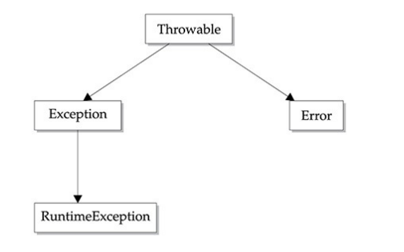
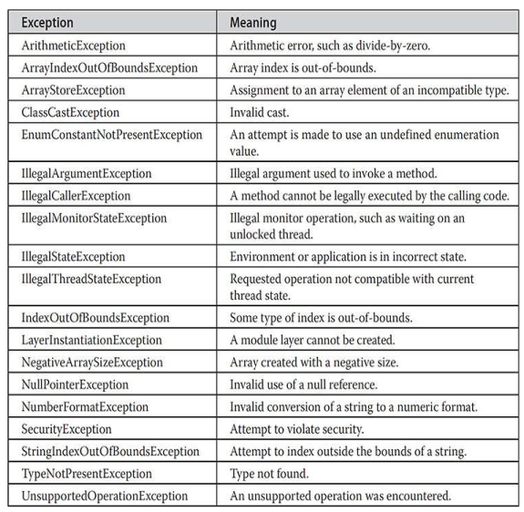
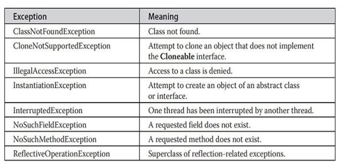
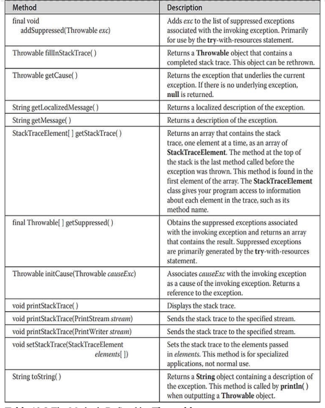

---
title: 'Exception Handlings'
weight: 10
--- 

This chapter examines Java’s exception-handling mechanism. An exception is an abnormal condition that arises in a code sequence at run time. In other words, an exception is a run-time error. In computer languages that do not support exception handling, errors must be checked and handled manually— typically through the use of error codes, and so on. This approach is as cumbersome as it is troublesome. Java’s exception handling avoids these problems and, in the process, brings run-time error management into the object-oriented world.

**Exception-Handling Fundamentals** A Java exception is an object that describes an exceptional (that is, error) condition that has occurred in a piece of code. When an exceptional condition arises, an object representing that exception is created and thrown in the method that caused the error. That method may choose to handle the exception itself, or pass it on. Either way, at some point, the exception is caught and processed. Exceptions can be generated by the Java run-time system, or they can be manually generated by your code. Exceptions thrown by Java relate to fundamental errors that violate the rules of the Java language or the constraints of the Java execution environment. Manually generated exceptions are typically used to report some error condition to the caller of a method.

Java exception handling is managed via five keywords: **try**, **catch**, **throw**, **throws**, and **finally**. Briefly, here is how they work. Program statements that you want to monitor for exceptions are contained within a **try** block. If an exception occurs within the **try** block, it is thrown. Your code can catch this exception (using **catch**) and handle it in some rational manner. System- generated exceptions are automatically thrown by the Java run-time system. To manually throw an exception, use the keyword **throw**. Any exception that is thrown out of a method must be specified as such by a **throws** clause. Any code that absolutely must be executed after a **try** block completes is put in a **finally** block.

This is the general form of an exception-handling block:  
```
try 
{
    // block of code to monitor for errors
}
catch (ExceptionTypel exOb) 
{ 
    // exception handler for ExceptionTypel
}
catch (ExceptionType2 exOb) 
{ 
    // exception handler for ExceptionType2
}
// ...
finally 
{
    // block of code to be executed after try block ends
}
```
Here, ExceptionType is the type of exception that has occurred. The remainder of this chapter describes how to apply this framework.

## NOTE

 There is another form of the **try** statement that supports _automatic resource management_. This form of **try**, called **try**\-_with-resources_, is described in Chapter 13 in the context of managing files because files are some of the most commonly used resources.

## Exception Types

 All exception types are subclasses of the built-in class **Throwable**. Thus, **Throwable** is at the top of the exception class hierarchy. Immediately below **Throwable** are two subclasses that partition exceptions into two distinct branches. One branch is headed by **Exception**. This class is used for exceptional conditions that user programs should catch. This is also the class that you will subclass to create your own custom exception types. There is an important subclass of **Exception**, called **RuntimeException**. Exceptions of this type are automatically defined for the programs that you write and include things such as division by zero and invalid array indexing.

The other branch is topped by **Error**, which defines exceptions that are not expected to be caught under normal circumstances by your program. Exceptions of type **Error** are used by the Java run-time system to indicate errors having to do with the run-time environment, itself. Stack overflow is an example of such an error. This chapter will not be dealing with exceptions of type **Error**, because these are typically created in response to catastrophic failures that cannot usually be handled by your program.

The top-level exception hierarchy is shown here:

## Uncaught Exceptions

 Before you learn how to handle exceptions in your program, it is useful to see what happens when you don’t handle them. This small program includes an expression that intentionally causes a divide-by-zero error:
```
class Exc0
{
    public static void main(String args[])
    {
        int d = 0 ;
        int a = 42 / d;
    }
}
```
When the Java run-time system detects the attempt to divide by zero, it constructs a new exception object and then throws this exception. This causes the execution of **Exc0** to stop, because once an exception has been thrown, it must be caught by an exception handler and dealt with immediately. In this  

example, we haven’t supplied any exception handlers of our own, so the exception is caught by the default handler provided by the Java run-time system. Any exception that is not caught by your program will ultimately be processed by the default handler. The default handler displays a string describing the exception, prints a stack trace from the point at which the exception occurred, and terminates the program.

Here is the exception generated when this example is executed:
```
java.lang.ArithmeticException: /by zero at Exc0.main(Exc0.java:4)
```
Notice how the class name, **Exc0**; the method name, **main**; the filename, **Exc0.java**; and the line number, **4**, are all included in the simple stack trace. Also, notice that the type of exception thrown is a subclass of **Exception** called **ArithmeticException**, which more specifically describes what type of error happened. As discussed later in this chapter, Java supplies several built-in exception types that match the various sorts of run-time errors that can be generated. One other point: The exact output you see when running this and other example programs in this chapter that use Java’s built-in exceptions may vary slightly from what is shown because of differences between JDKs.

The stack trace will always show the sequence of method invocations that led up to the error. For example, here is another version of the preceding program that introduces the same error but in a method separate from **main()**:
```
class Exc1
{
    static void subrouting()
    {
        int d = 0;
        int a = 10/d; 
    }
    public static void main(String args[])
    {
        Exc1.subrouting();
    }
}
```
The resulting stack trace from the default exception handler shows how the entire call stack is displayed:  
```
java.lang.ArithmeticException: /by zero 
    at Exc1.subroutine(Exc1.java:4)
    at Exc1.main(Exc1.java:7)

```
As you can see, the bottom of the stack is **main**’s line 7, which is the call to **subroutine()**, which caused the exception at line 4. The call stack is quite useful for debugging, because it pinpoints the precise sequence of steps that led to the error.

## Using try and catch

 Although the default exception handler provided by the Java run-time system is useful for debugging, you will usually want to handle an exception yourself. Doing so provides two benefits. First, it allows you to fix the error. Second, it prevents the program from automatically terminating. Most users would be confused (to say the least) if your program stopped running and printed a stack trace whenever an error occurred! Fortunately, it is quite easy to prevent this.

To guard against and handle a run-time error, simply enclose the code that you want to monitor inside a **try** block. Immediately following the **try** block, include a **catch** clause that specifies the exception type that you wish to catch. To illustrate how easily this can be done, the following program includes a **try** block and a **catch** clause that processes the **ArithmeticException** generated by the division-by-zero error:
```
class Exc2
{
    public static void main(String args[])
    {
        int d,a;
        try
        {
            d=0;
            a=42/d;
            System.out.println("This Will Not Be Printed ");
        }
        catch(ArithmeticException e)
        {
            System.out.println("Division By Zero . ");
        }
        System.out.println("After Catch Statements . ");
    }
}
```
This program generates the following output:
```
Division by zero.

After catch statement.  
```
Notice that the call to **println()** inside the **try** block is never executed. Once an exception is thrown, program control transfers out of the **try** block into the **catch** block. Put differently, **catch** is not “called,” so execution never “returns” to the **try** block from a **catch**. Thus, the line "This will not be printed." is not displayed. Once the **catch** statement has executed, program control continues with the next line in the program following the entire **try / catch** mechanism.

A **try** and its **catch** statement form a unit. The scope of the **catch** clause is restricted to those statements specified by the immediately preceding **try** statement. A **catch** statement cannot catch an exception thrown by another **try** statement (except in the case of nested **try** statements, described shortly). The statements that are protected by **try** must be surrounded by curly braces. (That is, they must be within a block.) You cannot use **try** on a single statement.

The goal of most well-constructed **catch** clauses should be to resolve the exceptional condition and then continue on as if the error had never happened. For example, in the next program each iteration of the **for** loop obtains two random integers. Those two integers are divided by each other, and the result is used to divide the value 12345. The final result is put into **a**. If either division operation causes a divide-by-zero error, it is caught, the value of **a** is set to zero, and the program continues.  
```
// Handle an exception and move on. 
import java.util. Random;
class HandleError 
{
    public static void main(String args[]) 
    { 
        int a=0, b=0, c=0; 
        Random r = new Random();
        for (int i=0; i<32000; i++) 
        {
            try 
            {
                b = r.nextInt();
                c = r.nextInt();
                a = 12345 / (b/c);
            } 
            catch (ArithmeticException e) 
            { 
                System.out.println("Division by zero."); 
                a = 0; // set a to zero and continue
            } 
        System.out.println("a: " + a);
        }
    }
}
```
## Displaying a Description of an Exception Throwable

 overrides the **toString()** method (defined by **Object**) so that it returns a string containing a description of the exception. You can display this description in a **println()** statement by simply passing the exception as an argument. For example, the **catch** block in the preceding program can be rewritten like this:
```
catch(ArithmeticException e)
{
    System.out.println("Exception : "+e);
    a=0;    //set a to zero and continue
}
```
When this version is substituted in the program, and the program is run, each divide-by-zero error displays the following message:

Exception: java.lang.ArithmeticException: / by zero

While it is of no particular value in this context, the ability to display a  

While it is of no particular value in this context, the ability to display a description of an exception is valuable in other circumstances—particularly when you are experimenting with exceptions or when you are debugging.

## Multiple catch Clauses

 In some cases, more than one exception could be raised by a single piece of code. To handle this type of situation, you can specify two or more **catch** clauses, each catching a different type of exception. When an exception is thrown, each **catch** statement is inspected in order, and the first one whose type matches that of the exception is executed. After one **catch** statement executes, the others are bypassed, and execution continues after the **try / catch** block. The following example traps two different exception types:
```
// Demonstrate multiple catch statements. 
class MultipleCatches 
{
    public static void main(String args[]) 
    { 
        try 
        {
            int a = args.length;
            System.out.println("a = " + a);
            int b = 42 / a;
            int c[] = {1};
            c [42] = 99;
        } 
        catch (ArithmeticException e) 
        {
            System.out.println("Divide by 0: " + e); 
        } 
        catch (ArrayIndexOutOfBoundsException e) 
        {
            System.out.println("Array index oob: " + e);
        } 
        System.out.println("After try/catch blocks.");
    }
}
```
This program will cause a division-by-zero exception if it is started with no command-line arguments, since **a** will equal zero. It will survive the division if you provide a command-line argument, setting **a** to something larger than zero. But it will cause an **ArrayIndexOutOfBoundsException**, since the **int** array **c** has a length of 1, yet the program attempts to assign a value to **c[42]**.

Here is the output generated by running it both ways:  
```
C:\\>java MultipleCatches

a = 0

Divide by 0: java.lang.ArithmeticException: / by zero

After try/catch blocks.

C:\\>java MultipleCatches TestArg

a = 1

Array index oob: java.lang.ArrayIndexOutOfBoundsException:

Index 42 out of bounds for length 1

After try/catch blocks.
```
When you use multiple **catch** statements, it is important to remember that exception subclasses must come before any of their superclasses. This is because a **catch** statement that uses a superclass will catch exceptions of that type plus any of its subclasses. Thus, a subclass would never be reached if it came after its superclass. Further, in Java, unreachable code is an error. For example, consider the following program:  
```
/* This program contains an error.
A subclass must come before its superclass in a series of catch statements. 
If not, unreachable code will be created and a compile-time error will result.
*/ 
class SuperSubCatch 
{ 
    public static void main(String args[]) 
    { 
        try 
        {
            int a = 0;
            int b = 42/a;
        } 
        catch (Exception e) 
        { 
            System.out.println("Generic Exception catch.");
        }
        /* This catch is never reached because ArithmeticException is a subclass of Exception. */ 
        catch (ArithmeticException e) 
        { 
            // ERROR - unreachable 
            System.out.println("This is never reached."); 
        }
    }
}
```
If you try to compile this program, you will receive an error message stating that the second **catch** statement is unreachable because the exception has already been caught. Since **ArithmeticException** is a subclass of **Exception**, the first **catch** statement will handle all **Exception**\-based errors, including **ArithmeticException**. This means that the second **catch** statement will never execute. To fix the problem, reverse the order of the **catch** statements.

## Nested try Statements

 The **try** statement can be nested. That is, a **try** statement can be inside the block of another **try**. Each time a **try** statement is entered, the context of that exception is pushed on the stack. If an inner **try** statement does not have a **catch** handler for a particular exception, the stack is unwound and the next **try** statement’s **catch** handlers are inspected for a match. This continues until one of the **catch** statements succeeds, or until all of the nested **try** statements are exhausted. If no **catch** statement matches, then the Java run-time system will handle the exception. Here is an example that uses nested **try** statements:  
```
// An example of nested try statements. 
class NestTry 
{ 
    public static void main(String args[]) 
    { 
        try 
        {
            int a = args.length;
            /* If no command-line args are present, the following statement will generate a divide-by-zero exception. */ 
            int b = 42 / a;
            System.out.println("a = " + a);
            try 
            { 
                // nested try block 
                /* If one command-line arg is used, then a divide-by-zero exception will be generated by the following code. */ 
                if (a==1) 
                    a = a/ (a-a); // division by zero
                
                /* If two command-line args are used,
                then generate an out-of-bounds exception. */ 
                if (a==2) 
                { 
                    int c[] = {1};
                    c [42]= 99; // generate an out-of-bounds exception
                } 
            } 
            catch (ArrayIndexOutOfBoundsException e) 
            { 
                System.out.println("Array index out-of-bounds: " + e);
            }
        }
        catch (ArithmeticException e) 
        { 
            System.out.println("Divide by 0: + e);
        }
    }
}
```
As you can see, this program nests one **try** block within another. The program works as follows. When you execute the program with no command- line arguments, a divide-by-zero exception is generated by the outer **try** block. Execution of the program with one command-line argument generates a divide-  

by-zero exception from within the nested **try** block. Since the inner block does not catch this exception, it is passed on to the outer **try** block, where it is handled. If you execute the program with two command-line arguments, an array boundary exception is generated from within the inner **try** block. Here are sample runs that illustrate each case:
```
C:\>java NestTry
Divide by 0: java.lang. ArithmeticException: / by zero

C:\>java NestTry One 
a = 1
Divide by 0: java.lang. ArithmeticException: / by zero

C:\>java Nest Try One Two
a = 2
Array index out-of-bounds:
    java.lang.ArrayIndexOutOfBoundsException:
    Index 42 out of bounds for length 1
```
Nesting of **try** statements can occur in less obvious ways when method calls are involved. For example, you can enclose a call to a method within a **try** block. Inside that method is another **try** statement. In this case, the **try** within the method is still nested inside the outer **try** block, which calls the method. Here is the previous program recoded so that the nested **try** block is moved inside the method **nesttry()**:  
```
/* Try statements can be implicitly nested via calls to methods. */ 
class MethNestTry 
{
    static void nesttry (int a) 
    {
        try{
            // nested try block will be generated by the following code.
             /* If one command-line arg is used,
              then a divide-by-zero exception
              Will Be Generated By The Following Code .*/
              if (a==1) 
                a = a/ (a-a); // division by zero
            
            /* If two command-line args are used,
            then generate an out-of-bounds exception. */
            if (a==2) 
            {
                 int c[] = {1};
                 c [42] = 99; // generate an out-of-bounds exception 
            } 
        } 
        catch (ArrayIndexOutOfBoundsException e) 
        {
            System.out.println("Array index out-of-bounds: " + e);
        }
    }
public static void main(String args[]) 
{  
    try { 
        int a = args.length;
        
        /* If no command-line args are present, 
        the following statement will generate a divide-by-zero exception. */
        int b = 42 / a; 
        System.out.println("a = " + a);
        nesttry (a);
        } 
        catch (Arithmetic Exception e) 
        { 
            System.out.println("Divide by 0: " + e);
        }
}
}
```
The output of this program is identical to that of the preceding example.  

## throw

 So far, you have only been catching exceptions that are thrown by the Java run- time system. However, it is possible for your program to throw an exception explicitly, using the **throw** statement. The general form of **throw** is shown here:

_throw_ _ThrowableInstance;_

Here, ThrowableInstance must be an object of type **Throwable** or a subclass of **Throwable**. Primitive types, such as **int** or **char**, as well as non-**Throwable** classes, such as **String** and **Object**, cannot be used as exceptions. There are two ways you can obtain a **Throwable** object: using a parameter in a **catch** clause or creating one with the **new** operator.

The flow of execution stops immediately after the **throw** statement; any subsequent statements are not executed. The nearest enclosing **try** block is inspected to see if it has a **catch** statement that matches the type of exception. If it does find a match, control is transferred to that statement. If not, then the next enclosing **try** statement is inspected, and so on. If no matching **catch** is found, then the default exception handler halts the program and prints the stack trace.

Here is a sample program that creates and throws an exception. The handler that catches the exception rethrows it to the outer handler.  
```
// Demonstrate throw.
class ThrowDemo 
{ 
    static void demoproc () 
    {
        try 
        {
            throw new NullPointerException("demo"); 
        } 
        catch (NullPointerException e) 
        { 
            System.out.println("Caught inside demoproc."); 
            throw e; // rethrow the exception
        }
    }
    public static void main(String args[]) 
    {
        try 
        {
            demoproc();
        } 
        catch (NullPointerException e) 
        { 
            System.out.println("Recaught: " + e);
        }
    }
}
```
This program gets two chances to deal with the same error. First, **main()** sets up an exception context and then calls **demoproc()**. The **demoproc()** method then sets up another exception-handling context and immediately throws a new instance of **NullPointerException**, which is caught on the next line. The exception is then rethrown. Here is the resulting output:
```
Caught inside demoproc.

Recaught: java.lang.NullPointerException: demo
```
The program also illustrates how to create one of Java’s standard exception objects. Pay close attention to this line:

throw new NullPointerException("demo");

Here, **new** is used to construct an instance of **NullPointerException**. Many of Java’s built-in run-time exceptions have at least two constructors: one with no parameter and one that takes a string parameter. When the second form is used, the argument specifies a string that describes the exception. This string is displayed when the object is used as an argument to **print()** or **println()**. It can also be obtained by a call to **getMessage()**, which is defined by  

## Throwable
## throws

 If a method is capable of causing an exception that it does not handle, it must specify this behavior so that callers of the method can guard themselves against that exception. You do this by including a **throws** clause in the method’s declaration. A **throws** clause lists the types of exceptions that a method might throw. This is necessary for all exceptions, except those of type **Error** or **RuntimeException**, or any of their subclasses. All other exceptions that a method can throw must be declared in the **throws** clause. If they are not, a compile-time error will result.

This is the general form of a method declaration that includes a **throws** clause:
```
type method-name(parameter-list)throws exception-list
{
    //body of method
}
```
Here, _exception-list_ is a comma-separated list of the exceptions that a method can throw.

Following is an example of an incorrect program that tries to throw an exception that it does not catch. Because the program does not specify a **throws** clause to declare this fact, the program will not compile.
```
// This program contains an error and will not compile. 
class ThrowsDemo 
{
    static void throwOne ()
    {
        System.out.println("Inside throwOne."); 
        throw new IllegalAccessException("demo"); 
    }
    public static void main(String args[]) 
    { 
        throwOne ();
    }
}
```
To make this example compile, you need to make two changes. First, you  

need to declare that **throwOne()** throws **IllegalAccessException**. Second, **main()** must define a **try / catch** statement that catches this exception.

The corrected example is shown here:
```
// This is now correct. 
class ThrowsDemo 
{
    static void throwOne () throws IllegalAccessException 
    { 
        System.out.println("Inside throwOne."); 
        throw new IllegalAccessException ("demo");
    } 
    public static void main(String args[]) 
    { 
        try 
        {
            throwOne ();
        } 
        catch (IllegalAccessException e) 
        { 
            System.out.println("Caught " + e); 
        }
    }
}
```
Here is the output generated by running this example program:
```
inside throwOne

caught java.lang.IllegalAccessException: demo
```
## finally

 When exceptions are thrown, execution in a method takes a rather abrupt, nonlinear path that alters the normal flow through the method. Depending upon how the method is coded, it is even possible for an exception to cause the method to return prematurely. This could be a problem in some methods. For example, if a method opens a file upon entry and closes it upon exit, then you will not want the code that closes the file to be bypassed by the exception- handling mechanism. The **finally** keyword is designed to address this contingency.

**finally** creates a block of code that will be executed after a **try /catch** block has completed and before the code following the **try/catch** block. The **finally** block will execute whether or not an exception is thrown. If an exception is thrown, the **finally** block will execute even if no **catch** statement matches the exception. Any time a method is about to return to the caller from inside a **try/catch** block, via an uncaught exception or an explicit return statement, the **finally** clause is also executed just before the method returns. This can be useful for closing file handles and freeing up any other resources that might have been allocated at the beginning of a method with the intent of disposing of them before returning. The **finally** clause is optional. However, each **try** statement requires at least one **catch** or a **finally** clause.

Here is an example program that shows three methods that exit in various ways, none without executing their **finally** clauses:  
```
// Demonstrate finally. 
class FinallyDemo 
{
    // Throw an exception out of the method. 
    static void procA() 
    { 
        try
        {
            System.out.println("inside procA"); 
            throw new RuntimeException("demo");
        } 
        finally 
        {
            System.out.println("procA's finally");
        }
    }
    // Return from within a try block. 
    static void procB () 
    {
        try 
        {
            System.out.println("inside procB"); 
            return;
        } 
        finally 
        {
            System.out.println("procB's finally");
        }
    }
    // Execute a try block normally. 
    static void procC () 
    {
            try
            {
                System.out.println("inside procC");
            } 
            finally 
            {
                System.out.println("procC's finally");
            }
    }
    public static void main(String args[]) 
    {
        try 
        {
            procA();
        } 
        catch (Exception e) 
        {
            System.out.println("Exception caught"); 
        }
        procB();
        procC();
    }
}

```
In this example, **procA()** prematurely breaks out of the **try** by throwing an exception. The **finally** clause is executed on the way out. **procB()**’s **try** statement is exited via a **return** statement. The **finally** clause is executed  

before **procB()** returns. In **procC()**, the **try** statement executes normally, without error. However, the **finally** block is still executed.

## REMEMBER

 If a **finally** block is associated with a **try**, the **finally** block will be executed upon conclusion of the **try**.

Here is the output generated by the preceding program:
```
inside procA

procA's finally

Exception caught

inside procB

procB's finally

inside procC

procC's finally
```
**Java’s Built-in Exceptions** Inside the standard package **java.lang**, Java defines several exception classes. A few have been used by the preceding examples. The most general of these exceptions are subclasses of the standard type **RuntimeException**. As previously explained, these exceptions need not be included in any method’s **throws** list. In the language of Java, these are called _unchecked exceptions_ because the compiler does not check to see if a method handles or throws these exceptions. The unchecked exceptions defined in **java.lang** are listed in Table 10-1. Table 10-2 lists those exceptions defined by **java.lang** that must be included in a method’s **throws** list if that method can generate one of these exceptions and does not handle it itself. These are called _checked exceptions_. In addition to the exceptions in **java .lang**, Java defines several more that relate to its other standard packages.  

**Table 10-1** Java’s Unchecked **RuntimeException** Subclasses Defined in **java.lang**  

**Table 10-2** Java’s Checked Exceptions Defined in **java.lang**

## Creating Your Own Exception Subclasses

 Although Java’s built-in exceptions handle most common errors, you will probably want to create your own exception types to handle situations specific to your applications. This is quite easy to do: just define a subclass of **Exception** (which is, of course, a subclass of **Throwable**). Your subclasses don’t need to actually implement anything—it is their existence in the type system that allows you to use them as exceptions.

The **Exception** class does not define any methods of its own. It does, of course, inherit those methods provided by **Throwable**. Thus, all exceptions, including those that you create, have the methods defined by **Throwable** available to them. They are shown in Table 10-3. You may also wish to override one or more of these methods in exception classes that you create.  

**Table 10-3** The Methods Defined by **Throwable**

**Exception** defines four public constructors. Two support chained . exceptions, described in the next section. The other two are shown here:
```
Exception() 
Exception(String msg)
```
The first form creates an exception that has no description. The second form lets you specify a description of the exception.

Although specifying a description when an exception is created is often useful, sometimes it is better to override **toString()**. Here’s why: The version of **toString()** defined by **Throwable** (and inherited by **Exception**) first displays the name of the exception followed by a colon, which is then followed by your description. By overriding **toString()**, you can prevent the exception name and colon from being displayed. This makes for a cleaner output, which is desirable in some cases.

The following example declares a new subclass of **Exception** and then uses that subclass to signal an error condition in a method. It overrides the **toString()** method, allowing a carefully tailored description of the exception to be displayed.  
```
// This program creates a custom exception type. 
class MyException extends Exception 
{ 
    private int detail;
    MyException(int a) 
    {
        detail = a;
    }
    public String toString() 
    { 
        return "MyException ["+ detail + "]";
    }
    class ExceptionDemo 
    {
        static void compute (int a) throws MyException 
        { 
            System.out.println("Called compute (" + a + ");
            if (a> 10) throw new MyException (a));
        System.out.println("Normal exit");
        }
        public static void main(String args[]) 
        {
            try 
            {
                compute(1);
                compute (20);
            } 
            catch (MyException e) 
            { 
                System.out.println("Caught " + e);
            }
        }
        }
    }
```
This example defines a subclass of **Exception** called **MyException**. This subclass is quite simple: It has only a constructor plus an overridden **toString()** method that displays the value of the exception. The **ExceptionDemo** class defines a method named **compute()** that throws a **MyException** object. The exception is thrown when **compute()**’s integer parameter is greater than 10. The **main()** method sets up an exception handler for **MyException**, then calls **compute()** with a legal value (less than 10) and an illegal one to show both paths through the code. Here is the result:  

Called compute(1)

Normal exit

Called compute(20)

Caught MyException[20]
```
## Chained Exceptions
```
Exception() Exception(String msg)
```
 A number of years ago, a feature was incorporated into the exception subsystem: _chained exceptions_. The chained exception feature allows you to associate another exception with an exception. This second exception describes the cause of the first exception. For example, imagine a situation in which a method throws an **ArithmeticException** because of an attempt to divide by zero. However, the actual cause of the problem was that an I/O error occurred, which caused the divisor to be set improperly. Although the method must certainly throw an **ArithmeticException**, since that is the error that occurred, you might also want to let the calling code know that the underlying cause was an I/O error. Chained exceptions let you handle this, and any other situation in which layers of exceptions exist.

To allow chained exceptions, two constructors and two methods were added to **Throwable**. The constructors are shown here:

Throwable(Throwable causeExc) Throwable(String msg, Throwable causeExc)

In the first form, causeExc is the exception that causes the current exception. That is, causeExc is the underlying reason that an exception occurred. The second form allows you to specify a description at the same time that you specify a cause exception. These two constructors have also been added to the **Error**, **Exception**, and **RuntimeException** classes.

The chained exception methods supported by **Throwable** are **getCause()** and **initCause()**. These methods are shown in Table 10-3 and are repeated here for the sake of discussion.

Throwable getCause() Throwable initCause(Throwable causeExc)

The **getCause()** method returns the exception that underlies the current exception. If there is no underlying exception, **null** is returned. The **initCause()** method associates causeExc with the invoking exception and returns a reference to the exception. Thus, you can associate a cause with an exception after the exception has been created. However, the cause exception can be set only once. This means that you can call **initCause()** only once for each exception object. Furthermore, if the cause exception was set by a constructor, then you can’t set it again using **initCause()**. In general, **initCause()** is used to set a cause for legacy exception classes that don’t support the two additional constructors described earlier.

Here is an example that illustrates the mechanics of handling chained exceptions:
```
// Demonstrate exception chaining. 
class ChainExcDemo 
{ 
    static void demoproc() 
    {
        // create an exception 
        NullPointerException e = new NullPointerException("top layer");
        
        // add a cause 
        e.initCause (new ArithmeticException("cause"));
        
        throw e;
    }
    public static void main(String args[]) 
    { 
        try 
        {
            demoproc(); 
        } 
        catch (NullPointerException e) 
        { 
            // display top level exception 
            System.out.println("Caught: " + e);
 
            // display cause exception
            System.out.println("Original cause: "+e.getCause()); 
        }
    }
}
```
The output from the program is shown here:  
```
Caught: java.lang.NullPointerException: top layer

Original cause: java.lang.ArithmeticException: cause
```
In this example, the top-level exception is **NullPointerException**. To it is added a cause exception, **ArithmeticException**. When the exception is thrown out of **demoproc()**, it is caught by **main()**. There, the top-level exception is displayed, followed by the underlying exception, which is obtained by calling **getCause()**.

Chained exceptions can be carried on to whatever depth is necessary. Thus, the cause exception can, itself, have a cause. Be aware that overly long chains of exceptions may indicate poor design.

Chained exceptions are not something that every program will need. However, in cases in which knowledge of an underlying cause is useful, they offer an elegant solution.

## Three Additional Exception Features

 Beginning with JDK 7, three interesting and useful features have been part of the exception system. The first automates the process of releasing a resource, such as a file, when it is no longer needed. It is based on an expanded form of the **try** statement called **try**_\-with-resources_, and is described in Chapter 13 when files are introduced. The second feature is called _multi-catch_, and the third is sometimes referred to as _final rethrow_ or _more precise rethrow_. These two features are described here.

The multi-catch feature allows two or more exceptions to be caught by the same **catch** clause. It is not uncommon for two or more exception handlers to use the same code sequence even though they respond to different exceptions. Instead of having to catch each exception type individually, you can use a single **catch** clause to handle all of the exceptions without code duplication.

To use a multi-catch, separate each exception type in the **catch** clause with the OR operator. Each multi-catch parameter is implicitly **final**. (You can explicitly specify **final**, if desired, but it is not necessary.) Because each multi- catch parameter is implicitly **final**, it can’t be assigned a new value.

Here is a **catch** statement that uses the multi-catch feature to catch both **ArithmeticException** and **ArrayIndexOutOfBoundsException**:

catch(ArithmeticException | ArrayIndexOutOfBoundsException e) {

The following program shows the multi-catch feature in action:  
```
// Demonstrate the multi-catch feature.
class MultiCatch 
{ 
    public static void main(String args[]) 
    { 
        int a=10, b=0;
        int vals [] = {1, 2, 3 };
        try 
        {
            int result = a / b; // generate an ArithmeticException
            vals [10]= 19; // generate an ArrayIndexOutOfBoundsException
            // This catch clause catches both exceptions.
        } 
        catch (ArithmeticException | ArrayIndexOutOfBoundsException e) 
        { 
            System.out.println("Exception caught: " + e);
        }
        System.out.println("After multi-catch.");
    }
}

```
The program will generate an **ArithmeticException** when the division by zero is attempted. If you comment out the division statement and remove the comment symbol from the next line, an **ArrayIndexOutOfBoundsException** is generated. Both exceptions are caught by the single **catch** statement.

The more precise rethrow feature restricts the type of exceptions that can be rethrown to only those checked exceptions that the associated **try** block throws, that are not handled by a preceding **catch** clause, and that are a subtype or supertype of the parameter. Although this capability might not be needed often, it is now available for use. For the more precise rethrow feature to be in force, the **catch** parameter must be either effectively **final**, which means that it must not be assigned a new value inside the **catch** block, or explicitly declared **final**.

## Using Exceptions

 Exception handling provides a powerful mechanism for controlling complex programs that have many dynamic run-time characteristics. It is important to think of **try**, **throw**, and **catch** as clean ways to handle errors and unusual boundary conditions in your program’s logic. Instead of using error return codes to indicate failure, use Java’s exception handling capabilities. Thus, when a method can fail, have it throw an exception. This is a cleaner way to handle failure modes. One last point: Java’s exception-handling statements should not be

considered a general mechanism for nonlocal branching. If you do so, it will only confuse your code and make it hard to maintain.  