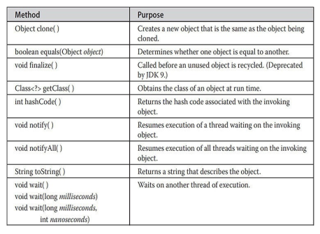

---
title: 'Inheritance'
weight: 8
--- 
# Inheritance
Inheritance is one of the cornerstones of object-oriented programming because it allows the creation of hierarchical classifications. Using inheritance, you can create a general class that defines traits common to a set of related items. This class can then be inherited by other, more specific classes, each adding those things that are unique to it. In the terminology of Java, a class that is inherited is called a superclass. The class that does the inheriting is called a subclass. Therefore, a subclass is a specialized version of a superclass. It inherits all of the members defined by the superclass and adds its own, unique elements.

## Inheritance Basics

 To inherit a class, you simply incorporate the definition of one class into another by using the **extends** keyword. To see how, let’s begin with a short example. The following program creates a superclass called **A** and a subclass called **B**. Notice how the keyword **extends** is used to create a subclass of **A**.  
```
// A simple example of inheritance.
// Create a superclass. 
class A 
{
    int i, j;
    void showij() 
    {
        System.out.println("i and j: " + i + " " + j);
    }
}
// Create a subclass by extending class A. 
class B extends A 
{ 
    int k;
    void showk () 
    {
        System.out.println("k: " + k);
    }
    void sum() 
    { 
        System.out.println("i+j+k: " + (i+j+k));
    }
}
class SimpleInheritance 
{
    public static void main(String args[]) 
    { 
        A superob = new A();
        B subob = new B();

        // The superclass may be used by itself.
        superOb.j= 20;
        superob.i= 10; 
        System.out.println("Contents of superob: "); 
        superob. showij ();
        System.out.println();

        /* 
        The subclass has access to all 
        public members of its superclass. 
        */
        
        subob.i = 7;
        subob.j = 8;
        subob.k = 9;
        System.out.println("Contents of sub0b: ");
        subob.showij();
        subob.showk();
        System.out.println();
        
        System.out.println("Sum of i, j and k in subob: "); 
        subob.sum();
    }
}
```
The output from this program is shown here:
```
Contents of superOb:

i and j: 10 20

Contents of subOb:

i and j: 7 8

k: 9  

Sum of i, j and k in subOb:

i+j+k: 24
```
As you can see, the subclass **B** includes all of the members of its superclass, **A**. This is why **subOb** can access **i** and **j** and call **showij()**. Also, inside **sum()**, **i** and **j** can be referred to directly, as if they were part of **B**.

Even though **A** is a superclass for **B**, it is also a completely independent, stand-alone class. Being a superclass for a subclass does not mean that the superclass cannot be used by itself. Further, a subclass can be a superclass for another subclass.

The general form of a **class** declaration that inherits a superclass is shown here:
```
class subclass-name extends superclass-name 
{ 
    // body of class 
}
```
You can only specify one superclass for any subclass that you create. Java does not support the inheritance of multiple superclasses into a single subclass. You can, as stated, create a hierarchy of inheritance in which a subclass becomes a superclass of another subclass. However, no class can be a superclass of itself.

### Member Access and Inheritance

 Although a subclass includes all of the members of its superclass, it cannot access those members of the superclass that have been declared as **private**. For example, consider the following simple class hierarchy:  
```
/*
In a class hierarchy, private members remain private to their class.
This program contains an error and will not compile.
*/

// Create a superclass.
class A 
{
    int i;// default access 
    private int j; // private to A
    void setij (int x, int y) 
    {
        i = x;
        j = y;
    }
}

// A's i is not accessible here. 
class B extends A 
{ 
    int total;
    void sum()
    {
        total = i + j; // ERROR, j is not accessible here:
    }
}
class Access
{
    public static void main(String args[]) 
    { 
        B subob = new B();
        subob.setij (10, 12);
        subob.sum();
        System.out.println("Total is " + subob.total);
    }
}
```
This program will not compile because the use of **j** inside the **sum()** method of **B** causes an access violation. Since **j** is declared as **private**, it is only accessible by other members of its own class. Subclasses have no access to it.

**REMEMBER**

 A class member that has been declared as private will remain private to its class. It is not accessible by any code outside its class, including subclasses.

### A More Practical Example

 Let’s look at a more practical example that will help illustrate the power of inheritance. Here, the final version of the **Box** class developed in the preceding chapter will be extended to include a fourth component called **weight**. Thus, the new class will contain a box’s width, height, depth, and weight.  
```
// This program uses inheritance to extend Box.
class Box 
{ 
    double width;
    double height;
    double depth;

    // construct clone of an object
    Box (Box ob) 
    { 
        // pass object to constructor 
        width = ob.width; 
        height = ob.height; 
        depth = ob.depth;
    }
    
    // constructor used when all dimensions specified 
    Box (double w, double h, double d) 
    { 
        height = h;
        width = w:
        depth = d;
    }
    
    // constructor used when no dimensions specified
    Box() 
    { 
        width = -1; // use -1 to indicate
        height = -1; // an uninitialized
        depth = -1; // box
    }
    
    // constructor used when cube is created 
    Box (double len) 
    {
        width = height = depth = len; 
    }
    
    // compute and return volume 
    double volume () 
    {
        return width * height * depth; 
    }
}
// Here, Box is extended to include weight. 
class BoxWeight extends Box 
{
    double weight; // weight of box
    // constructor for BoxWeight 
    BoxWeight (double w, double h, double d, double m) 
    {
        width= w;
        height = h;
        depth = d;
        weight = m;
    }
}
class DemoBoxWeight 
{
    public static void main(String args[]) 
    { 
        BoxWeight mybox1 = new BoxWeight (10, 20, 15, 34.3); 
        BoxWeight mybox2 = new BoxWeight (2, 3, 4, 0.076);
        double vol;

        vol = mybox1.volume();
        System.out.println("Volume of myboxl is "+ vol);  
        System.out.println("Weight of mybox is " + mybox1.weight);
        System.out.println();
        
        vol = mybox2. volume(); 
        System.out.println("Volume of mybox2 is " + vol); 
        System.out.println("Weight of mybox2 is + mybox2.weight);
    }
}
```
The output from this program is shown here:
```
Volume of mybox1 is 3000.0

Weight of mybox1 is 34.3

Volume of mybox2 is 24.0

Weight of mybox2 is 0.076
```
**BoxWeight** inherits all of the characteristics of **Box** and adds to them the **weight** component. It is not necessary for **BoxWeight** to re-create all of the features found in **Box**. It can simply extend **Box** to meet its own purposes.  

A major advantage of inheritance is that once you have created a superclass that defines the attributes common to a set of objects, it can be used to create any number of more specific subclasses. Each subclass can precisely tailor its own classification. For example, the following class inherits **Box** and adds a color attribute:
```
// Here, Box is extended to include color. 
class ColorBox extends Box 
{ 
    int color; // color of box
    ColorBox (double w, double h, double d, int c) 
    {
        width = w;
        height = h;
        depth = d;
        color = c;
    }
}
```
Remember, once you have created a superclass that defines the general aspects of an object, that superclass can be inherited to form specialized classes. Each subclass simply adds its own unique attributes. This is the essence of inheritance.

### A Superclass Variable Can Reference a Subclass Object

 A reference variable of a superclass can be assigned a reference to any subclass derived from that superclass. You will find this aspect of inheritance quite useful in a variety of situations. For example, consider the following:  
```
class RefDemo
{
    public static void main(String args[]) 
    {
        BoxWeight weightbox = new BoxWeight (3, 5, 7, 8.37); 
        Box plainbox = new Box(); 
        double vol;
        
        vol = weightbox.volume();
        System.out.println("Volume of weightbox is " + vol); 
        System.out.println("Weight of weightbox is " + weightbox.weight);
        System.out.println();
        
        // assign BoxWeight reference to Box reference 
        plainbox = weightbox;
        vol = plainbox.volume();   // OK, volume() defined in Box 
        System.out.println("Volume of plainbox is " + vol);
        /* 
        The following statement is invalid because plainbox does not define a weight member. 
        */
        // System.out.println("Weight of plainbox is " + plainbox.weight);
    }
}
```
Here, **weightbox** is a reference to **BoxWeight** objects, and **plainbox** is a reference to **Box** objects. Since **BoxWeight** is a subclass of **Box**, it is permissible to assign **plainbox** a reference to the **weightbox** object.

It is important to understand that it is the type of the reference variable—not the type of the object that it refers to—that determines what members can be accessed. That is, when a reference to a subclass object is assigned to a superclass reference variable, you will have access only to those parts of the object defined by the superclass. This is why **plainbox** can’t access **weight** even when it refers to a **BoxWeight** object. If you think about it, this makes sense, because the superclass has no knowledge of what a subclass adds to it. This is why the last line of code in the preceding fragment is commented out. It is not possible for a **Box** reference to access the **weight** field, because **Box** does not define one.

Although the preceding may seem a bit esoteric, it has some important practical applications—two of which are discussed later in this chapter.  

## Using super

 In the preceding examples, classes derived from **Box** were not implemented as efficiently or as robustly as they could have been. For example, the constructor for **BoxWeight** explicitly initializes the **width**, **height**, and **depth** fields of **Box**. Not only does this duplicate code found in its superclass, which is inefficient, but it implies that a subclass must be granted access to these members. However, there will be times when you will want to create a superclass that keeps the details of its implementation to itself (that is, that keeps its data members private). In this case, there would be no way for a subclass to directly access or initialize these variables on its own. Since encapsulation is a primary attribute of OOP, it is not surprising that Java provides a solution to this problem. Whenever a subclass needs to refer to its immediate superclass, it can do so by use of the keyword **super**.

**super** has two general forms. The first calls the superclass’ constructor. The second is used to access a member of the superclass that has been hidden by a member of a subclass. Each use is examined here.

### Using super to Call Superclass Constructors

 A subclass can call a constructor defined by its superclass by use of the following form of **super**:
```
super(_arg-list_);
```
Here, _arg-list_ specifies any arguments needed by the constructor in the superclass. **super()** must always be the first statement executed inside a subclass’ constructor.

To see how **super()** is used, consider this improved version of the **BoxWeight** class:  
```
// BoxWeight now uses super to initialize its Box attributes. 
class BoxWeight extends Box 
{ 
    double weight; // weight of box

    // initialize width, height, and depth using super() 
    BoxWeight (double w, double h, double d, double m) 
    { 
        super (w, h, d); // call superclass constructor 
        weight = m; 
    }
}
```
Here, **BoxWeight()** calls **super()** with the arguments **w**, **h**, and **d**. This causes the **Box** constructor to be called, which initializes **width**, **height**, and **depth** using these values. **BoxWeight** no longer initializes these values itself. It only needs to initialize the value unique to it: **weight**. This leaves **Box** free to make these values **private** if desired.

In the preceding example, **super()** was called with three arguments. Since constructors can be overloaded, **super()** can be called using any form defined by the superclass. The constructor executed will be the one that matches the arguments. For example, here is a complete implementation of **BoxWeight** that provides constructors for the various ways that a box can be constructed. In each case, **super()** is called using the appropriate arguments. Notice that **width**, **height**, and **depth** have been made private within **Box**.  
```
// A complete implementation of BoxWeight. 
class Box 
{
    private double width: 
    private double height;
    private double depth;
    
    // construct clone of an object 
    Box (Box ob) 
    { 
        // pass object to constructor
        width = ob.width;
        height = ob.height;
        depth = ob.depth;
    }
    
    // constructor used when all dimensions specified 
    Box (double w, double h, double d) 
    {
        width = W;
        height = h; 
        depth = d
    }

    // constructor used when no dimensions specified 
    Box() 
    {
        height = -1; // an uninitialized
        width = -1;    // use -1 to indicate
        depth = -1; // box
    }
    
    // constructor used when cube is created 
    Box (double len) 
    { 
        width = height = depth = len;
    }
 
    // compute and return volume
    double volume () 
    {
        return width * height * depth;
    }
}
// BoxWeight now fully implements all constructors. 
class BoxWeight extends Box 
{ 
    double weight; // weight of box
    
    // construct clone of an object 
    BoxWeight (BoxWeight ob) 
    { 
        // pass object to constructor 
        super (ob);
        weight = ob.weight;
    }
    
    // constructor when all parameters are specified 
    BoxWeight (double w, double h, double d, double m) 
    {
        super (w. h. d); // call superclass constructor 
        weight = m;
    }

    // default constructor 
    BoxWeight()
    {
        super():
        weight = -1;
    }

    // constructor used when cube is created 
    BoxWeight (double len, double m) 
    {
        super (len);
        weight = m;
    }
}
class DemoSuper 
{
    public static void main(String args[]) 
    {
        BoxWeight myboxl = new BoxWeight (10, 20, 15, 34-3);
        BoxWeight mybox2 = new BoxWeight (2, 3, 4, 0.076);
        BoxWeight mybox3 = new BoxWeight(); // default
        BoxWeight mycube = new BoxWeight (3, 2);
        BoxWeight myclone new BoxWeight (mybox1);
        double vol;
        
        vol = mybox1.volume();
        System.out.println("Volume of myboxi is " + vol);
        System.out.println("Weight of myboxl is "myboxl.weight); 
        System.out.println();
        
        vol = mybox2. volume();
        System.out.println("Volume of mybox2 is " + vol);
        System.out.println("Weight of mybox2 is mybox2.weight); 
        System.out.println();
        
        vol = mybox3.volume();
        System.out.println("Volume of mybox3 is" + vol);
        System.out.println("Weight of mybox3 is "+mybox3.weight); 
        System.out.println();
        
        vol = myclone.volume();
        System.out.println("Volume of myclone is " + vol);
        System.out.println("Weight of myclone is " +myclone.weight);
        System.out.println();
        
        vol = mycube.volume();
        System.out.println("Volume of mycube is " + vol); 
        System.out.println("Weight of mycube is "+mycube.weight);
        System.out.println();
    }
}
``` 
This program generates the following output:
```
Volume of mybox1 is 3000.0

Weight of mybox1 is 34.3

Volume of mybox2 is 24.0

Weight of mybox2 is 0.076

Volume of mybox3 is -1.0

Weight of mybox3 is -1.0

Volume of myclone is 3000.0

Weight of myclone is 34.3

Volume of mycube is 27.0

Weight of mycube is 2.0
```
Pay special attention to this constructor in **BoxWeight**:
```
//Construct Clone Of An Object
BoxWeight(BoxWeight obj)
{
    //Pass Object To COnstructor
    super(ob);
    weight=obj.weight;
} 
```
Notice that **super()** is passed an object of type **BoxWeight**—not of type **Box**. This still invokes the constructor **Box(Box ob)**. As mentioned earlier, a superclass variable can be used to reference any object derived from that class. Thus, we are able to pass a **BoxWeight** object to the **Box** constructor. Of course, **Box** only has knowledge of its own members.

Let’s review the key concepts behind **super()**. When a subclass calls **super()**, it is calling the constructor of its immediate superclass. Thus, **super()** always refers to the superclass immediately above the calling class. This is true even in a multileveled hierarchy. Also, **super()** must always be the first statement executed inside a subclass constructor.

### A Second Use for super

 The second form of **super** acts somewhat like **this**, except that it always refers to the superclass of the subclass in which it is used. This usage has the following general form:  

_super.member_

Here, member can be either a method or an instance variable. This second form of **super** is most applicable to situations in which member names of a subclass hide members by the same name in the superclass. Consider this simple class hierarchy:
```
// Using super to overcome name hiding.
class A 
{
    int i;
}

// Create a subclass by extending class A.
class B extends A 
{
    int i;// this i hides the i in A
    
    B(int a, int b) 
    { 
        super.i = a; // i in A 
        i = b; // i in B
    }
    void show()
    {
        System.out.println("i in superclass: " + super.i); 
        System.out.println("i in subclass: " + i);
    }
}
class UseSuper 
{
    public static void main(String args[]) 
    { 
        B subob = new B (1, 2);
        subob.show();
    }
}

```
This program displays the following:
```
i in superclass: 1

i in subclass: 2  
```
Although the instance variable **i** in **B** hides the **i** in **A**, **super** allows access to the **i** defined in the superclass. As you will see, **super** can also be used to call methods that are hidden by a subclass.

## Creating a Multilevel Hierarchy

 Up to this point, we have been using simple class hierarchies that consist of only a superclass and a subclass. However, you can build hierarchies that contain as many layers of inheritance as you like. As mentioned, it is perfectly acceptable to use a subclass as a superclass of another. For example, given three classes called **A**, **B**, and **C**, **C** can be a subclass of **B**, which is a subclass of **A**. When this type of situation occurs, each subclass inherits all of the traits found in all of its superclasses. In this case, **C** inherits all aspects of **B** and **A**. To see how a multilevel hierarchy can be useful, consider the following program. In it, the subclass **BoxWeight** is used as a superclass to create the subclass called **Shipment**. **Shipment** inherits all of the traits of **BoxWeight** and **Box**, and adds a field called **cost**, which holds the cost of shipping such a parcel.  
```
// Extend BoxWeight to include shipping costs.
// Start with Box.
class Box 
{ 
    private double width;
    private double height; 
    private double depth;
    
    // construct clone of an object 
    Box (Box ob) 
    { 
        // pass object to constructor
        width= ob.width; 
        height= ob.height;
        depth= ob.depth;
    }
    
    // constructor used when all dimensions specified 
    Box (double w, double h, double d) 
    { 
        width= w;
        height= h;
        depth= d;
    }

    // constructor used when no dimensions specified 
    Box() 
    {
        width = -1; // use -1 to indicate 
        height = -1; // an uninitialized 
        depth = -1; // box
    }

    // constructor used when cube is created 
    Box(double len) 
    { 
        width = height = depth = len;
    }
    
    // compute and return volume
    double volume () 
    { 
        return width * height * depth;
    }
}
// Add weight.
class BoxWeight extends Box {
    double weight; // weight of box
    // construct clone of an object 
    BoxWeight (BoxWeight ob)
    {
        //pass object to constructor
        super(ob);
        weight = ob.weight;
    } 
}

// constructor when all parameters are specified 
BoxWeight (double w, double h, double d, double m) 
{ 
    super (w, h, d); // call superclass constructor weight m
}
BoxWeight() 
{
    // default constructor
    super(); 
    weight = -1;
}
// constructor used when cube is created 
BoxWeight (double len, double m)
{
    super (len); 
    weight = m;
    // Add shipping costs.
}
class Shipment extends BoxWeight 
{ 
    double cost;
    // construct clone of an object 
    Shipment (Shipment ob) 
    { 
        // pass object to constructor
        super (ob);
        cost = ob.cost;
    }
    // constructor when all parameters are specified 
    Shipment (double w, double h, double d double m, double c) 
    { 
        super (w, h, d, m); // call superclass constructor
        cost c;
    }
    // default constructor 
    Shipment () 
    {
        super();
        cost =-1;
    }
    
    // constructor used when cube is created 
    Shipment (double len, double m, double e) 
    {
        super (len, m); 
        cost = C:
    }
}
class DemoShipment 
{
    public static void main(String args[]) 
    { 
        Shipment shipment1 = new Shipment (10, 20, 15, 10, 3.41); 
        Shipment shipment2 = new Shipment (2, 3, 4, 0.76, 1.28);
        double vol;
        vol shipment1.volume(); 
        System.out.println("Volume of shipment1 is " + vol);
        System.out.println("Weight of shipment1 is "+ shipment1.weight);
        System.out.println("Shipping cost: $" shipment1.cost); 
        System.out.println();
    }
}
```
The output of this program is shown here:
```
Volume of shipment1 is 3000.0

Weight of shipment1 is 10.0

Shipping cost: $3.41

Volume of shipment2 is 24.0

Weight of shipment2 is 0.76

Shipping cost: $1.28
```
Because of inheritance, **Shipment** can make use of the previously defined classes of **Box** and **BoxWeight**, adding only the extra information it needs for its own, specific application. This is part of the value of inheritance; it allows the reuse of code.

This example illustrates one other important point: **super()** always refers to the constructor in the closest superclass. The **super()** in **Shipment** calls the constructor in **BoxWeight**. The **super()** in **BoxWeight** calls the constructor in **Box**. In a class hierarchy, if a superclass constructor requires arguments, then all subclasses must pass those arguments “up the line.” This is true whether or not a subclass needs arguments of its own.

**NOTE**

 In the preceding program, the entire class hierarchy, including **Box**, **BoxWeight**, and **Shipment**, is shown all in one file. This is for your convenience only. In Java, all three classes could have been placed into their own files and compiled separately. In fact, using separate files is the norm, not the  exception, in creating class hierarchies.

## When Constructors Are Executed

 When a class hierarchy is created, in what order are the constructors for the classes that make up the hierarchy executed? For example, given a subclass called **B** and a superclass called **A**, is **A**’s constructor executed before **B**’s, or vice versa? The answer is that in a class hierarchy, constructors complete their execution in order of derivation, from superclass to subclass. Further, since **super()** must be the first statement executed in a subclass’ constructor, this order is the same whether or not **super()** is used. If **super()** is not used, then the default or parameterless constructor of each superclass will be executed. The following program illustrates when constructors are executed:
```
// Demonstrate when constructors are executed.
// Create a super class.
class A 
{
    A() 
    {
        System.out.println("Inside A's constructor.");
    }
}

// Create a subclass by extending class A. 
class B extends A 
{
    B() 
    {
        System.out.println("Inside B's constructor."); 
    }
}

// Create another subclass by extending B. 
class C extends B 
{
    c(){
    System.out.println("Inside C's constructor.");
    }
}

class CallingCons 
{
    public static void main(String args[]) 
    {
        C c = new C();
    }
}
```
The output from this program is shown here:
```
Inside A's constructor

Inside B's constructor

Inside C's constructor  
```
As you can see, the constructors are executed in order of derivation. If you think about it, it makes sense that constructors complete their execution in order of derivation. Because a superclass has no knowledge of any subclass, any initialization it needs to perform is separate from and possibly prerequisite to any initialization performed by the subclass. Therefore, it must complete its execution first.

## Method Overriding

 In a class hierarchy, when a method in a subclass has the same name and type signature as a method in its superclass, then the method in the subclass is said to override the method in the superclass. When an overridden method is called from within its subclass, it will always refer to the version of that method defined by the subclass. The version of the method defined by the superclass will be hidden. Consider the following:  
```
//Method Overriding.
class A
{
    int i,j;
    A(int a,int b)
    {
        i=a;
        j=b;
    }

    //Display i and j
    void show()
    {
        System.out.println("i and j : "+i+" "+j);
    }
}
class B extends A 
{ 
    int k;
    B(int a, int b, int c) 
    { 
        super (a, b);
        k = c;
    }
    // display k this overrides show() in A  
    void show() 
    {
        System.out.println("k: "+ k);
    }
}
class Override 
{
    public static void main(String args[]) 
    {
        B subob = new B(1, 2, 3);
        subob.show(); // this calls show() in B
    }
}
```
The output produced by this program is shown here:
```
k: 3
```
When **show()** is invoked on an object of type **B**, the version of **show()** defined within **B** is used. That is, the version of **show()** inside **B** overrides the version declared in **A**.

If you wish to access the superclass version of an overridden method, you can do so by using **super**. For example, in this version of **B**, the superclass version of **show()** is invoked within the subclass’ version. This allows all instance variables to be displayed.  
```
class B extends A 
{ 
    int k;
    B(int a, int b, int c) 
    { 
        super (a, b);
        k = c;
    }
    // display k this overrides show() in A  
    void show() 
    {
        super.show();
        System.out.println("k: "+ k);
    }
}

```
If you substitute this version of **A** into the previous program, you will see the following output:
```
i and j: 1 2

k: 3
```
Here, **super.show()** calls the superclass version of **show()**. Method overriding occurs only when the names and the type signatures of the two methods are identical. If they are not, then the two methods are simply overloaded. For example, consider this modified version of the preceding example:  
```
// Methods with differing type signatures are overloaded // overridden. not
class A 
{
    int i, j;
    A(int a, int b) 
    {
        i = a; 
        j = b;
    }
    // display i and j 
    void show() 
    { 
        System.out.println("i and j "+i +" "+ j);
    }
}
// Create a subclass by extending class A. 
class B extends A 
{
    int k;
    B(int a, int b, int c) 
    { 
        super (a, b);
        k = c;
    }
    // overload show()
    void show (String msg) 
    { 
        System.out.println(msg + k);
    }
}
class Override 
{
    public static void main(String args[]) 
    { 
        B subob = new B(1, 2, 3);
        subob.show("This is k: "); // this calls show() in B 
        subob.show(); // this calls show() in A
    }
}
```
The output produced by this program is shown here:
```
This is k: 3

i and j: 1 2
```
The version of **show()** in **B** takes a string parameter. This makes its type signature different from the one in **A**, which takes no parameters. Therefore, no overriding (or name hiding) takes place. Instead, the version of **show()** in **B** simply overloads the version of **show()** in **A**.

## Dynamic Method Dispatch

 While the examples in the preceding section demonstrate the mechanics of method overriding, they do not show its power. Indeed, if there were nothing more to method overriding than a name space convention, then it would be, at best, an interesting curiosity, but of little real value. However, this is not the case. Method overriding forms the basis for one of Java’s most powerful concepts: _dynamic method dispatch_. Dynamic method dispatch is the mechanism by which a call to an overridden method is resolved at run time, rather than compile time. Dynamic method dispatch is important because this is how Java implements run-time polymorphism.

Let’s begin by restating an important principle: a superclass reference variable can refer to a subclass object. Java uses this fact to resolve calls to overridden methods at run time. Here is how. When an overridden method is called through a superclass reference, Java determines which version of that method to execute based upon the type of the object being referred to at the time the call occurs. Thus, this determination is made at run time. When different types of objects are referred to, different versions of an overridden method will be called. In other words, _it is the type of the object being referred to_ (not the type of the reference variable) that determines which version of an overridden method will be executed. Therefore, if a superclass contains a method that is overridden by a subclass, then when different types of objects are referred to through a superclass reference variable, different versions of the method are executed.

Here is an example that illustrates dynamic method dispatch:  
```
// Dynamic Method Dispatch 
class A 
{
    void callme() 
    {
        System.out.println("Inside A's callme method");
    }
}
class B extends A 
{ 
    // override callme()
    void callme() 
    { 
        System.out.println("Inside B's callme method");
    }
}
class C extends A 
{ 
    // override callme()
    void callme() 
    {
        System.out.println("Inside C's callme method");
    }
}
class Dispatch 
{
    public static void main(String args[]) 
    { 
        A a = new A(); // object of type A
        B b = new B(); // object of type B 
        C c = new C(); // object of type C
        
        A r; // obtain a reference of type A
        
        r = a; // r refers to an A object 
        r.callme(); // calls A's version of callme
        
        r = b; // r refers to a B object
        r.callme(); // calls B's version of callme
        
        r = c; // r refers to a C object 
        r.callme(); // calls C's version of callme
    }
}
```
The output from the program is shown here:
```
Inside A's callme method

Inside B's callme method

Inside C's callme method
```
This program creates one superclass called **A** and two subclasses of it, called **B** and **C**. Subclasses **B** and **C** override **callme()** declared in **A**. Inside the **main()** method, objects of type **A**, **B**, and **C** are declared. Also, a reference of type **A**, called **r**, is declared. The program then in turn assigns a reference to each type of object to **r** and uses that reference to invoke **callme()**. As the output shows, the version of **callme()** executed is determined by the type of object being referred to at the time of the call. Had it been determined by the type of the reference variable, **r**, you would see three calls to **A**’s **callme()** method.

**NOTE**

 Readers familiar with C++ or C# will recognize that overridden methods in Java are similar to virtual functions in those languages.

### Why Overridden Methods?

 As stated earlier, overridden methods allow Java to support run-time polymorphism. Polymorphism is essential to object-oriented programming for one reason: it allows a general class to specify methods that will be common to all of its derivatives, while allowing subclasses to define the specific implementation of some or all of those methods. Overridden methods are another way that Java implements the “one interface, multiple methods” aspect of polymorphism.

Part of the key to successfully applying polymorphism is understanding that the superclasses and subclasses form a hierarchy which moves from lesser to greater specialization. Used correctly, the superclass provides all elements that a subclass can use directly. It also defines those methods that the derived class must implement on its own. This allows the subclass the flexibility to define its own methods, yet still enforces a consistent interface. Thus, by combining inheritance with overridden methods, a superclass can define the general form of the methods that will be used by all of its subclasses.

Dynamic, run-time polymorphism is one of the most powerful mechanisms that object-oriented design brings to bear on code reuse and robustness. The ability of existing code libraries to call methods on instances of new classes without recompiling while maintaining a clean abstract interface is a profoundly powerful tool.  

### Applying Method Overriding

 Let’s look at a more practical example that uses method overriding. The following program creates a superclass called **Figure** that stores the dimensions of a two-dimensional object. It also defines a method called **area()** that computes the area of an object. The program derives two subclasses from **Figure**. The first is **Rectangle** and the second is **Triangle**. Each of these subclasses overrides **area()** so that it returns the area of a rectangle and a triangle, respectively.  
```
// Using run-time polymorphism. 
class Figure 
{
    double dim1;
    double dim2;

    Figure (double a, double b) 
    {
        diml = a;
        dim2 = b;
    }
    double area() 
    {
        System.out.println("Area for Figure is undefined.");
        return 0;
    }
}
class Rectangle extends Figure 
{ 
    Rectangle (double a, double b) 
    {
        super (a, b);
    }
    // override area for rectangle 
    double area() 
    { 
        System.out.println("Inside Area for Rectangle.");
        return dimi * dim2;
    }
}
class Triangle extends Figure 
{ 
    Triangle (double a, double b) 
    {
        super (a, b);
    }
    // override area for right triangle
    double area() 
    { 
        System.out.println("Inside Area for Triangle."); 
        return dimi* dim2 / 2;
    }
}
class FindAreas 
{
    public static void main(String args[]) 
    { 
        Figure f = new Figure (10, 10); 
        Rectangle r = new Rectangle (9, 5);
        Triangle = new Triangle (10, 8); 
        Figure figref;
        
        figref=r;
        System.out.println("Area is " + figref.area());
        
        figref=t;
        System.out.println("Area is " + figref.area());
        
        figref=f;
        System.out.println("Area is " + figref.area());
    }
}
```
The output from the program is shown here:
```
Inside Area for Rectangle.

Area is 45

Inside Area for Triangle.

Area is 40

Area for Figure is undefined.

Area is 0
```
Through the dual mechanisms of inheritance and run-time polymorphism, it is possible to define one consistent interface that is used by several different, yet related, types of objects. In this case, if an object is derived from **Figure**, then its area can be obtained by calling **area()**. The interface to this operation is the same no matter what type of figure is being used.

## Using Abstract Classes

 There are situations in which you will want to define a superclass that declares the structure of a given abstraction without providing a complete implementation of every method. That is, sometimes you will want to create a superclass that only defines a generalized form that will be shared by all of its subclasses, leaving it to each subclass to fill in the details. Such a class determines the nature of the methods that the subclasses must implement. One way this situation can occur is when a superclass is unable to create a meaningful implementation for a method. This is the case with the class **Figure**  

used in the preceding example. The definition of **area()** is simply a placeholder. It will not compute and display the area of any type of object.

As you will see as you create your own class libraries, it is not uncommon for a method to have no meaningful definition in the context of its superclass. You can handle this situation two ways. One way, as shown in the previous example, is to simply have it report a warning message. While this approach can be useful in certain situations—such as debugging—it is not usually appropriate. You may have methods that must be overridden by the subclass in order for the subclass to have any meaning. Consider the class **Triangle**. It has no meaning if **area()** is not defined. In this case, you want some way to ensure that a subclass does, indeed, override all necessary methods. Java’s solution to this problem is the _abstract method_.

You can require that certain methods be overridden by subclasses by specifying the **abstract** type modifier. These methods are sometimes referred to as _subclasser responsibility_ because they have no implementation specified in the superclass. Thus, a subclass must override them—it cannot simply use the version defined in the superclass. To declare an abstract method, use this general form:

abstract _type name_(_parameter-list_);

As you can see, no method body is present. Any class that contains one or more abstract methods must also be declared

abstract. To declare a class abstract, you simply use the **abstract** keyword in front of the **class** keyword at the beginning of the class declaration. There can be no objects of an abstract class. That is, an abstract class cannot be directly instantiated with the **new** operator. Such objects would be useless, because an abstract class is not fully defined. Also, you cannot declare abstract constructors, or abstract static methods. Any subclass of an abstract class must either implement all of the abstract methods in the superclass, or be declared **abstract** itself.

Here is a simple example of a class with an abstract method, followed by a class which implements that method:  
```
// A Simple demonstration of abstract. 
abstract class A 
{ 
    abstract void callme();
    // concrete methods are still allowed in abstract classes 
    void callmetoo() 
    { 
        System.out.println("This is a concrete method.");
    }
}
class B extends A 
{ 
    void callme() 
    {
        System.out.println("B's implementation of callme.");
    }
}
class AbstractDemo 
{
    public static void main(String args[]) 
    {
        B b = new B();
        b.callme();
        b.callmetoo();
    }
}

```
Notice that no objects of class **A** are declared in the program. As mentioned, it is not possible to instantiate an abstract class. One other point: class **A** implements a concrete method called **callmetoo()**. This is perfectly acceptable. Abstract classes can include as much implementation as they see fit.

Although abstract classes cannot be used to instantiate objects, they can be used to create object references, because Java’s approach to run-time polymorphism is implemented through the use of superclass references. Thus, it must be possible to create a reference to an abstract class so that it can be used to point to a subclass object. You will see this feature put to use in the next example.

Using an        `       ` abstract class, you can improve the **Figure** class shown earlier. Since there is no meaningful concept of area for an undefined two-dimensional figure, the following version of the program declares **area()** as abstract inside  

**Figure**

. This, of course, means that all classes derived from **Figure** must override **area()**.  
```
// Using abstract methods and classes. 
abstract class Figure 
{
    double diml; 
    double dim2;
    Figure (double a, double b) 
    {
        diml = a;
        dim2 = b:
    }
    // area is now an abstract method 
    abstract double area();
}
class Rectangle extends Figure 
{
    Rectangle (double a, double b) 
    {
        super (a, b);
    }

    // override area for rectangle 
    double area() 
    {
        System.out.println("Inside Area for Rectangle."); 
        return dimi * dim2;
    }
}
class Triangle extends Figure 
{
    Triangle (double a, double b) 
    {
        super (a, b);
    }

    // override area for right triangle 
    double area()
    {
        System.out.println("Inside Area for Triangle."); 
        return diml * dim2 / 2;
    }
}

class AbstractAreas 
{
    public static void main(String args[]) 
    { 
        // Figure f = new Figure (10, 10);// illegal now 
        Rectangle r = new Rectangle (9, 5); 
        Triangle t = new Triangle (10, 8);
        Figure figref; // this is OK, no object is created
        
        figref=r;
        System.out.println("Area is " +figref.area());
    }
}
```
As the comment inside **main()** indicates, it is no longer possible to declare objects of type **Figure**, since it is now abstract. And, all subclasses of **Figure** must override **area()**. To prove this to yourself, try creating a subclass that does not override **area()**. You will receive a compile-time error.

Although it is not possible to create an object of type **Figure**, you can create a reference variable of type **Figure**. The variable **figref** is declared as a reference to **Figure**, which means that it can be used to refer to an object of any class derived from **Figure**. As explained, it is through superclass reference variables that overridden methods are resolved at run time.

## Using final with Inheritance

 The keyword **final** has three uses. First, it can be used to create the equivalent of a named constant. This use was described in the preceding chapter. The other two uses of **final** apply to inheritance. Both are examined here.

### Using final to Prevent Overriding

 While method overriding is one of Java’s most powerful features, there will be times when you will want to prevent it from occurring. To disallow a method from being overridden, specify **final** as a modifier at the start of its declaration. Methods declared as **final** cannot be overridden. The following fragment illustrates **final**:  
```
class A
{
    final void meth()
    {
        System.out.println("This Is final Method ");
    }
}
class B extends A
{
    void meth()
    {
        //Error cannot be overrider
        System.out.println("Illegal");
    }
}
```
Because **meth()** is declared as **final**, it cannot be overridden in **B**. If you attempt to do so, a compile-time error will result.

Methods declared as **final** can sometimes provide a performance enhancement: The compiler is free to inline calls to them because it “knows” they will not be overridden by a subclass. When a small **final** method is called, often the Java compiler can copy the bytecode for the subroutine directly inline with the compiled code of the calling method, thus eliminating the costly overhead associated with a method call. Inlining is an option only with **final** methods. Normally, Java resolves calls to methods dynamically, at run time. This is called _late binding_. However, since **final** methods cannot be overridden, a call to one can be resolved at compile time. This is called _early binding_.

### Using final to Prevent Inheritance

 Sometimes you will want to prevent a class from being inherited. To do this, precede the class declaration with **final**. Declaring a class as **final** implicitly declares all of its methods as **final**, too. As you might expect, it is illegal to declare a class as both **abstract** and **final** since an abstract class is incomplete by itself and relies upon its subclasses to provide complete implementations.

Here is an example of a **final** class:  

As the comments imply, it is illegal for **B** to inherit **A** since **A** is declared as **final**.

## Local Variable Type Inference and Inheritance

 As explained in Chapter 3, JDK 10 added local variable type inference to the Java language, which is supported by the reserved type name **var**. It is important to have a clear understanding of how type inference works within an inheritance hierarchy. Recall that a superclass reference can refer to a derived class object, and this feature is part of Java’s support for polymorphism. However, it is critical to remember that, when using local variable type inference, the inferred type of a variable is based on the declared type of its initializer. Therefore, if the initializer is of the superclass type, that will be the inferred type of the variable. It does not matter if the actual object being referred to by the initializer is an instance of a derived class. For example, consider this program:  
```
// When working with inheritance, the inferred type is the declared
// type of the initializer, which may not be the most derived type of 
// the object being referred to by the initializer.
class MyClass{
    //...
}

class First DerivedClass extends MyClass {
    int x;
    //...
}

class SecondDerivedClass extends First DerivedClass {
    int y;
    //...
}
class TypeInferenceAndInheritance{
    // Return some type of MyClass object.
    static MyClass getObj(int which) {
        switch(which) { 
            case 0: return new MyClass();
            case 1: return new FirstDerivedClass();
            default: return new SecondDerivedClass();
    }
}
public static void main(String args[]) {
    // Even though getObj() returns different types of 
    // objects within the MyClass inheritance hierarchy,
    // its declared return type is MyClass. As a result,
    // in all three cases shown here, the type of the
    // variables is inferred to be MyClass, even though
    // different derived types of objects are obtained.

    // Here, getObj() returns a MyClass object. 
    var me = getObj(0);

    // In this case, a First DerivedClass object is returned. 
    var mc2 = getObj(1);
    
    // Here, a SecondDerivedClass object is returned. 
    var mc3 = getObj (2);
    
    // Because the types of both mc2 and mc3 are inferred 
    // as MyClass (because the return type of getObj() is 
    // MyClass), neither mc2 nor mc3 can access the fields
    // declared by First DerivedClass or SecondDerivedClass. 
    //mc2.x = 10; // Wrong! MyClass does not have an x field. 
    //mc3.y = 10; // Wrong! MyClass does not have a y field.
    }
}
```
In the program, a hierarchy is created that consists of three classes, at the top of which is **MyClass**. **FirstDerivedClass** is a subclass of **MyClass**, and **SecondDerivedClass** is a subclass of **FirstDerivedClass**. The program then uses type inference to create three variables, called **mc**, **mc2**, and **mc3** by calling **getObj()**. The **getObj()** method has a return type of **MyClass** (the superclass), but returns objects of type **MyClass**, **FirstDerivedClass**, or **SecondDerivedClass**, depending on the argument that it is passed. As the output shows, the inferred type is determined by the return type of **getObj()**, not by the actual type of the object obtained. Thus, all three variables will be of type **MyClass**.

## The Object Class

 There is one special class, **Object**, defined by Java. All other classes are subclasses of **Object**. That is, **Object** is a superclass of all other classes. This means that a reference variable of type **Object** can refer to an object of any other class. Also, since arrays are implemented as classes, a variable of type **Object** can also refer to any array.

**Object** defines the following methods, which means that they are available in every object.  


The methods **getClass()**, **notify()**, **notifyAll()**, and **wait()** are declared as **final**. You may override the others. These methods are described elsewhere in this book. However, notice two methods now: **equals()** and **toString()**. The **equals()** method compares two objects. It returns **true** if the objects are equal, and **false** otherwise. The precise definition of equality can vary, depending on the type of objects being compared. The **toString()** method returns a string that contains a description of the object on which it is called. Also, this method is automatically called when an object is output using **println()**. Many classes override this method. Doing so allows them to tailor a description specifically for the types of objects that they create.

One last point: Notice the unusual syntax in the return type for **getClass()**. This relates to Java’s generics feature, which is described in Chapter 14.  