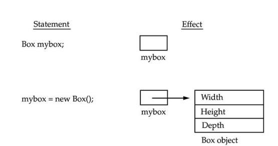
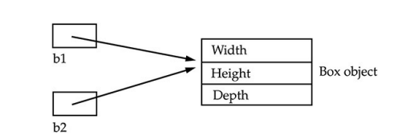

---
title: 'Introducing Classes'
weight: 6
--- 

# Introducing Classes

The class is at the core of Java. It is the logical construct upon which the entire Java language is built because it defines the shape and nature of an object. As such, the class forms the basis for object-oriented programming in Java. Any concept you wish to implement in a Java program must be encapsulated within a class.

Because the class is so fundamental to Java, this and the next few chapters will be devoted to it. Here, you will be introduced to the basic elements of a class and learn how a class can be used to create objects. You will also learn about methods, constructors, and the **this** keyword.

## Class Fundamentals

 Classes have been used since the beginning of this book. However, until now, only the most rudimentary form of a class has been shown. The classes created in the preceding chapters primarily exist simply to encapsulate the **main()** method, which has been used to demonstrate the basics of the Java syntax. As you will see, classes are substantially more powerful than the limited ones presented so far.

Perhaps the most important thing to understand about a class is that it defines a new data type. Once defined, this new type can be used to create objects of that type. Thus, a class is a template for an object, and an object is an instance of a class. Because an object is an instance of a class, you will often see the two words object and instance used interchangeably.

### The General Form of a Class

 When you define a class, you declare its exact form and nature. You do this by specifying the data that it contains and the code that operates on that data. While very simple classes may contain only code or only data, most real-world classes contain both. As you will see, a class’ code defines the interface to its data.

A class is declared by use of the **class** keyword. The classes that have been  

used up to this point are actually very limited examples of its complete form. Classes can (and usually do) get much more complex. A simplified general form of a **class** definition is shown here:

```
class classname 
{
	type instance-variable1;
	type instance-variable2;
	Il...
	type instance-variableN;
	type methodnamel (parameter-list) 
	{ 
		// body of method
	}
	// ...
	type methodname2(parameter-list) 
	{ 
		// body of method
	}
	type methodnameN(parameter-list) 
	{ 
		// body of method
	}
}
```

The data, or variables, defined within a **class** are called _instance variables_. The code is contained within methods. Collectively, the methods and variables defined within a class are called members of the class. In most classes, the instance variables are acted upon and accessed by the methods defined for that class. Thus, as a general rule, it is the methods that determine how a class’ data can be used.

Variables defined within a class are called instance variables because each instance of the class (that is, each object of the class) contains its own copy of these variables. Thus, the data for one object is separate and unique from the data for another. We will come back to this point shortly, but it is an important concept to learn early.

All methods have the same general form as **main()**, which we have been using thus far. However, most methods will not be specified as **static** or **public**. Notice that the general form of a class does not specify a **main()** method. Java  

classes do not need to have a **main()**method. You only specify one if that class is the starting point for your program. Further, some kinds of Java applications don’t require a **main()** method at all.

### A Simple Class

 Let’s begin our study of the class with a simple example. Here is a class called **Box** that defines three instance variables: **width**, **height**, and **depth**. Currently, **Box** does not contain any methods (but some will be added soon).

 ```
class Box {
	double width;
	double height;
	double depth;
}
 ```

As stated, a class defines a new type of data. In this case, the new data type is called **Box**. You will use this name to declare objects of type **Box**. It is important to remember that a class declaration only creates a template; it does not create an actual object. Thus, the preceding code does not cause any objects of type **Box** to come into existence.

To actually create a **Box** object, you will use a statement like the following:
```
Box mybox = new Box(); // create a Box object called mybox
```
After this statement executes, **mybox** will refer to an instance of **Box**. Thus, it will have “physical” reality. For the moment, don’t worry about the details of this statement.

As mentioned earlier, each time you create an instance of a class, you are creating an object that contains its own copy of each instance variable defined by the class. Thus, every **Box** object will contain its own copies of the instance variables **width**, **height**, and **depth**. To access these variables, you will use the dot (.) operator. The dot operator links the name of the object with the name of an instance variable. For example, to assign the **width** variable of **mybox** the value 100, you would use the following statement:
```
mybox.width = 100;
```
This statement tells the compiler to assign the copy of **width** that is contained within the **mybox** object the value of 100. In general, you use the dot operator to access both the instance variables and the methods within an object. One other point: Although commonly referred to as the dot operator, the formal specification for Java categorizes the . as a separator. However, since the use of the term “dot operator” is widespread, it is used in this book.

Here is a complete program that uses the **Box** class:

To run this program, you must execute **BoxDemo.class**. When you do, you will see the following output:
```
Volume is 3000.0
```
As stated earlier, each object has its own copies of the instance variables. This means that if you have two **Box** objects, each has its own copy of **depth**, **width**, and **height**. It is important to understand that changes to the instance variables of one object have no effect on the instance variables of another. For example, the following program declares two **Box** objects: 

```
// This program declares two Box objects.
class Box 
{
	double width;
	double height; 
	double depth;
}
class BoxDemo2 
{
	public static void main(String args[]) 
	{
		Box mybox1 = new Box();
		Box mybox2 = new Box();
		double vol;
		
		// assign values to myboxl's instance variables
		mybox1.width = 10; 
		mybox1.height = 20;
		mybox1.depth = 15;
		 
		//assign different values to mybox2's instance variables 
		mybox2.width = 3;
		mybox2.height = 6; 
		mybox2.depth = 9;
		
		// compute volume of first box
		vol = myboxl.width * mybox1.height * mybox1.depth; 
		System.out.println("Volume is " + vol);

		// compute volume of second box	
		vol = mybox2.width * mybox2.height * mybox2.depth; 
		System.out.println("Volume is " + vol);
	}
}
```

The output produced by this program is shown here:
```
Volume is 3000.0

Volume is 162.0  
```
As you can see, **mybox1**’s data is completely separate from the data contained in **mybox2**.

## Declaring Objects

 As just explained, when you create a class, you are creating a new data type. You can use this type to declare objects of that type. However, obtaining objects of a class is a two-step process. First, you must declare a variable of the class type. This variable does not define an object. Instead, it is simply a variable that can refer to an object. Second, you must acquire an actual, physical copy of the object and assign it to that variable. You can do this using the **new** operator. The **new** operator dynamically allocates (that is, allocates at run time) memory for an object and returns a reference to it. This reference is, essentially, the address in memory of the object allocated by **new**. This reference is then stored in the variable. Thus, in Java, all class objects must be dynamically allocated. Let’s look at the details of this procedure.

In the preceding sample programs, a line similar to the following is used to declare an object of type **Box**:
```
Box mybox = new Box();
```
This statement combines the two steps just described. It can be rewritten like this to show each step more clearly:
```
Box mybox; // declare reference to object

mybox = new Box(); // allocate a Box object
```
The first line declares **mybox** as a reference to an object of type **Box**. At this point, **mybox** does not yet refer to an actual object. The next line allocates an object and assigns a reference to it to **mybox**. After the second line executes, you can use **mybox** as if it were a **Box** object. But in reality, **mybox** simply holds, in essence, the memory address of the actual **Box** object. The effect of these two lines of code is depicted in Figure 6-1.



**Figure 6-1** Declaring an object of type **Box**

### A Closer Look at new

 As just explained, the **new** operator dynamically allocates memory for an object. In the context of an assignment, it has this general form:
```
_class-var_ = new classname ();
```
Here, _class-var_ is a variable of the class type being created. The classname is the name of the class that is being instantiated. The class name followed by parentheses specifies the constructor for the class. A constructor defines what occurs when an object of a class is created. Constructors are an important part of all classes and have many significant attributes. Most real-world classes explicitly define their own constructors within their class definition. However, if no explicit constructor is specified, then Java will automatically supply a default constructor. This is the case with **Box**. For now, we will use the default constructor. Soon, you will see how to define your own constructors.

At this point, you might be wondering why you do not need to use **new** for such things as integers or characters. The answer is that Java’s primitive types are not implemented as objects. Rather, they are implemented as “normal” variables. This is done in the interest of efficiency. As you will see, objects have many features and attributes that require Java to treat them differently than it treats the primitive types. By not applying the same overhead to the primitive types that applies to objects, Java can implement the primitive types more efficiently. Later, you will see object versions of the primitive types that are available for your use in those situations in which complete objects of these types are needed.

It is important to understand that **new** allocates memory for an object during run time. The advantage of this approach is that your program can create as many or as few objects as it needs during the execution of your program. However, since memory is finite, it is possible that **new** will not be able to allocate memory for an object because insufficient memory exists. If this happens, a run-time exception will occur. (You will learn how to handle exceptions in Chapter 10.) For the sample programs in this book, you won’t need to worry about running out of memory, but you will need to consider this possibility in real-world programs that you write.

Let’s once again review the distinction between a class and an object. A class creates a new data type that can be used to create objects. That is, a class creates a logical framework that defines the relationship between its members. When you declare an object of a class, you are creating an instance of that class. Thus, a class is a logical construct. An object has physical reality. (That is, an object occupies space in memory.) It is important to keep this distinction clearly in mind.

## Assigning Object Reference Variables

 Object reference variables act differently than you might expect when an assignment takes place. For example, what do you think the following fragment does?
```
Box b1 = new Box();

Box b2 = b1;
```
You might think that **b2** is being assigned a reference to a copy of the object referred to by **b1**. That is, you might think that **b1** and **b2** refer to separate and distinct objects. However, this would be wrong. Instead, after this fragment executes, **b1** and **b2** will both refer to the same object. The assignment of **b1** to **b2** did not allocate any memory or copy any part of the original object. It simply makes **b2** refer to the same object as does **b1**. Thus, any changes made to the object through **b2** will affect the object to which **b1** is referring, since they are the same object.

This situation is depicted here: 



Although **b1** and **b2** both refer to the same object, they are not linked in any other way. For example, a subsequent assignment to **b1** will simply unhook **b1** from the original object without affecting the object or affecting **b2**. For example:
```
Box b1 = new Box();
Box b2 = b1;
// ...
b1 = null;
```
Here, **b1** has been set to **null**, but **b2** still points to the original object.

**REMEMBER**

When you assign one object reference variable to another object reference variable, you are not creating a copy of the object, you are only making a copy of the reference.

## Introducing Methods

 As mentioned at the beginning of this chapter, classes usually consist of two things: instance variables and methods. The topic of methods is a large one because Java gives them so much power and flexibility. In fact, much of the next chapter is devoted to methods. However, there are some fundamentals that you need to learn now so that you can begin to add methods to your classes.

This is the general form of a method:
```
type name(parameter-list) { // body of method }
```
Here, type specifies the type of data returned by the method. This can be any valid type, including class types that you create. If the method does not return a value, its return type must be **void**. The name of the method is specified by name. This can be any legal identifier other than those already used by other items within the current scope. The _parameter-list_ is a sequence of type and identifier pairs separated by commas. Parameters are essentially variables that receive the value of the arguments passed to the method when it is called. If the method has no parameters, then the parameter list will be empty.

Methods that have a return type other than **void** return a value to the calling routine using the following form of the **return** statement:
```
return value;
```
Here, value is the value returned. In the next few sections, you will see how to create various types of methods, including those that take parameters and those that return values.

### Adding a Method to the Box Class

 Although it is perfectly fine to create a class that contains only data, it rarely happens. Most of the time, you will use methods to access the instance variables defined by the class. In fact, methods define the interface to most classes. This allows the class implementor to hide the specific layout of internal data structures behind cleaner method abstractions. In addition to defining methods that provide access to data, you can also define methods that are used internally by the class itself.

Let’s begin by adding a method to the **Box** class. It may have occurred to you while looking at the preceding programs that the computation of a box’s volume was something that was best handled by the **Box** class rather than the **BoxDemo** class. After all, since the volume of a box is dependent upon the size of the box, it makes sense to have the **Box** class compute it. To do this, you must add a method to **Box**, as shown here:

```
// This program includes a method inside the box class.
class Box 
{
	double width;
	double height;
	double depth;
	
	// display volume of a box
	void volume () 
	{
		System.out.print ("Volume is "); 
		System.out.println(width * height * depth);
	}
}
class BoxDemo3 
{
	public static void main(String args[]) 
	{
		Box mybox1 = new Box(); 
		Box mybox2 = new Box();

		// assign values to myboxl's instance variables 
		myboxl.width = 10;
		mybox1.depth = 15;
		mybox1.height = 20;

		// assign different values to mybox2's instance variables
		mybox2.width = 3;
		mybox2.height = 6;
		mybox2.depth = 9;
		
		// display volume of first box 
		mybox1.volume();
		
		// display volume of second box 
		mybox2. volume ();
	}
}
```

This program generates the following output, which is the same as the previous version.
```
Volume is 3000.0

Volume is 162.0
```
Look closely at the following two lines of code:
```
mybox1.volume();

mybox2.volume();
```
The first line here invokes the **volume()** method on **mybox1**. That is, it calls **volume()** relative to the **mybox1** object, using the object’s name followed by the dot operator. Thus, the call to **mybox1.volume()** displays the volume of the box defined by **mybox1**, and the call to **mybox2.volume()** displays the volume of the box defined by **mybox2**. Each time **volume()** is invoked, it displays the volume for the specified box.

If you are unfamiliar with the concept of calling a method, the following discussion will help clear things up. When **mybox1.volume()** is executed, the Java run-time system transfers control to the code defined inside **volume()**. After the statements inside **volume()** have executed, control is returned to the calling routine, and execution resumes with the line of code following the call. In the most general sense, a method is Java’s way of implementing subroutines.

There is something very important to notice inside the **volume()** method: the instance variables **width**, **height**, and **depth** are referred to directly, without preceding them with an object name or the dot operator. When a method uses an instance variable that is defined by its class, it does so directly, without explicit reference to an object and without use of the dot operator. This is easy to understand if you think about it. A method is always invoked relative to some object of its class. Once this invocation has occurred, the object is known. Thus, within a method, there is no need to specify the object a second time. This means that **width**, **height**, and **depth** inside **volume()** implicitly refer to the copies of those variables found in the object that invokes **volume()**.

Let’s review: When an instance variable is accessed by code that is not part of the class in which that instance variable is defined, it must be done through an object, by use of the dot operator. However, when an instance variable is accessed by code that is part of the same class as the instance variable, that variable can be referred to directly. The same thing applies to methods.

### Returning a Value

While the implementation of **volume()** does move the computation of a box’s volume inside the **Box** class where it belongs, it is not the best way to do it. For example, what if another part of your program wanted to know the volume of a box, but not display its value? A better way to implement **volume()** is to have it compute the volume of the box and return the result to the caller. The following example, an improved version of the preceding program, does just that:  

```
// Now, volume () returns the volume of a box.
class Box 
{
	double width;
	double height;
	double depth;
	
	// compute and return volume
	double volume () 
	{ 
		return * width * height depth;
	}
}
class BoxDemo4 
{ 
	Box mybox1 = new Box(); 
	Box mybox2 = new Box();
	public static void main(String args[]) 
	{
		double vol;
		
		// assign values to myboxl's instance variables 
		mybox1.depth = 15;
		mybox1.width = 10; 
		mybox1.height = 20;
		
		// assign different values to mybox2's instance variables 
		mybox2.width = 3;
		mybox2.height = 6; 
		mybox2.depth 9;
		
		// get volume of first box
		vol = mybox1.volume(); 
		System.out.println("Volume is " vol);
		
		// get volume of second box 
		vol = mybox2. volume (); 
		System.out.println("Volume is " + vol);
	}
}
```
As you can see, when **volume()** is called, it is put on the right side of an assignment statement. On the left is a variable, in this case **vol**, that will receive the value returned by **volume()**. Thus, after
```
vol = mybox1.volume();
```
executes, the value of **mybox1.volume()** is 3,000 and this value then is stored in **vol**.

There are two important things to understand about returning values:

- The type of data returned by a method must be compatible with the return type specified by the method. For example, if the return type of some method is **boolean**, you could not return an integer.

- The variable receiving the value returned by a method (such as **vol**, in this case) must also be compatible with the return type specified for the method.

One more point: The preceding program can be written a bit more efficiently because there is actually no need for the **vol** variable. The call to **volume()** could have been used in the **println()** statement directly, as shown here:
```
System.out.println("Volume is" + mybox1.volume());
```
In this case, when **println()** is executed, **mybox1.volume()** will be called automatically and its value will be passed to **println()**.

### Adding a Method That Takes Parameters

 While some methods don’t need parameters, most do. Parameters allow a method to be generalized. That is, a parameterized method can operate on a variety of data and/or be used in a number of slightly different situations. To illustrate this point, let’s use a very simple example. Here is a method that returns the square of the number 10:

 ```
int square()
{
	return 10 * 10;
}
 ```

While this method does, indeed, return the value of 10 squared, its use is very limited. However, if you modify the method so that it takes a parameter, as shown next, then you can make **square()** much more useful.

```
int square(int i)
{
	return i * i;
}
```

Now, **square()** will return the square of whatever value it is called with. That is, **square()** is now a general-purpose method that can compute the square of any integer value, rather than just 10.

Here is an example:
```
int x, y;

x = square(5); // x equals 25

x = square(9); // x equals 81

y = 2;

x = square(y); // x equals 4
```
In the first call to **square()**, the value 5 will be passed into parameter **i**. In the second call, **i** will receive the value 9. The third invocation passes the value of **y**, which is 2 in this example. As these examples show, **square()** is able to return the square of whatever data it is passed.

It is important to keep the two terms parameter and argument straight. A parameter is a variable defined by a method that receives a value when the method is called. For example, in **square()**, **i** is a parameter. An argument is a value that is passed to a method when it is invoked. For example, **square(100)** passes 100 as an argument. Inside **square()**, the parameter **i** receives that value.

You can use a parameterized method to improve the **Box** class. In the preceding examples, the dimensions of each box had to be set separately by use of a sequence of statements, such as:
```
mybox1.width = 10;
mybox1.height = 20;
mybox1.depth = 15;
```
While this code works, it is troubling for two reasons. First, it is clumsy and error prone. For example, it would be easy to forget to set a dimension. Second, in well-designed Java programs, instance variables should be accessed only through methods defined by their class. In the future, you can change the behavior of a method, but you can’t change the behavior of an exposed instance variable.   

Thus, a better approach to setting the dimensions of a box is to create a method that takes the dimensions of a box in its parameters and sets each instance variable appropriately. This concept is implemented by the following program:

```
// This program uses a parameterized method.
class Box 
{
	double width;
	double height;
	double depth;
	// compute and return volume
 	double volume () 
	{
	    return width * height * depth;
	}
	// sets dimensions of box
	void setDim (double w, double h, double d) 
	{ 
		height h;
		width= w;
		depth = d;
	}
}
class BoxDemo5 
{
	public static void main(String args[]) 
	{ 
		Box mybox1 = new Box();
		Box mybox2 = new Box();
		double vol;
		
		// initialize each box
		mybox1.setDim (10, 20, 15); 
		mybox2.setDim (3, 6, 9);
		
		// get volume of first
 		box vol = mybox1.volume(); 
		System.out.println("Volume is " + vol);
		// get volume of second 
		box vol = mybox2. volume(); 
		System.out.println("Volume is " + vol);
	}
}
```
As you can see, the **setDim()** method is used to set the dimensions of each box. For example, when
```
mybox1.setDim(10, 20, 15);
```
is executed, 10 is copied into parameter **w**, 20 is copied into **h**, and 15 is copied into **d**. Inside **setDim()** the values of **w**, **h**, and **d** are then assigned to **width**, **height**, and **depth**, respectively.

For many readers, the concepts presented in the preceding sections will be familiar. However, if such things as method calls, arguments, and parameters are new to you, then you might want to take some time to experiment before moving on. The concepts of the method invocation, parameters, and return values are fundamental to Java programming.

## Constructors

 It can be tedious to initialize all of the variables in a class each time an instance is created. Even when you add convenience methods like **setDim()**, it would be simpler and more concise to have all of the setup done at the time the object is first created. Because the requirement for initialization is so common, Java allows objects to initialize themselves when they are created. This automatic initialization is performed through the use of a constructor.

A constructor initializes an object immediately upon creation. It has the same name as the class in which it resides and is syntactically similar to a method. Once defined, the constructor is automatically called when the object is created, before the **new** operator completes. Constructors look a little strange because they have no return type, not even **void**. This is because the implicit return type of a class’ constructor is the class type itself. It is the constructor’s job to initialize the internal state of an object so that the code creating an instance will have a fully initialized, usable object immediately.

You can rework the **Box** example so that the dimensions of a box are automatically initialized when an object is constructed. To do so, replace **setDim()** with a constructor. Let’s begin by defining a simple constructor that sets the dimensions of each box to the same values. This version is shown here: 

```
//Here, Box uses a constructor to initialize the dimensions of a box.

class Box 
{
	double width;
	double height;
	double depth;
	// This is the constructor for Box. 
	Box() 
	{
		System.out.println("Constructing Box");
		width= 10;
		height = 10;
		depth = 10;
	}
	// compute and return volume
 	double volume () 
	{
	    return width * height * depth;
	}
}
class BoxDemo6 
{
	public static void main(String args[]) 
	{
		// declare, allocate, and initialize Box objects
		Box mybox1 = new Box();
		Box mybox2 = new Box();
		double vol;
		
		// get volume of first box
		vol = mybox1.volume();
		System.out.println("Volume is " + vol);
		
		// get volume of second box 
		vol = mybox2. volume();
		System.out.println("Volume is " + vol);
	}
}
```

When this program is run, it generates the following results:
```
Constructing Box
Constructing Box
Volume is 1000.0
Volume is 1000.0
```
As you can see, both **mybox1** and **mybox2** were initialized by the **Box()** constructor when they were created. Since the constructor gives all boxes the same dimensions, 10 by 10 by 10, both **mybox1** and **mybox2** will have the same volume. The **println()** statement inside **Box()** is for the sake of illustration only. Most constructors will not display anything. They will simply initialize an object.

Before moving on, let’s reexamine the **new** operator. As you know, when you allocate an object, you use the following general form:
```
class-var = new classname ();
```
Now you can understand why the parentheses are needed after the class name. What is actually happening is that the constructor for the class is being called. Thus, in the line
```
Box mybox1 = new Box();
```
**new Box()** is calling the **Box()** constructor. When you do not explicitly define a constructor for a class, then Java creates a default constructor for the class. This is why the preceding line of code worked in earlier versions of **Box** that did not define a constructor. When using the default constructor, all non- initialized instance variables will have their default values, which are zero, **null**, and **false**, for numeric types, reference types, and **boolean**, respectively. The default constructor is often sufficient for simple classes, but it usually won’t do for more sophisticated ones. Once you define your own constructor, the default constructor is no longer used.

### Parameterized Constructors

 While the **Box()** constructor in the preceding example does initialize a **Box** object, it is not very useful—all boxes have the same dimensions. What is needed is a way to construct **Box** objects of various dimensions. The easy solution is to add parameters to the constructor. As you can probably guess, this makes it much more useful. For example, the following version of **Box** defines a parameterized constructor that sets the dimensions of a box as specified by those parameters. Pay special attention to how **Box** objects are created. 

```
/* Here, Box uses a parameterized constructor to initialize the dimensions of a box.
*/
class Box 
{
	double width;
	double height;
	double depth;
	// This is the constructor for Box. 
	Box(double w, double h, double d) 
	{
		depth = d;
		width= w;
		height = h;
	}
	
	// compute and return volume
	double volume () 
	{
		return width * height * depth;
	}
}
class BoxDemo7 
{
	public static void main(String args[]) 
	{
		// declare, allocate, and initialize Box objects 
		Box mybox1 = new Box (10, 20, 15);
		Box mybox2 = new Box (3, 6, 9);
		double vol;
		
		// get volume of first box 
		vol = mybox1.volume();
		System.out.println("Volume is " + vol);
		
		// get volume of second box
		vol = mybox2. volume(); 
		System.out.println("Volume is " + vol);
	}
}
```

The output from this program is shown here:
```
Volume is 3000.0
Volume is 162.0
```
As you can see, each object is initialized as specified in the parameters to its constructor. For example, in the following line,
```
Box mybox1 = new Box(10, 20, 15);
```
the values 10, 20, and 15 are passed to the **Box()** constructor when **new** creates the object. Thus, **mybox1**’s copy of **width**, **height**, and **depth** will contain the values 10, 20, and 15, respectively.

## The this Keyword

 Sometimes a method will need to refer to the object that invoked it. To allow this, Java defines the **this** keyword. **this** can be used inside any method to refer to the current object. That is, **this** is always a reference to the object on which the method was invoked. You can use **this** anywhere a reference to an object of the current class’ type is permitted.

To better understand what **this** refers to, consider the following version of **Box()**:

```
// Acredudant use of this.
Box(double w, double h, double d) 
{
	this.width = w;
	this.height = h;
	this.depth = d'
}
```

This version of **Box()** operates exactly like the earlier version. The use of **this** is redundant, but perfectly correct. Inside **Box()**, **this** will always refer to the invoking object. While it is redundant in this case, **this** is useful in other contexts, one of which is explained in the next section.

### Instance Variable Hiding

 As you know, it is illegal in Java to declare two local variables with the same name inside the same or enclosing scopes. Interestingly, you can have local variables, including formal parameters to methods, which overlap with the names of the class’ instance variables. However, when a local variable has the same name as an instance variable, the local variable hides the instance variable. This is why **width**, **height**, and **depth** were not used as the names of the parameters to the **Box()** constructor inside the **Box** class. If they had been, then **width,** for example, would have referred to the formal parameter, hiding the instance variable **width**. While it is usually easier to simply use different names, there is another way around this situation. Because **this** lets you refer directly to the object, you can use it to resolve any namespace collisions that might occur between instance variables and local variables. For example, here is another version of **Box()**, which uses **width**, **height**, and **depth** for parameter names and then uses **this** to access the instance variables by the same name:

```
// use this to resolve name-space collisions.
BOx(double width. double height. double depth) 
{
	this.width = width;
	this.height = height;
	this.depth = depth;
}
```

A word of caution: The use of **this** in such a context can sometimes be confusing, and some programmers are careful not to use local variables and formal parameter names that hide instance variables. Of course, other programmers believe the contrary—that it is a good convention to use the same names for clarity, and use **this** to overcome the instance variable hiding. It is a matter of taste which approach you adopt.

## Garbage Collection

 Since objects are dynamically allocated by using the **new** operator, you might be wondering how such objects are destroyed and their memory released for later reallocation. In some languages, such as traditional C++, dynamically allocated objects must be manually released by use of a **delete** operator. Java takes a different approach; it handles deallocation for you automatically. The technique that accomplishes this is called _garbage collection_. It works like this: when no references to an object exist, that object is assumed to be no longer needed, and the memory occupied by the object can be reclaimed. There is no need to explicitly destroy objects. Garbage collection only occurs sporadically (if at all) during the execution of your program. It will not occur simply  

because one or more objects exist that are no longer used. Furthermore, different Java run-time implementations will take varying approaches to garbage collection, but for the most part, you should not have to think about it while writing your programs.

## A Stack Class

 While the **Box** class is useful to illustrate the essential elements of a class, it is of little practical value. To show the real power of classes, this chapter will conclude with a more sophisticated example. As you recall from the discussion of object-oriented programming (OOP) presented in Chapter 2, one of OOP’s most important benefits is the encapsulation of data and the code that manipulates that data. As you have seen, the class is the mechanism by which encapsulation is achieved in Java. By creating a class, you are creating a new data type that defines both the nature of the data being manipulated and the routines used to manipulate it. Further, the methods define a consistent and controlled interface to the class’ data. Thus, you can use the class through its methods without having to worry about the details of its implementation or how the data is actually managed within the class. In a sense, a class is like a “data engine.” No knowledge of what goes on inside the engine is required to use the engine through its controls. In fact, since the details are hidden, its inner workings can be changed as needed. As long as your code uses the class through its methods, internal details can change without causing side effects outside the class.

To see a practical application of the preceding discussion, let’s develop one of the archetypal examples of encapsulation: the stack. A stack stores data using first-in, last-out ordering. That is, a stack is like a stack of plates on a table—the first plate put down on the table is the last plate to be used. Stacks are controlled through two operations traditionally called push and pop. To put an item on top of the stack, you will use push. To take an item off the stack, you will use pop. As you will see, it is easy to encapsulate the entire stack mechanism.

Here is a class called **Stack** that implements a stack for up to ten integers:  

```
// This class defines an integer stack that can hold 10 values 
class Stack 
{
	int stck[] = new int[10];
	int tos;
	// Initialize top-of-stack
	Stack() 
	{
		tos = -1;
	}
	
	// Push an item onto the stack 
	void push(int item) 
	{
		if (tos==9)
			System.out.println("Stack is full.");
		else
			stck [++tos] = item;
	}
	
	// Pop an item from the stack
	int pop() 
	{
		if (tos < 0) 
		{
			System.out.println("Stack underflow.");
			return 0;
		}
		else
			return stck [tos--];
	}
}
```

As you can see, the **Stack** class defines two data items, two methods, and a constructor. The stack of integers is held by the array **stck**. This array is indexed by the variable **tos**, which always contains the index of the top of the stack. The **Stack()** constructor initializes **tos** to –1, which indicates an empty stack. The method **push()** puts an item on the stack. To retrieve an item, call **pop()**. Since access to the stack is through **push()** and **pop()**, the fact that the stack is held in an array is actually not relevant to using the stack. For example, the stack could be held in a more complicated data structure, such as a linked list, yet the interface defined by **push()** and **pop()** would remain the same.  

The class **TestStack**, shown here, demonstrates the **Stack** class. It creates two integer stacks, pushes some values onto each, and then pops them off.

```
class TestStack 
{
	public static void main(String args[]) 
	{ 
		Stack mystack1= new Stack();
		Stack mystack2= new Stack();
		// push some numbers onto the stack 
		for(int i=0; i<10; i++)
			mystack1.push(i);
   		
		for (int i=10; i<20; i++) 
   			mystack2.push(i);
		
		// pop those numbers off the stack
 		System.out.println("Stack in mystackl:"); 
 		for (int i=0; i<10; i++)
			System.out.println (mystack1.pop());
		System.out.println("Stack in mystack2: ");
		for (int i=0; i<10; i++)
			System.out.println (mystack2.pop());
	}
}
```
This program generates the following output:
```
Stack in mystack1:

9
8
7
6
5
4
3
2
1
0

Stack in mystack2:

19
18
17
16
15  
14
13
12
11
10
```
As you can see, the contents of each stack are separate. One last point about the **Stack** class. As it is currently implemented, it is possible for the array that holds the stack, **stck**, to be altered by code outside of the **Stack** class. This leaves **Stack** open to misuse or mischief. In the next chapter, you will see how to remedy this situation.  
