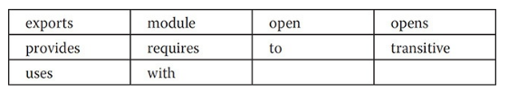
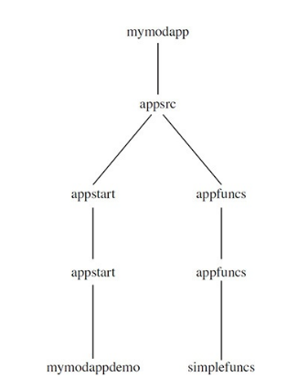
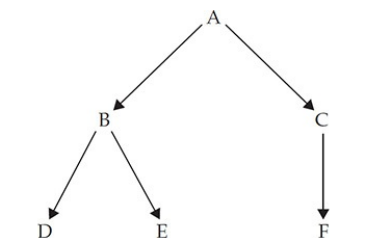

---
title: 'Modules'
weight: 16
--- 

# Modules

JDK 9 introduced a new and important feature called modules. Modules give you a way to describe the relationships and dependencies of the code that comprises an application. Modules also let you control which parts of a module are accessible to other modules and which are not. Through the use of modules you can create more reliable, scalable programs.

As a general rule, modules are most helpful to large applications because they help reduce the management complexity often associated with a large software system. However, small programs also benefit from modules because the Java API library has now been organized into modules. Thus, it is now possible to specify which parts of the API are required by your program and which are not. This makes it possible to deploy programs with a smaller run- time footprint, which is especially important when creating code for small devices, such as those intended to be part of the Internet of Things (IoT).

Support for modules is provided both by language elements, including several keywords, and by enhancements to **javac**, **java**, and other JDK tools. Furthermore, new tools and file formats were introduced. As a result, the JDK and the run-time system were substantially upgraded to support modules. In short, modules constitute a major addition to, and evolution of, the Java language.

## Module Basics

 In its most fundamental sense, a module is a grouping of packages and resources that can be collectively referred to by the module’s name. A _module declaration_ specifies the name of a module and defines the relationship a module and its packages have to other modules. Module declarations are program statements in a Java source file and are supported by several module- related keywords. They are shown here:  

It is important to understand that these keywords are recognized _as keywords_ only in the context of a module declaration. Otherwise, they are interpreted as identifiers in other situations. Thus, the keyword **module** could, for example, also be used as a parameter name, although such a use is certainly not recommended. However, making the module-related keywords context- sensitive prevents problems with pre-existing code that may use one or more of them as identifiers. Because they are context-sensitive, the module-related keywords are formally called _restricted keywords_.

A module declaration is contained in a file called **module-info.java**. Thus, a module is defined in a Java source file. This file is then compiled by **javac** into a class file and is known as its _module descriptor_. The **module-info.java** file must contain only a module definition. It cannot contain other types of declarations.

A module declaration begins with the keyword **module**. Here is its general form:
```
module moduleName{
    //module Definition
}
```
The name of the module is specified by _moduleName,_ which must be a valid Java identifier or a sequence of identifiers separated by periods. The module definition is specified within the braces. Although a module definition may be empty (which results in a declaration that simply names the module), typically it specifies one or more clauses that define the characteristics of the module.

### A Simple Module Example

 At the foundation of a module’s capabilities are two key features. The first is a module’s ability to specify that it requires another module. In other words, one module can specify that it depends on another. A dependence relationship is specified by use of a **requires** statement. By default, the presence of the required module is checked at both compile time and at run time. The second key feature is a module’s ability to control which, if any, of its packages are  

accessible by another module. This is accomplished by use of the **exports** keyword. The public and protected types within a package are accessible to other modules only if they are explicitly exported. Here we will develop an example that introduces both of these features.

The following example creates a modular application that demonstrates some simple mathematical functions. Although this application is purposely very small, it illustrates the core concepts and procedures required to create, compile, and run module-based code. Furthermore, the general approach shown here also applies to larger, real-world applications. It is strongly recommended that you work through the example on your computer, carefully following each step.

**NOTE**

 This chapter shows the process of creating, compiling, and running module-based code by use of the command-line tools. This approach has two advantages. First, it works for all Java programmers because no IDE is required. Second, it very clearly shows the fundamentals of the module system, including how it utilizes directories. To follow along, you will need to manually create a number of directories and ensure that each file is placed in its proper directory. As you might expect, when creating real- world, module-based applications you will likely find a module-aware IDE easier to use because, typically, it will automate much of the process. However, learning the fundamentals of modules using the command-line tools ensures that you have a solid understanding of the topic.

The application defines two modules. The first module is called **appstart**. It contains a package called **appstart.mymodappdemo** that defines the application’s entry point in a class called **MyModAppDemo**. Thus, **MyModAppDemo** contains the application’s **main()** method. The second module is called **appfuncs**. It contains a package called **appfuncs.simplefuncs** that includes the class **SimpleMathFuncs**. This class defines three static methods that implement some simple mathematical functions. The entire application will be contained in a directory tree that begins at **mymodapp**.

Before continuing, a few words about module names are appropriate. First, in the examples that follow, the name of a module (such as **appfuncs**) is the prefix of the name of a package (such as **appfuncs.simplefuncs**) that it contains. This is not required, but is used here as a way of clearly indicating to what module a package belongs. In general, when learning about and experimenting with modules, short, simple names, such as those used in this chapter, are helpful, and you can use any sort of convenient names that you like. However, when creating modules suitable for distribution, you must be careful with the names you choose because you will want those names to be  

unique. At the time of this writing, the suggested way to achieve this is to use the reverse domain name method. In this method, the reverse domain name of the domain that “owns” the project is used as a prefix for the module. For example, a project associated with **herbschildt.com** would use **com.herbschildt** as the module prefix. (The same goes for package names.) Because modules are a recent addition to Java, naming conventions may evolve over time. You will want to check the Java documentation for current recommendations.

Let’s now begin. Start by creating the necessary source code directories by following these steps:

1. Create a directory called **mymodapp**. This is the top-level directory for the entire application.

2. Under **mymodapp**, create a subdirectory called **appsrc**. This is the top- level directory for the application’s source code.

3. Under **appsrc**, create the subdirectory **appstart**. Under this directory, create a subdirectory also called **appstart**. Under this directory, create the directory **mymodappdemo**. Thus, beginning with **appsrc**, you will have created this tree: appsrc\\appstart\\appstart\\mymodappdemo

4. Also under **appsrc**, create the subdirectory **appfuncs**. Under this directory, create a subdirectory also called **appfuncs**. Under this directory, create the directory called **simplefuncs**. Thus, beginning with **appsrc**, you will have created this tree: appsrc\\appfuncs\\appfuncs\\simplefuncs

Your directory tree should look like that shown here.  

After you have set up these directories, you can create the application’s source files.

This example will use four source files. Two are the source files that define the application. The first is **SimpleMathFuncs.java**, shown here. Notice that **SimpleMathFuncs** is packaged in **appfuncs.simplefuncs**.  
```
// Some simple math functions.
package appfuncs.simplefuncs;
public class SimpleMathFuncs 
{
    // Determine if a is a factor of b. 
    public static boolean isFactor (int a, int b) 
    { 
        if((b%a) == 0) 
            return true; 
        return false;
    }
    // Return the smallest positive factor that a and b have in common.
    public static int lef (int a, int b) 
    { 
        // Factor using positive values.
        a = Math.abs (a);
        b = Math.abs (b);
        int min = a<b?a: b;
        for (int i= 2; i <= min/2; i++) 
        { 
            if (isFactor (i, a) && isFactor (i, b))
            return i;
        }
        return 1;
    }
    // Return the largest positive factor that a and b have in common. 
    public static int gcf(int a, int b) 
    {
        // Factor using positive values.
        a = Math.abs (a);
        b = Math.abs (b); 
        int min = a < b? a: b;
        for (int i = min/2; i >= 2; i--) 
        { 
            if (isFactor (i, a) && isFactor (i, b)) 
            return i;
        }
    return 1;
    }
}
```

**SimpleMathFuncs** defines three simple **static** math functions. The first, **isFactor()**, returns true if **a** is a factor of **b**. The **lcf()** method returns the smallest factor common to both **a** and **b**. In other words, it returns the least common factor of **a** and **b**. The **gcf()** method returns the greatest common factor of **a** and **b**. In both cases, 1 is returned if no common factors are found. This file must be put in the following directory:

appsrc\\appfuncs\\appfuncs\\simplefuncs

This is the **appfuncs.simplefuncs** package directory. 
    The second source file is **MyModAppDemo.java**, shown next. It uses the methods in **SimpleMathFuncs**. Notice that it is packaged in **appstart.mymodappdemo**. Also note that it imports the **SimpleMathFuncs** class because it depends on **SimpleMathFuncs** for its operation.  
```
// Demonstrate a simple module-based application. 
package appstart.mymodappdemo;
import appfuncs.simplefuncs.SimpleMathFuncs;
public class MyModAppDemo 
{ 
    public static void main(String[] args)
    {
        if (SimpleMathFuncs.isFactor (2, 10)) 
            System.out.println("2 is a factor of 10");
        System.out.println("Smallest factor common to both 35 and 105 is " +SimpleMathFuncs.lef (35, 105));
        System.out.println("Largest factor common to both 35 and 105 is " +SimpleMathFuncs.gcf (35, 105));
    }
}   
```
This file must be put in the following directory:
```
appsrc\\appstart\\appstart\\mymodappdemo
```
This is the directory for the **appstart.mymodappdemo** package. Next, you will need to add **module-info.java** files for each module. These files contain the module definitions. First, add this one, which defines the **appfuncs** module:
```
//Module Definition for the functional module
module appfuncs
{
    //Exports the package appfuncs.simplefuncs
    exports appfuncs.simplefuncs;
}
```
Notice that **appfuncs** exports the package **appfuncs.simplefuncs**, which makes it accessible to other modules. This file must be put into this directory:

appsrc\\appfuncs

Thus, it goes in the **appfuncs** module directory, which is above the package directories.

Finally, the **module-info.java** file for the **appstart** module is shown next. Notice that **appstart** requires the module **appfuncs**.  

This file must be put into its module directory:

appsrc\\appstart

Before examining the **requires**, **exports**, and **module** statements more closely, let’s first compile and run this example. Be sure that you have correctly created the directories and entered each file into its proper directory, as just explained.

### Compile and Run the First Module Example

 Beginning with JDK 9, **javac** has been updated to support modules. Thus, like all other Java programs, module-based programs are compiled using **javac**. The process is easy, with the primary difference being that you will usually explicitly specify a _module path_. A module path tells the compiler where the compiled files will be located. When following along with this example, be sure that you execute the **javac** commands from the **mymodapp** directory in order for the paths to be correct. Recall that **mymodapp** is the top-level directory for the entire module application.

To begin, compile **SimpleMathFuncs.java** using this command:
```
javac -d appmodules\appfuncs 
appsrc\appfuncs\appfuncs\simple funcs\SimpleMathFuncs.java
```
Remember, this command _must be_ executed from the **mymodapp** directory. Notice the use of the **\-d** option. This tells **javac** where to put the output **.class** file. For the examples in this chapter, the top of the directory tree for compiled code is **appmodules**. This command will create the output package directories for **appfuncs.simplefuncs** under **appmodules\\appfuncs** as needed.

Next, here is the **javac** command that compiles the **module-info.java** file for the **appfuncs** module:

javac -d appmodules\\appfuncs appsrc\\appfuncs\\module-info.java

This puts the **module-info.class** file into the **appmodules\\appfuncs** directory. Although the preceding two-step process works, it was shown primarily for the sake of discussion. It is usually easier to compile a module’s **module- info.java** file and its source files in one command line. Here, the preceding two **javac** commands are combined into one:
```
javac -d appmodules\appfuncs appsrc\appfuncs\appfuncs\module-info.java
appsrc\appfuncs\appfuncs\simplefuncs\simpleMathFuncs.java
```
In this case, each compiled file is put in its proper module or package directory.

Now, compile **module-info.java** and **MyModAppDemo.java** for the **appstart** module, using this command:
```
javac --module-path appmodules -d appmodules\appstart 
appsrc\appstart\module-info.java 
appsrc\appstart\appstart\mymodappdemo\MyModAppDemo.java
```
Notice the **\--module-path** option. It specifies the module path, which is the path on which the compiler will look for the user-defined modules required by the **module-info.java** file. In this case, it will look for the **appfuncs** module because it is needed by the **appstart** module. Also, notice that it specifies the output directory as **appmodules\\appstart**. This means that the **module- info.class** file will be in the **appmodules\\appstart** module directory and **MyModAppDemo.class** will be in the **appmodules\\appstart\\appstart\\mymodappdemo** package directory.

Once you have completed the compilation, you can run the application with this **java**command:
```
java --module-path appmodules -m
appstart/appstart.mymodappdemo.MyModAppDemo
```
Here, the --**module-path** option specifies the path to the application’s modules. As mentioned, **appmodules** is the directory at the top of the compiled modules tree. The **\-m** option specifies the class that contains the entry point of the application and, in this case, the name of the class that contains the **main()** method. When you run the program, you will see the following output:
```
2 is a factor of 10

Smallest factor common to both 35 and 105 is 5

Largest factor common to both 35 and 105 is 7
```
### A Closer Look at requires and exports

 The preceding module-based example relies on the two foundational features of the module system: the ability to specify a dependence and the ability to satisfy that dependence. These capabilities are specified through the use of the **requires** and **exports** statements within a **module** declaration. Each merits a closer examination at this time.

Here is the form of the **requires** statement used in the example:

requires _moduleName;_

Here, _moduleName_ specifies the name of a module that is required by the module in which the **requires** statement occurs. This means that the required module must be present in order for the current module to compile. In the language of modules, the current module is said to read the module specified in the **requires** statement. When more than one module is required, it must be specified in its own **requires** statement. Thus, a module declaration may include several different **requires** statements. In general, the **requires** statement gives you a way to ensure that your program has access to the modules that it needs.

Here is the general form of the **exports** statement used in the example:
```
exports packageName;
```
Here, packageName specifies the name of the package that is exported by the module inwhich this statement occurs. A module can export as many packages as needed, with eachone specified in a separate **exports** statement. Thus, a module may have several **exports** statements.

When a module exports a package, it makes all of the public and protected types in the package accessible to other modules. Furthermore, the public and protected members of those types are also accessible. However, if a package within a module is not exported, then it is private to that module, including all of its public types. For example, even though a class is declared as **public** within a package, if that package is not explicitly exported by an **exports** statement, then that class is not accessible to other modules. It is important to understand that the public and protected types of a package, whether exported or not, are always accessible within that package’s module. The **exports** statement simply makes them accessible to outside modules. Thus, any nonexported package is only for the internal use of its module.

The key to understanding **requires** and **exports** is that they work together. If one module depends on another, then it must specify that dependence with **requires**. The module on which another depends must explicitly export (i.e., make accessible) the packages that the dependent module needs. If either side of this dependence relationship is missing, the dependent module will not compile. As it relates to the foregoing example, **MyModAppDemo** uses the functions in **SimpleMathFuncs**. As a result, the **appstart** module declaration contains a **requires** statement that names the **appfuncs** module. The **appfuncs** module declaration exports the **appfuncs.simplefuncs** package, thus making the public types in the **SimpleMathFuncs** class available. Since both sides of the dependence relationship have been fulfilled, the application can compile and run. If either is missing, the compilation will fail.

It is important to emphasize that **requires** and **exports** statements must occur only within a **module** statement. Furthermore, a **module** statement must occur by itself in a file called **module-info.java**.

**java.base and the Platform Modules** 
As mentioned at the start of this chapter, beginning with JDK 9 the Java API packages have been incorporated into modules. In fact, the modularization of the API is one of the primary benefits realized by the addition of the modules. Because of their special role, the API modules are referred to as _platform modules,_ and their names all begin with the prefix **java**. Here are some examples: **java.base**, **java.desktop**, and **java.xml**. By modularizing the API, it becomes possible to deploy an application with only the packages that it requires, rather than the entire Java Runtime Environment (JRE). Because of the size of the full JRE, this is a very important improvement.

The fact that all of the Java API library packages are now in modules gives rise to the following question: How can the **main()** method in **MyModAppDemo** in the preceding example use **System.out.println()** without specifying a **requires** statement for the module that contains the **System** class? Obviously, the program will not compile and run unless **System** is present. The same question also applies to the use of the **Math** class in **SimpleMathFuncs**. The answer to this question is found in **java.base**.

Of the platform modules, the most important is **java.base**. It includes and exports those packages fundamental to Java, such as **java.lang**, **java.io**, and **java.util**, among many others. Because of its importance, **java.base** is _automatically accessible_ to all modules. Furthermore, all other modules automatically require **java.base**. There is no need to include a **requires java.base** statement in a module declaration. (As a point of interest, it is not wrong to explicitly specify **java.base**, it’s just not necessary.) Thus, in much the same way that **java.lang** is automatically available to all programs without the use of an **import** statement, the **java.base** module is automatically accessible to all module-based programs without explicitly requesting it.

Because **java.base** contains the **java.lang** package, and **java.lang** contains the **System** class, **MyModAppDemo** in the preceding example can automatically use **System.out.println()** without an explicit **requires** statement. The same applies to the use of the **Math** class in **SimpleMathFuncs**, because the **Math** class is also in **java.lang**. As you will see when you begin to create your own module-based applications, many of the API classes you will commonly need are in the packages included in **java.base**. Thus, the automatic inclusion of **java.base** simplifies the creation of module- based code because Java’s core packages are automatically accessible.

One last point: Beginning with JDK 9, the documentation for the Java API now tells you the name of the module in which a package is contained. If the module is **java.base**, then you can use the contents of that package directly. Otherwise, your module declaration must include a **requires** clause for the desired module.

## Legacy Code and the Unnamed Module

 Another question may have occurred to you when working through the first example module program. Because Java now supports modules, and the API packages are also contained in modules, why do all of the other programs in the preceding chapters compile and run without error even though they do not use modules? More generally, since there is now over 20 years of Java code in existence and (at the time of this writing) the vast majority of that code does not use modules, how is it possible to compile, run, and maintain that legacy code with a JDK 9 or later compiler? Given Java’s original philosophy of “write once, run everywhere,” this is a very important question because backward capability must be maintained. As you will see, Java answers this question by providing an elegant, nearly transparent means of ensuring backward compatibility with pre-existing code.

Support for legacy code is provided by two key features. The first is the _unnamed module_. When you use code that is not part of a named module, it automatically becomes part of theunnamed module. The unnamed module has two important attributes. First, all of the packages in the unnamed module are automatically exported. Second, the unnamed module can access any and all other modules. Thus, when a program does not use modules, all API modules in the Java platform are automatically accessible through the unnamed module.

The second key feature that supports legacy code is the automatic use of the class path, rather than the module path. When you compile a program that does not use modules, the class path mechanism is employed, just as it has been since Java’s original release. As a result, the program is compiled and run in the same way it was prior to the advent of modules.

Because of the unnamed module and the automatic use of the class path, there was no need to declare any modules for the sample programs shown elsewhere in this book. They run properly whether you compile them with a modern compiler or an earlier one, such as JDK8. Thus, even though modules are a feature that has significant impact on Java, compatibility with legacy code is maintained. This approach also provides a smooth, nonintrusive, nondisruptive transition path to modules. Thus, it enables you to move a legacy application to modules at your own pace. Furthermore, it allows you to avoid the use of modules when they are not needed.

Before moving on, an important point needs to be made. For the types of example programs used elsewhere in this book, and for example programs in general, there is no benefit in using modules. Modularizing them would simply add clutter and complicate them for no reason or benefit. Furthermore, for many simple programs, there is no need to contain them in modules. For the reasons stated at the start of this chapter, modules are often of the greatest benefit when creating commercial programs. Therefore, no examples outside this chapter will use modules. This also allows the examples to be compiled and run in a pre–JDK 9 environment, which is important to readers using an older version of Java. Thus, except for the examples in this chapter, the examples in this book work for both pre-module and post-module JDKs.

## Exporting to a Specific Module

 The basic form of the **exports** statement makes a package accessible to any and all other modules. This is often exactly what you want. However, in some specialized development situations, it can be desirable to make a package accessible to only a _specific set_ of modules, not all other modules. For example, a library developer might want to export a support package to certain other modules within the library, but not make it available for general use. Adding a **to** clause to the **exports** statement provides a means by which this can be accomplished.

In an **exports** statement, the **to** clause specifies a list of one or more modules that have access to the exported package. Furthermore, only those modules named in the **to** clause will have access. In the language of modules, the **to** clause creates what is known as a _qualified export_.

The form of **exports** that includes **to** is shown here:

exports packageName to moduleNames;

Here, moduleNames is a comma-separated list of modules to which the exporting module grants access.

You can try the **to** clause by changing the **module-info.java** file for the **appfuncs** module, as shown here:
```
// Module definition that uses a to clause. 
module appfuncs 
{ 
    // Exports the package appfuncs.simplefuncs to appstart. 
    exports appfuncs.simple funcs to appstart; 
}
```
Now, **simplefuncs** is exported only to **appstart** and to no other modules. After making this change, you can recompile the application by using this **javac** command:
```
javac -d appmodules --module-source-path appsrc appsrc\appstart\appstart\mymodappdemo\MyModAppDemo.java
```
After compiling, you can run the application as shown earlier. This example also uses another module-related feature. Look closely at the

preceding **javac** command. First, notice that it specifies the **\--module-source- path** option. The module source path specifies the top of the module source tree. The --**module-source-path** option automatically compiles the files in the tree under the specified directory, which is **appsrc** in this example. The -- **module-source-path** option must be used with the **\-d** option to ensure that the compiled modules are stored in their proper directories under **appmodules**. This form of **javac** is called _multi-module mode_ because it enables more than one module to be compiled at a time. The multi-module compilation mode is especially helpful here because the **to** clause refers to a specific module, and the requiring module must have access to the exported package. Thus, in this case, both **appstart** and **appfuncs** are needed to avoid warnings and/or errors during compilation. Multi-module mode avoids this problem because both modules are being compiled at the same time.

The multi-module mode of **javac** has another advantage. It automatically finds and compiles all source files for the application, creating the necessary output directories. Because of the advantages that multi-module compilation mode offers, it will be used for the subsequent examples.

**NOTE**

 As a general rule, qualified export is a special case feature. Most often, your modules will either provide unqualified export of a package or not export the package at all, keeping it inaccessible. As such, qualified export is discussed here primarily for the sake of completeness. Also, qualified export by itself does not prevent the exported package from being misused by malicious code in a module that masquerades as the targeted module. The security techniques required to prevent this from happening are beyond the scope of this book. Consult the Oracle documentation for details on security in this regard, and Java security details in general.

## Using requires transitive

 Consider a situation in which there are three modules, A, B, and C, that have the following dependences:

- A requires B.
- B requires C.

Given this situation, it is clear that since A depends on B and B depends on C, A has an indirect dependence on C. As long as A does not directly use any of the contents of C, then you can simply have A require B in its module-info file, and have B export the packages required by A in its module-info file, as shown here:
```
// A's module-info file: 
module A 
{ 
    requires B; 
}

// B's module-info file. 
module B 
{ 
    exports somepack; 
    requires C;
}
```
Here, somepack is a placeholder for the package exported by B and used by A. Although this works as long as A does not need to use anything defined in C, a problem occurs if A does want to access a type in C. In this case, there are two solutions.  

The first solution is to simply add a **requires C** statement to A’s file, as shown here:
```
// A's module-info file updated to explicitly require C: 
module A 
{ 
    requires B; 
    requires C; // also require C
}
```
This solution certainly works, but if B will be used by many modules, you must add **requiresC** to all module definitions that require B. This is not only tedious, it is also error prone. Fortunately, there is a better solution. You can create an _implied dependence_ on C. Implied dependence is also referred to as _implied readability_.

To create an implied dependence, add the **transitive** keyword after **requires** in the clause that requires the module upon which an implied readability is needed. In the case of this example, you would change B’s module-info file as shown here:
```
// B's module-info file. 
module B 
{ 
    exports somepack; 
    requires transitive C; 
}
```
Here, C is now required as transitive. After making this change, any module that depends on B will also, automatically, depend on C. Thus, A would automatically have access to C.

You can experiment with **requires transitive** by reworking the preceding modular application example so that the **isFactor()** method is removed from the **SimpleMathFuncs** class in the **appfuncs.simplefuncs** package and put into a new class, module, and package. The new class will be called **SupportFuncs**, the module will be called **appsupport**, and the package will be called **appsupport.supportfuncs**. The **appfuncs** module will then add a dependence on the **appsupport** module by use of **requires transitive**. This will enable both the **appfuncs** and **appstart** modules to access it without **appstart** having to provide its own **requires** statement. This works because **appstart** receives access to it through an **appfuncs requires transitive** statement. The following describes the process in detail.

To begin, create the source directories that support the new **appsupport** module. First, create **appsupport** under the **appsrc** directory. This is the module directory for the support functions. Under **appsupport**, create the package directory by adding the **appsupport** subdirectory followed by the **supportfuncs** subdirectory. Thus, the directory tree for **appsupport** should now look like this:

appsrc\\appsupport\\appsupport\\supportfuncs

Once the directories have been established, create the **SupportFuncs** class. Notice that **SupportFuncs** is part of the **appsupport.supportfuncs** package. Therefore, you must put it in the **appsupport.supportfuncs** package directory.
```
// Support functions.
package appsupport.supportfuncs;
public class SupportFuncs 
{
    // Determine if a is a factor of b. 
    public static boolean isFactor (int a, int b) 
    { 
        if ((b%a) == 0) 
            return true; 
        return false; 
    }
}
```
Notice that **isFactor()** is now part of **SupportFuncs**, rather than **SimpleMathFuncs**.

Next, create the **module-info.java** file for the **appsupport** module and put it in **appsrc\\appsupport** directory.
```
// Module definition for appsupport. 
module appsupport 
{ 
    exports appsupport.support funcs; 
}
```
As you can see, it exports the **appsupport.supportfuncs** package. Because **isFactor()** is now part of **Supportfuncs**, remove it from **SimpleMathFuncs**. Thus,**SimpleMathFuncs.java** will now look like this:  
```
// Some simple math functions, with isFactor() removed.
package appfuncs.simplefuncs;
import appsupport.support funcs. Support Funcs; 
public class SimpleMathFuncs 
{
    // Return the smallest positive factor that a and b have in common.
    public static int lef (int a, int b) 
    { 
        // Factor using positive values.
        a = Math.abs (a);
        b = Math.abs (b);
        int min = a<b? a: b;
        for (int i= 2; i <= min/2; i++) 
        {
            if (SupportFuncs. isFactor (i, a) && SupportFuncs.isFactor (i, b))
            return i;
        }
        return 1;
    }

    // Return the largest positive factor that a and b have in common.
    public static int gef(int a, int b) 
    { 
        // Factor using positive values.
        a = Math.abs (a);
        b = Math.abs (b);
        int min = a < b? a: b;
        for (int i = min/2; i >= 2; i--) 
        {       
            if (Support Funcs.isFactor (i, a) && Support Funcs.isFactor (i, b))
            return i;
        }
        return 1;
    }
}
```
Notice that now the **SupportFuncs** class is imported and calls to **isFactor()** are referred to through the class name **SupportFuncs**.

Next, change the **module-info.java** file for **appfuncs** so that in its **requires**  statement, **appsupport** is specified as **transitive**, as shown here:
```
// Module definition for appfuncs. 
module appfuncs 
{
    // Exports the package app funcs.simplefuncs. 
    exports appfuncs.simplefuncs;

    // Requires appsupport and makes it transitive. 
    requires transitive appsupport;
}
```
Because **appfuncs** requires **appsupport** as **transitive**, there is no need for the **module-info.java** file for **appstart** to also require it. Its dependence on **appsupport** is implied. Thus, no changes to the **module-info.java** file for **appstart** are needed.

Finally, update **MyModAppDemo.java** to reflect these changes. Specifically, it must now import the **SupportFuncs** class and specify it when invoking **isFactor()**, as shown here:
```
// Updated to use SupportFuncs. 
package appstart.mymodappdemo;
import appfuncs.simplefuncs.SimpleMathFuncs; 
import appsupport.support funcs. Support Funcs;
public class MyModAppDemo 
{ 
    public static void main(String[] args) 
    {
        // Now, isFactor() is referred to via Support Funcs, 
        // not SimpleMathFuncs. 
        if (SupportFuncs.isFactor(2, 10))
            System.out.println("2 is a factor of 10");
        System.out.println("Smallest factor common to both 35 and 105 is
        +SimpleMathFuncs.lcf (35, 105));
        System.out.println("Largest factor common to both 35 and 105 is " +
        SimpleMathFuncs.gcf (35, 105));
    }
}
```
Once you have completed all of the preceding steps, you can recompile the entire program using this multi-module compilation command:  

entire program using this multi-module compilation command:
```
javac -d appmodules --module-source-path appsrc 

appsrc\appstart\appstart\mymodappdemo\MyModAppDemo.java
```
As explained earlier, the multi-module compilation will automatically create the parallel module subdirectories, under the **appmodules** directory.

You can run the program using this command:
```
java --module-path appmodules -m

appstart/appstart.mymodappdemo.MyModAppDemo
```
It will produce the same output as the previous version. However, this time three different modules are required.

To prove that the **transitive** modifier is actually required by the application, remove it from the **module-info.java** file for **appfuncs**. Then, try to compile the program. As you will see, an error will result because **appsupport** is no longer accessible by **appstart**.

Here is another experiment. In the module-info file for **appsupport**, try exporting the**appsupport.supportfuncs** package to only **appfuncs** by use of a qualified export, as shown here:

exports appsupport.supportfuncs to appfuncs;

Next, attempt to compile the program. As you see, the program will not compile because now the support function **isFactor()** is not available to **MyModAppDemo**, which is in the **appstart** module. As explained previously, a qualified export restricts access to a package to only those modules specified by the **to** clause.

One final point, because of a special exception in the Java language syntax, in a **requires** statement, if **transitive** is immediately followed by a separator (such as a semicolon), it is interpreted as an identifier (for example, as a module name) rather than a keyword.

## Use Services

 In programming, it is often useful to separate what must be done from how it is done. As you learned in Chapter 9, one way this is accomplished in Java is through the use of interfaces. The interface specifies the _what,_ and the implementing class specifies the how. This concept can be expanded so that the implementing class is provided by code that is outside your program, through the use of a _plug-in_. Using such an approach, the capabilities of an application can be enhanced, upgraded, or altered by simply changing the plug-in. The core of the application itself remains unchanged. One way that Java supports a pluggable application architecture is through the use of services and _service providers_. Because of their importance, especially in large, commercial applications, Java’s module system provides support for them.
 
 Before we begin, it is necessary to state that applications that use services and service providers are typically fairly sophisticated. Therefore, you may find that you do not often need the service-based module features. However, because support for services constitutes a rather significant part of the module system, it is important that you have a general understanding of how these features work. Also, a simple example is presented that illustrates the core techniques needed to use them.

### Service and Service Provider Basics

 In Java, a service is a program unit whose functionality is defined by an interface or abstract class. Thus, a service specifies in a general way some form of program activity. A concrete implementation of a service is supplied by a _service provider_. In other words, a service defines the form of some action, and the service provider supplies that action.

As mentioned, services are often used to support a pluggable architecture. For example, a service might be used to support the translation of one language into another. In this case, the service supports translation in general. The service provider supplies a specific translation, such as German to English or French to Chinese. Because all service providers implement the same interface, different translators can be used to translate different languages without having to change the core of the application. You can simply change the service provider.

Service providers are supported by the **ServiceLoader** class. **ServiceLoader** is a generic class packaged in **java.util**. It is declared like this:

class ServiceLoader<S>

Here, **S** specifies the service type. Service providers are loaded by the **load()** method. It has several forms; the one we will use is shown here:

public static <S> ServiceLoader<S> load(Class <S> serviceType)

Here, serviceType specifies the **Class** object for the desired service type. Recall  
that **Class** is a class that encapsulates information about a class. There are a variety of ways to obtain a **Class** instance. The way we will use here involves a class literal. Recall that a class literal has this general form:

className.class

Here, className specifies the name of the class. When **load()** is called, it returns a **ServiceLoader** instance for the

application. This object supports iteration and can be cycled through by use of a for-each **for** loop. Therefore, to find a specific provider, simply search for it using a loop.

**The Service-Based Keywords** Modules support services through the use of the keywords **provides**, **uses**, and **with**. Essentially, a module specifies that it provides a service with a **provides** statement. A module indicates that it requires a service with a **uses** statement. The specific type of service provider is declared by **with**. When used together, they enable you to specify a module that provides a service, a module that needs that service, and the specific implementation of that service. Furthermore, the module system ensures that the service and service providers are available and will be found.

Here is the general form of **provides**:

provides serviceType with implementationTypes;

Here, serviceType specifies the type of the service, which is often an interface, although abstract classes are also used. A comma-separated list of the implementation types is specified by implementationTypes. Therefore, to provide a service, the module indicates both the name of the service and its implementation.

Here is the general form of the **uses** statement:

uses serviceType;

Here, serviceType specifies the type of the service required.

**A Module-Based Service Example** To demonstrate the use of services we will add a service to the modular application example that we have been evolving. For simplicity, we will begin with the first version of the application shown at the start of this chapter. To it we will add two new modules. The first is called **userfuncs**. It will define interfaces that support functions that perform binary operations in which each argument is an **int** and the result is an **int**. The second module is called **userfuncsimp**, and it contains concrete implementations of the interfaces.

Begin by creating the necessary source directories.

1\. Under the **appsrc** directory add directories called **userfuncs** and **userfuncsimp**.

2\. Under **userfuncs**, add the subdirectory also called **userfuncs**. Under that directory, add the subdirectory **binaryfuncs**. Thus, beginning with **appsrc**, you will have created this tree: appsrc\\userfuncs\\userfuncs\\binaryfuncs

3\. Under **userfuncsimp**, add the subdirectory also called **userfuncsimp**. Under that directory, add the subdirectory **binaryfuncsimp**. Thus, beginning with **appsrc**, you will have created this tree:
```
appsrc\\userfuncsimp\\userfuncsimp\\binaryfuncsimp
```
This example expands the original version of the application by providing support for functions beyond those built into the application. Recall that the **SimpleMathFuncs** class supplies three built-in functions: **isFactor()**, **lcf()**, and **gcf()**. Although it would be possible to add more functions to this class, doing so requires modifying and recompiling the application. By implementing services, it becomes possible to “plug in” new functions at run time, without modifying the application, and that is what this example will do. In this case, the service supplies functions that take two **int** arguments and return an **int** result. Of course, other types of functions can be supported if additional interfaces are provided, but support for binary integer functions is sufficient for our purposes and keeps the source code size of the example manageable.

### The Service Interfaces

 Two service-related interfaces are needed. One specifies the form of an action, and the other specifies the form of the provider of that action. Both go in the **binaryfuncs** directory, and both are in the **userfuncs.binaryfuncs** package. The first, called **BinaryFunc**, declares the form of a binary function. It is shown here:  
```
// This interface defines a function that takes two int
// arguments and returns an int result. Thus, it can 
// describe any binary operation on two ints that
// returns an int.
package userfuncs.binaryfuncs;
public interface BinaryFunc 
{ 
    // Obtain the name of the function. 
    public String getName();
    // This is the function to perform. It will be 
    // provided by specific implementations. 
    public int func (int a, int b);
}
```
 **BinaryFunc** declares the form of an object that can implement a binary integer function. This is specified by the **func()** method. The name of the function is obtainable from **getName()**. The name will be used to determine what type of function is implemented. This interface is implemented by a class that supplies a binary function.

The second interface declares the form of the service provider. It is called **BinFuncProvider** and is shown here:
```
// This interface defines a function that takes two int
// arguments and returns an int result. Thus, it can 
// describe any binary operation on two ints that
// returns an int.
package userfuncs.binaryfuncs;
public interface BinaryFunc 
{ 
    // Obtain the name of the function. 
    public String getName();
    // This is the function to perform. It will be 
    // provided by specific implementations. 
    public int func (int a, int b);
}
```
**BinFuncProvider** declares only one method, **get()**, which is used to obtain an instance of **BinaryFunc**. This interface must be implemented by a class that wants to provide instances of **BinaryFunc**.

## The Implementation Classes

In this example, two concrete implementations of **BinaryFunc** are supported. The first is **AbsPlus**, which returns the sum of the absolute values of its arguments. The second is **AbsMinus**, which returns the result of subtracting the absolute value of the second argument from the absolute value of the first argument. These are provided by the classes **AbsPlusProvider** and **AbsMinusProvider**. The source code for these classes must be stored in the **binaryfuncsimp** directory, and they are all part of the **userfuncsimp.binaryfuncsimp** package.

The code for **AbsPlus** is shown here:
```
// AbsPlus provides a concrete implementation of 
// BinaryFunc. It returns the result of abs (a) + abs (b). 
package userfuncsimp.binaryfuncsimp;
import userfuncs.binaryfuncs. BinaryFunc;
public class AbsPlus implements BinaryFunc 
{
    // Return name of this function. 
    public String getName() 
    { 
        return "absPlus";
    }
    
    // Implement the AbsPlus function.
    public int func (int a, int b) 
    { 
        return Math.abs (a)+ Math.abs (b); 
    }
}
```
**AbsPlus** implements **func()** such that it returns the result of adding the absolute values of **a** and **b**. Notice that **getName()** returns the "absPlus" string. It identifies this function.

The **AbsMinus** class is shown next:  
```
// AbsMinus provides a concrete implementation of
// BinaryFunc. It returns the result of abs (a) - abs (b).
package userfuncsimp.binary funcsimp;
import userfuncs.binaryfuncs. BinaryFunc;
public class AbsMinus implements BinaryFunc 
{
    // Return name of this function. 
    public String getName() 
    {
        return "absMinus";
    }
    // Implement the AbsMinus function.
    public int func (int a, int b) 
    { 
        return Math.abs (a) - Math.abs (b); 
    }
}
```
Here, **func()** is implemented to return the difference between the absolute values of **a** and **b**, and the string "absMinus" is returned by **getName()**.

To obtain an instance of **AbsPlus**, the **AbsPlusProvider** is used. It implements **BinFuncProvider** and is shown here:

The **get()** method simply returns a new **AbsPlus()** object. Although this provider is very simple, it is important to point out that some service providers will be much more complex.

The provider for **AbsMinus** is called **AbsMinusProvider** and is shown next:  
```
// This is a provider for the AbsMinus function.
package userfuncsimp.binaryfuncsimp;
import userfuncs.binaryfuncs.*;
public class AbsMinus Provider implements BinFuncProvider
{
    // Provide an AbsMinus object. 
    public BinaryFunc get() 
    {
         return new AbsMinus(); 
    } 
}
```
Its **get()** method returns an object of **AbsMinus**.

## The Module Definition Files

 Next, two module definition files are needed. The first is for the **userfuncs** module. It is shown here:
```
modules userfuncs
{
    exports userfuncs.binaryfuncs;
}
```
This code must be contained in a **module-info.java** file that is in the **userfuncs** module directory. Notice that it exports the **userfuncs.binaryfuncs** package. This is the package that defines the **BinaryFunc** and **BinFuncProvider** interfaces.

The second **module-info.java** file is shown next. It defines the module that contains the implementations. It goes in the **userfuncsimp** module directory.
```
module userfuncsimp 
{
    requires userfuncs;
/
    provides user funcs.binary funcs. BinFuncProvider with 
    userfuncsimp.binaryfuncsimp. Abs Plus Provider, 
    userfuncsimp.binaryfuncsimp. AbsMinus Provider; 
}
```
This module requires **userfuncs** because that is where **BinaryFunc** and **BinFuncProvider** are contained, and those interfaces are needed by the implementations. The module provides **BinFuncProvider** implementations with the classes **AbsPlusProvider** and **AbsMinusProvider**.

## Demonstrate the Service Providers in MyModAppDemo

 To demonstrate the use of the services, the **main()** method of **MyModAppDemo** is expanded to use **AbsPlus** and **AbsMinus**. It does so by loading them at run time by use of **ServiceLoader.load()**. Here is the updated code:  
```
// A module-based application that demonstrates services 
// and service providers.

package appstart.mymodappdemo;
import java.util.ServiceLoader;
import appfuncs.simplefuncs.SimpleMathFuncs; 
import userfuncs.binaryfuncs.*;
public class MyModAppDemo 
{ 
    public static void main(String[] args) 
    {
        // First, use built-in functions as before.
        if (SimpleMathFuncs.isFactor (2, 10)) 
            System.out.println("2 is a factor of 10");

        System.out.println("Smallest factor common to both 35 and 105 is "+ SimpleMathFuncs.lcf (35, 105));

        System.out.println("Largest factor common to both 35 and 105 is "+ SimpleMathFuncs.gcf(35, 105));

        // Now, use service-based, user-defined operations.

        // Get a service loader for binary functions. 
        ServiceLoader<BinFuncProvider> ldr = ServiceLoader.load(BinFuncProvider.class);BinaryFunc binop = null;

        // Find the provider for absPlus and obtain the function. 
        for (BinFuncProvider bfp : ldr) 
        { 
            if (bfp.get().getName().equals("absPlus")) 
            { 
                binop = bfp.get();
                break;
            } 
        }
        if (binop != null)
            System.out.println("Result of absPlus function: "+binop. func (12,-4));
        else
            System.out.println("absPlus function not found");
        binop = null;

    // Now, find the provider for absMinus and obtain the function. 
    for (BinFuncProvider bfp: ldr) 
    {
        if (bfp.get().getName().equals("absMinus")) 
        { 
            binop = bfp.get();
            break;
        }

        if (binop != null)
            System.out.println("Result of absMinus function: binop. func (12,-4));
        else
            System.out.println("absMinus function not found");
    }
    }
}
```
Let’s take a close look at how a service is loaded and executed by the preceding code. First, a service loader for services of type **BinFuncProvider** is created with this statement:
```
ServiceLoader<BinFuncsProvider> idr = ServiceLoader.load(BinFuncProvider.class);
```
Notice that the type parameter to **ServiceLoader** is **BinFuncProvider**. This is also the type used in the call to **load()**. This means that providers that implement this interface will be found. Thus, after this statement executes, **BinFuncProvider** classes in the module will be available through **ldr**. In this case, both **AbsPlusProvider** and **AbsMinusProvider** will be available.

Next, a reference of type **BinaryFunc** called **binOp** is declared and initialized to **null**. It will be used to refer to an implementation that supplies a specific type of binary function. Next, the following loop searches **ldr** for one that has the "absPlus" name.
```
// Find the provider for absPlus and obtain the function. 
for (BinFuncProvider bfp: ldr) 
{ 
    if (bfp.get().getName().equals("absPlus")) 
    { 
        binop = bfp.get(); 
        break; 
    }
}
```
Here, a for-each loop iterates through **ldr**. Inside the loop, the name of the function supplied by the provider is checked. If it matches "absPlus", that function is assigned to **binOp** by calling the provider’s **get()** method.

Finally, if the function is found, as it will be in this example, it is executed by this statement:
```
if(binop != null)
System.out.println("Result of absplus function : "+binOp.func(12,-4));
```
In this case, because **binOp** refers to an instance of **AbsPlus**, the call to **func()** performs an absolute value addition. A similar sequence is used to find and execute **AbsMinus**.

Because **MyModAppDemo** now uses **BinFuncProvider**, its module definition file must include a **uses** statement that specifies this fact. Recall that **MyModAppDemo** is in the **appstart** module. Therefore, you must change the **module-info.java** file for **appstart** as shown here:  
```
// Module definition for the main application module.
// It now uses BinFuncProvider. 
module appstart 
{
    // Requires the modules appfuncs and userfuncs. 
    requires appfuncs; 
    requires userfuncs;
    
    //appstart now uses BinFunc Provider. 
    uses userfuncs.binaryfuncs. BinFunc Provider;
}
```
**Compile and Run the Module-Based Service Example** Once you have performed all of the preceding steps, you can compile and run the example by executing the following commands:
```
javac -d appmodules --module-source-path appsrc 
    appsrc\userfuncsimp\module-info.java 
    appsrc\appstart\appstart\mymodappdemo \MyModAppDemo.java

java --module-path appmodules -m appstart/appstart.mymodappdemo. MyModAppDemo
```
Here is the output:
```
2 is a factor of 10

Smallest factor common to both 35 and 105 is 5

Largest factor common to both 35 and 105 is 7

Result of absPlus function: 16

Result of absMinus function: 8
```
As the output shows, the binary functions were located and executed. It is important to emphasize that if either the **provides** statement in the **userfuncsimp** module or the **uses** statement in the **appstart** module were missing, the application would fail.

One last point: The preceding example was kept very simple in order to clearly illustrate module support for services, but much more sophisticated uses are possible. For example, you might use a service to provide a **sort()** method that sorts a file. Various sorting algorithms could be supported and made available through the service. The specific sort could then be chosen based on the desired run-time characteristics, the nature and/or size of the data, and whether random access to the data is supported. You might want to try implementing such a service as a way to further experiment with services in  

modules.

## Module Graphs

 A term you are likely to encounter when working with modules is _module graph_. During compilation, the compiler resolves the dependence relationships between modules by creating a module graph that represents the dependences. The process ensures that _all dependences_ are resolved, including those that occur indirectly. For example, if module A requires module B, and B requires module C, then the module graph will contain module C even if A does not use it directly.

Module graphs can be depicted visually in a drawing to illustrate the relationship between modules. Here is a simple example. Assume six modules called **A**, **B**, **C**, **D**, **E**, and **F**. Further assume that **A** requires **B** and **C**, **B** requires **D** and **E**, and **C** requires **F**. The following visually depicts this relationship. (Because **java.base** is automatically included, it is not shown in the diagram.)

In Java, the arrows point from the dependent module to the required module. Thus, a drawing of a module graph depicts what modules have access to what other modules. Frankly, only the smallest applications can have their module graphs visually represented because of the complexity typically involved in many commercial applications.

## Three Specialized Module Features

 The preceding discussions have described the key features of modules supported by the Java language, and they are the features on which you will typically rely when creating your own modules. However, there are three  

additional module-related features that can be quite useful in certain circumstances. These are the **open** module, the **opens** statement, and the use of **requires static**. Each of these features is designed to handle a specialized situation, and each constitutes a fairly advanced aspect of the module system. That said, it is important for all Java programmers to have a general understanding of their purpose.

### Open Modules

 As you learned earlier in this chapter, by default, the types in a module’s packages are accessible only if they are explicitly exported via an **exports** statement. While this is usually what you will want, there can be circumstances in which it is useful to enable run-time access to all packages in the module, whether a package is exported or not. To allow this, you can create an _open module_. An open module is declared by preceding the **module** keyword with the **open** modifier, as shown here:
```
open module moduleName
{
    //module definition 
}
```
In an open module, types in all its packages are accessible at run time. Understand, however, that only those packages that are explicitly exported are available at compile time. Thus, the **open** modifier affects only run-time accessibility. The primary reason for an open module is to enable the packages in the module to be accessed through reflection. As explained in Chapter 12, reflection is the feature that lets a program analyze code at run time.

### The opens Statement

 It is possible for a module to open a specific package for run-time access by other modules and for reflective access rather than opening an entire module. To do so, use the **opens** statement, shown here:
```
opens packageName;
```
Here, packageName specifies the package to open. It is also possible to include a **to** clause, which names those modules for which the package is opened.

It is important to understand **opens** does not grant compile-time access. It is used only to open a package for run-time and reflective access. However, you can both export and open a module. One other point: an **opens** statement cannot be used in an open module. Remember, all packages in an open module are already open.

### requires static

 As you know, **requires** specifies a dependence that, by default, is enforced both during compilation and at run time. However, it is possible to relax this requirement in such a way that a module is not required at run time. This is accomplished by use of the **static** modifier in a **requires** statement. For example, this specifies that **mymod** is required for compilation, but not at run time:
```
requires static mymod;
```
In this case, the addition of **static** makes **mymod** optional at run time. This can be helpful in a situation in which a program can utilize functionality if it is present, but not require it.

## Introducing jlink and Module JAR Files

 As the preceding discussions have shown, modules represent a substantial enhancement to the Java language. The module system also supports enhancements at run time. One of the most important is the ability to create a run-time image that is specifically tailored to your application. To accomplish this, JDK 9 added a new tool called **jlink**. It combines a group of modules into an optimized run-time image. You can use **jlink** to link modular JAR files, the new JMOD files, or even modules in their unarchived, “exploded directory” form.

### Linking Files in an Exploded Directory

 Let’s look first at using **jlink** to create a run-time image from unarchived modules. That is, the files are contained in their raw form in a fully expanded (i.e., exploded) directory. Assuming a Windows environment, the following command links the modules for the first example in this chapter. It must be executed from a directory _directly above_ **mymodapp**.  
```
jlink -- launcher MyModApp-appstart/appstart.mymodappdemo.MyModAppDemo 
--module-path "%JAVA_HOME%"\jmods; mymodapp\appmodules 
--add-modules appstart --output mylinkedmodapp
```
Let’s look closely at this command. First, the option **\--launcher** tells **jlink** to create a command that starts the application. It specifies the name of the application and the path to the main class. In this case, the main class is **MyModAppDemo**. The **\--module-path** option specifies the path to the required modules. The first is the path to the platform modules; the second is the path to the application modules. Notice the use of the environmental variable **JAVA_HOME**. It represents the path to the standard JDK directory. For example, in a standard Windows installation, the path will typically be something similar to **"C:\\program files"\\java\\jdk-11\\jmods**, but the use of **JAVA_HOME** is both shorter and able to work no matter in what directory the JDK was installed. The **\--add-modules** option specifies the module or modules to add. Notice that only **appstart** is specified. This is because **jlink** automatically resolves all dependencies and includes all required modules. Finally, **\--output** specifies the output directory.

After you run the preceding command, a directory called **mylinkedmodapp** will have been created that contains the run-time image. In its **bin** directory, you will find a launcher file called **MyModApp** that you can use to run the application. For example, in Windows, this will be a batch file that executes the program.

### Linking Modular JAR Files

 Although linking modules from their exploded directory is convenient, when working on real-world code you will often be using JAR files. (Recall that JAR stands for Java ARchive. It is a file format typically used for application deployment.) In the case of modular code, you will be using _modular JAR files_. A modular JAR file is one that contains a **module-info.class** file. Beginning with JDK 9, the **jar** tool has the ability to create modular JAR files. For example, it can now recognize a module path. Once you have created modular JAR files, you can use **jlink** to link them into a run-time image. To understand the process, let’s work through an example. Again assuming the first example in this chapter, here are the **jar** commands that create modular JAR files for the **MyModAppDemo** program. Each must be executed from a directory directly above **mymodapp**. Also, you will need to create a directory called **applib** under **mymodapp**.  
```
jar create --file-mymodapp\applib\appfuncs.jar
    -C mymodapp\appmodules\appfuncs
jar --create --file-mymodapp\applib\appstart.jar 
    --main-class-appstart.mymodappdemo. MyModAppDemo 
    -C mymodapp\appmodules\appstart.
```
Here, **\--create** tells **jar** to create a new JAR file. The **\--file** option specifies the name of the JAR file. The files to include are specified by the **\-C** option. The class that contains **main()** is specified by the **\--main-class** option. After running these commands, the JAR files for the application will be in the **applib** directory under **mymodapp**.

Given the modular JAR files just created, here is the command that links them:

Here, the module path to the JAR files is specified, not the path to the exploded directories. Otherwise, the **jlink** command is the same as before.

As a point of interest, you can use the following command to run the application directly from the JAR files. It must be executed from a directory directly above **mymodapp**.
```
java -p mymodapp\applib -m appstart
```
Here, **\-p** specifies the module path and **\-m** specifies the module that contains the program’s entry point.

### JMOD Files

 The **jlink** tool can also link files that use the new JMOD format introduced by JDK 9. JMOD files can include things that are not applicable to a JAR file. They are created by the new **jmod** tool. Although most applications will still use module JAR files, JMOD files will be of value in specialized situations. As a point of interest, beginning with JDK 9 the platform modules are contained in JMOD files.

## A Brief Word About Layers and Automatic Modules

 When learning about modules you are likely to encounter reference to two additional module-related features. These are layers and _automatic modules_. Both are designed for specialized, advanced work with modules or when migrating preexisting applications. Although it is likely that most programmers will not need to make use of these features, a brief description of each is given here in the interest of completeness.

A module layer associates the modules in a module graph with a class loader. Thus, different layers can use different class loaders. Layers enable certain specialized types of applications to be more easily constructed.

An automatic module is created by specifying a nonmodular JAR file on the module path, with its name being automatically derived. (It is also possible to explicitly specify a name for an automatic module in the manifest file.) Automatic modules enable normal modules to have a dependence on code in the automatic module. Automatic modules are provided as an aid in migration from pre-modular code to fully modular code. Thus, they are primarily a transitional feature.

## Final Thoughts on Modules

 The preceding discussions have introduced and demonstrated the core elements of Java’s module system. These are the features about which every Java programmer should have at least a basic understanding. As you might guess, the module system provides additional features that give you fine-grained control over the creation and use of modules. For example, both **javac** and **java** have many more options related to modules than described in this chapter. Because modules are both a recent and significant addition to Java, it is likely that the module system will evolve over time. You will want to watch for enhancements to this innovative aspect of Java.

In conclusion, modules are expected to play an important role in Java programming. Although their use is not required at this time, they offer important benefits for commercial applications that no Java programmer can afford to ignore. It is likely that module-based development will be in every Java programmer’s future.