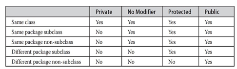

---
title: 'Packages and Interfaces'
weight: 9
--- 

This chapter examines two of Java’s most innovative features: packages and interfaces. Packages are containers for classes. They are used to keep the class name space compartmentalized. For example, a package allows you to create a class named **List**, which you can store in your own package without concern that it will collide with some other class named **List** stored elsewhere. Packages are stored in a hierarchical manner and are explicitly imported into new class definitions. As you will see in Chapter 16, packages also play an important role with modules.

In previous chapters, you have seen how methods define the interface to the data in a class. Through the use of the **interface** keyword, Java allows you to fully abstract an interface from its implementation. Using **interface**, you can specify a set of methods that can be implemented by one or more classes. In its traditional form, the **interface**, itself, does not actually define any implementation. Although they are similar to abstract classes, **interface**s have an additional capability: A class can implement more than one interface. By contrast, a class can only inherit a single superclass (abstract or otherwise).

## Packages

 In the preceding chapters, the name of each example class was taken from the same name space. This means that a unique name had to be used for each class to avoid name collisions. After a while, without some way to manage the name space, you could run out of convenient, descriptive names for individual classes. You also need some way to be assured that the name you choose for a class will be reasonably unique and not collide with class names chosen by other programmers. (Imagine a small group of programmers fighting over who gets to use the name “Foobar” as a class name. Or, imagine the entire Internet community arguing over who first named a class “Espresso.”) Thankfully, Java provides a mechanism for partitioning the class name space into more manageable chunks. This mechanism is the package. The package is both a naming and a visibility control mechanism. You can define classes inside a package that are not accessible by code outside that package. You can also define class members that are exposed only to other members of the same define class members that are exposed only to other members of the same package. This allows your classes to have intimate knowledge of each other, but not expose that knowledge to the rest of the world.

## Defining a Package

 To create a package is quite easy: simply include a **package** command as the first statement in a Java source file. Any classes declared within that file will belong to the specified package. The **package** statement defines a name space in which classes are stored. If you omit the **package** statement, the class names are put into the default package, which has no name. (This is why you haven’t had to worry about packages before now.) While the default package is fine for short, sample programs, it is inadequate for real applications. Most of the time, you will define a package for your code.

This is the general form of the **package** statement:

_package pkg;_

Here, pkg is the name of the package. For example, the following statement creates a package called **mypackage**:

_package mypackage;_

Typically, Java uses file system directories to store packages, and that is the approach assumed by the examples in this book. For example, the **.class** files for any classes you declare to be part of **mypackage** must be stored in a directory called **mypackage**. Remember that case is significant, and the directory name must match the package name exactly.

More than one file can include the same **package** statement. The **package** statement simply specifies to which package the classes defined in a file belong. It does not exclude other classes in other files from being part of that same package. Most real-world packages are spread across many files.

You can create a hierarchy of packages. To do so, simply separate each package name from the one above it by use of a period. The general form of a multileveled package statement is shown here:
```
package pkg1[.pkg2[.pkg3]];
```

A package hierarchy must be reflected in the file system of your Java development system. For example, a package declared as  
```
package a.b.c;
```
needs to be stored in **a\\b\\c** in a Windows environment. Be sure to choose your package names carefully. You cannot rename a package without renaming the directory in which the classes are stored.

## Finding Packages and CLASSPATH

 As just explained, packages are typically mirrored by directories. This raises an important question: How does the Java run-time system know where to look for packages that you create? As it relates to the examples in this chapter, the answer has three parts. First, by default, the Java run-time system uses the current working directory as its starting point. Thus, if your package is in a subdirectory of the current directory, it will be found. Second, you can specify a directory path or paths by setting the **CLASSPATH** environmental variable. Third, you can use the **\-classpath** option with **java** and **javac** to specify the path to your classes. It is useful to point out that, beginning with JDK 9, a package can be part of a module, and thus found on the module path. However, a discussion of modules and module paths is deferred until Chapter 16. For now, we will use only class paths.

For example, consider the following package specification:

_package_ _mypack;_

In order for a program to find **mypack**, the program can be executed from a directory immediately above **mypack**, or the **CLASSPATH** must be set to include the path to **mypack**, or the **\-classpath** option must specify the path to **mypack** when the program is run via **java**.

When the second two options are used, the class path _must not_ include **mypack**, itself. It must simply specify the _path to_ **mypack**. For example, in a Windows environment, if the path to **mypack** is

_C:\\MyPrograms\\Java\\mypack_

then the class path to **mypack** is

_C:\\MyPrograms\\Java_

The easiest way to try the examples shown in this book is to simply create the package directories below your current development directory, put the **.class** files into the appropriate directories, and then execute the programs from the development directory. This is the approach used in the following example.

## A Short Package Example

 Keeping the preceding discussion in mind, you can try this simple package:
```
// A simple package package mypack;
class Balance 
{
    String name;
    double bal;
    Balance (String n, double b) 
    {
        name = n;
        bal = b;
    }
    void show () 
    {
        if (bal<0)
        System.out.print ("-->");
        System.out.println(name + ': $" + bal);
    }
}
class AccountBalance 
{
    public static void main(String args[]) 
    { 
        Balance current [] = new Balance [3];
        current [0]= new Balance ("K. J. Fielding", 123.23);
        current [1]= new Balance ("Will Tell", 157.02);
        current [2]= new Balance ("Tom Jackson", -12.33);
        for (int i=0; i<3; i++) 
            current [i].show();
    }
}
```
Call this file **AccountBalance.java** and put it in a directory called **mypack**. Next, compile the file. Make sure that the resulting **.class** file is also in the  
**mypack** directory. Then, try executing the **AccountBalance** class, using the following command line:
```
java mypack.AccountBalance
```

Remember, you will need to be in the directory above **mypack** when you execute this command. (Alternatively, you can use one of the other two options described in the preceding section to specify the path **mypack**.)

As explained, **AccountBalance** is now part of the package **mypack**. This means that it cannot be executed by itself. That is, you cannot use this command line:
```
java AccountBalance
```
**AccountBalance** must be qualified with its package name.

## Packages and Member Access

 In the preceding chapters, you learned about various aspects of Java’s access control mechanism and its access modifiers. For example, you already know that access to a **private** member of a class is granted only to other members of that class. Packages add another dimension to access control. As you will see, Java provides many levels of protection to allow fine-grained control over the visibility of variables and methods within classes, subclasses, and packages.

Classes and packages are both means of encapsulating and containing the name space and scope of variables and methods. Packages act as containers for classes and other subordinate packages. Classes act as containers for data and code. The class is Java’s smallest unit of abstraction. As it relates to the interplay between classes and packages, Java addresses four categories of visibility for class members:

- Subclasses in the same package
- Non-subclasses in the same package
- Subclasses in different packages
- Classes that are neither in the same package nor subclasses

The three access modifiers, **private**, **public**, and **protected**, provide a variety of ways to produce the many levels of access required by these categories. Table 9-1 sums up the interactions.  

**Table 9-1** Class Member Access

While Java’s access control mechanism may seem complicated, we can simplify it as follows. Anything declared **public** can be accessed from different classes and different packages. Anything declared **private** cannot be seen outside of its class. When a member does not have an explicit access specification, it is visible to subclasses as well as to other classes in the same package. This is the default access. If you want to allow an element to be seen outside your current package, but only to classes that subclass your class directly, then declare that element **protected**.

Table 9-1 applies only to members of classes. A non-nested class has only two possible access levels: default and public. When a class is declared as **public**, it is accessible outside its package. If a class has default access, then it can only be accessed by other code within its same package. When a class is public, it must be the only public class declared in the file, and the file must have the same name as the class.

**NOTE**

 The modules feature can also affect accessibility. Modules are described in Chapter 16.

## An Access Example

 The following example shows all combinations of the access control modifiers. This example has two packages and five classes. Remember that the classes for the two different packages need to be stored in directories named after their respective packages—in this case, **p1** and **p2**.

The source for the first package defines three classes: **Protection**, **Derived**, and **SamePackage**. The first class defines four **int** variables in each of the legal protection modes. The variable **n** is declared with the default protection, **n_pri** is **private**, **n_pro** is **protected**, and **n_pub** is **public**.

Each subsequent class in this example will try to access the variables in an instance of this class. The lines that will not compile due to access restrictions instance of this class. The lines that will not compile due to access restrictions are commented out. Before each of these lines is a comment listing the places from which this level of protection would allow access.

The second class, **Derived**, is a subclass of **Protection** in the same package, **p1**. This grants **Derived** access to every variable in **Protection** except for **n_pri**, the **private** one. The third class, **SamePackage**, is not a subclass of **Protection**, but is in the same package and also has access to all but **n_pri**.

This is file **Protection.java**:
```
package pl;
public class Protection 
{ 
    int n = 1; 
    private int n_pri = 2; 
    protected int n_pro = 3; 
    public int n_pub = 4;
    public Protection () 
    {
        System.out.println("base constructor");
        System.out.println("n=" + n);
        System.out.println("n_pri= " + n_pri);
        System.out.println("n_pro= " + n_pro);
        System.out.println("n_pub= "+n_pub);
    }
}
```
This is file **Derived.java**:  
```
package pl;
class Derived extends Protection 
{ 
    Derived() 
    {
        System.out.println("derived constructor"); 
        System.out.println("n=" + n);

        // class only
        // System.out.println("n_pri = "4+n_pri);
        
        System.out.println("n_pro = "+n_pro);
        System.out.println("n_pub = "+n_pub); 
    }
}
```
This is file **SamePackage.java**:
```
package pl;
class SamePackage 
{
    SamePackage() 
    {
        Protection p = new Protection(); 
        System.out.println("same package constructor"); 
        System.out.println("n "+p.n);
        
        // class only
        // System.out.println("n_pri + p.n_pri);
        
        System.out.println("n_pro = "+ p.n_pro);
        System.out.println("n_pub = "+ p.n_pub);
    }
}
```
Following is the source code for the other package, **p2**. The two classes defined in **p2** cover the other two conditions that are affected by access control. The first class, **Protection2**, is a subclass of **p1.Protection**. This grants access to all of **p1.Protection**’s variables except for **n_pri** (because it is **private**) and **n**, the variable declared with the default protection. Remember, the default only allows access from within the class or the package, not extra-package subclasses. Finally, the class **OtherPackage** has access to only one variable, **n_pub**, which was declared **public**.

This is file **Protection2.java**:
```
package p2;
class Protection2 extends pl.Protection 
{ 
    Protection2() 
    {
        System.out.println("derived other package constructor");
        
        // class or package only
        //System.out.println("n=" + n);
        
        // class only
        // System.out.println("n_pri = + n_pri);
        
        System.out.println("n_pro = "+n_pub);
        System.out.println("n_pub = "+n_pro);  
    }
}
```
This is file **OtherPackage.java**:  
```
package p2;
class OtherPackage 
{
    OtherPackage() 
    { 
        pl.Protection p = new pl. Protection(); 
        System.out.println("other package constructor");
        // class or package only
        // System.out.println("n = "+ p.n);

        // class only
        // System.out.println("n_pri = "+ p.n_pri);
        
        // class, subclass or package only 
        // System.out.println("n_pro = " + p.n_pro);
        
        System.out.println("n_pub = "+ p.n_pub);
    }
}
```
If you want to try these two packages, here are two test files you can use. The one for package **p1** is shown here:
```
//Demo Package p1
package p1;

// Instantiate the various classes in pl. 
public class Demo 
{
    public static void main(String args[])
    {
        Protection obl = new Protection(); 
        Derived ob2 = new Derived();
        SamePackage ob3 = new SamePackage(); 
    } 
}
```
The test file for **p2** is shown next:  
```
// Demo package p2. 
package p2;

// Instantiate the various classes in p2. 
public class Demo 
{
    public static void main(String args[]) 
    { 
        Protection2 obl = new Protection2(); 
        OtherPackage ob2 = new OtherPackage(); 
    }
}
```
## Importing Packages

 Given that packages exist and are a good mechanism for compartmentalizing diverse classes from each other, it is easy to see why all of the built-in Java classes are stored in packages. There are no core Java classes in the unnamed default package; all of the standard classes are stored in some named package. Since classes within packages must be fully qualified with their package name or names, it could become tedious to type in the long dot-separated package path name for every class you want to use. For this reason, Java includes the **import** statement to bring certain classes, or entire packages, into visibility. Once imported, a class can be referred to directly, using only its name. The **import** statement is a convenience to the programmer and is not technically needed to write a complete Java program. If you are going to refer to a few dozen classes in your application, however, the **import** statement will save a lot of typing.

In a Java source file, **import** statements occur immediately following the **package** statement (if it exists) and before any class definitions. This is the general form of the **import** statement:
```
import _pkg1_ [._pkg2_].(classname | *);
```
Here, _pkg1_ is the name of a top-level package, and _pkg2_ is the name of a subordinate package inside the outer package separated by a dot (**.**). There is no practical limit on the depth of a package hierarchy, except that imposed by the file system. Finally, you specify either an explicit classname or a star (*), which indicates that the Java compiler should import the entire package. This code fragment shows both forms in use:  
```
import java.util.Date;

import java.io.*;
```
All of the standard Java SE classes included with Java begin with the name **java**. The basic language functions are stored in a package called **java.lang**. Normally, you have to import every package or class that you want to use, but since Java is useless without much of the functionality in **java.lang**, it is implicitly imported by the compiler for all programs. This is equivalent to the following line being at the top of all of your programs:
```
import java.lang.*;
```
If a class with the same name exists in two different packages that you import using the star form, the compiler will remain silent, unless you try to use one of the classes. In that case, you will get a compile-time error and have to explicitly name the class specifying its package.

It must be emphasized that the **import** statement is optional. Any place you use a class name, you can use its _fully qualified name_, which includes its full package hierarchy. For example, this fragment uses an import statement:
```
import java.util.*;

class MyDate extends Date {

}
```
The same example without the **import** statement looks like this:
```
class MyDate extends java.util.Date {

}
```
In this version, **Date** is fully-qualified. 
    As shown in Table 9-1, when a package is imported, only those items within the package declared as **public** will be available to non-subclasses in the importing code. For example, if you want the **Balance** class of the package **mypack** shown earlier to be available as a stand-alone class for general use outside of **mypack**, then you will need to declare it as **public** and put it into its own file, as shown here:  
```
package mypack;

/* Now, the Balance class, its constructor,and its show() method are public. 
This means that they can be used by non-subclass code outside their package.
*/
public class Balance 
{
    String name;
    double bal;
    public Balance (String n, double b) 
    { 
        name = n;
        bal = b;
    }
    public void show() 
    { 
        if (bal<0)
            System.out.print ("-->"); 
        System.out.println(name+": "+bal);
    }
}
```
As you can see, the **Balance** class is now **public**. Also, its constructor and its **show()** method are **public**, too. This means that they can be accessed by any type of code outside the **mypack** package. For example, here **TestBalance** imports **mypack** and is then able to make use of the **Balance** class:  
```
import mypack.*;
class TestBalance 
{ 
    public static void main(String args[]) 
    {
        /* 
        Because Balance is public, 
        you may use Balance class and call its constructor. 
        */
        Balance test = new Balance ("J. J. Jaspers", 99.88);
        test.show(); // you may also call show()
    }
}
```
As an experiment, remove the **public** specifier from the **Balance** class and then try compiling **TestBalance**. As explained, errors will result.

## Interfaces

 Using the keyword **interface**, you can fully abstract a class’ interface from its implementation. That is, using **interface**, you can specify what a class must do, but not how it does it. Interfaces are syntactically similar to classes, but they lack instance variables, and, as a general rule, their methods are declared without any body. In practice, this means that you can define interfaces that don’t make assumptions about how they are implemented. Once it is defined, any number of classes can implement an **interface**. Also, one class can implement any number of interfaces.

To implement an interface, a class must provide the complete set of methods required by the interface. However, each class is free to determine the details of its own implementation. By providing the **interface** keyword, Java allows you to fully utilize the “one interface, multiple methods” aspect of polymorphism.

Interfaces are designed to support dynamic method resolution at run time. Normally, in order for a method to be called from one class to another, both classes need to be present at compile time so the Java compiler can check to ensure that the method signatures are compatible. This requirement by itself makes for a static and nonextensible classing environment. Inevitably in a system like this, functionality gets pushed up higher and higher in the class hierarchy so that the mechanisms will be available to more and more subclasses. Interfaces are designed to avoid this problem. They disconnect the definition of a method or set of methods from the inheritance hierarchy. Since interfaces are in a different hierarchy from classes, it is possible for classes that are unrelated in terms of the class hierarchy to implement the same interface. This is where the real power of interfaces is realized.

## Defining an Interface

 An interface is defined much like a class. This is a simplified general form of an interface:  
```
access interface name 
{ 
    return-type method-name 1(parameter-list); 
    return-type method-name2(parameter-list);
    type final-varnamel= value; 
    type final-varname2 = value; 
    //...
    return-type method-nameN(parameter-list); 
    type final-varnameN = value;
}
```
When no access modifier is included, then default access results, and the interface is only available to other members of the package in which it is declared. When it is declared as **public**, the interface can be used by code outside its package. In this case, the interface must be the only public interface declared in the file, and the file must have the same name as the interface. name is the name of the interface, and can be any valid identifier. Notice that the methods that are declared have no bodies. They end with a semicolon after the parameter list. They are, essentially, abstract methods. Each class that includes such an interface must implement all of the methods.

Before continuing an important point needs to be made. JDK 8 added a feature to **interface** that made a significant change to its capabilities. Prior to JDK 8, an interface could not define any implementation whatsoever. This is the type of interface that the preceding simplified form shows, in which no method declaration supplies a body. Thus, prior to JDK 8, an interface could define only “what,” but not “how.” JDK 8 changed this. Beginning with JDK 8, it is possible to add a _default implementation_ to an interface method. Furthermore, JDK 8 also added static interface methods, and beginning with JDK 9, an interface can include private methods. Thus, it is now possible for **interface** to specify some behavior. However, such methods constitute what are, in essence, special-use features, and the original intent behind **interface** still remains. Therefore, as a general rule, you will still often create and use interfaces in which no use is made of these new features. For this reason, we will begin by discussing the interface in its traditional form. The new interface features are described at the end of this chapter.

As the general form shows, variables can be declared inside interface declarations. They are implicitly **final** and **static**, meaning they cannot be changed by the implementing class. They must also be initialized. All methods and variables are implicitly **public**.

Here is an example of an interface definition. It declares a simple interface that contains one method called **callback()** that takes a single integer parameter.
```
interface callback
{
    void callback(int param);
}
```
## Implementing Interfaces

 Once an **interface** has been defined, one or more classes can implement that interface. To implement an interface, include the **implements** clause in a class definition, and then create the methods required by the interface. The general form of a class that includes the **implements** clause looks like this:
```
class classname [extends superclass][implements interface [.interface...]]{
    //class-body
}
```
If a class implements more than one interface, the interfaces are separated with a comma. If a class implements two interfaces that declare the same method, then the same method will be used by clients of either interface. The methods that implement an interface must be declared **public**. Also, the type signature of the implementing method must match exactly the type signature specified in the **interface** definition.

Here is a small example class that implements the **Callback** interface shown earlier:
```
class Client implements Callback 
{ 
    // Implement Callback's interface 
    public void callback (int p) 
    {
        System.out.println("callback called with " + p);
    }
}
```
Notice that **callback()** is declared using the **public** access modifier.  

**REMEMBER**

 When you implement an interface method, it must be declared as **public**.

It is both permissible and common for classes that implement interfaces to define additional members of their own. For example, the following version of **Client** implements **callback()** and adds the method **nonIfaceMeth()**:
```
class Client implements Callback 
{ 
    // Implement Callback's interface 
    public void callback (int p) 
    {
        System.out.println("callback called with + p);
    }
    void nonIfaceMeth() 
    {
        System.out.println("Classes that implement interfaces "+ "may also define other members, too.");
    }
}
```
## Accessing Implementations Through Interface References

 You can declare variables as object references that use an interface rather than a class type. Any instance of any class that implements the declared interface can be referred to by such a variable. When you call a method through one of these references, the correct version will be called based on the actual instance of the interface being referred to. This is one of the key features of interfaces. The method to be executed is looked up dynamically at run time, allowing classes to be created later than the code which calls methods on them. The calling code can dispatch through an interface without having to know anything about the “callee.” This process is similar to using a superclass reference to access a subclass object, as described in Chapter 8.

The following example calls the **callback()** method via an interface reference variable:
```
class TestIFace
{
    public static void main(String args[]){
        Callback c = new Client();
        c.callback(42);
    }
}
```
The output of this program is shown here:  
```
callback called with 42
```
Notice that variable **c** is declared to be of the interface type **Callback**, yet it was assigned an instance of **Client**. Although **c** can be used to access the **callback()** method, it cannot access any other members of the **Client** class. An interface reference variable has knowledge only of the methods declared by its **interface** declaration. Thus, **c** could not be used to access **nonIfaceMeth()** since it is defined by **Client** but not **Callback**.

While the preceding example shows, mechanically, how an interface reference variable can access an implementation object, it does not demonstrate the polymorphic power of such a reference. To sample this usage, first create the second implementation of **Callback**, shown here:
```
// Another implementation of Callback. 
class AnotherClient implements Callback 
{ 
    // Implement Callback's interface 
    public void callback (int p) 
    { 
        System.out.println("Another version of callback"); 
        System.out.println("p squared is " + (p*p));
    } 
}
```
Now, try the following class:
```
class TestIface2 
{
    public static void main(String args[]) 
    { 
        Callback c = new Client(); 
        AnotherClient ob = new AnotherClient();
        c.callback (42);
        C ob; // c now refers to AnotherClient object 
        c.callback (42);
    } 
}
```
The output from this program is shown here:  
```
callback called with 42

Another version of callback

p squared is 1764
```
As you can see, the version of **callback()** that is called is determined by the type of object that **c** refers to at run time. While this is a very simple example, you will see another, more practical one shortly.

## Partial Implementations

 If a class includes an interface but does not fully implement the methods required by that interface, then that class must be declared as **abstract**. For example:
```
abstract class Incomplete implements Callback 
{ 
    int a, b;
    void show() 
    {
        System.out.println(a + " " + b);
    }
    //...
}
```
Here, the class **Incomplete** does not implement **callback()** and must be declared as **abstract**. Any class that inherits **Incomplete** must implement **callback()** or be declared **abstract** itself.

## Nested Interfaces

 An interface can be declared a member of a class or another interface. Such an interface is called a _member interface_ or a _nested interface_. A nested interface can be declared as **public**, **private**, or **protected**. This differs from a top-level interface, which must either be declared as **public** or use the default access level, as previously described. When a nested interface is used outside of its enclosing scope, it must be qualified by the name of the class or interface of which it is a member. Thus, outside of the class or interface in which a nested interface is declared, its name must be fully qualified.

Here is an example that demonstrates a nested interface:  
```
// A nested interface example.
// This class contains a member interface. 
class A 
{
    // this is a nested interface 
    public interface NestedIF 
    { 
        boolean isNotNegative(int x);
    }
}

// B implements the nested interface. 
class B implements A.NestedIF 
{ 
    public boolean isNotNegative (int x) 
    { 
        return x < 0 ? false: true;
    } 
}
class NestedIFDemo 
{ 
    public static void main(String args[]) 
    {
        // use a nested interface reference 
        A.NestedIF nif = new B();
        
        if (nif.isNotNegative(10))
        System.out.println("10 is not negative");
        if (nif.isNotNegative (-12))
        System.out.println("this won't be displayed");
    }
}
```
Notice that **A** defines a member interface called **NestedIF** and that it is declared **public**. Next, **B** implements the nested interface by specifying
```
implements A.NestedIF
```

Notice that the name is fully qualified by the enclosing class’ name. Inside the **main()** method, an **A.NestedIF** reference called **nif** is created, and it is assigned a reference to a **B** object. Because **B** implements **A.NestedIF**, this is legal.
 
## Applying Interfaces

 To understand the power of interfaces, let’s look at a more practical example. In earlier chapters, you developed a class called **Stack** that implemented a simple fixed-size stack. However, there are many ways to implement a stack. For example, the stack can be of a fixed size or it can be “growable.” The stack can also be held in an array, a linked list, a binary tree, and so on. No matter how the stack is implemented, the interface to the stack remains the same. That is, the methods **push()** and **pop()** define the interface to the stack independently of the details of the implementation. Because the interface to a stack is separate from its implementation, it is easy to define a stack interface, leaving it to each implementation to define the specifics. Let’s look at two examples.

First, here is the interface that defines an integer stack. Put this in a file called **IntStack.java**. This interface will be used by both stack implementations.
```
//Define An Integer Stack Interface 
interface IntStack
{
    void push(int item);    //store an item
    int pop();  //retrieve an item
}
```
The following program creates a class called **FixedStack** that implements a fixed-length version of an integer stack:  
```
// An implementation of IntStack that uses fixed storage.

class FixedStack implements IntStack 
{ 
    private int stek[]; 
    private int tos;
    // allocate and initialize stack
    FixedStack (int size) 
    { 
        stck new int[size];
    }
    tos = -1;
    // Push an item onto the stack 
    public void push (int item) 
    {
        if (tos--stck.length-1) // use length member 
            System.out.println("Stack is full.");
        else 
            stck [++tos] = item;
    }
    // Pop an item from the stack public 
    int pop() 
    {
        if (tos < 0) 
        {
            System.out.println("Stack underflow.");
            return 0;
        }
        else
        return stck [tos--];
    }
}
class IFTest 
{
    public static void main(String args[]) 
    { 
        FixedStack mystack1= new FixedStack (5);
        FixedStack mystack2= new FixedStack (8);
        
        // push some numbers onto the stack 
        for (int i=0; i<5; i++) 
            mystack1.push(i);
        for (int i=0; i<8; i++) 
            mystack2.push(i);
            
        // pop those numbers off the stack 
        System.out.println("Stack in mystack1:"); 
        for (int i=0; i<5; i++) 
            System.out.println(mystack1.pop());

        System.out.println("Stack in mystack2: ");
        for (int i=0; i<8; i++) 
            System.out.println(mystack2.pop());
    }
}
```
Following is another implementation of **IntStack** that creates a dynamic stack by use of the same **interface** definition. In this implementation, each stack is constructed with an initial length. If this initial length is exceeded, then the stack is increased in size. Each time more room is needed, the size of the stack is doubled.  
```
// Implement a "growable" stack. 
class DynStack implements IntStack 
{ 
    private int stek[];
    private int tos;
    
    // allocate and initialize stack 
    DynStack(int size) 
    { 
        stck= new int[size];
        tos = -1;
    }
    
    // Push an item onto the stack 
    public void push (int item) 
    {
        // if stack is full, allocate a larger stack 
        if (tos==stck.length-1) 
        {
            int temp[] = new int[stck.length 2]; // double size 
            for (int i=0; i<stck.length; i++) 
                temp[i] = stck[i];
            stck= temp;
            stck [++tos] = item;
        } 
        else
            stck [++tos] = item;
    }
    
    // Pop an item from the stack
    public int pop() 
    { 
        if (tos < 0) 
        {
            System.out.println("Stack underflow.");
            return 0;
        }
        else
            return stck [tos--];
    }
}
class IFTest2 
{
    public static void main(String args[]) 
    { 
        DynStack mystack1 = new DynStack (5); 
        DynStack mystack2 = new DynStack (8);
        
        // these loops cause each stack to grow 
        for (int i=0; i<12; i++) 
            mystack1.push(i); 
        for(int i=0; i<20; i++) 
            mystack2.push(i);
        System.out.println("Stack in mystack1;");
        for (int i=0; i<12; i++)
            System.out.println (mystack1.pop());
        System.out.println("Stack in mystack2:"); 
        for (int i=0; i<20; i++) 
            System.out.println(mystack2.pop());
    }
}
```
The following class uses both the **FixedStack** and **DynStack** implementations. It does so through an interface reference. This means that calls to **push()** and **pop()** are resolved at run time rather than at compile time.
```
/* Create an interface variable and access stacks through it. */
class IFTest3 
{
    public static void main(String args[]) 
    { 
        IntStack mystack; // create an interface reference variable
        DynStack ds = new DynStack (5);
        FixedStack fs = new FixedStack (8);

        mystack = ds; // load dynamic stack 
        // push some numbers onto the stack 
        for (int i=0; i<12; i++) 
            mystack.push(i);
            
        mystack= fs; // load fixed stack 
        for (int i=0; i<8; i++) 
            mystack.push(i);
            
        mystack = ds;
        System.out.println("Values in dynamic stack: "); 
        for (int i=0; i<12; i++)
        System.out.println(mystack.pop());
        
        mystack= fs;
        System.out.println("Values in fixed stack: "); 
        for (int i=0; i<8; i++) 
            System.out.println(mystack.pop());
    }
}
```
In this program, **mystack** is a reference to the **IntStack** interface. Thus, when it refers to **ds**, it uses the versions of **push()** and **pop()** defined by the **DynStack** implementation. When it refers to **fs**, it uses the versions of **push()** and **pop()** defined by **FixedStack**. As explained, these determinations are made at run time. Accessing multiple implementations of an interface through an interface reference variable is the most powerful way that Java achieves run-time polymorphism.

## Variables in Interfaces

 You can use interfaces to import shared constants into multiple classes by simply declaring an interface that contains variables that are initialized to the desired values. When you include that interface in a class (that is, when you “implement” the interface), all of those variable names will be in scope as constants. If an interface contains no methods, then any class that includes such an interface doesn’t actually implement anything. It is as if that class were importing the constant fields into the class name space as **final** variables. The next example uses this technique to implement an automated “decision maker”:  
```
import java.util.Random;
interface SharedConstants 
{
    int NO = 0; 
    int YES = 1;
    int MAYBE 2;
    int LATER = 3; 
    int SOON = 4;
    int NEVER - 5:
}
class Question implements SharedConstants 
{ 
    Random rand new Random();
    int ask() 
    {
        int prob= (int) (100 * rand.nextDouble());
        if (probe < 30)
            return NO:  // 30%
        else if (prob < 60)
            return YES; // 30%
        else if (prob < 75) 
            return LATER;  // 15%
        else if (prob < 98) 
            return SOON;    // 13%
        else
            return NEVER;   // 2%
    }
}
class AskMe implements SharedConstants 
{ 
    static void answer (int result) 
    { 
        switch(result) 
        {
            case NO:
                System.out.println("No");
                break; 
            case YES:
                System.out.println("Yes"); 
                break;
            case MAYBE:
                System.out.println("Maybe");
                break;
            case LATER: 
                System.out.println("Later");
                break;
            case SOON:
                System.out.println("Soon");
                break; 
            case NEVER:
                System.out.println("Never"); 
                break;
        }
    }
    public static void main(String args[]) 
    { 
        Question q = new Question();
        answer (q.ask());
        answer (q.ask());
        answer (q.ask());
        answer (q.ask());
    }
}
```
Notice that this program makes use of one of Java’s standard classes: **Random**. This class provides pseudorandom numbers. It contains several methods that allow you to obtain random numbers in the form required by your program. In this example, the method **nextDouble()** is used. It returns random numbers in the range 0.0 to 1.0.

In this sample program, the two classes, **Question** and **AskMe**, both implement the **SharedConstants** interface where **NO**, **YES**, **MAYBE**, **SOON**, **LATER**, and **NEVER** are defined. Inside each class, the code refers to these constants as if each class had defined or inherited them directly. Here is the output of a sample run of this program. Note that the results are different each time it is run.
**
Later

Soon

No

Yes
**

## NOTE

 The technique of using an interface to define shared constants, as just described, is controversial. It is described here for completeness.

## Interfaces Can Be Extended

 One interface can inherit another by use of the keyword **extends**. The syntax is the same as for inheriting classes. When a class implements an interface that inherits another interface, it must provide implementations for all methods required by the interface inheritance chain. Following is an example:  
```
// One interface can extend another. 
interface A 
{
    void meth1();
    void meth2();
}

// B now includes meth1 () and meth2() 
interface B extends A 
{ 
    //it adds meth3 ().
    void meth3();
}

// This class must implement all of A and B 
class MyClass implements B
{
    public void meth1 () 
    { 
        System.out.println("Implement meth1().");
    }
    public void meth2() 
    {
        System.out.println("Implement meth2().");
    }
    public void meth3() 
    {
        System.out.println("Implement meth3().");
    }
}
class IFExtend 
{
    public static void main(String arg[]) 
    { 
        MyClass ob = new MyClass();
        ob.methi();
        ob.meth2();
        ob.meth3();
    }
}
```
As an experiment, you might want to try removing the implementation for **meth1()** in **MyClass**. This will cause a compile-time error. As stated earlier, any class that implements an interface must implement all methods required by  

that interface, including any that are inherited from other interfaces.

## Default Interface Methods

 As explained earlier, prior to JDK 8, an interface could not define any implementation whatsoever. This meant that for all previous versions of Java, the methods specified by an interface were abstract, containing no body. This is the traditional form of an interface and is the type of interface that the preceding discussions have used. The release of JDK 8 changed this by adding a new capability to **interface** called the _default method_. A default method lets you define a default implementation for an interface method. In other words, by use of a default method, it is possible for an interface method to provide a body, rather than being abstract. During its development, the default method was also referred to as an _extension method,_ and you will likely see both terms used.

A primary motivation for the default method was to provide a means by which interfaces could be expanded without breaking existing code. Recall that there must be implementations for all methods defined by an interface. In the past, if a new method were added to a popular, widely used interface, then the addition of that method would break existing code because no implementation would be found for that new method. The default method solves this problem by supplying an implementation that will be used if no other implementation is explicitly provided. Thus, the addition of a default method will not cause preexisting code to break.

Another motivation for the default method was the desire to specify methods in an interface that are, essentially, optional, depending on how the interface is used. For example, an interface might define a group of methods that act on a sequence of elements. One of these methods might be called **remove()**, and its purpose is to remove an element from the sequence. However, if the interface is intended to support both modifiable and nonmodifiable sequences, then **remove()** is essentially optional because it won’t be used by nonmodifiable sequences. In the past, a class that implemented a nonmodifiable sequence would have had to define an empty implementation of **remove()**, even though it was not needed. Today, a default implementation for **remove()** can be specified in the interface that does nothing (or throws an exception). Providing this default prevents a class used for nonmodifiable sequences from having to define its own, placeholder version of **remove()**. Thus, by providing a default, the interface makes the implementation of **remove()** by a class optional.  

It is important to point out that the addition of default methods does not change a key aspect of **interface**: its inability to maintain state information. An interface still cannot have instance variables, for example. Thus, the defining difference between an interface and a class is that a class can maintain state information, but an interface cannot. Furthermore, it is still not possible to create an instance of an interface by itself. It must be implemented by a class. Therefore, even though, beginning with JDK 8, an interface can define default methods, the interface must still be implemented by a class if an instance is to be created.

One last point: As a general rule, default methods constitute a special- purpose feature. Interfaces that you create will still be used primarily to specify what and not how. However, the inclusion of the default method gives you added flexibility.

## Default Method Fundamentals

 An interface default method is defined similar to the way a method is defined by a **class**. The primary difference is that the declaration is preceded by the keyword **default**. For example, consider this simple interface:
```
public interface MyIF 
{
    // This is a "normal" interface method declaration.
    // It does NOT define a default implementation. 
    int getNumber();

    // This is a default method. Notice that it provides 
    // a default implementation. 
    default String getString() 
    { 
        return "Default String";
    }
}
```
**MyIF** declares two methods. The first, **getNumber()**, is a standard interface method declaration. It defines no implementation whatsoever. The second method is **getString()**, and it does include a default implementation. In this case, it simply returns the string "Default String". Pay special attention to the way **getString()** is declared. Its declaration is preceded by the **default** modifier. This syntax can be generalized. To define a default method, precede its declaration with **default**.  

Because **getString()** includes a default implementation, it is not necessary for an implementing class to override it. In other words, if an implementing class does not provide its own implementation, the default is used. For example, the **MyIFImp** class shown next is perfectly valid:
```
// Implement MyIF.
class MyIFImp implements MyIF 
{
    // Only getNumber() defined by MyIF needs to be implemented. 
    // getString() can be allowed to default. 
    public int getNumber() 
    {
        return 100;
    }
}
```
The following code creates an instance of **MyIFImp** and uses it to call both **getNumber()** and **getString()**.
```
// Use the default method. 
class DefaultMethodDemo 
{
    public static void main(String args[]) 
    {
        MyIFImp obj = new MyIFImp();
        // Can call get Number (), because it is explicitly
        // implemented by MyIFImp:
        
        System.out.println(obj.getNumber());
        // Can also call getString(), because of default
        // implementation:
        System.out.println(obj.getString());
    }
}
```
The output is shown here:
```
100

Default String
```
As you can see, the default implementation of **getString()** was automatically  

used. It was not necessary for **MyIFImp** to define it. Thus, for **getString()**, implementation by a class is optional. (Of course, its implementation by a class will be required if the class uses **getString()** for some purpose beyond that supported by its default.)

It is both possible and common for an implementing class to define its own implementation of a default method. For example, **MyIFImp2** overrides **getString()**:

Now, whe **getString()** is called, a different string is returned.

## A More Practical Example

 Although the preceding shows the mechanics of using default methods, it doesn’t illustrate their usefulness in a more practical setting. To do this, let’s once again return to the **IntStack** interface shown earlier in this chapter. For the sake of discussion, assume that **IntStack** is widely used and many programs rely on it. Further assume that we now want to add a method to **IntStack** that clears the stack, enabling the stack to be re-used. Thus, we want to evolve the **IntStack** interface so that it defines new functionality, but we don’t want to break any preexisting code. In the past, this would be impossible, but with the inclusion of default methods, it is now easy to do. For example, the **IntStack** interface can be enhanced like this:  

Here, the default behavior of **clear()** simply displays a message indicating that it is not implemented. This is acceptable because no preexisting class that implements **IntStack** would ever call **clear()** because it was not defined by the earlier version of **IntStack**. However, **clear()** can be implemented by a new class that implements **IntStack**. Furthermore, **clear()** needs to be defined by a new implementation only if it is used. Thus, the default method gives you

- a way to gracefully evolve interfaces over time, and
- a way to provide optional functionality without requiring that a class provide a placeholder implementation when that functionality is not needed.

One other point: In real-world code, **clear()** would have thrown an exception, rather than displaying an error message. Exceptions are described in the next chapter. After working through that material, you might want to try modifying **clear()** so that its default implementation throws an **UnsupportedOperationException**.

## Multiple Inheritance Issues

 As explained earlier in this book, Java does not support the multiple inheritance of classes. Now that an interface can include default methods, you might be wondering if an interface can provide a way around this restriction. The answer is, essentially, no. Recall that there is still a key difference between a class and an interface: a class can maintain state information (especially through the use of instance variables), but an interface cannot.

The preceding notwithstanding, default methods do offer a bit of what one would normally associate with the concept of multiple inheritance. For example, you might have a class that implements two interfaces. If each of these interfaces provides default methods, then some behavior is inherited from  

these interfaces provides default methods, then some behavior is inherited from both. Thus, to a limited extent, default methods do support multiple inheritance of behavior. As you might guess, in such a situation, it is possible that a name conflict will occur.

For example, assume that two interfaces called **Alpha** and **Beta** are implemented by a class called **MyClass**. What happens if both **Alpha** and **Beta** provide a method called **reset()** for which both declare a default implementation? Is the version by **Alpha** or the version by **Beta** used by **MyClass**? Or, consider a situation in which **Beta** extends **Alpha**. Which version of the default method is used? Or, what if **MyClass** provides its own implementation of the method? To handle these and other similar types of situations, Java defines a set of rules that resolves such conflicts.

First, in all cases, a class implementation takes priority over an interface default implementation. Thus, if **MyClass** provides an override of the **reset()** default method, **MyClass**’ version is used. This is the case even if **MyClass** implements both **Alpha** and **Beta**. In this case, both defaults are overridden by **MyClass**’ implementation.

Second, in cases in which a class implements two interfaces that both have the same default method, but the class does not override that method, then an error will result. Continuing with the example, if **MyClass** implements both **Alpha** and **Beta**, but does not override **reset()**, then an error will occur.

In cases in which one interface inherits another, with both defining a common default method, the inheriting interface’s version of the method takes precedence. Therefore, continuing the example, if **Beta** extends **Alpha**, then **Beta**’s version of **reset()** will be used.

It is possible to explicitly refer to a default implementation in an inherited interface by using this form of **super**. Its general form is shown here:

InterfaceName.super._methodName()_

For example, if **Beta** wants to refer to **Alpha**’s default for **reset()**, it can use this statement:

Alpha.super.reset();

## Use static Methods in an Interface

 Another capability added to **interface** by JDK 8 is the ability to define one or more **static** methods. Like **static** methods in a class, a **static** method defined by an interface can be called independently of any object. Thus, no implementation of the interface is necessary, and no instance of the interface is required, in order to call a **static** method. Instead, a **static** method is called by specifying the interface name, followed by a period, followed by the method name. Here is the general form:

_InterfaceName.staticMethodName_

Notice that this is similar to the way that a **static** method in a class is called. The following shows an example of a **static** method in an interface by adding one to **MyIF**, shown in the previous section. The **static** method is **getDefaultNumber()**. It returns zero.
```
public interface MyIF 
{
    // This is a "normal" interface method declaration. 
    // It does NOT define a default implementation. 
    int getNumber();

    // This is a default method. Notice that it provides 
    // a default implementation. 
    default String getString() 
    { 
        return "Default String";
    }

    // This is a static interface method. 
    static int getDefaultNumber() 
    { 
        return 0;
    }
}
```
The **getDefaultNumber()** method can be called, as shown here:
```
int defNum = MyIF.getDefaultNumber();
```
As mentioned, no implementation or instance of **MyIF** is required to call **getDefaultNumber()** because it is **static**.

One last point: **static** interface methods are not inherited by either an implementing class or a subinterface.

## Private Interface Methods

 Beginning with JDK 9, an interface can include a private method. A private interface method can be called only by a default method or another private method defined by the same interface. Because a private interface method is specified **private**, it cannot be used by code outside the interface in which it is defined. This restriction includes subinterfaces because a private interface method is not inherited by a subinterface.

The key benefit of a private interface method is that it lets two or more default methods use a common piece of code, thus avoiding code duplication. For example, here is another version of the **IntStack** interface that has two default methods called **popNElements()** and **skipAndPopNElements()**. The first returns an array that contains the top N elements on the stack. The second skips a specified number of elements and then returns an array that contains the next N elements. Both use a private method called **getElements()** to obtain an array of the specified number of elements from the stack.  
```
// Another version of IntStack that has a private interface 
// method that is used by two default methods. 
interface IntStack 
{ 
    void push (int item); // store an item 
    int pop(); // retrieve an item
    
    // A default method that returns an array that contains 
    // the top n elements on the stack. 
    default int[] popNElements (int n) 
    { 
        // Return the requested elements. 
        return getElements (n);
    }
    
    // A default method that returns an array that contains 
    // the next n elements on the stack after skipping elements. 
    default int[] skipAndPopNElements (int skip, int n) 
    {
        // Skip the specified number of elements. 
        getElements (skip);
        // Return the requested elements. 
        return getElements (n);
        // A private method that returns an array containing 
        // the top n elements on the stack 
    }
    
    private int getElements (int n) 
    {
        int[] elements = new int[n];
        for (int i=0; i < n; i++) 
            elements[i] = pop();
        return elements;
    }
}
```
Notice that both **popNElements()** and **skipAndPopNElements()** use the private **getElements()** method to obtain the array to return. This prevents both methods from having to duplicate the same code sequence. Keep in mind that because **getElements()** is private, it cannot be called by code outside **IntStack**. Thus, its use is limited to the default methods inside **IntStack**. Also, because **getElements()** uses the **pop()** method to obtain stack elements, it will automatically call the implementation of **pop()** provided by the **IntStack** is implementation. Thus, **getElements()** will work for any stack class that implements **IntStack**.

Although the private interface method is a feature that you will seldom need, in those cases in which you do need it, you will find it quite useful.  

## Final Thoughts on Packages and Interfaces

 Although the examples we’ve included in this book do not make frequent use of packages or interfaces, both of these tools are an important part of the Java programming environment. Virtually all real programs that you write in Java will be contained within packages. A number will probably implement interfaces as well. It is important, therefore, that you be comfortable with their usage.  