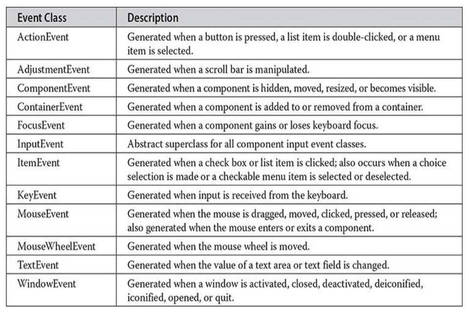

---
title: 'Event Handling'
weight: 8
-

# Event Handling

This chapter examines an important aspect of Java: the event. Event handling is fundamental to Java programming because it is integral to the creation of many kinds of applications. For example, any program that uses a graphical user interface, such as a Java application written for Windows, is event driven. Thus, you cannot write these types of programs without a solid command of event handling. Events are supported by a number of packages, including **java.util**, **java.awt**, and **java.awt.event**. Beginning with JDK 9, **java.awt** and **java.awt.event** are part of the **java.desktop** module, and **java.util** is part of the **java.base** module.

Many events to which your program will respond are generated when the user interacts with a GUI-based program. These are the types of events examined in this chapter. They are passed to your program in a variety of ways, with the specific method dependent upon the actual event. There are several types of events, including those generated by the mouse, the keyboard, and various GUI controls, such as a push button, scroll bar, or check box.

This chapter begins with an overview of Java’s event handling mechanism. It then examines a number of event classes and interfaces used by the Abstract Window Toolkit (AWT). The AWT was Java’s first GUI framework and it offers a simple way to present the basics of event handling. Next, the chapter develops several examples that demonstrate the fundamentals of event processing. This chapter also introduces key concepts related to GUI programming, and explains how to use adapter classes, inner classes, and anonymous inner classes to streamline event handling code. The examples provided in the remainder of this book make frequent use of these techniques.

**NOTE**

This chapter focuses on events related to GUI-based programs. However, events are also occasionally used for purposes not directly related to GUI-based programs. In all cases, the same basic event handling techniques apply.

## Two Event Handling Mechanisms

Before beginning our discussion of event handling, an important historical point must be made: The way in which events are handled changed significantly between the original version of Java (1.0) and all subsequent versions of Java, beginning with version 1.1. Although the 1.0 method of event handling is still supported, it is not recommended for new programs. Also, many of the methods that support the old 1.0 event model have been deprecated. The modern approach is the way that events should be handled by all new programs and thus is the method employed by programs in this book.

## The Delegation Event Model

The modern approach to handling events is based on the _delegation event model,_ which defines standard and consistent mechanisms to generate and process events. Its concept is quite simple: a source generates an event and sends it to one or more _listeners._ In this scheme, the listener simply waits until it receives an event. Once an event is received, the listener processes the event and then returns. The advantage of this design is that the application logic that processes events is cleanly separated from the user interface logic that generates those events. A user interface element is able to “delegate” the processing of an event to a separate piece of code.

In the delegation event model, listeners must register with a source in order to receive an event notification. This provides an important benefit: notifications are sent only to listeners that want to receive them. This is a more efficient way to handle events than the design used by the original Java 1.0 approach. Previously, an event was propagated up the containment hierarchy until it was handled by a component. This required components to receive events that they did not process, and it wasted valuable time. The delegation event model eliminates this overhead.

The following sections define events and describe the roles of sources and listeners.

### Events

In the delegation model, an event is an object that describes a state change in a source. Among other causes, an event can be generated as a consequence of a person interacting with the elements in a graphical user interface. Some of the activities that cause events to be generated are pressing a button, entering a character via the keyboard, selecting an item in a list, and clicking the mouse. Many other user operations could also be cited as examples.

Events may also occur that are not directly caused by interactions with a Events may also occur that are not directly caused by interactions with a user interface. For example, an event may be generated when a timer expires, a counter exceeds a value, a software or hardware failure occurs, or an operation is completed. You are free to define events that are appropriate for your application.

### Event Sources

A source is an object that generates an event. This occurs when the internal state of that object changes in some way. Sources may generate more than one type of event.

A source must register listeners in order for the listeners to receive notifications about a specific type of event. Each type of event has its own registration method. Here is the general form:
```
public void addTypeListener (TypeListener el)
```
Here, Type is the name of the event, and el is a reference to the event listener. For example, the method that registers a keyboard event listener is called **addKeyListener()**. The method that registers a mouse motion listener is called **addMouseMotionListener()**. When an event occurs, all registered listeners are notified and receive a copy of the event object. This is known as multicasting the event. In all cases, notifications are sent only to listeners that register to receive them.

Some sources may allow only one listener to register. The general form of such a method is this:
```
public void addTypeListener(TypeListener el) throws java.util.TooManyListenersException
```
Here, Type is the name of the event, and el is a reference to the event listener. When such an event occurs, the registered listener is notified. This is known as unicasting the event.

A source must also provide a method that allows a listener to unregister an interest in a specific type of event. The general form of such a method is this:
```
public void removeTypeListener(TypeListener el)
```
Here, Type is the name of the event, and el is a reference to the event listener. For example, to remove a keyboard listener, you would call **removeKeyListener()**.  

The methods that add or remove listeners are provided by the source that generates events. For example, **Component**, which is a top-level class defined by the AWT, provides methods to add and remove keyboard and mouse event listeners.

### Event Listeners

A listener is an object that is notified when an event occurs. It has two major requirements. First, it must have been registered with one or more sources to receive notifications about specific types of events. Second, it must implement methods to receive and process these notifications. In other words, the listener must supply the event handlers.

The methods that receive and process events are defined in a set of interfaces, such as those found in **java.awt.event**. For example, the **MouseMotionListener** interface defines two methods to receive notifications when the mouse is dragged or moved. Any object may handle one or both of these events if it provides an implementation of this interface. Other listener interfaces are discussed later in this and other chapters.

Here is one more key point about events: An event handler must return quickly. For the most part, a GUI program should not enter a “mode” of operation in which it maintains control for an extended period. Instead, it must perform specific actions in response to events and then return control to the run-time system. Failure to do this can cause your program to appear sluggish or even non-responsive. If your program needs to perform a repetitive task, such as scrolling a banner, it must do so by starting a separate thread. In short, when your program receives an event, it must process it immediately, and then return.

## Event Classes

The classes that represent events are at the core of Java’s event handling mechanism. Thus, a discussion of event handling must begin with the event classes. It is important to understand, however, that Java defines several types of events and that not all event classes can be discussed in this chapter. Arguably, the most widely used events at the time of this writing are those defined by the AWT and those defined by Swing. This chapter focuses on the AWT events. (Most of these events also apply to Swing.) Several Swing- specific events are described in Chapter 31, when Swing is covered.  

At the root of the Java event class hierarchy is **EventObject**, which is in **java.util**. It is the superclass for all events. Its one constructor is shown here:
```
EventObject(Object src)
```
Here, src is the object that generates this event. **EventObject** defines two methods: **getSource()** and **toString()**. The **getSource()** method returns the source of the event. Its general form is shown here:
```
Object getSource()
```
As expected, **toString()** returns the string equivalent of the event. 

The class **AWTEvent**, defined within the **java.awt** package, is a subclass of the EventObject It is the superclass (either directly or indirectly) of all AWT- based events used by the delegation event model. Its **getID()** method can be used to determine the type of the event. The signature of this method is shown here:
```
int getID()
```
Typically, you won’t use the features defined by **AWTEvent** directly. Rather, you will use its subclasses. At this point, it is important to know only that all of the other classes discussed in this section are subclasses of **AWTEvent**.

To summarize:

- **EventObject** is a superclass of all events.
- **AWTEvent** is a superclass of all AWT events that are handled by the delegation event model.

The package **java.awt.event** defines many types of events that are generated by various user interface elements. Table 24-1 shows several commonly used event classes and provides a brief description of when they are generated. Commonly used constructors and methods in each class are described in the following sections.  

**Table 24-1** Commonly Used Event Classes in **java.awt.event**

### The ActionEvent Class

An **ActionEvent** is generated when a button is pressed, a list item is double- clicked, or a menu item is selected. The **ActionEvent** class defines four integer constants that can be used to identify any modifiers associated with an action event: **ALT_MASK**, **CTRL_MASK**, **META_MASK**, and **SHIFT_MASK**. In addition, there is an integer constant, **ACTION_PERFORMED**, which can be used to identify action events.

### ActionEvent has these three constructors:
```
ActionEvent(Object src, int type, String cmd) 
ActionEvent(Object src, int type, String cmd, int modifiers)
ActionEvent(Object src, int type, String cmd, long when, int modifiers)
```
Here, src is a reference to the object that generated this event. The type of the event is specified by _type,_ and its command string is _cmd._ The argument modifiers indicates which modifier keys (ALT, CTRL, META, and/or SHIFT) were pressed when the event was generated. The when parameter specifies when the event occurred.  

You can obtain the command name for the invoking **ActionEvent** object by using the **getActionCommand()** method, shown here:
```
String getActionCommand()
```

For example, when a button is pressed, an action event is generated that has a command name equal to the label on that button.

The **getModifiers()** method returns a value that indicates which modifier keys (ALT, CTRL, META, and/or SHIFT) were pressed when the event was generated. Its form is shown here:
```
int getModifiers()
```
The method **getWhen()** returns the time at which the event took place. This is called the event’s _timestamp._ The **getWhen()** method is shown here:
```
long getWhen()
```
### The AdjustmentEvent Class

An **AdjustmentEvent** is generated by a scroll bar. There are five types of adjustment events. The **AdjustmentEvent** class defines integer constants that can be used to identify them. The constants and their meanings are shown here:


In addition, there is an integer constant, **ADJUSTMENT_VALUE_CHANGED**, that indicates that a change has occurred.

Here is one **AdjustmentEvent** constructor:
```
AdjustmentEvent(Adjustable src, int id, int type, int val)
```
Here, src is a reference to the object that generated this event. The id specifies the event. The type of the adjustment is specified by _type,_ and its associated value is val. The **getAdjustable()** method returns the object that generated the event. Its form is shown here:
```
Adjustable getAdjustable()
```
The type of the adjustment event may be obtained by the **getAdjustmentType()** method. It returns one of the constants defined by **AdjustmentEvent**. The general form is shown here:
```
int getAdjustmentType()
```
The amount of the adjustment can be obtained from the **getValue()** method, shown here:
```
int getValue()
```
For example, when a scroll bar is manipulated, this method returns the value represented by that change.

### The ComponentEvent Class

A **ComponentEvent** is generated when the size, position, or visibility of a component is changed. There are four types of component events. The **ComponentEvent** class defines integer constants that can be used to identify them. The constants and their meanings are shown here:

**ComponentEvent**has this constructor:
```
ComponentEvent(Component src, int type)
```
Here, src is a reference to the object that generated this event. The type of the event is specified by _type._ **ComponentEvent** is the superclass either directly or indirectly of **ContainerEvent**, **FocusEvent**, **KeyEvent**, **MouseEvent**, and **WindowEvent**, among others.  

The **getComponent()** method returns the component that generated the event. It is shown here:
```
Component getComponent()
```
### The ContainerEvent Class

A **ContainerEvent** is generated when a component is added to or removed from a container. There are two types of container events. The **ContainerEvent** class defines **int** constants that can be used to identify them: **COMPONENT_ADDED** and **COMPONENT_REMOVED**. They indicate that a component has been added to or removed from the container.

**ContainerEvent**is a subclass of **ComponentEvent** and has this constructor:
```
ContainerEvent(Component src, int type, Component comp)
```
Here, src is a reference to the container that generated this event. The type of the event is specified by _type,_ and the component that has been added to or removed from the container is _comp._

You can obtain a reference to the container that generated this event by using the **getContainer ()** method, shown here:
```
Container getContainer()
```
The **getChild()** method returns a reference to the component that was added to or removed from the container. Its general form is shown here:
```
Component getChild()
```

### The FocusEvent Class

A **FocusEvent** is generated when a component gains or loses input focus. These events are identified by the integer constants **FOCUS_GAINED** and **FOCUS_LOST**.

**FocusEvent**is a subclass of **ComponentEvent** and has these constructors:
```
FocusEvent(Component src, int type) 
FocusEvent(Component src, int type, boolean temporaryFlag)
FocusEvent(Component src, int type, boolean temporaryFlag, Component other) 
FocusEvent(Component src, int type, boolean temporaryFlag, Component other, FocusEvent.Cause what)
```
Here, src is a reference to the component that generated this event. The type of the event is specified by _type._ The argument temporaryFlag is set to **true** if the focus event is temporary. Otherwise, it is set to **false**. (A temporary focus event occurs as a result of another user interface operation. For example, assume that the focus is in a text field. If the user moves the mouse to adjust a scroll bar, the focus is temporarily lost.)

The other component involved in the focus change, called the _opposite component,_ is passed in _other._ Therefore, if a **FOCUS_GAINED** event occurred, other will refer to the component that lost focus. Conversely, if a **FOCUS_LOST** event occurred, other will refer to the component that gains focus.

The fourth constructor was added by JDK 9. Its what parameter specifies why the event was generated. It is specified as a **FocusEvent.Cause** enumeration value that identifies the cause of the focus event. The **FocusEvent.Cause** enumeration was also added by JDK 9.

You can determine the other component by calling **getOppositeComponent()**, shown here:
```
Component getOppositeComponent()
```
The opposite component is returned. The **isTemporary()** method indicates if this focus change is temporary. Its

form is shown here:
```
boolean isTemporary()
```
The method returns **true** if the change is temporary. Otherwise, it returns **false**. Beginning with JDK 9, you can obtain the cause of the event by calling**getCause()**, shown here:
```
final FocusEvent.Cause getCause()
```
The cause is returned in the form of a **FocusEvent.Cause** enumeration value.

### The InputEvent Class

The abstract class **InputEvent** is a subclass of **ComponentEvent** and is the superclass for component input events. Its subclasses are **KeyEvent** and **MouseEvent**.

**InputEvent**defines several integer constants that represent any modifiers, such as the control key being pressed, that might be associated with the event. Originally, the **InputEvent** class defined the following eight values to represent the modifiers, and these modfiers may still be found in older legacy code:

However, because of possible conflicts between the modifiers used by keyboard events and mouse events, and other issues, the following extended modifier values were added:

When writing new code, you should use the new, extended modifiers rather than the original modifiers. Furthermore, the original modifiers have have been deprecated by JDK 9.

To test if a modifier was pressed at the time an event is generated, use the **isAltDown()**, **isAltGraphDown()**, **isControlDown()**, **isMetaDown()**, and **isShiftDown()** methods. The forms of these methods are shown here:
```
boolean isAltDown() 
boolean isAltGraphDown() 
boolean isControlDown() 
boolean isMetaDown() 
boolean isShiftDown()
```
It is possible to obtain a value that contains all of the original modifier flags by calling the **getModifiers()** method. It is shown here:
```
int getModifiers()
```
Although you may still encounter **getModifiers()** in legacy code, it is important to point out that because the original modifier flags have been deprecated by JDK 9, this method has also been deprecated by JDK 9. Instead, you should obtain the extended modifiers by calling **getModifiersEx()**, which is shown here:
```
int getModifiersEx()
```
### The ItemEvent Class

An **ItemEvent** is generated when a check box or a list item is clicked or when a checkable menu item is selected or deselected. (Check boxes and list boxes are described later in this book.) There are two types of item events, which are identified by the following integer constants:

In addition, **ItemEvent** defines the integer constant, **ITEM_STATE_CHANGED**, that signifies a change of state.

**ItemEvent** has this constructor:
```
ItemEvent(ItemSelectable src, int type, Object entry, int state)
```
Here, src is a reference to the component that generated this event. For example, this might be a list or choice element. The type of the event is specified by _type._ The specific item that generated the item event is passed in _entry._ The current state of that item is in _state._

The **getItem()** method can be used to obtain a reference to the item that changed. Its signature is shown here:
```java
Object getItem()
```
The **getItemSelectable()** method can be used to obtain a reference to the **ItemSelectable** object that generated an event. Its general form is shown here:
```
ItemSelectable getItemSelectable()
```
Lists and choices are examples of user interface elements that implement the **ItemSelectable** interface.

The **getStateChange()** method returns the state change (that is, **SELECTED** or **DESELECTED**) for the event. It is shown here:  
```java
int getStateChange()
```
## The KeyEvent Class

A **KeyEvent** is generated when keyboard input occurs. There are three types of key events, which are identified by these integer constants: **KEY_PRESSED**, **KEY_RELEASED**, and **KEY_TYPED**. The first two events are generated when any key is pressed or released. The last event occurs only when a character is generated. Remember, not all keypresses result in characters. For example, pressing SHIFT does not generate a character.

There are many other integer constants that are defined by **KeyEvent**. For example, **VK_0** through **VK_9** and **VK_A** through **VK_Z** define the ASCII equivalents of the numbers and letters. Here are some others:

The **VK** constants specify _virtual key codes_ and are independent of any modifiers, such as control, shift, or alt.

**KeyEvent**is a subclass of **InputEvent**. Here is one of its constructors:
```java
KeyEvent(Component src, int type, long when, int modifiers, int code, char ch)
```
Here, src is a reference to the component that generated the event. The type of the event is specified by _type._ The system time at which the key was pressed is passed in _when._ The modifiers argument indicates which modifiers were pressed when this key event occurred. The virtual key code, such as **VK_UP**, **VK_A**, and so forth, is passed in _code._ The character equivalent (if one exists) is passed in _ch._ If no valid character exists, then ch contains **CHAR_UNDEFINED**. For **KEY_TYPED** events, code will contain **VK_UNDEFINED**.

The **KeyEvent** class defines several methods, but probably the most commonly used ones are **getKeyChar()**, which returns the character that was entered, and **getKeyCode()**, which returns the key code. Their general forms are shown here:
```
char getKeyChar() int getKeyCode()  

int getKeyCode()
```
If no valid character is available, then **getKeyChar()** returns **CHAR_UNDEFINED**. When a **KEY_TYPED** event occurs, **getKeyCode()** returns **VK_UNDEFINED**.

### The MouseEvent Class

There are eight types of mouse events. The **MouseEvent** class defines the following integer constants that can be used to identify them:

**MouseEvent**is a subclass of **InputEvent**. Here is one of its constructors:
```
MouseEvent(Component src, int type, long when, int modifiers, int x, int y, int clicks, boolean triggersPopup)
```
Here, src is a reference to the component that generated the event. The type of the event is specified by _type._ The system time at which the mouse event occurred is passed in _when._ The modifiers argument indicates which modifiers were pressed when a mouse event occurred. The coordinates of the mouse are passed in x and _y._ The click count is passed in _clicks._ The triggersPopup flag indicates if this event causes a pop-up menu to appear on this platform.

Two commonly used methods in this class are **getX()** and **getY()**. These return the X and Y coordinates of the mouse within the component when the event occurred. Their forms are shown here:
```
int getX()
int getY()
```
Alternatively, you can use the **getPoint()** method to obtain the coordinates of the mouse. It is shown here:  
```
Point getPoint()
```
It returns a **Point** object that contains the X,Y coordinates in its integer members: **x** and **y**.

The **translatePoint()** method changes the location of the event. Its form is shown here:
```
void translatePoint(int x, int y)
```
Here, the arguments x and y are added to the coordinates of the event. The **getClickCount()** method obtains the number of mouse clicks for this event. Its signature is shown here:
```
int getClickCount()
```
The **isPopupTrigger()** method tests if this event causes a pop-up menu to appear on this platform. Its form is shown here:
```
boolean isPopupTrigger()
```
Also available is the **getButton()** method, shown here:
```
int getButton()
```
It returns a value that represents the button that caused the event. For most cases, the return value will be one of these constants defined by **MouseEvent**:

The **NOBUTTON** value indicates that no button was pressed or released. Also available are three methods that obtain the coordinates of the mouse relative to the screen rather than the component. They are shown here:
```
Point getLocationOnScreen()

int getXOnScreen()

int getYOnScreen()
```
The **getLocationOnScreen()** method returns a **Point** object that contains both the X and Y coordinate. The other two methods return the indicated coordinate.

### The MouseWheelEvent Class

The **MouseWheelEvent** class encapsulates a mouse wheel event. It is a subclass of **MouseEvent**. Not all mice have wheels. If a mouse has a wheel, it is typically located between the left and right buttons. Mouse wheels are used for scrolling. **MouseWheelEvent** defines these two integer constants:

Here is one of the constructors defined by **MouseWheelEvent**:
```
MouseWheelEvent(Component src, int type, long when, int modifiers, int x, int y, int clicks, boolean triggersPopup, 
int scrollHow, int amount, int count)
```
Here, src is a reference to the object that generated the event. The type of the event is specified by _type._ The system time at which the mouse event occurred is passed in _when._ The modifiers argument indicates which modifiers were pressed when the event occurred. The coordinates of the mouse are passed in x and _y._ The number of clicks is passed in _clicks._ The triggersPopup flag indicates if this event causes a pop-up menu to appear on this platform. The scrollHow value must be either **WHEEL_UNIT_SCROLL** or **WHEEL_BLOCK_ SCROLL**. The number of units to scroll is passed in _amount._ The count parameter indicates the number of rotational units that the wheel moved.

**MouseWheelEvent**defines methods that give you access to the wheel event. To obtain the number of rotational units, call **getWheelRotation()**, shown here:
```
int getWheelRotation()
```
It returns the number of rotational units. If the value is positive, the wheel moved counterclockwise. If the value is negative, the wheel moved clockwise. Also available is a method called **getPreciseWheelRotation()**, which supports high-resolution wheels. It works like **getWheelRotation()**, but returns a **double**.

To obtain the type of scroll, call **getScrollType()**, shown next:
```
int getScrollType()
```
It returns either **WHEEL_UNIT_SCROLL** or **WHEEL_BLOCK_SCROLL**. If the scroll type is **WHEEL_UNIT_SCROLL**, you can obtain the number of units to scroll by calling **getScrollAmount()**. It is shown here:
```
int getScrollAmount()
```
### The TextEvent Class

Instances of this class describe text events. These are generated by text fields and text areas when characters are entered by a user or program. **TextEvent** defines the integer constant **TEXT_VALUE_CHANGED**.

The one constructor for this class is shown here:
```
TextEvent(Object src, int type)
```
Here, src is a reference to the object that generated this event. The type of the event is specified by _type._

The **TextEvent** object does not include the characters currently in the text component that generated the event. Instead, your program must use other methods associated with the text component to retrieve that information. This operation differs from other event objects discussed in this section. Think of a text event notification as a signal to a listener that it should retrieve information from a specific text component.

### The WindowEvent Class

There are ten types of window events. The **WindowEvent** class defines integer constants that can be used to identify them. The constants and their meanings are shown here:  

**WindowEvent**is a subclass of **ComponentEvent**. It defines several constructors. The first is
```
WindowEvent(Window src, int type)
```
Here, src is a reference to the object that generated this event. The type of the event is type.

The next three constructors offer more detailed control:
```
WindowEvent(Window src, int type, Window other)
WindowEvent(Window src, int type, int fromState, int toState)
WindowEvent(Window src, int type, Window other, int fromState, int toState)
```
Here, other specifies the opposite window when a focus or activation event occurs. The fromState specifies the prior state of the window, and toState specifies the new state that the window will have when a window state change occurs.

A commonly used method in this class is **getWindow()**. It returns the **Window** object that generated the event. Its general form is shown here:
```
Window getWindow()
```
**WindowEvent** also defines methods that return the opposite window (when a focus or activation event has occurred), the previous window state, and the current window state. These methods are shown here:
```
Window getOppositeWindow() 
int getOldState() 
int getNewState()
```
## Sources of Events

Table 24-2 lists some of the user interface components that can generate the events described in the previous section. In addition to these graphical user interface elements, any class derived from **Component**, such as **Frame**, can generate events. For example, you can receive key and mouse events from an instance of **Frame**. In this chapter, we will be handling only mouse and keyboard events, but subsequent chapters will be handling events from a variety of sources.  

**Table 24-2** Event Source Examples

## Event Listener Interfaces

As explained, the delegation event model has two parts: sources and listeners. As it relates to this chapter, listeners are created by implementing one or more of the interfaces defined by the **java.awt.event** package. When an event occurs, the event source invokes the appropriate method defined by the listener and provides an event object as its argument. Table 24-3 lists several commonly used listener interfaces and provides a brief description of the methods that they define. The following sections examine the specific methods that are contained in each interface.  

**Table 24-3** Commonly Used Event Listener Interfaces

### The ActionListener Interface

This interface defines the **actionPerformed()** method that is invoked when an action event occurs. Its general form is shown here:
```
void actionPerformed(ActionEvent ae)
```
### The AdjustmentListener Interface

This interface defines the **adjustmentValueChanged()** method that is invoked when an adjustment event occurs. Its general form is shown here:
```
void adjustmentValueChanged(AdjustmentEvent ae)
```
### The ComponentListener Interface

This interface defines four methods that are invoked when a component is resized, moved, shown, or hidden. Their general forms are shown here:  

resized, moved, shown, or hidden. Their general forms are shown here:
```
void componentResized(ComponentEvent ce) 
void componentMoved(ComponentEvent ce) 
void componentShown(ComponentEvent ce) 
void componentHidden(ComponentEvent ce)
```
### The ContainerListener Interface

This interface contains two methods. When a component is added to a container, **componentAdded()** is invoked. When a component is removed from a container, **componentRemoved()** is invoked. Their general forms are shown here:
```
void componentAdded(ContainerEvent ce) void componentRemoved(ContainerEvent ce)
```
### The FocusListener Interface

This interface defines two methods. When a component obtains keyboard focus, **focusGained()** is invoked. When a component loses keyboard focus, **focusLost()** is called. Their general forms are shown here:
```
void focusGained(FocusEvent fe) void focusLost(FocusEvent fe)
```
### The ItemListener Interface

This interface defines the **itemStateChanged()** method that is invoked when the state of an item changes. Its general form is shown here:
```
void itemStateChanged(ItemEvent ie)
```
### The KeyListener Interface

This interface defines three methods. The **keyPressed()** and **keyReleased()** methods are invoked when a key is pressed and released, respectively. The **keyTyped()** method is invoked when a character has been entered.

For example, if a user presses and releases the A key, three events are generated in sequence: key pressed, typed, and released. If a user presses and releases the HOME key, two key events are generated in sequence: key pressed and released.  

The general forms of these methods are shown here:

void keyPressed(KeyEvent ke) void keyReleased(KeyEvent ke) void keyTyped(KeyEvent ke)

### The MouseListener Interface

 This interface defines five methods. If the mouse is pressed and released at the same point, **mouseClicked()** is invoked. When the mouse enters a component, the **mouseEntered()** method is called. When it leaves, **mouseExited()** is called. The **mousePressed()** and **mouseReleased()** methods are invoked when the mouse is pressed and released, respectively.

The general forms of these methods are shown here:
```
void mouseClicked(MouseEvent me)
void mouseEntered(MouseEvent me) 
void mouseExited(MouseEvent me) 
void mousePressed(MouseEvent me) 
void mouseReleased(MouseEvent me)
```
### The MouseMotionListener Interface

This interface defines two methods. The **mouseDragged()** method is called multiple times as the mouse is dragged. The **mouseMoved()** method is called multiple times as the mouse is moved. Their general forms are shown here:
```
void mouseDragged(MouseEvent me) void mouseMoved(MouseEvent me)
```
### The MouseWheelListener Interface

This interface defines the **mouseWheelMoved()** method that is invoked when the mouse wheel is moved. Its general form is shown here:
```
void mouseWheelMoved(MouseWheelEvent mwe)
```
### The TextListener Interface

This interface defines the **textValueChanged()** method that is invoked when a change occurs in a text area or text field. Its general form is shown here:  
```
void textValueChanged(TextEvent te)
```
### The WindowFocusListener Interface

This interface defines two methods: **windowGainedFocus()** and **windowLostFocus()**. These are called when a window gains or loses input focus. Their general forms are shown here:
```
void windowGainedFocus(WindowEvent we)
void windowLostFocus(WindowEvent we)
```
### The WindowListener Interface

This interface defines seven methods. The **windowActivated()** and **windowDeactivated()** methods are invoked when a window is activated or deactivated, respectively. If a window is iconified, the **windowIconified()** method is called. When a window is deiconified, the **windowDeiconified()** method is called. When a window is opened or closed, the **windowOpened()** or **windowClosed()** methods are called, respectively. The **windowClosing()** method is called when a window is being closed. The general forms of these methods are
```
void windowActivated(WindowEvent we)
void windowClosed(WindowEvent we)
void windowClosing(WindowEvent we)
void windowDeactivated(WindowEvent we) 
void windowDeiconified(WindowEvent we) 
void windowIconified(WindowEvent we)
void windowOpened(WindowEvent we)
```
## Using the Delegation Event Model

Now that you have learned the theory behind the delegation event model and have had an overview of its various components, it is time to see it in practice. Using the delegation event model is actually quite easy. Just follow these two steps:

1. Implement the appropriate interface in the listener so that it can receive the type of event desired.

2. Implement code to register and unregister (if necessary) the listener as a recipient for the event notifications.  

recipient for the event notifications.

Remember that a source may generate several types of events. Each event must be registered separately. Also, an object may register to receive several types of events, but it must implement all of the interfaces that are required to receive these events. In all cases, an event handler must return quickly. As explained earlier, an event handler must not retain control for an extended period of time.

To see how the delegation model works in practice, we will look at examples that handle two common event generators: the mouse and keyboard.

### Some Key AWT GUI Concepts

To demonstrate the fundamentals of event handling, we will use several simple, GUI-based programs. As stated earlier, most events to which your program will respond will be generated by user interaction with GUI programs. Although the GUI programs shown in this chapter are very simple, it is still necessary to explain a few key concepts because GUI-based programs differ from the console-based programs found in many other parts of this book.

Before we begin, it is important to point out that all modern versions of Java support two GUI frameworks: the AWT and Swing. The AWT was Java’s first GUI framework, and for very limited GUI programs, it is the easiest to use. Swing, which is built on the foundation of the AWT, was Java’s second GUI framework and is its most popular and widely used. (A third Java GUI called JavaFX was provided with several recent versions of Java. However, beginning JDK 11, it is no longer part of the JDK.) Both the AWT and Swing are discussed later in this book. However, to demonstrate the fundamentals of event handling, simple AWT-based GUI programs are an appropriate choice and are used here.

There are four key AWT features used by the following programs. First, all create a top-level window by extending the **Frame** class. **Frame** defines what one would think of as a “normal” window. For example, it has minimize, maximize, and close boxes. It can be resized, covered, and redisplayed. Second, all override the **paint()** method to display output in the window. This method is called by the run-time system to display output in the window. For example, it is called when a window is first shown and after a window has been hidden and then uncovered. Third, when your program needs output displayed, it does not call **paint()** directly. Instead, you call **repaint()**. In essence, **repaint()** tells the AWT to call **paint()**. You will see how the process works in the examples that follow. Finally, when the top-level **Frame** window for an application is closed—for example, by clicking its close box—the program must explicitly exit, often through a call to **System.exit()**. Clicking the close box, by itself, does not cause the program to terminate. Therefore, it is necessary for an AWT-based GUI program to handle a window-close event.

### Handling Mouse Events

To handle mouse events, you must implement the **MouseListener** and the **MouseMotionListener** interfaces. (You may also want to implement **MouseWheelListener**, but we won’t be doing so, here.) The following program demonstrates the process. It displays the current coordinates of the mouse in the program’s window. Each time a button is pressed, the phrase “Button Down” is displayed at the location of the mouse pointer. Each time the button is released, the phrase “Button Released” is shown. If a button is clicked, a message stating this fact is displayed at the current mouse location.

As the mouse enters or exits the window, a message is displayed that indicates what happened. When dragging the mouse, a * is shown, which tracks with the mouse pointer as it is dragged. Notice that the two variables, **mouseX** and **mouseY**, store the location of the mouse when a mouse pressed, released, or dragged event occurs. These coordinates are then used by **paint()** to display output at the point of these occurrences. 

```
//Demonstrate several mouse event handlers.
import java.awt.*; 
import java.awt.event.*;

public class MouseEventsDemo extends Frame implements MouseListener,MouseMotionListener 
{
    String msg = "";
    int mouseX = 0, mouseY = 0; // coordinates of mouse
    
    public MouseEventsDemo () 
    {
        addMouseListener(this); 
        addMouseMotionListener(this);
        addWindowListener(new MyWindowAdapter());
    }
    
    // Handle mouse clicked. 
    public void mouseClicked (MouseEvent me) 
    { 
        msg = msg + " --click received";
        repaint();
    }

    // Handle mouse entered.
    public void mouseEntered (MouseEvent me) 
    {
        mouseX = 100;
        mouseY = 100;
        msg = "Mouse entered.";
        repaint();
    }
    
    // Handle mouse exited. 
    public void mouseExited (MouseEvent me) 
    {
        mouseX = 100; 
        mouseY = 100; 
        msg = "Mouse exited."; 
        repaint();
    }

    // Handle button pressed. 
    public void mousePressed (MouseEvent me) 
    {
        // save coordinates 
        mouseX = me.getX(); 
        mouseY = me.getY(); 
        msg = "Button down"; 
        repaint ();
    }
    
    // Handle button released. 
    public void mouseReleased (MouseEvent me) 
    { 
        // save coordinates 
        mouseX= me.getX(); 
        mouseY = me.getY(); 
        msg "Button Released";
        repaint();
    }
    
    // Handle mouse dragged.
    public void mouseDragged (MouseEvent me) 
    {
        // save coordinates 
        mouseX = me.getX();
        mouseY = me.getY(); 
        msg = "*" + " mouse at +mouseX + "," + mouseY; 
        repaint();
    }

    // Handle mouse moved.
    public void mouseMoved (MouseEvent me) 
    { 
        msg = "Moving mouse at " + me.getX() + "," + me.getY(); 
        repaint();
    }

    // Display msg in the window at current X, Y location. 
    public void paint (Graphics g) 
    { 
        g.drawString (msg, mousex, mouseY); 
    }
    
    public static void main(String[] args) 
    { 
        MouseEventsDemo appwin = new MouseEventsDemo();
        appwin.setSize (new Dimension (300, 300)); 
        appwin.setTitle("MouseEventsDemo"); 
        appwin.setVisible(true);
    }
}
// When the close box in the frame is clicked, 
// close the window and exit the program. 
class MyWindowAdapter extends WindowAdapter
{ 
    public void windowClosing (WindowEvent we) 
    { 
        System.exit(0);
    }
}
```
Sample output from this program is shown here:  


Let’s look closely at this example. First, notice that **MouseEventsDemo** extends **Frame**. Thus, it forms the top-level window for the application. Next, notice that it implements both the **MouseListener** and **MouseMotionListener** interfaces. These two interfaces contain methods that receive and process various types of mouse events. Notice that **MouseEventsDemo** is both the source and the listener for these events. This works because **Frame** supplies the **addMouseListener()** and **addMouseMotionListener()** methods. Being both the source and the listener for events is not uncommon for simple GUI programs.

Inside the **MouseEventsDemo** constructor, the program registers itself as a listener for mouse events. This is done by calling **addMouseListener()** and **addMouseMotionListener()**. They are shown here:
```
void addMouseListener(MouseListener ml) 
void addMouseMotionListener(MouseMotionListener mml)
```
Here, ml is a reference to the object receiving mouse events, and mml is a reference to the object receiving mouse motion events. In this program, the same object is used for both. **MouseEventsDemo** then implements all of the methods defined by the **MouseListener** and **MouseMotionListener** interfaces. These are the event handlers for the various mouse events. Each method handles its event and then returns.

Notice that the **MouseEventsDemo** constructor also adds a **WindowListener**. This is needed to enable the program to respond to a window close event when the user clicks the close box. This listener uses an _adapter class_ to implement the **WindowListener** interface. Adapter classes supply empty implementations of a listener interface, enabling you to override only the method or methods in which you are interested. They are described in detail later in this chapter, but one is used here to greatly simplify the code needed to close the program. In this case, the **windowClosing()** method is overridden. This method is called by the AWT when the window is closed. Here, it calls **System.exit()** to end the program.

Now notice the mouse event handlers. Each time a mouse event occurs, **msg** is assigned a string that describes what happened and then **repaint()** is called. In this case, **repaint()** ultimately causes the AWT to call **paint()** to display output. (This process is examined in greater detail in Chapter 25.) Notice that **paint()** has a parameter of type **Graphics**. This class describes the _graphics context_ of the program. It is required for output. The program uses the **drawString()** method provided by **Graphics** to actually display a string in the window at the specified X, Y location. The form used in the program is shown here:
```
void drawString(String message, int x, int y)
```
Here, message is the string to be output beginning at x, y. In a Java window, the upper-left corner is location 0,0. As mentioned, **mouseX** and **mouseY** keep track of the location of the mouse. These values are passed to **drawString()** as the location at which output is displayed.

Finally, the program is started by creating a **MouseEventsDemo** instance and then setting the size of the window, its title, and making the window visible. These features are described in greater detail in Chapter 25.

### Handling Keyboard Events

To handle keyboard events, you use the same general architecture as that shown in the mouse event example in the preceding section. The difference, of course, is that you will be implementing the **KeyListener** interface.

Before looking at an example, it is useful to review how key events are generated. When a key is pressed, a **KEY_PRESSED** event is generated. This results in a call to the **keyPressed()** event handler. When the key is released, a **KEY_RELEASED** event is generated and the **keyReleased()** handler is executed. If a character is generated by the keystroke, then a **KEY_TYPED** event is sent and the **keyTyped()** handler is invoked. Thus, each time the user  
presses a key, at least two and often three events are generated. If all you care about are actual characters, then you can ignore the information passed by the key press and release events. However, if your program needs to handle special keys, such as the arrow or function keys, then it must watch for them through the **keyPressed()** handler.

The following program demonstrates keyboard input. It echoes keystrokes to the window and shows the pressed/released status of each key. 
``` 
// Demonstrate some virtual key codes.
import java.awt.*;
import java.awt.event.*;
public class KeyEventsDemo extends Frame implements KeyListener
{
    String msg = ""; 
    String keyState = "";
    public KeyEventsDemo () 
    { 
        addKeyListener(this); 
        addWindowListener (new MyWindowAdapter());
    }
    // Handle a key press. 
    public void keyPressed (KeyEvent ke) 
    {
        keyState= "Key Down";
        int key = ke.getKeyCode();
        switch (key) 
        {
            case KeyEvent.VK_F1: 
                msg+= "<F1>";
                break;
            case KeyEvent.VK_F2:
                msg+= "<F2>";
                break;
            case KeyEvent.VK_F3:
                msg+= "<F3>";
                break;
            case KeyEvent.VK_PAGE_DOWN
                msg+= "<PgDn>";
                break;
            case KeyEvent.VK_PAGE_UP:
                msg+= "<PgUp>"; 
                break;
            case KeyEvent.VK_LEFT: 
                msg+= "<Left Arrow>"; 
                break; 
            case KeyEvent.VK_RIGHT: 
                msg+= "<Right Arrow>"; 
                break;  
        }
       repaint();
    }
    // Handle a key release. 
    public void keyReleased (KeyEvent ke) 
    { 
        keyState= "Key Up"; 
        repaint();  
    }
    // Handle key typed.
    public void keyTyped (KeyEvent ke) 
    { 
        msg ke.getKeyChar(); 
        repaint();
    }
    // Display keystrokes.
    public void paint (Graphics g) 
    { 
        g.drawString (msg, 20, 100); 
        g.drawString (keyState, 20, 50); 
    }
    public static void main(String[] args) 
    {
        KeyEventsDemo appwin = new KeyEventsDemo ();
        appwin.setSize (new Dimension (200, 150)); 
        appwin.setTitle("KeyEventsDemo"); 
        appwin.setVisible (true);
    }
}
// When the close box in the frame is clicked, 
// close the window and exit the program. 
class MyWindowAdapter extends WindowAdapter
{ 
    public void windowClosing (WindowEvent we) 
    {
            System.exit(0);
    }
}
```
Sample output is shown here:

If you want to handle the special keys, such as the arrow or function keys, you need to respond to them within the **keyPressed()** handler. They are not  

available through **keyTyped()**. To identify the keys, you use their virtual key codes. For example, the next program outputs the name of a few of the special keys:  

Sample output is shown here:


The procedures shown in the preceding keyboard and mouse event examples can be generalized to any type of event handling, including those events generated by controls. In later chapters, you will see many examples that handle other types of events, but they will all follow the same basic structure as the programs just described.

## Adapter Classes

Java provides a special feature, called an _adapter class,_ that can simplify the creation of event handlers in certain situations. An adapter class provides an empty implementation of all methods in an event listener interface. Adapter classes are useful when you want to receive and process only some of the events that are handled by a particular event listener interface. You can define a new class to act as an event listener by extending one of the adapter classes and implementing only those events in which you are interested.

For example, the **MouseMotionAdapter** class has two methods, **mouseDragged()** and **mouseMoved()**, which are the methods defined by the **MouseMotionListener** interface. If you were interested in only mouse drag events, then you could simply extend **MouseMotionAdapter** and override **mouseDragged()**. The empty implementation of **mouseMoved()** would handle the mouse motion events for you.

Table 24-4 lists several commonly used adapter classes in **java.awt.event** and notes the interface that each implements.

**Table 24-4** Commonly Used Listener Interfaces Implemented by Adapter Classes

You have already seen one adapter class in action in the preceding examples: **WindowAdapter**. Recall that the **WindowListener** interface defines seven methods, but only one, **windowClosing()**, was needed by the programs. The use of the adapter prevented the need to provide empty implementations of the other unused methods, thus avoiding clutter in the examples. As you would expect, the other adapter classes can be employed in a similar fashion.

The following program provides another example of an adapter. It uses **MouseAdapter** to respond to mouse click and mouse drag events. As shown in Table 24-4, **MouseAdapter** implements all of the mouse listener interfaces. Thus, you can use it to handle all types of mouse events. Of course, you need override only those methods that are used by your program. In the following example, **MyMouseAdapter** extends **MouseAdapter** and overrides the **mouseClicked()** and **mouseDragged()** methods. All other mouse events are silently ignored. Notice that the **MyMouseAdapter** constructor is passed a reference to the **AdapterDemo** instance. This reference is saved and then used to assign a string to **msg** and to invoke **repaint()** on the object that receives the event notification. As before, a **WindowAdapter** is used to handle a window closing event.  
```
// Demonstrate adapter classes. 
import java.awt.*; 
import java.awt.event.*;
public class AdapterDemo extends Frame 
{ 
    String msg = "";
    public AdapterDemo () 
    { 
        addMouseListener(new MyMouseAdapter (this)); 
        addMouseMotionListener(new MyMouseAdapter (this)); 
        addWindowListener (new MyWindowAdapter());
    }
    
    // Display the mouse information.
    public void paint (Graphics g) 
    { 
        g.drawString (msg, 20, 80); 
    }
    public static void main(String[] args) 
    { 
        AdapterDemo appwin = new AdapterDemo ();
        appwin.setSize (new Dimension (200, 150)); 
        appwin.setTitle("AdapterDemo"); 
        appwin.setVisible(true); 
    }
}
// Handle only mouse click and drag events. 
class MyMouseAdapter extends MouseAdapter 
{
    AdapterDemo adapterDemo;
    public MyMouseAdapter (AdapterDemo adapterDemo) 
    {
        this.adapterDemo = adapterDemo; 
    }
    // Handle mouse clicked. 
    public void mouseClicked (MouseEvent me) 
    { 
        adapterDemo.msg = "Mouse clicked"; adapterDemo. repaint();
    }
    // Handle mouse dragged. 
    public void mouseDragged (MouseEvent me) 
    { 
        adapterDemo.msg = "Mouse dragged"; adapterDemo. repaint ();
    }
}
    // When the close box in the frame is clicked, 
    // close the window and exit the program. 
class MyWindowAdapter extends WindowAdapter 
{ 
    public void windowClosing (WindowEvent we) 
    { 
        System.exit(0);
    }
}
```
As you can see by looking at the program, not having to implement all of the methods defined by the **MouseMotionListener**, **MouseListener**, and **MouseWheelListener** interfaces saves you a considerable amount of effort and prevents your code from becoming cluttered with empty methods. As an exercise, you might want to try rewriting one of the keyboard input examples shown earlier so that it uses a **KeyAdapter**.

## Inner Classes

In Chapter 7, the basics of inner classes were explained. Here, you will see why they are important. Recall that an _inner class_ is a class defined within another class, or even within an expression. This section illustrates how inner classes can be used to simplify the code when using event adapter classes. To understand the benefit provided by inner classes, consider the program shown in the following listing. It _does not_ use an inner class. Its goal is to display the string "Mouse Pressed" when the mouse is pressed. Similar to the approach used by the preceding example, a reference to the **MousePressedDemo** instance is passed to the **MyMouseAdapter** constructor and saved. This reference is used to assign a string to **msg** and invoke **repaint()** on the object that received the event.  
```
// This program does NOT use an inner class. 
import java.awt.*;
import java.awt.event.*;
public class MousePressedDemo extends Frame 
{ 
    String msg = "";
    public MousePressedDemo () 
    {
        addMouseListener (new MyMouseAdapter (this));
        addWindowListener (new MyWindowAdapter()); 
    }
    public void paint (Graphics g) 
    {
        g.drawstring (msg, 20, 100);
    }
    public static void main(String[] args) 
    {
        MousePressedDemo appwin = new MousePressedDemo ();
        appwin.setSize (new Dimension (200, 150));
        appwin.setTitle("Mouse PressedDemo");
        appwin.setVisible(true);
    }
}
class MyMouseAdapter extends MouseAdapter 
{
    MousePressedDemo mousePressedDemo;
    public MyMouseAdapter (MousePressedDemo mousePressedDemo) 
    {
        this.mousePressedDemo = mousePressedDemo; 
    }
    // Handle a mouse pressed. 
    public void mouse Pressed (MouseEvent me) 
    {
        mousePressedDemo.msg = "Mouse Pressed."; 
        mousePressedDemo. repaint();
    }
}
// When the close box in the frame is clicked, 
// close the window and exit the program. 
class MyWindowAdapter extends WindowAdapter 
{
    public void windowClosing (WindowEvent we) 
    {
        System.exit(0);
    }
}
```
The following listing shows how the preceding program can be improved by using an inner class. Here, **InnerClassDemo** is the top-level class and **MyMouseAdapter** is an inner class. Because **MyMouseAdapter** is defined within the scope of **InnerClassDemo**, it has access to all of the variables and methods within the scope of that class. Therefore, the **mousePressed()** method can call the **repaint()** method directly. It no longer needs to do this via a stored reference. The same applies to assigning a value to **msg**. Thus, it is no longer necessary to pass **MyMouseAdapter()** a reference to the invoking object. Also notice that **MyWindowAdapter** has been made into an inner class.  
```
// Inner class demo.
import java.awt.*; 
import java.awt.event.*;
public class InnerClassDemo extends Frame 
{
    String msg = "";
    public InnerClassDemo () 
    {
        addMouseListener (new MyMouseAdapter());
        addWindowListener(new MyWindowAdapter()); 
    }
    // Inner class to handle mouse pressed events. 
}
class MyMouseAdapter extends MouseAdapter 
{
    public void mouse Pressed (MouseEvent me) 
    {
        msg = "Mouse Pressed."; 
        repaint();
    }
}
// Inner class to handle window close events. 
class MyWindowAdapter extends WindowAdapter 
{
    public void windowClosing (WindowEvent we) 
    {
        System.exit(0);
    }
    public void paint (Graphics g) 
    {
        g.drawstring (msg, 20, 80); 
    }
    public static void main(String[] args) 
    {
        InnerClassDemo appwin = new InnerClassDemo ();
        appwin.setSize (new Dimension (200, 150)); 
        appwin.setTitle("InnerClassDemo");
        appwin.setVisible(true);
    }
}
```
### Anonymous Inner Classes

 An anonymous inner class is one that is not assigned a name. This section  

illustrates how an anonymous inner class can facilitate the writing of event handlers. Consider the program shown in the following listing. As before, its goal is to display the string "Mouse Pressed" when the mouse is pressed.  
```
// Anonymous inner class demo. 
import java.awt.*;
import java.awt.event.*;
public class AnonymousInnerClassDemo extends Frame 
{
    String msg = "";
    public AnonymousInnerClassDemo () 
    {
        // Anonymous inner class to handle mouse pressed events. 
        addMouseListener (new MouseAdapter() 
        {
            public void mousePressed(MouseEvent me) 
            {
                msg = "Mouse Pressed.";
                repaint();
            } 
        });
        
        // Anonymous inner class to handle window close events. 
        addWindowListener (new WindowAdapter() 
        {
            public void windowClosing (WindowEvent we) 
            {
                System.exit(0);
            }
            });
    }
    
    public void paint (Graphics g) 
    {
        g.drawstring (msg, 20, 80);
    }
        
    public static void main(String[] args) 
    {
        AnonymousInnerClassDemo appwin = new AnonymousInnerClassDemo ();
        appwin.setSize (new Dimension (200, 150)); 
        appwin.setTitl("Anonymous InnerClassDemo");
        appwin.setVisible(true);
    }
}
```
There is one top-level class in this program: **AnonymousInnerClassDemo**. Its constructor calls the **addMouseListener()** method. Its argument is an expression that defines and instantiates an anonymous inner class. Let’s analyze this expression carefully.

The syntax **new MouseAdapter(){...}** indicates to the compiler that the code between the braces defines an anonymous inner class. Furthermore, that class extends **MouseAdapter**. This new class is not named, but it is automatically instantiated when this expression is executed. This syntax can be generalized and is the same when creating other anonymous classes, such as when an anonymous **WindowAdapter** is created by the program.

Because this anonymous inner class is defined within the scope of **AnonymousInnerClassDemo**, it has access to all of the variables and methods within the scope of that class. Therefore, it can call the **repaint()** method and access **msg** directly.

As just illustrated, both named and anonymous inner classes solve some annoying problems in a simple yet effective way. They also allow you to create more efficient code.  