# Exploring java.lang

This chapter discusses classes and interfaces defined by **java.lang**. As you know, **java.lang** is automatically imported into all programs. It contains classes and interfaces that are fundamental to virtually all of Java programming. It is Java’s most widely used package. Beginning with JDK 9, all of **java.lang** is part of the **java.base** module.

**java.lang** includes the following classes:

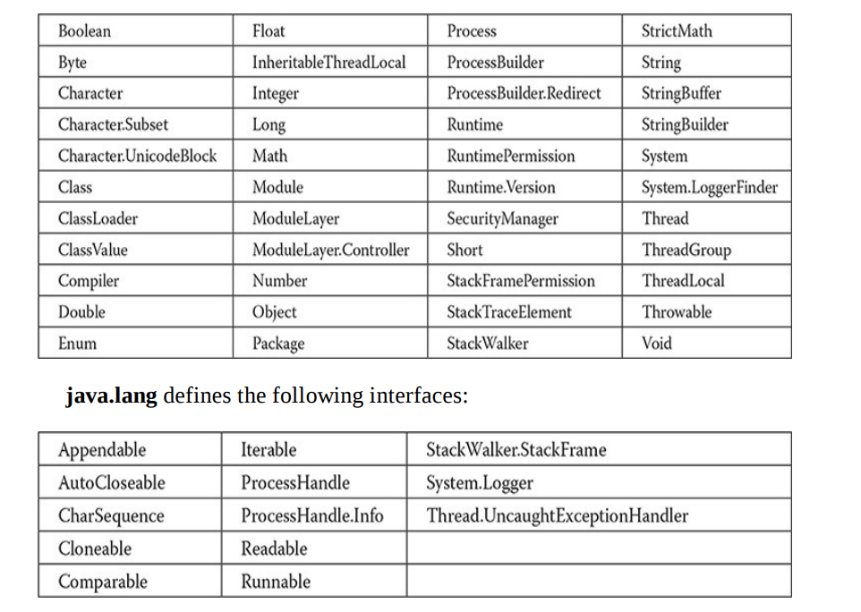
Several of the classes contained in **java.lang** contain deprecated methods, many dating back to Java 1.0. Deprecated methods are still provided by Java to support legacy code but are not recommended for new code. Because of this, in most cases the deprecated methods are not discussed here.

## Primitive Type Wrappers

As mentioned in Part I of this book, Java uses primitive types, such as **int** and **char**, for performance reasons. These data types are not part of the object hierarchy. They are passed by value to methods and cannot be directly passed by reference. Also, there is no way for two methods to refer to the _same instance_ of an **int**. At times, you will need to create an object representation for one of these primitive types. For example, there are collection classes discussed in Chapter 19 that deal only with objects; to store a primitive type in one of these classes, you need to wrap the primitive type in a class. To address this need, Java provides classes that correspond to each of the primitive types. In essence, these classes encapsulate, or wrap, the primitive types within a class. Thus, they are commonly referred to as _type wrappers_. The type wrappers were introduced in Chapter 12. They are examined in detail here.

### Number

The abstract class **Number** defines a superclass that is implemented by the classes that wrap the numeric types **byte**, **short**, **int**, **long**, **float**, and **double**. **Number** has abstract methods that return the value of the object in each of the different number formats. For example, **doubleValue()** returns the value as a **double**, **floatValue()** returns the value as a **float**, and so on. These methods are shown here:
```
byte byteValue() 
double doubleValue() 
float floatValue() 
int intValue() 
long longValue() 
short shortValue()
```
The values returned by these methods might be rounded, truncated, or result in a “garbage” value due to the effects of a narrowing conversion.Number has concrete subclasses that hold explicit values of each primitive numeric type: **Double**, **Float**, **Byte**, **Short**, **Integer**, and **Long**.

### Double and Float

**Double and Float Double**and **Float** are wrappers for floating-point values of type **double** and **float**, respectively. The constructors for **Float** are shown here:
```
Float(double num) 
Float(float num) 
Float(String str) throws NumberFormatException
```
As you can see, **Float** objects can be constructed with values of type **float** or **double**. They can also be constructed from the string representation of a floating-point number. Beginning with JDK 9, these constructors have been deprecated. The **valueOf()** method is the recommended alternative.

The constructors for **Double** are shown here:
```
Double(double num) 
Double(String str) throws NumberFormatException
```
**Double** objects can be constructed with a **double** value or a string containing a floating-point value. Beginning with JDK 9, these constructors have been deprecated. The **valueOf()** method is the recommended alternative.

The methods defined by **Float** include those shown in Table 18-1. The methods defined by **Double** include those shown in Table 18-2. Both **Float** and **Double** define the following constants:  
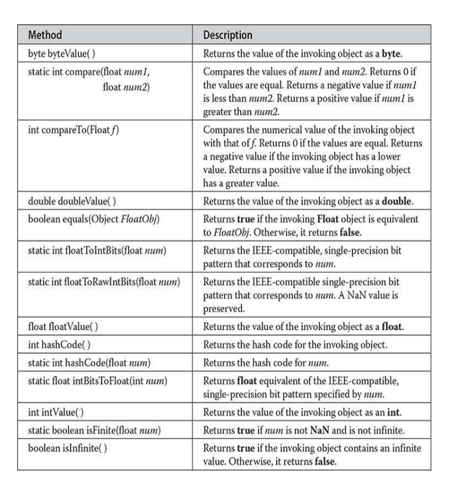
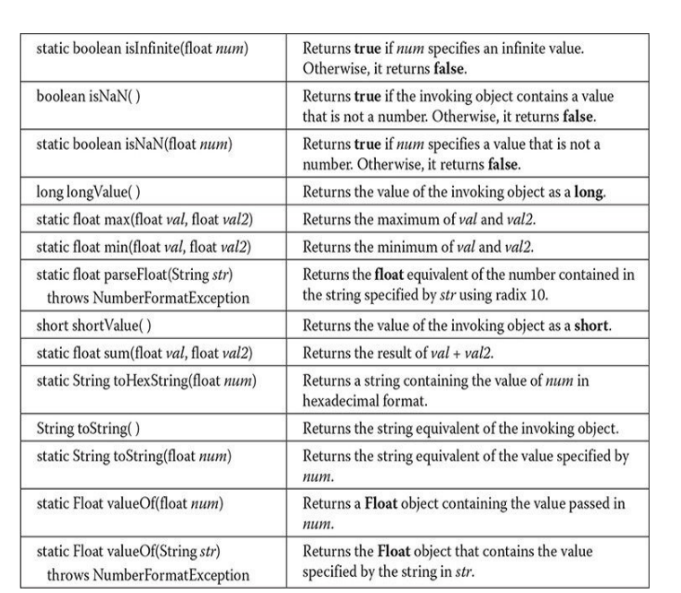
**Table 18-2** The Methods Defined by **Double**  
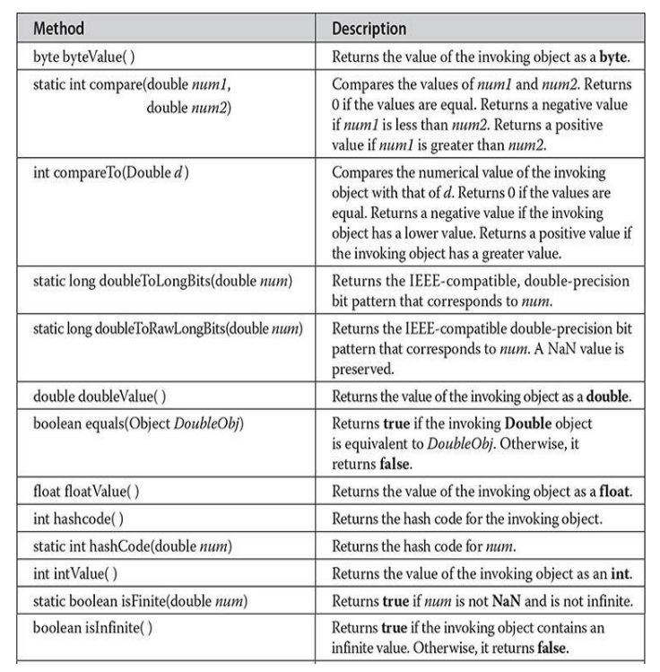
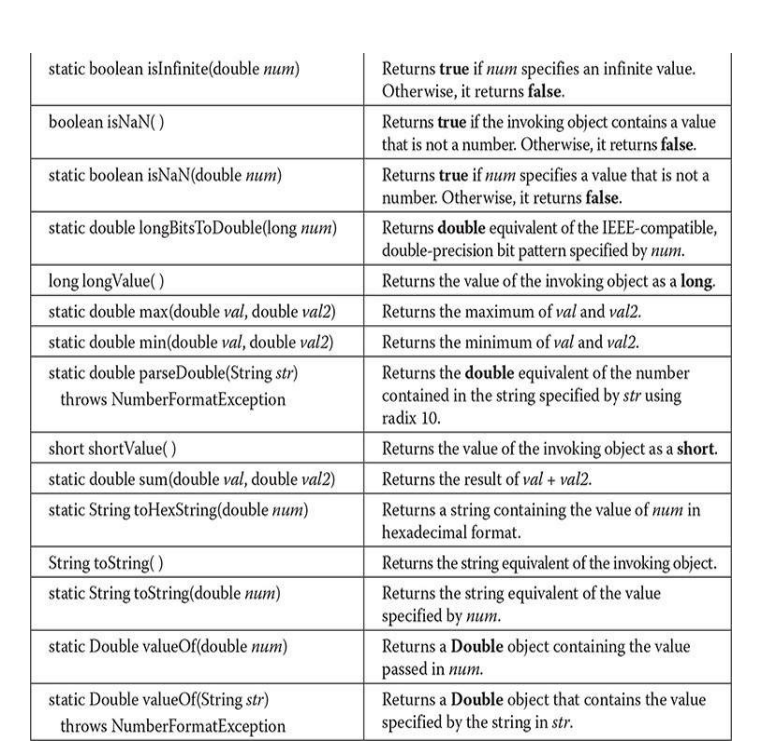
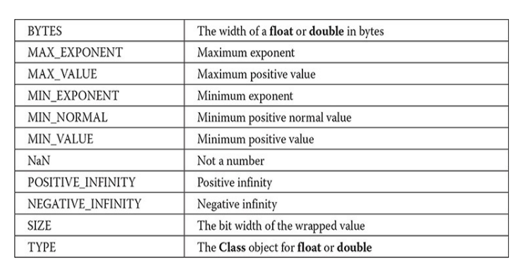
The following example creates two **Double** objects—one by using a **double** value and the other by passing a string that can be parsed as a **double**:

As you can see from the following output, both versions of **valueOf()** created identical **Double** instances, as shown by the **equals()** method returning **true**:

_3.14159 = 3.14159 –> true_

### Understanding isInfinite() and isNaN()

**Float** and **Double** provide the methods **isInfinite()** and **isNaN()**, which help when manipulating two special **double** and **float** values. These methods test for two unique values defined by the IEEE floating-point specification: infinity and NaN (not a number). **isInfinite()** returns **true** if the value being tested is infinitely large or small in magnitude. **isNaN()** returns **true** if the value being tested is not a number.
```
class InfNaN 
{
  // Demonstrate isInfinite() and isNaN() 
  public static void main(String args[]) 
  {
    Double d1 = Double.valueOf(1/0.);
    Double d2 = Double.valueOf(0/0.);
    
    System.out.println(d1 +":" + dl.isInfinite() + ", "+ dl.isNaN()); 
    System.out.println(d2 +":" + d2.isInfinite() +", "+ d2.isNaN());
  }
}
```
This program generates the following output:
```
Infinity: true, false 
NaN: false, true
```

### Byte, Short, Integer, and Long

**Byte, Short, Integer, and Long** The **Byte**, **Short**, **Integer**, and **Long** classes are wrappers for **byte**, **short**, **int**, and **long** integer types, respectively. Their constructors are shown here:
```
Byte(byte num) 
Byte(String str) throws NumberFormatException

Short(short num) 
Short(String str) throws NumberFormatException

Integer(int num) 
Integer(String str) throws NumberFormatException

Long(long num) 
Long(String str) throws NumberFormatException
```
As you can see, these objects can be constructed from numeric values or from strings that contain valid whole number values. Beginning with JDK 9, these constructors have been deprecated. The **valueOf()** method is the recommended alternative.

The methods defined by these classes are shown in Tables 18-3 through 18- 6. As you can see, they define methods for parsing integers from strings and converting strings back into integers. Variants of these methods allow you to specify the radix, or numeric base, for conversion. Common radixes are 2 for binary, 8 for octal, 10 for decimal, and 16 for hexadecimal.  
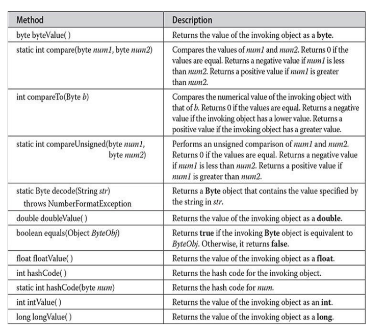
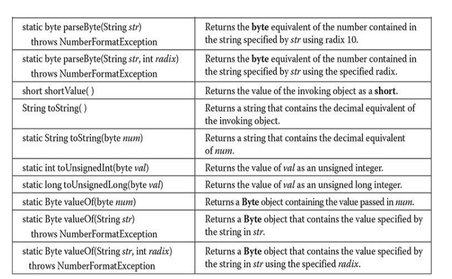
**Table 18-3** The Methods Defined by **Byte**  
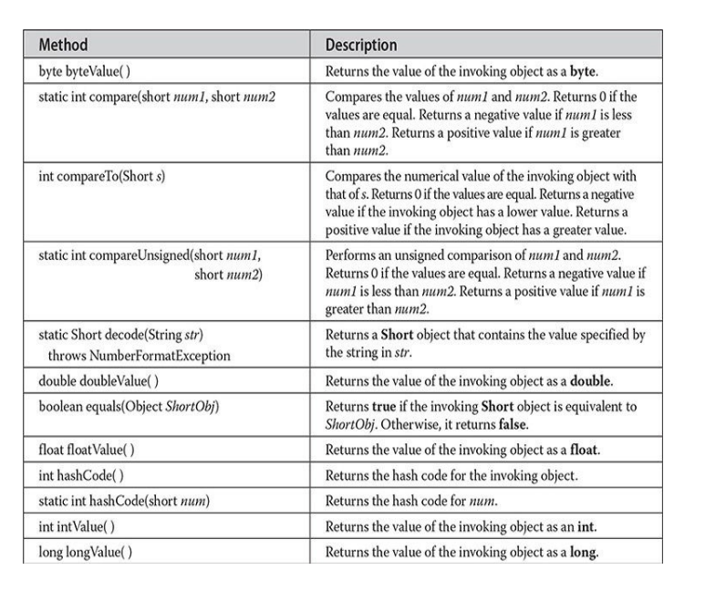
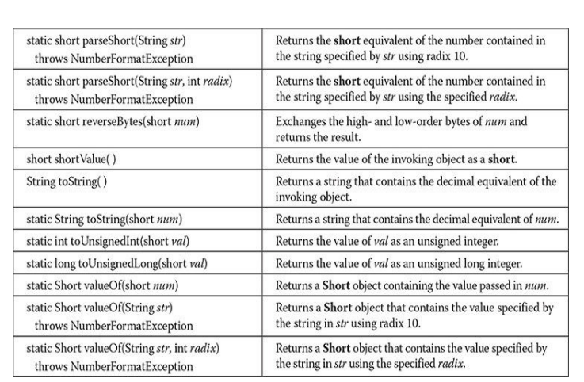
**Table 18-4** The Methods Defined by **Short**  
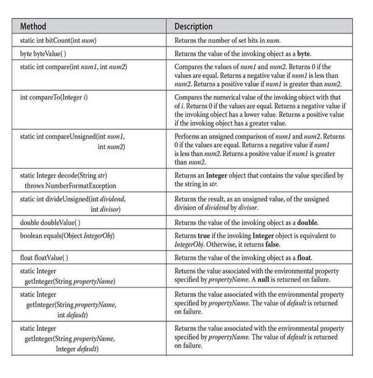
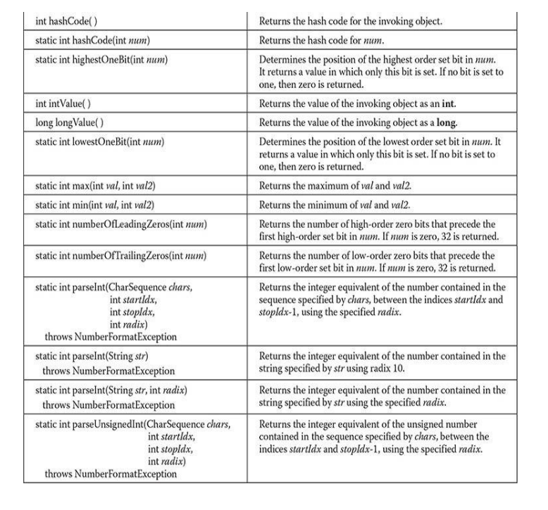
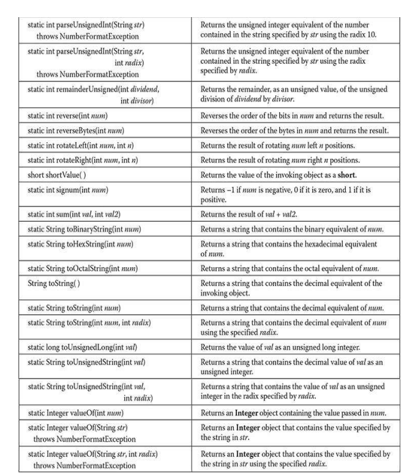
**Table 18-5** The Methods Defined by **Integer**  
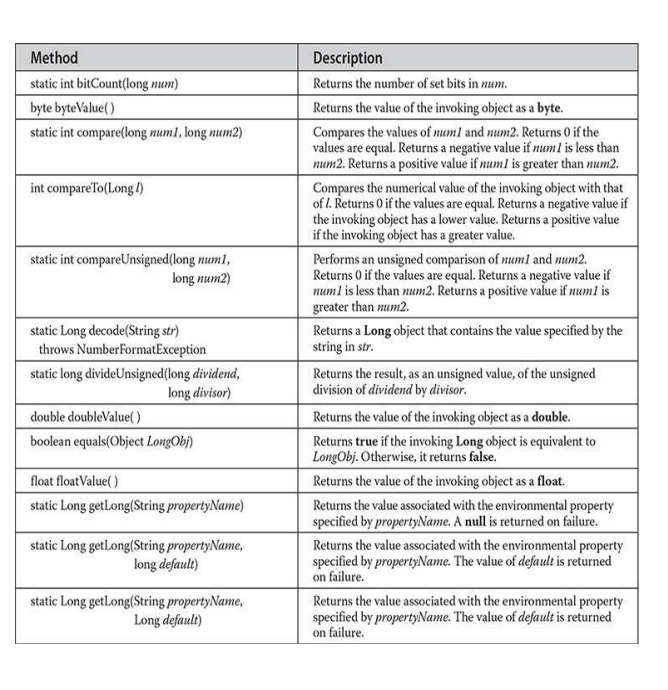
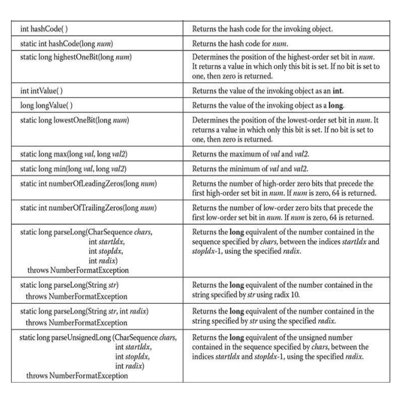
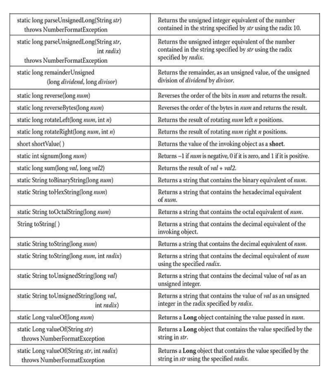
**Table 18-6** The Methods Defined by **Long**

The following constants are defined:  
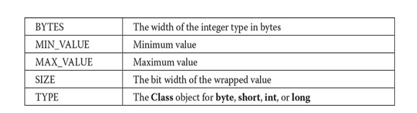

### Converting Numbers to and from Strings

One of the most common programming chores is converting the string representation of a number into its internal, binary format. Fortunately, Java provides an easy way to accomplish this. The **Byte**, **Short**, **Integer**, and **Long** classes provide the **parseByte()**, **parseShort()**, **parseInt()**, and **parseLong()** methods, respectively. These methods return the **byte**, **short**, **int**, or **long** equivalent of the numeric string with which they are called. (Similar methods also exist for the **Float** and **Double** classes.)

The following program demonstrates **parseInt()**. It sums a list of integers entered by the user. It reads the integers using **readLine()** and uses **parseInt()** to convert these strings into their **int** equivalents. 
```
/* 
  This program sums a list of numbers entered by the user. 
  It converts the string representation of each 
  number into an int using parseInt().
*/ 
import java.io.*;
class ParseDemo 
{ 
  public static void main(String args[]) throws IOException 
  {
    // create a BufferedReader using System.in 
    BufferedReader br = new BufferedReader (new InputStreamReader (System.in));
    String str;
    int i;
    int sum=0;
    
    System.out.println("Enter numbers, 0 to quit.");
    
    do {
      str = br.readLine();  
      try 
      {
        i = Integer.parseInt(str);
      } 
      catch (NumberFormatException e) 
      {
        System.out.println("Invalid format");
        i = 0;
      } 
      sum += i;
      System.out.println("Current sum is: "+ sum) 
      } while (i!= 0);
  }
}
```
To convert a whole number into a decimal string, use the versions of **toString()** defined in the **Byte**, **Short**, **Integer**, or **Long** classes. The **Integer** and **Long** classes also provide the methods **toBinaryString()**, **toHexString()**, and **toOctalString()**, which convert a value into a binary, hexadecimal, or octal string, respectively.

The following program demonstrates binary, hexadecimal, and octal conversion:  
```
/* 
  Convert an integer into binary, hexadecimal, and octal.
*/
class StringConversions 
{ 
  public static void main(String args[]) 
  { 
    int num = 19648; 
    System.out.println (num + " in binary: " + Integer.toBinaryString (num));
    System.out.println (num + " in octal: " + Integer.tooctalString (num));
    System.out.println (num + " in hexadecimal: " + Integer.toHexString (num));
  }
}
```
The output of this program is shown here:
```
19648 in binary: 100110011000000

19648 in octal: 46300

19648 in hexadecimal: 4cc0
```

### Character 

**Character**is a simple wrapper around a **char**. The constructor for **Character** is Character(char ch) Here, ch specifies the character that will be wrapped by the **Character** object being created. Beginning with JDK 9, this constructor has been deprecated. The **valueOf()** method is the recommended alternative.

To obtain the **char** value contained in a **Character** object, call **charValue()**, shown here:
```
char charValue() 
```
It returns the character.

The **Character** class defines several constants, including the following:  
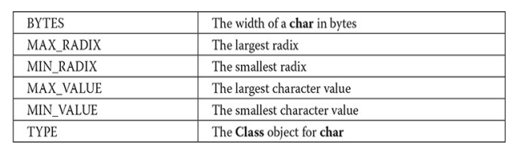
**Character**includes several static methods that categorize characters and alter their case. A sampling is shown in Table 18-7. The following example demonstrates several of these methods:  
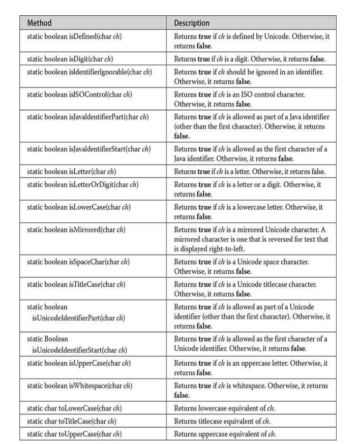
**Table 18-7** Various Character **Methods**  
```
// Demonstrate several Is... methods.
class IsDemo 
{
  public static void main(String args[]) 
  { 
    char a[] = { 'a', 'b', '5', '?', 'A', ' '};
    for (int i=0; i<a.length; i++) 
    {
      if (Character.isDigit (a[i]))
        System.out.println(a[i] + " is a digit.");
      if (Character.isLetter (a[i])) 
        System.out.println(a[i] + " is a letter.");
      if (Character.isWhitespace (a[i]))
        System.out.println(a[i] + " is whitespace.");
      if (Character.isUpperCase (a[i])) 
        System.out.println(a[i] + " is uppercase.");
      if (Character.isLowerCase (a[i]))
        System.out.println(a[i] + " is lowercase.");
    }
  }
}
```
The output from this program is shown here:
```
a is a letter.

a is lowercase.

b is a letter.

b is lowercase.

5 is a digit.

A is a letter.

A is uppercase.

is whitespace.
```
Character defines two methods, **forDigit()** and **digit()**, that enable you to convert between integer values and the digits they represent. They are shown here:
```
static char forDigit(int num, int radix) 
static int digit(char digit, int radix)
```
**forDigit()** returns the digit character associated with the value of num. The radix of the conversion is specified by radix. **digit()** returns the integer value associated with the specified character (which is presumably a digit) according to the specified radix. (There is a second form of **digit()** that takes a code point. See the following section for a discussion of code points.)

Another method defined by **Character** is **compareTo()**, which has the following form:
```
int compareTo(Character c) 
```
It returns zero if the invoking object and c have the same value. It returns a negative value if the invoking object has a lower value. Otherwise, it returns a positive value.

**Character** includes a method called **getDirectionality()** which can be used to determine the direction of a character. Several constants are defined that describe directionality. Most programs will not need to use character directionality.

**Character**also overrides **equals()** and **hashCode()**, and provides a number of other methods.

Two other character-related classes are **Character.Subset**, used to describe a subset of Unicode, and **Character.UnicodeBlock**, which contains Unicode character blocks.

### Additions to Character for Unicode Code Point Support

A number of years ago, major additions were made to **Character**. Beginning with JDK 5, the **Character** class has included support for 32-bit Unicode characters. In the past, all Unicode characters could be held by 16 bits, which is the size of a **char** (and the size of the value encapsulated within a **Character**), because those values ranged from 0 to FFFF. However, the Unicode character set has been expanded, and more than 16 bits are required. Characters can now range from 0 to 10FFFF.

Here are three important terms. A _code point_ is a character in the range 0 to 10FFFF. Characters that have values greater than FFFF are called _supplemental characters_. The _basic multilingual plane (BMP)_ are those characters between 0 and FFFF.

The expansion of the Unicode character set caused a fundamental problem for Java. Because a supplemental character has a value greater than a **char** can hold, some means of handling the supplemental characters was needed. Java addressed this problem in two ways. First, Java uses two **chars** to represent a supplemental character. The first **char** is called the _high surrogate_, and the second is called the _low surrogate_. Methods, such as **codePointAt()**, were provided to translate between code points and supplemental characters.  

Secondly, Java overloaded several preexisting methods in the **Character** class. The overloaded forms use **int** rather than **char** data. Because an **int** is large enough to hold any character as a single value, it can be used to store any character. For example, all of the methods in Table 18-7 have overloaded forms that operate on **int**. Here is a sampling:
```
static boolean isDigit(int cp) 
static boolean isLetter(int cp) 
static int toLowerCase(int cp)
```
In addition to the methods overloaded to accept code points, **Character** adds methods that provide additional support for code points. A sampling is shown in Table 18-8.  
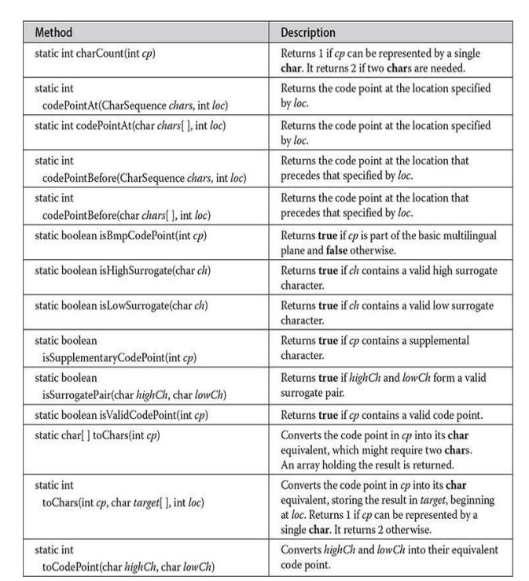
**Table 18-8** A Sampling of Methods That Provide Support for 32-Bit Unicode Code Points

### Boolean 

**Boolean**is a very thin wrapper around **boolean** values, which is useful mostly when you want to pass a **boolean** variable by reference. It contains the constants **TRUE** and **FALSE**, which define true and false **Boolean** objects. **Boolean** also defines the **TYPE** field, which is the **Class** object for **boolean**. **Boolean** defines these constructors:
```
Boolean(boolean boolValue) 
Boolean(String boolString)
```
In the first version, boolValue must be either **true** or **false**. In the second version, if boolString contains the string "true" (in uppercase or lowercase), then the new **Boolean** object will be **true**. Otherwise, it will be **false**. Beginning with JDK 9, these constructors have been deprecated. The **valueOf()** method is the recommended alternative.

**Boolean**defines the methods shown in Table 18-9.  
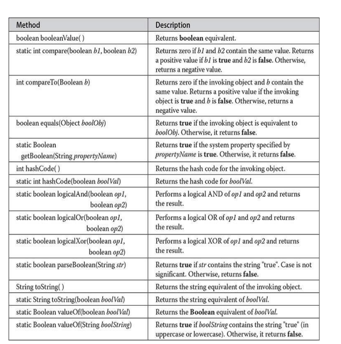
**Table 18-9** The Methods Defined by **Boolean**

## Void

 The **Void** class has one field, **TYPE**, which holds a reference to the **Class** object for type **void**. You do not create instances of this class.

## Process

**Process**The abstract **Process** class encapsulates a process—that is, an executing program. It is used primarily as a superclass for the type of objects created by **exec()** in the **Runtime** class, or by **start()** in the **ProcessBuilder** class. **Process** contains the methods shown in Table 18-10. Beginning with JDK 9, you can obtain a handle to the process in the form of a **ProcessHandle** instance, and that you can obtain information about the process encapsulated in a **ProcessHandle.Info** instance. These offer additional control and information about a process. One particularly interesting piece of information is the amount of CPU time that a process receives. This is obtained by calling **totalCpuDuration()** defined by **ProcessHandle.Info**. Another especially helpful piece of information is obtained by calling **isAlive()** on a **ProcessHandle**. It will return **true** if the process is still executing.  
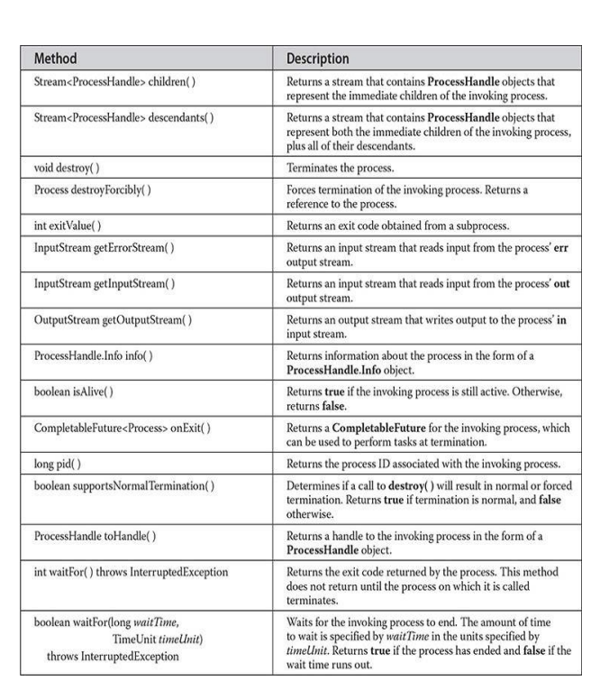
**Table 18-10** The Methods Defined by **Process**

## Runtime

The **Runtime** class encapsulates the run-time environment. You cannot instantiate a **Runtime** object. However, you can get a reference to the current **Runtime**object by calling the static method **Runtime.getRuntime()**. Once you obtain a reference to the current **Runtime** object, you can call several methods that control the state and behavior of the Java Virtual Machine. Untrusted code typically cannot call any of the **Runtime** methods without raising a **SecurityException**. A sampling of methods defined by **Runtime** are shown in Table 18-11.  
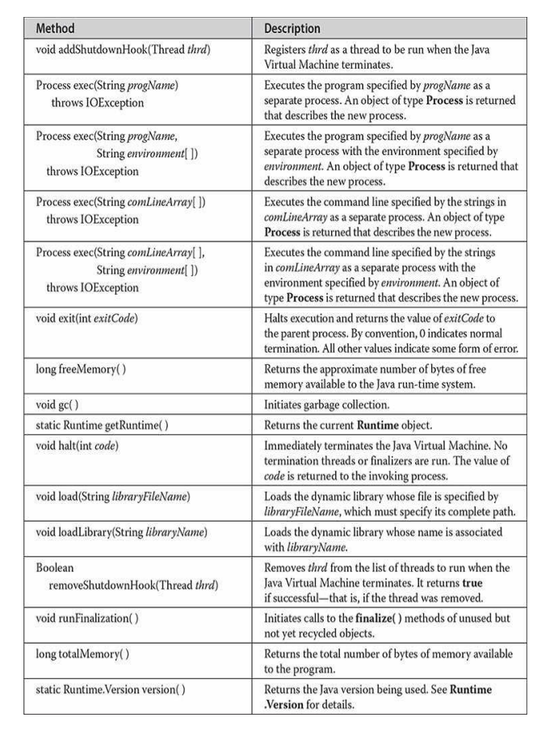
**Table 18-11** A Sampling of Methods Defined by **Runtime**

Let’s look at two of the more interesting uses of the **Runtime** class: memory management and executing additional processes.

### Memory Management

Although Java provides automatic garbage collection, sometimes you will want to know how large the object heap is and how much of it is left. You can use this information, for example, to check your code for efficiency or to approximate how many more objects of a certain type can be instantiated. To obtain these values, use the **totalMemory()** and **freeMemory()** methods.

As mentioned in Part I, Java’s garbage collector runs periodically to recycle unused objects. However, sometimes you will want to collect discarded objects prior to the collector’s next appointed rounds. You can run the garbage collector on demand by calling the **gc()** method. A good thing to try is to call **gc()** and then call **freeMemory()** to get a baseline memory usage. Next, execute your code and call **freeMemory()** again to see how much memory it is allocating. The following program illustrates this idea:  
```
// Demonstrate totalMemory(), freeMemory() and gc().
class MemoryDemo 
{
  public static void main(String args[]) 
  {
    Runtime r = Runtime.getRuntime(); 
    long meml, mem2;
    Integer someints []= new Integer [1000];
    
    System.out.println("Total memory is: " +r.totalMemory());
    
    mem1 = r.freeMemory(); 
    System.out.println("Initial free memory: "+ mem1);
    r.gc();
    
    mem1 = r.freeMemory();
    System.out.println("Free memory after garbage collection: "+ mem1);
    for (int i=0; i<1000; i++)
      someints[i]= Integer.valueOf(i); // allocate integers
    
    mem2 = r.freeMemory();
    System.out.println("Free memory after allocation: "+ mem2);
    System.out.println("Memory used by allocation: "+ (mem1-mem2));
    
    // discard Integers
    for (int i=0; i<1000; i++) 
      someints [i]= null;
    r.gc(); // request garbage collection
    
    mem2= r.freeMemory();
    System.out.println("Free memory after collecting" + "discarded Integers: " + mem2);
  }
}
```
Sample output from this program is shown here (of course, your actual results may vary):
```
Total memory is: 1048568

Initial free memory: 751392  

Free memory after garbage collection: 841424

Free memory after allocation: 824000

Memory used by allocation: 17424

Free memory after collecting discarded Integers: 842640
```
### Executing Other Programs

In safe environments, you can use Java to execute other heavyweight processes (that is, programs) on your multitasking operating system. Several forms of the **exec()** method allow you to name the program you want to run as well as its input parameters. The **exec()** method returns a **Process** object, which can then be used to control how your Java program interacts with this new running process. Because Java can run on a variety of platforms and under a variety of operating systems, **exec()** is inherently environment-dependent.

The following example uses **exec()** to launch **notepad**, Windows’ simple text editor. Obviously, this example must be run under the Windows operating system.
```
// Demonstrate exec().
class ExecDemo 
{
  public static void main(String args[]) 
  {
    Runtime r = Runtime.getRuntime();
    Process p = null;
    try 
    {
      p = r.exec("notepad");
    } 
    catch (Exception e) 
    {
      System.out.println("Error executing notepad. ");
    }
  }
}
```
There are several alternative forms of **exec()**, but the one shown in the example is often sufficient. The **Process** object returned by **exec()** can be manipulated by **Process**’ methods after the new program starts running. You can kill the subprocess with the **destroy()** method. The **waitFor()** method causes your program to wait until the subprocess finishes. The **exitValue()** method returns the value returned by the subprocess when it is finished. This is typically 0 if no problems occur. Here is the preceding **exec()** example modified to wait for the running process to exit:  
```
// Wait until notepad is terminated. 
class ExecDemoFini 
{
  public static void main(String args[]) 
  { 
    Runtime r = Runtime.getRuntime();
    Process p = null;
    try 
    {
      p = r.exec("notepad"); 
      p.waitFor(); 
    } 
    catch (Exception e) 
    {
      System.out.println("Error executing notepad. ");
    }
    System.out.println("Notepad returned " +p.exitValue());
  }
}
```
While a subprocess is running, you can write to and read from its standard input and output. The **getOutputStream()** and **getInputStream()** methods return the handles to standard **in** and **out** of the subprocess. (I/O is examined in detail in Chapter 21.)

## Runtime.Version 

**Runtime.Version** encapsulates version information (which includes the version number) pertaining to the Java environment. You can obtain an instance of **Runtime.Version** for the current platform by calling **Runtime.version()**. Originally added by JDK 9, **Runtime.Version** was substantially changed with the release of JDK 10 to better accommodate the faster, time-based release cadence. As discussed earlier in this book, starting with JDK 10, a feature release is anticipated to occur on a strict schedule, with the time between feature releases expected to be six months.

In the past, the JDK version number used the well-known major.minor approach. This mechanism did not, however, provide a good fit with the time- based release schedule. As a result, a different meaning was given to the elements of a version number. Today, the first four elements specify _counters,_ which occur in the following order: feature release counter, interim release counter, update release counter, and patch release counter. Each number is separated by a period. However, trailing zeros, along with their preceding periods, are removed. Although additional elements may also be included, only the meaning of the first four are predefined.

The feature release counter specifies the number of the release. This counter is updated with each feature release. To smooth the transition from the previous version scheme, the feature release counter began at 10. Thus, the feature release counter for JDK 10 is 10, the one for JDK 11 is 11, and so on.

The interim release counter indicates the number of a release that occurs between feature releases. At the time of this writing, the value of the interim release counter will be zero because interim releases are not expected to be part of the increased release cadence. (It is defined for possible future use.) An interim release will not cause breaking changes to the JDK feature set. The update release counter indicates the number of a release that addresses security and possibly other problems. The patch release counter specifies a number of a release that addresses a serious flaw that must be fixed as soon as possible. With each new feature release, the interim, update, and patch counters are reset to zero.

It is useful to point out that the version number just described is a necessary component of the version _string,_ but optional elements may also be included in the string. For example, a version string may include information for a pre- release version. Optional elements follow the version number in the version string.

Beginning with JDK 10, **Runtime.Version** was updated to include the following methods that support the new feature, interim, update, and patch counter values:
```
int feature() 
int interim() 
int update() 
int patch()
```
Each returns an integer value that represents the indicated value. Here is a short program that demonstrates their use:  
```
// Demonstrate Runtime.Version release counters. 
class VerDemo 
{
  public static void main(String args[]) 
  { 
    Runtime.Version ver = Runtime.version();
    
    // Display individual counters.
    System.out.println("Feature release counter: "+ ver.feature()); 
    System.out.println("Interim release counter: "+ ver.interim()); 
    System.out.println("Update release counter: "+ ver.update()); 
    System.out.println("Patch release counter: "+ ver.patch());
}
}
```
As a result of the change to time-based releases, the following methods in **Runtime.Version** have been deprecated: **major()**, **minor()**, and **security()**. Previously, these returned the major version number, the minor version number, and the security update number. These values have been superseded by the feature, interim, and update numbers, as just described.

In addition to the methods just discussed, **Runtime.Version** has methods that obtain various pieces of optional data. For example, you can obtain the build number, if present, by calling **build()**. Pre-release information, if present, is returned by **pre()**. Other optional information may also be present and is obtained by calling **optional()**. You can compare versions by using **compareTo()** or **compareToIgnoreOptional()**. You can use **equals()** and **equalsIgnoreOptional()** to determine version equality. The **version()** method returns a list of the version numbers. You can convert a valid version string into a **Runtime.Version** object by calling **parse()**.

## ProcessBuilder 

**ProcessBuilder**provides another way to start and manage processes (that is, programs). As explained earlier, all processes are represented by the **Process** class, and a process can be started by **Runtime.exec()**. **ProcessBuilder** offers more control over the processes. For example, you can set the current working directory.

**ProcessBuilder**defines these constructors:
```
ProcessBuilder(List<String> args) 
ProccessBuilder(String ... args)
```
Here, args is a list of arguments that specify the name of the program to be executed along with any required command-line arguments. In the first constructor, the arguments are passed in a **List**. In the second, they are specified through a varargs parameter. Table 18-12 describes the methods defined by **ProcessBuilder**.  
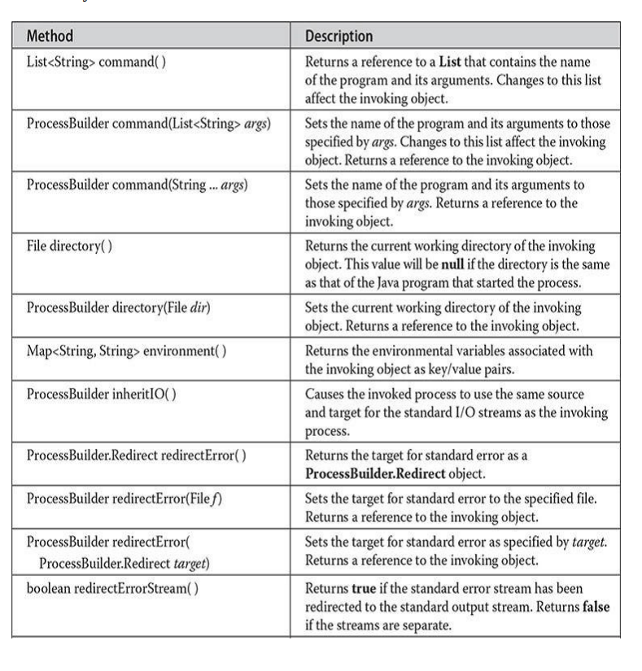
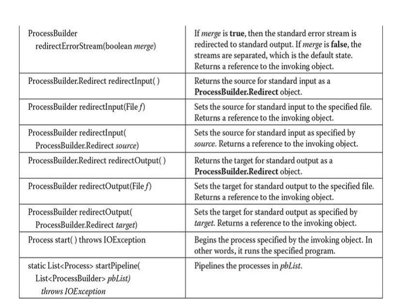
**Table 18-12** The Methods Defined by **ProcessBuilder**

In Table 18-12, notice the methods that use the **ProcessBuilder.Redirect** class. This abstract class encapsulates an I/O source or target linked to a subprocess. Among other things, these methods enable you to redirect the source or target of I/O operations. For example, you can redirect to a file by calling **to()**, redirect from a file by calling **from()**, and append to a file by calling **appendTo()**. A **File** object linked to the file can be obtained by calling **file()**. These methods are shown here:
```
static ProcessBuilder.Redirect to(File f) 
static ProcessBuilder.Redirect from(File f) 
static ProcessBuilder.Redirect appendTo(File f) 
File file()
```
Another method supported by **ProcessBuilder.Redirect** is **type()**, which returns a value of the enumeration type **ProcessBuilder.Redirect.Type**. This enumeration describes the type of the redirection. It defines these values:  

**APPEND**, **INHERIT**, **PIPE**, **READ**, or **WRITE**. **ProcessBuilder.Redirect** also defines the constants **INHERIT**, **PIPE,** and **DISCARD.**

To create a process using **ProcessBuilder**, simply create an instance of **ProcessBuilder**, specifying the name of the program and any needed arguments. To begin execution of the program, call **start()** on that instance. Here is an example that executes the Windows text editor **notepad**. Notice that it specifies the name of the file to edit as an argument.
```
class PBDemo 
{ 
  public static void main(String args[]) 
  {
    try 
    {
      ProcessBuilder proc = new ProcessBuilder ("notepad.exe", "testfile"); 
      proc.start();
    } 
    catch (Exception e) 
    { 
      System.out.println("Error executing notepad. ");
    }
  }
}
```
## System

The **System** class holds a collection of static methods and variables. The standard input, output, and error output of the Java run time are stored in the **in**, **out**, and **err** variables. The methods defined by **System** are shown in Table 18- 13. Many of the methods throw a **SecurityException** if the operation is not permitted by the security manager.  
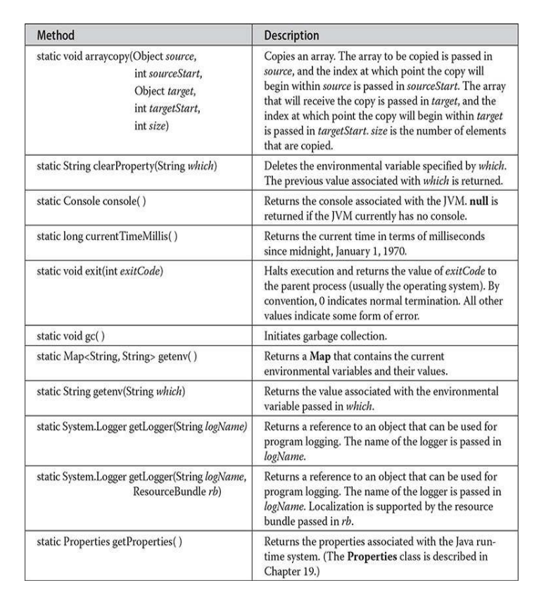
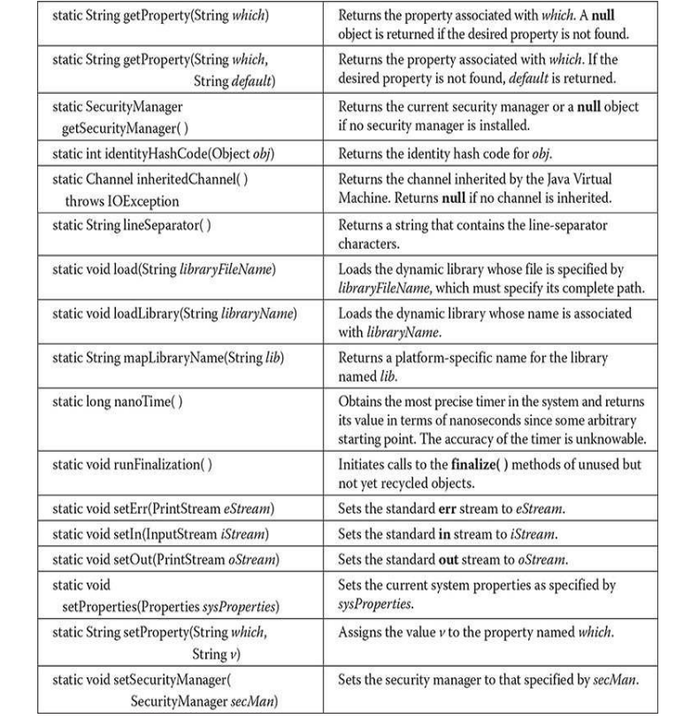
**Table 18-13** The Methods Defined by **System**

Let’s look at some common uses of **System**.

### Using currentTimeMillis() to Time Program Execution  

One use of the **System** class that you might find particularly interesting is to use the **currentTimeMillis()** method to time how long various parts of your program take to execute. The **currentTimeMillis()** method returns the current time in terms of milliseconds since midnight, January 1, 1970. To time a section of your program, store this value just before beginning the section in question. Immediately upon completion, call **currentTimeMillis()** again. The elapsed time will be the ending time minus the starting time. The following program demonstrates this:
```
// Timing program execution.
class Elapsed 
{
  public static void main(String args[]) 
  { 
    long start, end;

    System.out.println("Timing a for loop from 0 to 100,000,000");

    // time a for loop from 0 to 100,000,000
    start = System.currentTimeMillis(); 
    
    // get starting time 
    for (long i=0; i< 100000000L; i++); 
      end = System.currentTimeMillis(); 
    
    // get ending time
    System.out.println("Elapsed time: " + (end-start));
  }
}
```
Here is a sample run (remember that your results probably will differ):
```
Timing a for loop from 0 to 100,000,000

Elapsed time: 10
```
If your system has a timer that offers nanosecond precision, then you could rewrite the preceding program to use **nanoTime()** rather than **currentTimeMillis()**. For example, here is the key portion of the program rewritten to use **nanoTime()**:
```
start = System.nanoTime(); // get starting time

for(long i=0; i < 100000000L; i++) ;

  end = System.nanoTime(); // get ending time
```
### Using arraycopy() 

The **arraycopy()** method can be used to copy quickly an array of any type from one place to another. This is much faster than the equivalent loop written out longhand in Java. Here is an example of two arrays being copied by the **arraycopy()** method. First, **a** is copied to **b**. Next, all of **a**’s elements are shifted down by one. Then, **b** is shifted up by one.
```
// Using arraycopy().
class ACDemo 
{
  static byte a[] = { 65, 66, 67, 68, 69, 70, 71, 72, 73, 74 }; 
  static byte b[] = { 77, 77, 77, 77, 77, 77, 77, 77, 77, 77 };
  public static void main(String args[1]) 
  {
    System.out.println("a = " + new String (a));
    System.out.println("b = = " + new String (b));
    System.arraycopy (a, 0, b, 0, a.length);
    System.out.println("a = "+ new String(a));
    System.out.println("b = " + new String (b));  
    System.arraycopy (a, 0, a, 1, a.length - 1);
    System.arraycopy (b, 1, b, 0, b.length-1);
    System.out.println("a = "+ new String (a)); 
    System.out.println("b = "+ new String (b));
  }
}
```
As you can see from the following output, you can copy using the same source and destination in either direction:
```
a = ABCDEFGHIJ

b = MMMMMMMMMM

a = ABCDEFGHIJ

b = ABCDEFGHIJ

a = AABCDEFGHI

b = BCDEFGHIJJ
```
### Environment Properties

 The following properties are available in all cases:  
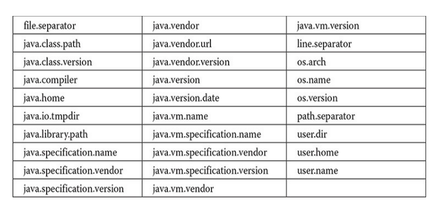
You can obtain the values of various environment variables by calling the **System.getProperty()** method. For example, the following program displays the path to the current user directory:
```
class ShowUserDir 
{ 
  public static void main(String args[]) 
  { 
    System.out.println(System.getProperty("user.dir")); 
  } 
}
```
## System.Logger and System.LoggerFinder

The **System.Logger** interface and **System.LoggerFinder** class support a program log. A logger can be found by use of **System.getLogger()**. **System.Logger** provides the interface to the logger.

## Object

 As mentioned in Part I, **Object** is a superclass of all other classes. **Object** defines the methods shown in Table 18-14, which are available to every object.  
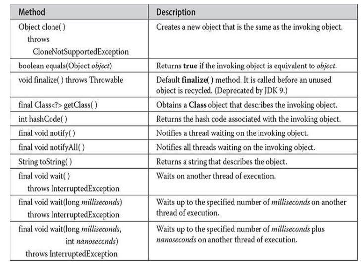
**Table 18-14** The Methods Defined by **Object**

## Using clone() and the Cloneable Interface 
 Most of the methods defined by **Object** are discussed elsewhere in this book. However, one deserves special attention: **clone()**. The **clone()** method generates a duplicate copy of the object on which it is called. Only classes that implement the **Cloneable** interface can be cloned.

The **Cloneable** interface defines no members. It is used to indicate that a class allows an exact copy of an object (that is, a clone) to be made. If you try to call **clone()** on a class that does not implement **Cloneable**, a **CloneNotSupportedException** is thrown. When a clone is made, the constructor for the object being cloned is not called. As implemented by **Object**, a clone is simply an exact copy of the original.

Cloning is a potentially dangerous action, because it can cause unintended side effects. For example, if the object being cloned contains a reference variable called obRef, then when the clone is made, obRef in the clone will refer  

to the same object as does obRef in the original. If the clone makes a change to the contents of the object referred to by obRef, then it will be changed for the original object, too. Here is another example: If an object opens an I/O stream and is then cloned, two objects will be capable of operating on the same stream. Further, if one of these objects closes the stream, the other object might still attempt to write to it, causing an error. In some cases, you will need to override the **clone()** method defined by **Object** to handle these types of problems.

Because cloning can cause problems, **clone()** is declared as **protected** inside **Object**. This means that it must either be called from within a method defined by the class that implements **Cloneable**, or it must be explicitly overridden by that class so that it is public. Let’s look at an example of each approach.

The following program implements **Cloneable** and defines the method **cloneTest()**, which calls **clone()** in **Object**:  
```
// Demonstrate the clone () method
class TestClone implements Cloneable 
{
  int a;
  double b;
  
  // This method calls Object's clone(). 
  TestClone cloneTest() 
  {
    try 
    {
      // call clone in Object.
      return (TestClone) super.clone(); 
    }
    catch (CloneNotSupportedException e) 
    {
      System.out.println("Cloning not allowed. ");
      return this;
    }
  }
}
class CloneDemo 
{ 
  public static void main(String args[]) 
  { 
    TestClone x1 = new TestClone ();
    TestClone x2;

    x1.a = 10;
    x1.b = 20.98;
    
    x2 = x1.cloneTest(); // clone x1

    System.out.println("x1: "+ x1.a + " "+ x1.b);
    System.out.println("x2: "+ x2.a + " "+ x2.b);

  }
}
```
Here, the method **cloneTest()** calls **clone()** in **Object** and returns the result. Notice that the object returned by **clone()** must be cast into its appropriate type (**TestClone**).

The following example overrides **clone()** so that it can be called from code outside of its class. To do this, its access specifier must be **public**, as shown here:  

```
// Demonstrate the clone () method
class TestClone implements Cloneable 
{
  int a;
  double b;
  
  // clone is now overloading and is public . 
  public object clone() 
  {
    try 
    {
      // call clone in Object.
      return super.clone(); 
    }
    catch (CloneNotSupportedException e) 
    {
      System.out.println("Cloning not allowed. ");
      return this;
    }
  }
}
class CloneDemo2 
{ 
  public static void main(String args[]) 
  { 
    TestClone x1 = new TestClone ();
    TestClone x2;

    x1.a = 10;
    x1.b = 20.98;
    
    // here, clone() is called directly
    x2 = (TestClone) x1.clone(); 

    System.out.println("x1: "+ x1.a + " "+ x1.b);
    System.out.println("x2: "+ x2.a + " "+ x2.b);

  }
}
```
The side effects caused by cloning are sometimes difficult to see at first. It is easy to think that a class is safe for cloning when it actually is not. In general, you should not implement **Cloneable** for any class without good reason.

## Class 

**Class**encapsulates the run-time state of a class or interface. Objects of type  **class**are created automatically, when classes are loaded. You cannot explicitly declare a **Class** object. Generally, you obtain a **Class** object by calling the **getClass()** method defined by **Object**. **Class** is a generic type that is declared as shown here:

class Class<T>

Here, **T** is the type of the class or interface represented. A sampling of methods defined by **Class** is shown in Table 18-15. In the table, notice the **getModule()** method. It is part of the support for the modules feature added by JDK 9.  
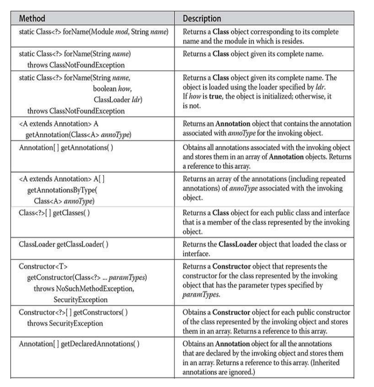
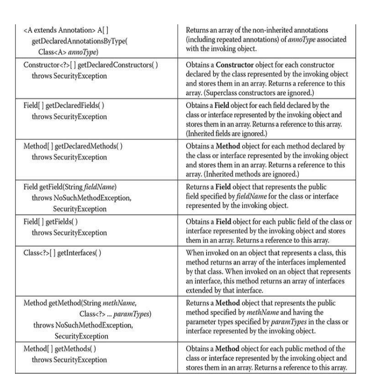
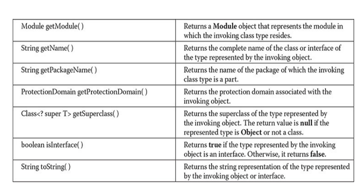
**Table 18-15** A Sampling of Methods Defined by **Class**


The following program demonstrates **getClass()** (inherited from **Object**) and **getSuperclass()** (from **Class**):  
The methods defined by **Class** are often useful in situations where run-time type information about an object is required. As Table 18-15 shows, methods are provided that allow you to determine additional information about a particular class, such as its public constructors, fields, and methods. Among other things, this is important for the Java Beans functionality, which is discussed later in this book.
```
// Demonstrate Run-Time Type Information.
class X 
{
  int a;
  float b;
}
class Y extends X 
{
  double c;
}
class RTTI 
{
  public static void main(String args[]) 
  {
    X X = new X(); 
    Y y = new Y();
    
    Class<?> cl0bj;
    clobj = x.getClass(); // get Class reference 
    System.out.println("x is object of type: "+cl0bj.getName());
    
    clobj = y.getClass(); // get Class reference 
    System.out.println("y is object of type: " +clobj.getName());
    
    clobj = clobj.getSuperclass();
    System.out.println("y's superclass is " + clobj.getName());
  }
}
```
The output from this program is shown here:
```
x is object of type: X

y is object of type: Y

y’s superclass is X
```
Before moving on, it is useful to mention a new **Class** capability that you may find interesting. Beginning with JDK 11, **Class** provides three methods that relate to a nest. A nest is a group of classes and/or interfaces nested within an outer class or interface. The nest concept enables the JVM to more efficiently handle certain situations involving access between nest members. It is important to state that a nest is not a source code mechanism, and it does not change the Java language or how it defines accessibility. Nests relate  

specifically to how the compiler and JVM work. However, it is now possible to obtain a nest’s top-level class/interface, which is called the nest host, by use of **getNestHost()**. You can determine if one class/interface is a member of the same nest as another by use of **isNestMateOf()**. Finally, you can get an array containing a list of the nest members by calling **getNestMembers()**. You may find these methods useful when using reflection, for example.

## ClassLoader

 The abstract class **ClassLoader** defines how classes are loaded. Your application can create subclasses that extend **ClassLoader**, implementing its methods. Doing so allows you to load classes in some way other than the way they are normally loaded by the Java run-time system. However, this is not something that you will normally need to do.

## Math

 The **Math** class contains all the floating-point functions that are used for geometry and trigonometry, as well as several general-purpose methods. **Math** defines two **double** constants: **E** (approximately 2.72) and **PI** (approximately 3.14).

### Trigonometric Functions

 The following methods accept a **double** parameter for an angle in radians and return the result of their respective trigonometric function:
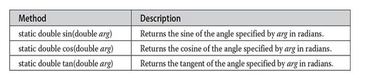
The next methods take as a parameter the result of a trigonometric function and return, in radians, the angle that would produce that result. They are the inverse of their non-arc companions.  
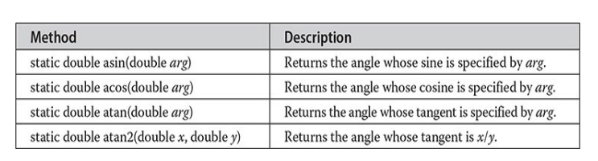
The next methods compute the hyperbolic sine, cosine, and tangent of an angle:
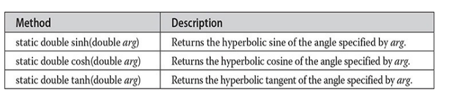

### Exponential Functions Math

 defines the following exponential methods:
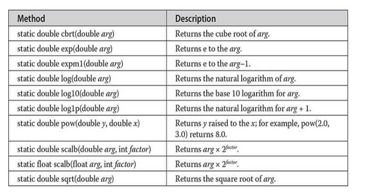
### Rounding Functions

 The **Math** class defines several methods that provide various types of rounding operations. They are shown in Table 18-16. Notice the two **ulp()** methods at the end of the table. In this context, ulp stands for _units in the last place_. It indicates the distance between a value and the next higher value. It can be used to help assess the accuracy of a result.  
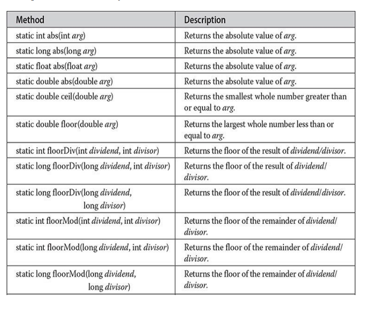
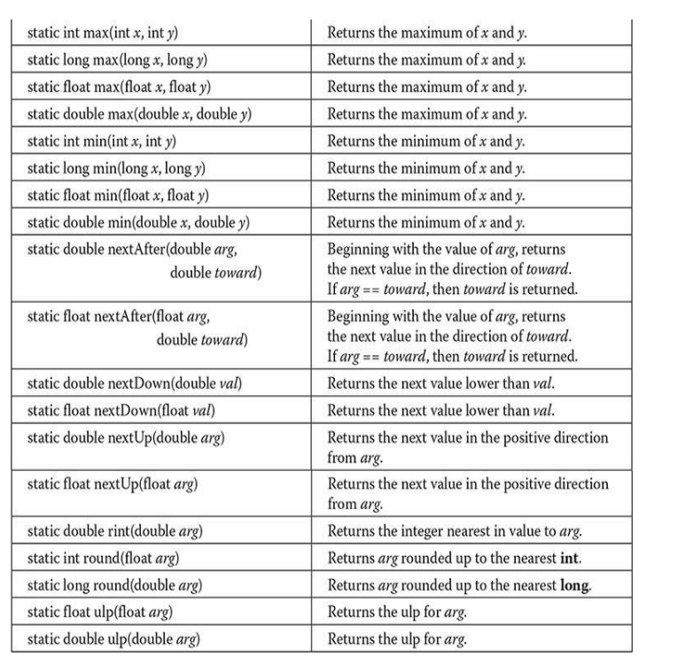
**Table 18-16** The Rounding Methods Defined by **Math**

### Miscellaneous Math Methods

 In addition to the methods just shown, **Math** defines several other methods, which are shown in Table 18-17. Notice that several of the methods use the suffix **Exact**. They throw an **ArithmeticException** if overflow occurs. Thus, these methods give you an easy way to watch various operations for overflow.  
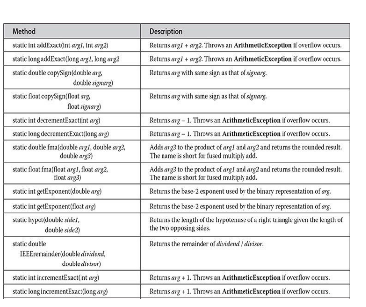
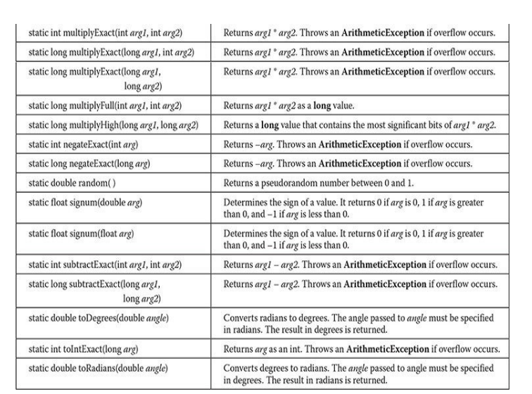
**Table 18-17** Other Methods Defined by **Math**

The following program demonstrates **toRadians()** and **toDegrees()**:
```
// Demonstrate toDegrees () and toRadians (). 
class Angles 
{
  public static void main(String args[]) 
  { 
    double theta = 120.0;
    System.out.println(theta + " degrees is " +Math. toRadians (theta) + " radians.");theta = 1.312;
    System.out.println(theta + " radians is " +Math.toDegrees (theta) + " degrees.");
  }
}
```
The output is shown here:  
```
120.0 degrees is 2.0943951023931953 radians.

1.312 radians is 75.17206272116401 degrees.
```

## StrictMath

The **StrictMath** class defines a complete set of mathematical methods that parallel those in **Math**. The difference is that the **StrictMath** version is guaranteed to generate precisely identical results across all Java implementations, whereas the methods in **Math** are given more latitude in order to improve performance.

## Compiler

The **Compiler** class supports the creation of Java environments in which Java bytecode is compiled into executable code rather than interpreted. It is not for normal programming use and has been deprecated by JDK 9.

## Thread, ThreadGroup, and Runnable

The **Runnable** interface and the **Thread** and **ThreadGroup** classes support multithreaded programming. Each is examined next.

**NOTE**

 An overview of the techniques used to manage threads, implement the **Runnable** interface, and create multithreaded programs is presented in Chapter 11.

### The Runnable Interface

 The **Runnable** interface must be implemented by any class that will initiate a separate thread of execution. **Runnable** only defines one abstract method, called **run()**, which is the entry point to the thread. It is defined like this:
```
void run()
```
Threads that you create must implement this method.

## Thread 

**Thread**creates a new thread of execution. It implements **Runnable** and defines a number of constructors. Several are shown here:  
```
Thread() 
Thread(Runnable threadOb) 
Thread(Runnable threadOb, String threadName) 
Thread(String threadName) 
Thread(ThreadGroup groupOb, Runnable threadOb) 
Thread(ThreadGroup groupOb, Runnable threadOb, String threadName) 
Thread(ThreadGroup groupOb, String threadName)
```
threadOb is an instance of a class that implements the **Runnable** interface and defines where execution of the thread will begin. The name of the thread is specified by threadName. When a name is not specified, one is created by the Java Virtual Machine. groupOb specifies the thread group to which the new thread will belong. When no thread group is specified, by default the new thread belongs to the same group as the parent thread.

The following constants are defined by **Thread**:
```
MAX_PRIORITY 
MIN_PRIORITY 
NORM_PRIORITY
```
As expected, these constants specify the maximum, minimum, and default thread priorities.

The non-deprecated methods defined by **Thread** are shown in Table 18-18. **Thread** also includes the deprecated methods **stop()**, **suspend()**, and **resume()**. However, as explained in Chapter 11, these were deprecated because they were inherently unstable. Also deprecated are **countStackFrames()**, because it calls **suspend()**, and **destroy()**, because it can cause deadlock. Furthermore, beginning with JDK 11, **destroy()** and one version of **stop()** have now been removed from **Thread**.  
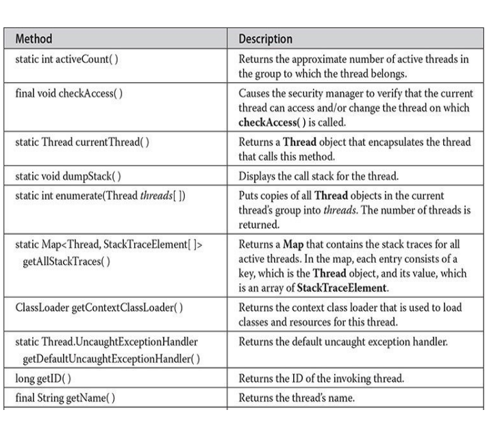
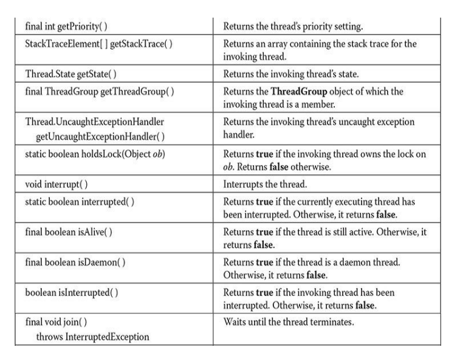
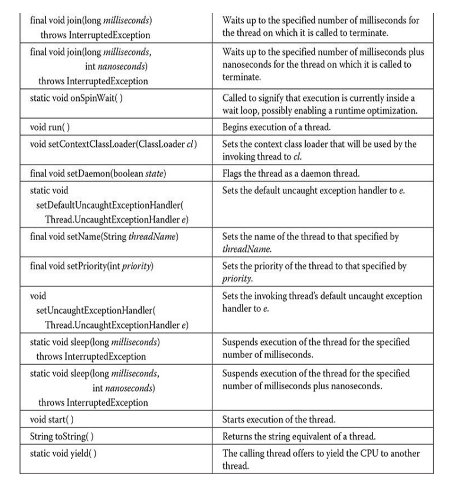
**Table 18-18** The Methods Defined by **Thread**

### ThreadGroup

**ThreadGroup**creates a group of threads. It defines these two constructors:
```
ThreadGroup(String groupName)  

ThreadGroup(ThreadGroup parentOb, String groupName)
```

For both forms, groupName specifies the name of the thread group. The first version creates a new group that has the current thread as its parent. In the second form, the parent is specified by parentOb. The non-deprecated methods defined by **ThreadGroup** are shown in Table 18-19.  
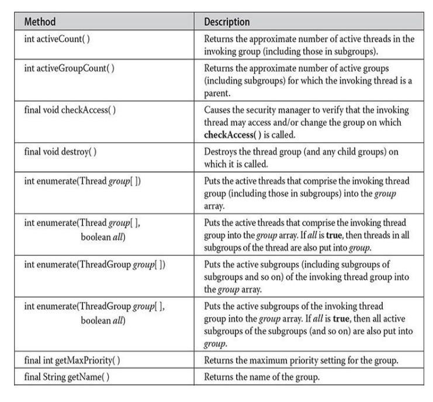
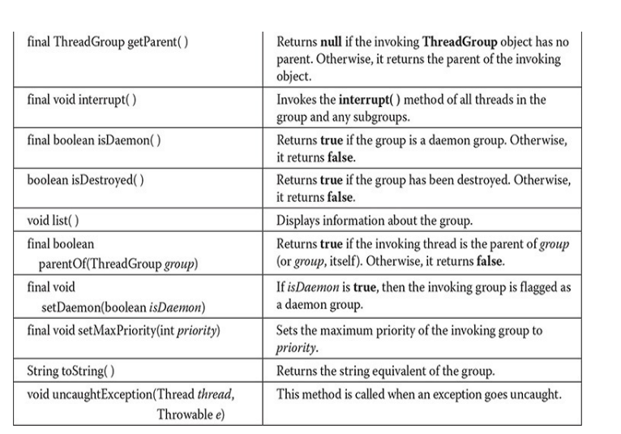
**Table 18-19** The Methods Defined by **ThreadGroup**Thread groups offer a convenient way to manage groups of threads as a unit. This is particularly valuable in situations in which you want to suspend and resume a number of related threads. For example, imagine a program in which one set of threads is used for printing a document, another set is used to display the document on the screen, and another set saves the document to a disk file. If printing is aborted, you will want an easy way to stop all threads related to printing. Thread groups offer this convenience. The following program, which creates two thread groups of two threads each, illustrates this usage:  
```
// Demonstrate thread groups. 
class NewThread extends Thread 
{ 
  boolean suspendFlag;
  
  NewThread(String threadname, ThreadGroup tgob) 
  { 
    super (tgob, threadname); 
    System.out.println("New thread: "+this); 
    suspendFlag = false;
  }
  
  // This is the entry point for thread. 
  public void run() 
  {
    try 
    { 
      for (int i = 5; i > 0; i--) 
      { 
        System.out.println(getName() + ": " + i); 
        Thread.sleep(1000);
        synchronized (this) 
        { 
          while (suspendFlag) 
          { 
            wait();
          }
        }
      }
    } 
    catch (Exception e) 
    { 
      System.out.println("Exception in " + getName());
    }
  System.out.println(getName() + " exiting.");
  }
  synchronized void mysuspend() 
  { 
    suspendFlag = true;
  }
  synchronized void myresume () 
  { 
    suspendFlag = false;
    notify();
  }
}
class ThreadGroupDemo 
{
  public static void main(String args[]) 
  {
    ThreadGroup groupA = new ThreadGroup ("Group A"); 
    ThreadGroup groupB = new ThreadGroup ("Group B");
   
    NewThread obl = new NewThread ("One", groupA);
    NewThread ob2 = new NewThread ("Two", groupA); 
    NewThread ob3 = new NewThread ("Three", groupB);
    NewThread ob4= new NewThread ("Four", groupB);
   
    obl.start();
    ob2.start();
    ob3.start();
    ob4.start();
   
    System.out.println("\nHere is output from list():");
    groupA.list();
    groupB.list();
    System.out.println();

    System.out.println("Suspending Group A"); 
    Thread tga [] = new Thread [groupA.activeCount ()]; 
    groupA. enumerate (tga); // get threads in group 
    for (int i = 0; i < tga.length; i++) 
    {
      ((NewThread) tga [i]).mysuspend(); // suspend each thread 
    }

    try 
    {
      Thread.sleep (4000);
    } 
    catch (InterruptedException e) 
    { 
      System.out.println("Main thread interrupted. ");
    }

    System.out.println("Resuming Group A"); 
    for (int i = 0; i < tga.length; i++) 
    { 
      ((NewThread) tga [i]).myresume (); // resume threads in group
    }
    // wait for threads to finish
    try 
    {
      System.out.println("Waiting for threads to finish.");
      obl.join();
      ob3.join();
      ob2.join(); 
      System.out.println("Exception in Main thread");
      ob4.join();
    } 
    catch (Exception e) 
    {
      System.out.println("Main thread exiting.");
    }
  }
}
```
Sample output from this program is shown here (the precise output you see may differ):  
```
New thread: Thread [One, 5, Group A] 
New thread: Thread [Two, 5, Group A]
New thread: Thread [Three, 5, Group B]
New thread: Thread [Four, 5, Group B]
```
Here is output from list():
```
java.lang.ThreadGroup [name=Group A, maxpri=10]
Thread [One, 5, Group A]
Thread [Two, 5, Group A] java.lang.ThreadGroup [name=Group
Thread [Three, 5, Group B]
Thread [Four, 5, Group B] Suspending Group A
Three: 5
Four: 5
Three: 4
Four: 4
Three: 3
Four: 3
Three: 2
Four: 2
Resuming Group A Waiting for threads to finish.
One: 5
Two: 5
Three: 1
Four: 1
One: 4
Two: 4
Three exiting.
Four exiting.
One: 3
Two: 3
One: 2
Two: 2
One: 1
Two: 1
One exiting.
Two exiting.
Main thread exiting.
B, maxpri=10]
```
Inside the program, notice that thread group A is suspended for four seconds. As the output confirms, this causes threads One and Two to pause, but threads Three and Four continue running. After the four seconds, threads One and Two are resumed. Notice how thread group A is suspended and resumed. First, the threads in group A are obtained by calling **enumerate()** on group A. Then, each thread is suspended by iterating through the resulting array. To resume the threads in A, the list is again traversed and each thread is resumed.

## ThreadLocal and InheritableThreadLocal

 Java defines two additional thread-related classes in **java.lang**:

- **ThreadLocal** Used to create thread local variables. Each thread will have its own copy of a thread local variable.

- **InheritableThreadLocal** Creates thread local variables that may be inherited.

## Package 

Package encapsulates information about a package. The methods defined by **Package** are shown in Table 18-20. The following program demonstrates **Package**, displaying the packages about which the program currently is aware:  
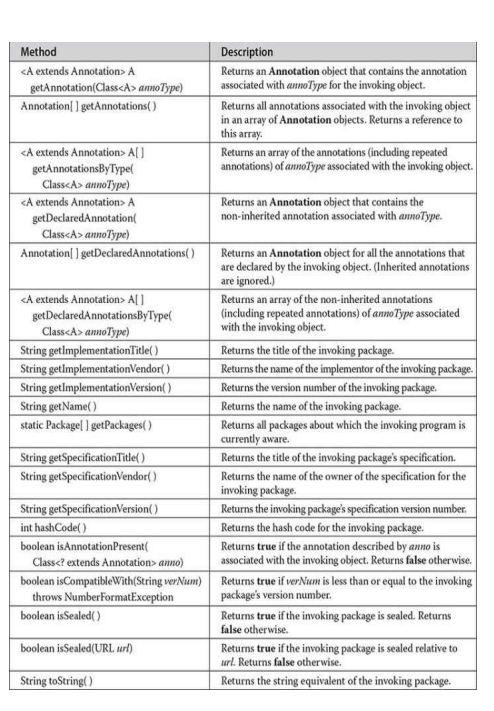
**Table 18-20** The Methods Defined by **Package**
```
// Demonstrate Package 
class PkgTest 
{
  public static void main(String args[]) 
  { 
    Package pkgs [];
    
    pkgs = Package.getPackages ();
    
    for (int i=0; i < pkgs.length; i++)
      System.out.println(pkgs [i].getName() + " " +
  pkgs [i].getImplementationTitle() + " " +
  pkgs [i].getImplementationVendor () + " " +
  pkgs [i].getImplementationVersion ());
  }
}
```
## Module

Added by JDK 9, the **Module** class encapsulates a module. Using a **Module** instance you can add various access rights to a module, determine access rights, or obtain information about a module. For example, to export a package to a specified module, call **addExports()**; to open a package to a specified module, call **addOpens()**; to read another module, call **addReads()**; and to add a service requirement, call **addUses()**. You can determine if a module can access another by calling **canRead()**. To determine if a module uses a service, call **canUse()**. Although these methods will be most useful in specialized situations, **Module** defines several others that may be of more general interest.

For example, you can obtain the name of a module by calling **getName()**. If called from within a named module, the name is returned. If called from the unnamed module, **null** is returned. You can obtain a **Set** of the packages in a module by calling **getPackages()**. A module descriptor, in the form of a **ModuleDescriptor** instance, is returned by **getDescriptor()**. (**ModuleDescriptor** is a class declared in **java.lang.module**.) You can determine if a package is exported or opened by the invoking module by calling **isExported()** or **isOpen()**. Use **isNamed()** to determine if a module is named or unnamed. Other methods include **getAnnotation()**,  

**getDeclaredAnnotations()**, **getLayer()**, **getClassLoader()**, and **getResourceAsStream()**. The **toString()** method is also overridden for **Module**.

Assuming the modules defined by the examples in Chapter 16, you can easily experiment with the **Module** class. For example, try adding the following lines to the **MyModAppDemo** class:
```
Module myMod = MyModAppDemo.class.getModule();

System.out.println("Module is " + myMod.getName());

System.out.print("Packages: ");

for(String pkg : myMod.getPackages()) 
  System.out.println(pkg + " ");
```
Here, the methods **getName()** and **getPackages()** are used. Notice that a **Module** instance is obtained by calling **getModule()** on the **Class** instance for **MyModAppDemo**. When run, these lines produce the following output:
```
Module is appstart

Packages: appstart.mymodappdemo
```

## ModuleLayer 

**ModuleLayer**, added by JDK 9, encapsulates a module layer. The nested class **ModuleLayer.Controller**, also added by JDK 9, is the controller for a module layer. In general, these classes are for specialized applications.

## RuntimePermission 

**RuntimePermission**relates to Java’s security mechanism.

## Throwable

The **Throwable** class supports Java’s exception-handling system and is the class from which all exception classes are derived. It is discussed in Chapter 10.

## SecurityManager 

**SecurityManager**supports Java’s security system. A reference to the current security manager can be obtained by calling **getSecurityManager()** defined by the **System** class.

## StackTraceElement

 The **StackTraceElement** class describes a single _stack frame_, which is an individual element of a stack trace when an exception occurs. Each stack frame represents an _execution point_, which includes such things as the name of the class, the name of the method, the name of the file, and the source-code line number. Beginning with JDK 9, module information is also included. **StackTraceElement** defines two constructors, but typically you won’t need to use them because an array of **StackTraceElement**s is returned by various methods, such as the **getStackTrace()** method of the **Throwable** and **Thread** classes.

The methods supported by **StackTraceElement** are shown in Table 18-21. These methods give you programmatic access to a stack trace.  
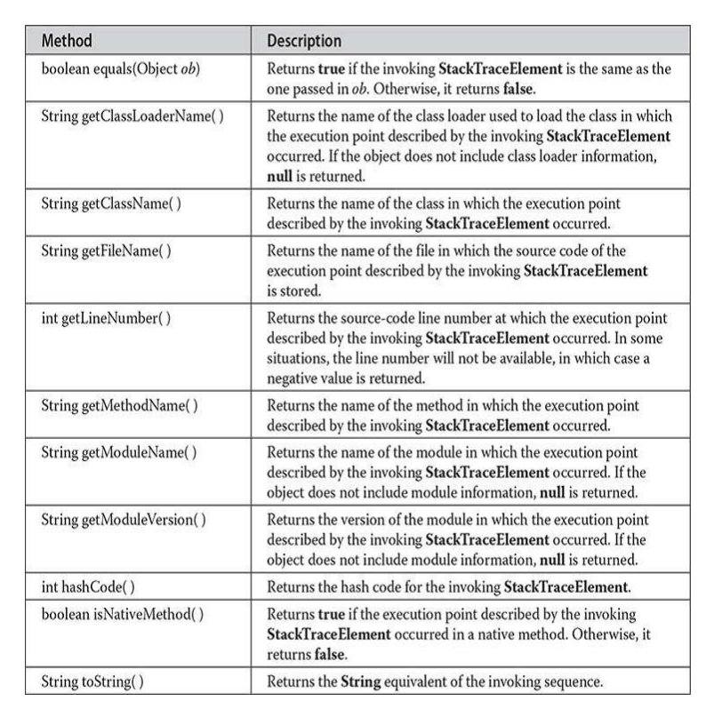
**Table 18-21** The Methods Defined by **StackTraceElement**

## StackWalker and StackWalker.StackFrame

Added by JDK 9, the **StackWalker** class and the **StackWalker.StackFrame** interface support stack walking operations. A **StackWalker** instance is obtained by use of the static **getInstance()** method defined by **StackWalker**. Stack walking is initiated by calling the **walk()** method of **StackWalker**. Each stack frame is encapsulated as a **StackWalker.StackFrame** object.  

## Enum

 As described in Chapter 12, an enumeration is a list of named constants. (Recall that an enumeration is created by using the keyword **enum**.) All enumerations automatically inherit **Enum**. **Enum** is a generic class that is declared as shown here:
```
class Enum<E extends Enum<E>>
```
Here, **E** stands for the enumeration type. **Enum** has no public constructors. **Enum** defines several methods that are available for use by all

enumerations, which are shown in Table 18-22.
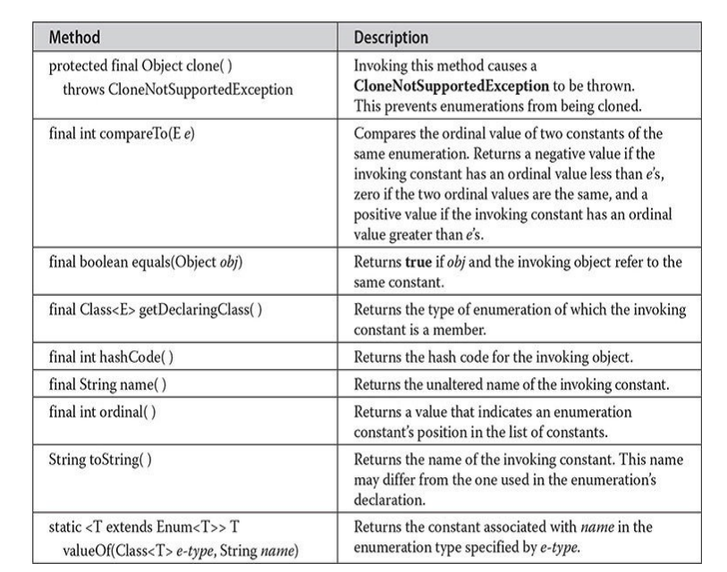
**Table 18-22** The Methods Defined by **Enum**  

## ClassValue 

ClassValue can be used to associate a value with a type. It is a generic type defined like this:

_Class ClassValue<T>_

It is designed for highly specialized uses, not for normal programming.

## The CharSequence Interface

The **CharSequence** interface defines methods that grant read-only access to a sequence of characters. These methods are shown in Table 18-23. This interface is implemented by **String**, **StringBuffer**, and **StringBuilder**, among others.
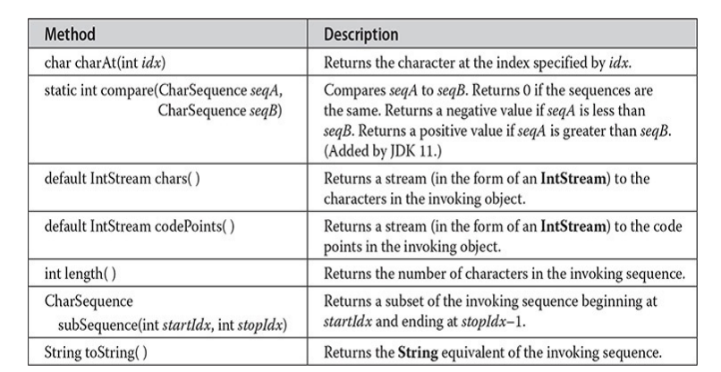
**Table 18-23** The Methods Defined by **CharSequence**

## The Comparable Interface

Objects of classes that implement **Comparable** can be ordered. In other words, classes that implement **Comparable** contain objects that can be compared in some meaningful manner. **Comparable** is generic and is declared like this:

_interface Comparable<T>_

Here, **T** represents the type of objects being compared. The **Comparable** interface declares one method that is used to determine

what Java calls the _natural ordering_ of instances of a class. The signature of the method is shown here:

_int compareTo(T obj)_

This method compares the invoking object with obj. It returns 0 if the values are equal. A negative value is returned if the invoking object has a lower value. Otherwise, a positive value is returned.

This interface is implemented by several of the classes already reviewed in this book, such as **Byte**, **Character**, **Double**, **Float**, **Long**, **Short**, **String**, **Integer**, and **Enum**.

## The Appendable Interface

An object of a class that implements **Appendable** can have a character or character sequences appended to it. **Appendable** defines these three methods:

Appendable append(char ch) throws IOException Appendable append(CharSequence chars) throws IOException Appendable append(CharSequence chars, int begin, int end) throws IOException

In the first form, the character ch is appended to the invoking object. In the second form, the character sequence chars is appended to the invoking object. The third form allows you to indicate a portion (the characters running from begin through end–1) of the sequence specified by chars. In all cases, a reference to the invoking object is returned.

## The Iterable Interface 

**Iterable** must be implemented by any class whose objects will be used by the for-each version of the **for** loop. In other words, in order for an object to be used within a for-each style **for** loop, its class must implement **Iterable**. **Iterable** is a generic interface that has this declaration:
```
interface Iterable<T>
```
Here, **T** is the type of the object being iterated. It defines one abstract method,  

**iterator()**, which is shown here:
```
Iterator<T> iterator()
```
It returns an iterator to the elements contained in the invoking object. **Iterable** also defines two default methods. The first is called **forEach()**:
```
default void forEach(Consumer<? super T> action)
```
For each element being iterated, **forEach()** executes the code specified by action. (**Consumer** is a functional interface defined in **java.util.function**. See Chapter 20.)

The second default method is **spliterator()**, shown next:
```
default Spliterator<T> spliterator()
```
It returns a **Spliterator** to the sequence being iterated. (See Chapters 19 and 29 for details on spliterators.)

**NOTE**

 Iterators are described in detail in Chapter 19.

## The Readable Interface

 The **Readable** interface indicates that an object can be used as a source for characters. It defines one method called **read()**, which is shown here:

int read(CharBuffer buf) throws IOException

This method reads characters into buf. It returns the number of characters read, or –1 if an EOF is encountered.

## The AutoCloseable Interface 

**AutoCloseable** provides support for the **try**\-with-resources statement, which implements what is sometimes referred to as _automatic resource management_ (ARM). The **try**\-with-resources statement automates the process of releasing a resource (such as a stream) when it is no longer needed. (See Chapter 13 for details.) Only objects of classes that implement **AutoCloseable** can be used with **try**\-with-resources. The **AutoCloseable** interface defines only the **close()** method, which is shown here:
```
void close() throws Exception  

void close() throws Exception
```
This method closes the invoking object, releasing any resources that it may hold. It is automatically called at the end of a **try**\-with-resources statement, thus eliminating the need to explicitly invoke **close()**. **AutoCloseable** is implemented by several classes, including all of the I/O classes that open a stream that can be closed.

## The Thread.UncaughtExceptionHandler Interface

The static **Thread.UncaughtExceptionHandler** interface is implemented by classes that want to handle uncaught exceptions. It is implemented by **ThreadGroup**. It declares only one method, which is shown here:
```
void uncaughtException(Thread thrd, Throwable exc)
```
Here, thrd is a reference to the thread that generated the exception and exc is a reference to the exception.

## The java.lang Subpackages 

Java defines several subpackages of **java.lang**. Except as otherwise noted, these packages are in the **java.base** module.

- java.lang.annotation
- java.lang.instrument
- java.lang.invoke
- java.lang.management
- java.lang.module
- java.lang.ref
- java.lang.reflect

Each is briefly described here.

### java.lang.annotation

Java’s annotation facility is supported by **java.lang.annotation**. It defines the **Annotation** interface, the **ElementType** and **RetentionPolicy** enumerations,  

and several predefined annotations. Annotations are described in Chapter 12.

### java.lang.instrument 

**java.lang.instrument** defines features that can be used to add instrumentation to various aspects of program execution. It defines the **Instrumentation** and **ClassFileTransformer** interfaces, and the **ClassDefinition** class. This package is in the **java.instrument** module.

### java.lang.invoke 

**java.lang.invoke** supports dynamic language features. It includes classes such as **CallSite**, **MethodHandle**, and **MethodType**.

### java.lang.management

The **java.lang.management** package provides management support for the JVM and the execution environment. Using the features in **java.lang.management**, you can observe and manage various aspects of program execution. This package is in the **java.management** module.

### java.lang.module

The **java.lang.module** package supports modules. It includes classes such as **ModuleDescriptor** and **ModuleReference**, and the interfaces **ModuleFinder** and **ModuleReader**.

### java.lang.ref

You learned earlier that the garbage collection facilities in Java automatically determine when no references exist to an object. The object is then assumed to be no longer needed and its memory is reclaimed. The classes in the **java.lang.ref** package provide more flexible control over the garbage collection process.

### java.lang.reflect

Reflection is the ability of a program to analyze code at run time. The **java.lang.reflect** package provides the ability to obtain information about the fields, constructors, methods, and modifiers of a class. Among other reasons,  

you need this information to build software tools that enable you to work with Java Beans components. The tools use reflection to determine dynamically the characteristics of a component. Reflection was introduced in Chapter 12 and is also examined in Chapter 30.

**java.lang.reflect** defines several classes, including **Method**, **Field**, and **Constructor**. It also defines several interfaces, including **AnnotatedElement**, **Member**, and **Type**. In addition, the **java.lang.reflect** package includes the **Array** class that enables you to create and access arrays dynamically.  