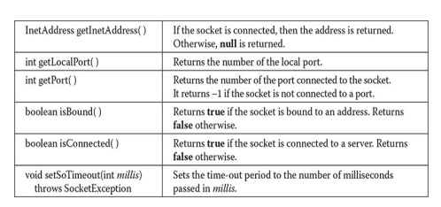

---
title: 'Networking'
weight: 7
--- 

#Networking

****

Since its beginning, Java has been associated with Internet programming. There are a number of reasons for this, not the least of which is its ability to generate secure, cross-platform, portable code. However, one of the most important reasons that Java became the premier language for network programming are the classes defined in the **java.net** package. They provide a convenient means by which programmers of all skill levels can access network resources. Beginning with JDK 11, Java has also provided enhanced networking support for HTTP clients in the **java.net.http** package in a module by the same name. Called the HTTP Client API, it further solidifies Java’s networking capabilities.

This chapter explores the **java.net** package. It concludes by introducing the new **java.http .net** package. It is important to emphasize that networking is a very large and at times complicated topic. It is not possible for this book to discuss all of the capabilities contained in these two packages. Instead, this chapter focuses on several of their core classes and interfaces.

## Networking Basics

 Before we begin, it will be useful to review some key networking concepts and terms. At the core of Java’s networking support is the concept of a socket. A socket identifies an endpoint in a network. The socket paradigm was part of the 4.2BSD Berkeley UNIX release in the early 1980s. Because of this, the term _Berkeley socket_ is also used. Sockets are at the foundation of modern networking because a socket allows a single computer to serve many different clients at once, as well as to serve many different types of information. This is accomplished through the use of a _port,_ which is a numbered socket on a particular machine. A server process is said to "listen" to a port until a client connects to it. A server is allowed to accept multiple clients connected to the same port number, although each session is unique. To manage multiple client connections, a server process must be multithreaded or have some other means of multiplexing the simultaneous I/O.

Socket communication takes place via a protocol. _Internet Protocol (IP)_ is a  

low-level routing protocol that breaks data into small packets and sends them to an address across a network, which does not guarantee to deliver said packets to the destination. _Transmission Control Protocol (TCP)_ is a higher-level protocol that manages to robustly string together these packets, sorting and retransmitting them as necessary to reliably transmit data. A third protocol, _User Datagram Protocol (UDP),_ sits next to TCP and can be used directly to support fast, connectionless, unreliable transport of packets.

Once a connection has been established, a higher-level protocol ensues, which is dependent on which port you are using. TCP/IP reserves the lower 1,024 ports for specific protocols. Many of these will seem familiar to you if you have spent any time surfing the Internet. Port number 21 is for FTP; 23 is for Telnet; 25 is for e-mail; 43 is for whois; 80 is for HTTP; 119 is for netnews —and the list goes on. It is up to each protocol to determine how a client should interact with the port.

For example, HTTP is the protocol that web browsers and servers use to transfer hypertext pages and images. It is a quite simple protocol for a basic page-browsing web server. Here’s how it works. When a client requests a file from an HTTP server, an action known as a _hit,_ it simply sends the name of the file in a special format to a predefined port and reads back the contents of the file. The server also responds with a status code to tell the client whether or not the request can be fulfilled and why.

A key component of the Internet is the address. Every computer on the Internet has one. An Internet address is a number that uniquely identifies each computer on the Net. Originally, all Internet addresses consisted of 32-bit values, organized as four 8-bit values. This address type was specified by IPv4 (Internet Protocol, version 4). However, a new addressing scheme, called IPv6 (Internet Protocol, version 6) has come into play. IPv6 uses a 128-bit value to represent an address, organized into eight 16-bit chunks. Although there are several reasons for and advantages to IPv6, the main one is that it supports a much larger address space than does IPv4. Fortunately, when using Java, you won’t normally need to worry about whether IPv4 or IPv6 addresses are used because Java handles the details for you.

Just as the numbers of an IP address describe a network hierarchy, the name of an Internet address, called its _domain name,_ describes a machine’s location in a name space. For example, **www.HerbSchildt.com** is in the COM top-level domain (used by U.S. commercial sites); it is called HerbSchildt, and www identifies the server for web requests. An Internet domain name is mapped to an IP address by the _Domain Naming Service (DNS)._ This enables users to work  

with domain names, but the Internet operates on IP addresses.

**The java.net Networking Classes and Interfaces**

The **java.net** package contains Java’s original networking features, which have been available since version 1.0. It supports TCP/IP both by extending the already established stream I/O interface introduced in Chapter 21 and by adding the features required to build I/O objects across the network. Java supports both the TCP and UDP protocol families. TCP is used for reliable stream-based I/O across the network. UDP supports a simpler, hence faster, point-to-point datagram-oriented model. The classes contained in the **java.net** package are shown here:

The **java.net** package’s interfaces are listed here:  

Beginning with JDK 9, **java.net** is part of the **java.base** module. In the sections that follow, we will examine the main networking classes and show several examples that apply to them. Once you understand these core networking classes, you will be able to easily explore the others on your own.

## InetAddress

 The **InetAddress** class is used to encapsulate both the numerical IP address and the domain name for that address. You interact with this class by using the name of an IP host, which is more convenient and understandable than its IP address. The **InetAddress** class hides the number inside. **InetAddress** can handle both IPv4 and IPv6 addresses.

## Factory Methods

 The **InetAddress** class has no visible constructors. To create an **InetAddress** object, you have to use one of the available factory methods. As explained earlier in this book, _factory methods_ are merely a convention whereby static methods in a class return an instance of that class. This is done in lieu of overloading a constructor with various parameter lists when having unique method names makes the results much clearer. Three commonly used **InetAddress** factory methods are shown here:

static InetAddress getLocalHost() throws UnknownHostException

static InetAddress getByName(String hostName) throws UnknownHostException

static InetAddress[ ] getAllByName(String hostName) throws UnknownHostException

The **getLocalHost()** method simply returns the **InetAddress** object that represents the local host. The **getByName()** method returns an **InetAddress** for a host name passed to it. If these methods are unable to resolve the host  

name, they throw an **UnknownHostException**. On the Internet, it is common for a single name to be used to represent

several machines. In the world of web servers, this is one way to provide some degree of scaling. The **getAllByName()** factory method returns an array of **InetAddress**es that represent all of the addresses that a particular name resolves to. It will also throw an **UnknownHostException** if it can’t resolve the name to at least one address.

## InetAddress

 also includes the factory method **getByAddress(),** which takes an IP address and returns an **InetAddress** object. Either an IPv4 or an IPv6 address can be used.

The following example prints the addresses and names of the local machine and two Internet web sites:
```java
// Demonstrate InetAddress. import java.net.*;
class InetAddressTest {
public static void main(String args[]) throws UnknownHost Exception { InetAddress Address InetAddress.getLocalHost (); System.out.println (Address);
Address InetAddress.getByName("www.HerbSchildt.com"); System.out.println (Address);
InetAddress SW [] = InetAddress.getAllByName ("www.nba.com"); for (int i=0; i<SW.length; i++) System.out.println(SW [i]);
}
}
```
Here is the output produced by this program. (Of course, the output you see may be slightly different.)

default/166.203.115.212

www.HerbSchildt.com/216.92.65.4

www.nba.com/23.61.252.147

www.nba.com/2600:1403:1:58d:0:0:0:2e1

www.nba.com/2600:1403:1:593:0:0:0:2e1

## Instance Methods

  

The **InetAddress** class has several other methods, which can be used on the objects returned by the methods just discussed. Here is a sampling:

Internet addresses are looked up in a series of hierarchically cached servers. That means that your local computer might know a particular name-to-IP- address mapping automatically, such as for itself and nearby servers. For other names, it may ask a local DNS server for IP address information. If that server doesn’t have a particular address, it can go to a remote site and ask for it. This can continue all the way up to the root server. This process might take a long time, so it is wise to structure your code so that you cache IP address information locally rather than look it up repeatedly.

## Inet4Address and Inet6Address

 Java includes support for both IPv4 and IPv6 addresses. Because of this, two subclasses of **InetAddress** were created: **Inet4Address** and **Inet6Address**. **Inet4Address** represents a traditional-style IPv4 address. **Inet6Address** encapsulates a newer IPv6 address. Because they are subclasses of **InetAddress,** an **InetAddress** reference can refer to either. This is one way that Java was able to add IPv6 functionality without breaking existing code or adding many more classes. For the most part, you can simply use **InetAddress** when working with IP addresses because it can accommodate both styles.

**TCP/IP Client Sockets**  

**TCP/IP Client Sockets** are used to implement reliable, bidirectional, persistent, point- to-point, stream-based connections between hosts on the Internet. A socket can be used to connect Java’s I/O system to other programs that may reside either on the local machine or on any other machine on the Internet, subject to security constraints.

There are two kinds of TCP sockets in Java. One is for servers, and the other is for clients. The **ServerSocket** class is designed to be a "listener," which waits for clients to connect before doing anything. Thus, **ServerSocket** is for servers. The **Socket** class is for clients. It is designed to connect to server sockets and initiate protocol exchanges. Because client sockets are the most commonly used by Java applications, they are examined here.

The creation of a **Socket** object implicitly establishes a connection between the client and server. There are no methods or constructors that explicitly expose the details of establishing that connection. Here are two constructors used to create client sockets:


**Socket**defines several instance methods. For example, a **Socket** can be examined at any time for the address and port information associated with it, by use of the following methods:

You can gain access to the input and output streams associated with a **Socket** by use of the **getInputStream()** and **getOuptutStream()** methods, as shown here. Each can throw an **IOException** if the socket has been invalidated by a loss of connection. These streams are used exactly like the I/O streams  

described in Chapter 21 to send and receive data.

Several other methods are available, including **connect(),** which allows you to specify a new connection; **isConnected(),** which returns true if the socket is connected to a server; **isBound(),** which returns true if the socket is bound to an address; and **isClosed(),** which returns true if the socket is closed. To close a socket, call **close()**. Closing a socket also closes the I/O streams associated with the socket. Beginning with JDK 7, **Socket** also implements **AutoCloseable**, which means that you can use a **try**\-with-resources block to manage a socket.

The following program provides a simple **Socket** example. It opens a connection to a "whois" port (port 43) on the InterNIC server, sends the command-line argument down the socket, and then prints the data that is returned. InterNIC will try to look up the argument as a registered Internet domain name, and then send back the IP address and contact information for that site.  
```java
// Demonstrate Sockets. import java.net.*; import java.io.*;
class Whois {
public static void main(String args[]) throws Exception {
int c;
// Create a socket connected to internic.net, port 43. Sockets = new Socket ("whois.internic.net", 43);
// Obtain input and output streams. InputStream in s.getInputStream(); OutputStream out = s.getOutputStream();
// Construct a request string.
String str = (args.length == 0 ? "Oracle PressBooks.com": args[0]) + "\n";
// Convert to bytes. byte buf[]= str.getBytes();
// Send request.
out.write(buf);
// Read and display response.
while ((c in.read()) != -1) { System.out.print((char) c);
}
s.close();
}
}
```
Here is how the program works. First, a **Socket** is constructed that specifies the host name "whois.internic.net" and the port number 43. **Internic.net** is the InterNIC web site that handles whois requests. Port 43 is the whois port. Next, both input and output streams are opened on the socket. Then, a string is constructed that contains the name of the web site you want to obtain information about. In this case, if no web site is specified on the command line, then "OraclePressBooks.com" is used. The string is converted into a **byte** array and then sent out of the socket. The response is read by inputting from the socket, and the results are displayed. Finally, the socket is closed, which also closes the I/O streams.

In the preceding example, the socket was closed manually by calling **close(**  

**)**. Beginning with JDK 7, you can use a **try**\-with-resources block to automatically close the socket. For example, here is another way to write the **main()** method of the previous program:
```java
// Use try-with-resources to close a socket. public static void main(String args[]) throws Exception {
int c;
// Create a socket connected to internic.net, port 43. Manage this //socket with a try-with-resources block.
try (Socket s = new Socket ("whois.internic.net", 43) ) {
// Obtain input and output streams. InputStream in s.getInputStream(); OutputStream out = s.getOutputStream();
// Construct a request string.
String str = (args.length == 0 ? "OraclePressBooks.com": args[0]) + "\n";
// Convert to bytes.
byte buf[]= str.getBytes();
// Send request. out.write (buf);
// Read and display response. while ((c = in.read()) != -1) { System.out.print((char) c);
}
} // The socket is now closed.
}
```
In this version, the socket is automatically closed when the **try** block ends. So the examples will work with earlier versions of Java and to clearly

illustrate when a network resource can be closed, subsequent examples will continue to call **close()** explicitly. However, in your own code, you should consider using automatic resource management since it offers a more streamlined approach. One other point: In this version, exceptions are still thrown out of **main()**, but they could be handled by adding **catch** clauses to the end of the **try**\-with-resources block.

**NOTE** For simplicity, the examples in this chapter simply throw all exceptions out of **main()**. This allows the logic of the network code to be clearly illustrated. However, in real-  

world code, you will normally need to handle the exceptions in an appropriate way.

## URL

 The preceding example was rather obscure because the modern Internet is not about the older protocols such as whois, finger, and FTP. It is about WWW, the World Wide Web. The Web is a loose collection of higher-level protocols and file formats, all unified in a web browser. One of the most important aspects of the Web is that Tim Berners-Lee devised a scalable way to locate all of the resources of the Net. Once you can reliably name anything and everything, it becomes a very powerful paradigm. The Uniform Resource Locator (URL) does exactly that.

The URL provides a reasonably intelligible form to uniquely identify or address information on the Internet. URLs are ubiquitous; every browser uses them to identify information on the Web. Within Java’s network class library, the **URL** class provides a simple, concise API to access information across the Internet using URLs.

All URLs share the same basic format, although some variation is allowed. Here are two examples: **http://www.HerbSchildt.com/** and **http://www.HerbSchildt.com:80/index.htm**. A URL specification is based on four components. The first is the protocol to use, separated from the rest of the locator by a colon (:). Common protocols are HTTP, FTP, gopher, and file, although these days almost everything is being done via HTTP (in fact, most browsers will proceed correctly if you leave off the "http://" from your URL specification). The second component is the host name or IP address of the host to use; this is delimited on the left by double slashes (//) and on the right by a slash (/) or optionally a colon (:). The third component, the port number, is an optional parameter, delimited on the left from the host name by a colon (:) and on the right by a slash (/). (It defaults to port 80, the predefined HTTP port; thus, ":80" is redundant.) The fourth part is the actual file path. Most HTTP servers will append a file named **index.html** or **index.htm** to URLs that refer directly to a directory resource. Thus, **http://www.HerbSchildt.com/** is the same as **http://www.HerbSchildt.com/index.htm**.

Java’s **URL** class has several constructors; each can throw a **MalformedURLException**. One commonly used form specifies the URL with a string that is identical to what you see displayed in a browser:

URL(String urlSpecifier) throws MalformedURLException

The next two forms of the constructor allow you to break up the URL into its  

The next two forms of the constructor allow you to break up the URL into its component parts:

URL(String _protocolName,_ String _hostName,_ int _port,_ String path) throws MalformedURLException

URL(String _protocolName,_ String _hostName,_ String path) throws MalformedURLException

Another frequently used constructor allows you to use an existing URL as a reference context and then create a new URL from that context. Although this sounds a little contorted, it’s really quite easy and useful.

URL(URL _urlObj,_ String urlSpecifier) throws MalformedURLException

The following example creates a URL to a page on **HerbSchildt.com** and then examines its properties:
```java
// Demonstrate URL. import java.net.*;
class URLDemo {
public static void main(String args[]) throws MalformedURLException { URL hp = new URL(http://www.HerbSchildt.com/WhatsNew");
System.out.println("Protocol: " + hp.getProtocol()); System.out.println("Port: "+hp.getPort());
System.out.println("Host: "+hp.getHost());
System.out.println("File: " + hp.getFile()); System.out.println("Ext: " + hp.toExternalForm());
}
}
```
When you run this, you will get the following output:

Protocol: http

Port: -1

Host: www.HerbSchildt.com

File: /WhatsNew

Ext:http://www.HerbSchildt.com/WhatsNew

Notice that the port is –1; this means that a port was not explicitly set. Given a **URL** object, you can retrieve the data associated with it. To access the actual bits or content information of a **URL,** create a **URLConnection** object from it,  

using its **openConnection()** method, like this:

urlc = url.openConnection()

**openConnection()** has the following general form:

URLConnection openConnection() throws IOException

It returns a **URLConnection** object associated with the invoking **URL** object. Notice that it may throw an **IOException**.

## URLConnection 
**URLConnection**is a general-purpose class for accessing the attributes of a remote resource. Once you make a connection to a remote server, you can use **URLConnection** to inspect the properties of the remote object before actually transporting it locally. These attributes are exposed by the HTTP protocol specification and, as such, only make sense for **URL** objects that are using the HTTP protocol.

**URLConnection**defines several methods. Here is a sampling:  

Notice that **URLConnection** defines several methods that handle header information. A header consists of pairs of keys and values represented as strings. By using **getHeaderField()**, you can obtain the value associated with a  

header key. By calling **getHeaderFields()**, you can obtain a map that contains all of the headers. Several standard header fields are available directly through methods such as **getDate()** and **getContentType()**.

The following example creates a **URLConnection** using the **openConnection()** method of a **URL** object and then uses it to examine the document’s properties and content:  
```java
// Demonstrate URLConnection.
import java.net.
import java.io.*; import java.util.Date;
class UCDemo
{
public static void main(String args[]) throws Exception { int c;
URL hp new URL(http://www.internic.net"); URLConnection hpcon = hp.openConnection();
// get date
long d=hpCon.getDate();
if (d--0)
System.out.println("No date information."); else
System.out.println("Date: " + new Date(d));
// get content type
System.out.println("Content-Type:+hpCon.getContentType());
// get expiration date. dhpCon.getExpiration();
if (d=0)
System.out.println("No expiration information.");
else System.out.println("Expires: " + new Date(d));
// get last-modified date
dhpCon.getLastModified();
if (d-0)
System.out.println("No last-modified information
else
.");
System.out.println("Last-Modified: " + new Date(d));
// get content length
long len = hpCon.getContent LengthLong();
if (len = -1) System.out.println("Content length unavailable.") I
else System.out.println("Content-Length: len);
if (len = 0) {
System.out.println("Content");
InputStream input hpcon.getInputStream(); while (((c input.read()) != -1)) { System.out.print((char) c);
}
input.close():
else (
System.out.println("No content available.");
}
}
}
```
The program establishes an HTTP connection to **www.internic.net** over port 80. It then displays several header values and retrieves the content. You might find it interesting to try this example, observing the results, and then for comparison purposes try different web sites of your own choosing.

## HttpURLConnection

 Java provides a subclass of **URLConnection** that provides support for HTTP connections. This class is called **HttpURLConnection.** You obtain an **HttpURLConnection** in the same way just shown, by calling **openConnection()** on a **URL** object, but you must cast the result to **HttpURLConnection.** (Of course, you must make sure that you are actually opening an HTTP connection.) Once you have obtained a reference to an **HttpURLConnection** object, you can use any of the methods inherited from **URLConnection.** You can also use any of the several methods defined by **HttpURLConnection.** Here is a sampling:  

The following program demonstrates **HttpURLConnection.** It first establishes a connection to **www.google.com**. Then it displays the request method, the response code, and the response message. Finally, it displays the keys and values in the response header.  
```java
// Demonstrate HttpURLConnection.
import java.net.*;
import java.io.*;
import java.util.*;
class HttpURLDemo
{
public static void main(String args[]) throws Exception { URL hp = new URL(http://www.google.com");
HttpURLConnection hpCon= (HttpURLConnection) hp.openConnection();
// Display request method.
System.out.println("Request method is " + hpCon.getRequestMethod());
// Display response code.
System.out.println("Response code is " + hpCon.getResponseCode());
// Display response message.
System.out.println("Response Message is " + hpCon.getResponseMessage());
// Get a list of the header fields and a set // of the header keys. Map<String, List<String>> hdrMap hpCon.getHeaderFields(); Set<String> hdrField hdrMap.keySet();
System.out.println("\nHere is the header: ");
// Display all header keys and values. for (String k harField) { Value: hdrMap.get(k));
System.out.println("Key: "+k+ " values " + hdrMap.get(k)
}
}
```
Here is a small portion of the output produced by the program. (Of course, the exact response returned by **www.google.com** will vary over time.)  

Request method is GET

Response code is 200

Response Message is OK

Here is the header:

Key: Transfer-Encoding Value: [chunked]

Key: null Value: [HTTP/1.1 200 OK]

Key: Server Value: [gws]

Notice how the header keys and values are displayed. First, a map of the header keys and values is obtained by calling **getHeaderFields()** (which is inherited from **URLConnection**). Next, a set of the header keys is retrieved by calling **keySet()** on the map. Then, the key set is cycled through by using a for-each style **for** loop. The value associated with each key is obtained by calling **get()** on the map.

## The URI Class

 The **URI** class encapsulates a _Uniform Resource Identifier (URI)_. URIs are similar to URLs. In fact, URLs constitute a subset of URIs. A URI represents a standard way to identify a resource. A URL also describes how to access the resource.

## Cookies

 The **java.net** package includes classes and interfaces that help manage cookies and can be used to create a stateful (as opposed to stateless) HTTP session. The classes are **CookieHandler,** **CookieManager,** and **HttpCookie.** The interfaces are **CookiePolicy** and **CookieStore.** The creation of a stateful HTTP session is beyond the scope of this book.

**NOTE**For information about using cookies with servlets, see Chapter 35.

##TCP/IP Server Sockets
As mentioned earlier, Java has a different socket class that must be used for creating server applications. The **ServerSocket** class is used to create servers that listen for either local or remote client programs to connect to them on published ports. **ServerSocket**s are quite different from normal **Socket**s. When  

you create a **ServerSocket,** it will register itself with the system as having an interest in client connections. The constructors for **ServerSocket** reflect the port number that you want to accept connections on and, optionally, how long you want the queue for said port to be. The queue length tells the system how many client connections it can leave pending before it should simply refuse connections. The default is 50. The constructors might throw an **IOException** under adverse conditions. Here are three of its constructors:

**ServerSocket** has a method called **accept(),** which is a blocking call that will wait for a client to initiate communications and then return with a normal **Socket** that is then used for communication with the client.


## Datagrams

 TCP/IP-style networking is appropriate for most networking needs. It provides a serialized, predictable, reliable stream of packet data. This is not without its cost, however. TCP includes many complicated algorithms for dealing with congestion control on crowded networks, as well as pessimistic expectations about packet loss. This leads to a somewhat inefficient way to transport data. Datagrams provide an alternative. Datagrams are bundles of information passed between machines. They are

somewhat like a hard throw from a well-trained but blindfolded catcher to the third baseman. Once the datagram has been released to its intended target, there is no assurance that it will arrive or even that someone will be there to catch it. Likewise, when the datagram is received, there is no assurance that it hasn’t been damaged in transit or that whoever sent it is still there to receive a response.

Java implements datagrams on top of the UDP protocol by using two classes: the **DatagramPacket** object is the data container, while the  

## DatagramSocket

 is the mechanism used to send or receive the **DatagramPacket**s. Each is examined here.

## DatagramSocket 
**DatagramSocket**defines four public constructors. They are shown here:

DatagramSocket() throws SocketException

DatagramSocket(int port) throws SocketException

DatagramSocket(int _port,_ InetAddress ipAddress) throws SocketException

DatagramSocket(SocketAddress address) throws SocketException

The first creates a **DatagramSocket** bound to any unused port on the local computer. The second creates a **DatagramSocket** bound to the port specified by port. The third constructs a **DatagramSocket** bound to the specified port and **InetAddress**. The fourth constructs a **DatagramSocket** bound to the specified **SocketAddress**. **SocketAddress** is an abstract class that is implemented by the concrete class **InetSocketAddress**. **InetSocketAddress** encapsulates an IP address with a port number. All can throw a **SocketException** if an error occurs while creating the socket.

**DatagramSocket**defines many methods. Two of the most important are **send()** and **receive()**, which are shown here:

void send(DatagramPacket packet) throws IOException

void receive(DatagramPacket packet) throws IOException

The **send()** method sends a packet to the port specified by packet. The **receive()** method waits for a packet to be received and returns the result.

**DatagramSocket**also defines the **close()**method, which closes the socket. **DatagramSocket** also implements **AutoCloseable**, which means that a **DatagramSocket** can be managed by a **try**\-with-resources block.

Other methods give you access to various attributes associated with a **DatagramSocket**. Here is a sampling:  

## DatagramPacket 
**DatagramPacket**defines several constructors. Four are shown here:

DatagramPacket(byte data [ ], int size) DatagramPacket(byte data [ ], int _offset,_ int size) DatagramPacket(byte data [ ], int _size,_ InetAddress _ipAddress,_ int port) DatagramPacket(byte data [ ], int _offset,_ int _size,_ InetAddress _ipAddress,_ int port)

The first constructor specifies a buffer that will receive data and the size of a packet. It is used for receiving data over a **DatagramSocket.** The second form allows you to specify an offset into the buffer at which data will be stored. The third form specifies a target address and port, which are used by a **DatagramSocket** to determine where the data in the packet will be sent. The fourth form transmits packets beginning at the specified offset into the data. Think of the first two forms as building an "in box," and the second two forms as stuffing and addressing an envelope.

## DatagramPacket

 defines several methods, including those shown here, that give access to the address and port number of a packet, as well as the raw data and its length:  

## A Datagram Example

 The following example implements a very simple networked communications client and server. Messages are typed into the window at the server and written across the network to the client side, where they are displayed.  
```java
// Demonstrate datagrams.
import java.net.*; class WriteServer {
public static int serverPort = 998;
public static int client Port = 999;
public static int buffer_size = 1024;
public static DatagramSocket ds;
public static byte buffer[]= new byte[buffer_size];
public static void TheServer() throws Exception {
int pos=0;
while (true) {
int c System.in. read();
switch (e) { case -1:
System.out.println("Server Quits.");
ds.close(); return;
case r
break; case '\n':
ds.send(new DatagramPacket (buffer, pos,
InetAddress.getLocalHost(), client Port));
pos=0;
break; default:
buffer [pos++] = (byte) c;
}
}
}
public static void TheClient() throws Exception {
while(true) { DatagramPacket p = new DatagramPacket (buffer, buffer.length);
ds.receive(p); System.out.println(new String(p.getData(), 0, p.getLength()));
public static void main(String args[]) throws Exception {
if (args.length == 1) { ds = new DatagramSocket (serverPort);
TheServer();
} else {
ds new DatagramSocket (client Port); 
TheClient();
}
}
}
```
This sample program is restricted by the **DatagramSocket** constructor to running between two ports on the local machine. To use the program, run

java WriteServer

in one window; this will be the client. Then run

java WriteServer 1

This will be the server. Anything that is typed in the server window will be sent to the client window after a newline is received.

**NOTE**

 The use of datagrams may not be allowed on your computer. (For example, a firewall may prevent their use.) If this is the case, the preceding example cannot be used. Also, the port numbers used in the program work on the author’s system, but may have to be adjusted for your environment.

##Introducing java.net.http 
The preceding material introduced Java’s traditional support for networking provided by **java.net**. This API is available in all versions of Java and is widely used. Thus, knowledge of Java’s traditional approach to networking is important for all programmers. However, beginning with JDK 11, a new networking package called **java.net.http**, in the module **java.net.http**, has been added. It provides enhanced, updated networking support for HTTP clients. This new API is generally referred to as the _HTTP Client API._

For many types of HTTP networking, the capabilities defined by the API in **java.net.http** can provide superior solutions. In addition to offering a streamlined, easy-to-use API, other advantages include support for asynchronous communication, HTTP/2, and flow control. In general, the HTTP Client API is designed as a superior alternative to the functionality provided by **HttpURLConnection**. It also supports the WebSocket protocol for bidirectional communication.

The following discussion explores several key features of the HTTP Client API. Be aware that it contains much more than described here. If you will be writing sophisticated network-based code, then it is a package that you will want to examine in detail. Our purpose here is to introduce some of the fundamentals associated with this important new module.  

## Three Key Elements

 The focus of the following discussion is centered on three core HTTP Client API elements:

These work together to support the request/response features of HTTP. Here is the general procedure. First, create an instance of **HttpClient**. Then, construct an **HttpRequest** and send it by calling **send()** on the **HttpClient**. The response is returned by **send()**. From the response, you can obtain the headers and response body. Before working through an example, we will begin with an overview of these fundamental aspects of the API.

## HttpClient 
**HttpClient**encapsulates the HTTP request/response mechanism. It supports both synchronous and asynchronous communication. Here, we will be using only synchronous communication, but you might want to experiment with asynchronous communication on your own. Once you have an **HttpClient** object, you can use it to send requests and obtain responses. Thus, it is at the foundation of the HTTP Client API.

**HttpClient**is an abstract class, and instances are not created via a public constructor. Rather, you will use a factory method to build one. **HttpClient** supports builders with the **HttpClient.Builder** interface, which provides several methods that let you configure the **HttpClient**. To obtain an **HttpClient** builder, use the **newBuilder()** static method. It returns a builder that lets you configure the **HttpClient** that it will create. Next, call **build()** on the builder. It creates and returns the **HttpClient** instance. For example, this creates an **HttpClient** that uses the default settings:
```java
HttpClient myHC = HttpClient.newBuilder().build();
```
**HttpClient.Builder** defines a number of methods that let you configure the builder. Here is one example. By default, redirects are not followed. You can change this by calling **followRedirects()**, passing in the new redirect setting,  

which must be a value in the **HttpClient.Redirect** enumeration. It defines the following values: **ALWAYS**, **NEVER**, and **NORMAL**. The first two are self explanatory. The **NORMAL** setting causes redirects to be followed unless a redirect is from an HTTPS site to an HTTP site. For example, this creates a builder in which the redirect policy is **NORMAL**. It then uses that builder to construct an **HttpClient**.

HttpClient.Builder myBuilder =

HttpClient.newBuilder().followRedirects(HttpClient.Redirect.NORMAL);

HttpClient.myHC = myBuilder.build();

Among others, builder configuration settings include authentication, proxy, HTTP version, and priority. Therefore, you can build an HTTP client to fit virtually any need.

In cases in which the default configuration is sufficient, you can obtain a default **HttpClient** directly by calling the **newHttpClient()** method. It is shown here:

static HttpClient newHttpClient()

An **HttpClient** with a default configuration is returned. For example, this creates a new default **HttpClient**:

HttpClient myHC = HttpClient.newHttpClient();

Because a default client is sufficient for the purposes of this book, this is the approach used by the examples that follow.

Once you have an **HttpClient** instance, you can send a synchronous request by calling its **send()** method, shown here:

Here, req encapsulates the request and handler specifies how the response body is handled. As you will shortly see, often, you can use one of the predefined body handlers provided by the **HttpResponse.BodyHandlers** class. An **HttpResponse** object is returned. Thus, **send()** provides the basic mechanism for HTTP communication.

## HttpRequest

  

The HTTP Client API encapsulates requests in the **HttpRequest** abstract class. To create an **HttpRequest** object, you will use a builder. To obtain a builder, call **newBuilder()**. It has these two forms:

static HttpRequest.Builder newBuilder()

static HttpRequest.Builder newBuilder(URI uri)

The first form creates a default builder. The second lets you specify the URI of the resource.

**HttpRequest.Builder** lets you specify various aspects of the request, such as what request method to use. (The default is GET.) You can also set header information, the URI, and the HTTP version, among others. Aside from the URI, often the default settings are sufficient. You can obtain a string representation of the request method by calling **method()** on the **HttpRequest** object.

To actually construct a request, call **build()** on the builder instance. It is shown here:

HttpRequest build()

Once you have an **HttpRequest** instance, you can use it use it in a call to **HttpClient**’s **send()** method, as shown in the previous section.

## HttpResponse

 The HTTP Client API encapsulates a response in an implementation of the **HttpResponse** interface. It is a generic interface declared like this:

HttpResponse<T>

Here, **T** specifies the type of body. Because the body type is generic, it enables the body to be handled in a variety of ways. This gives you a wide degree of flexibility in how your response code is written.

When a request is sent, an **HttpResponse** instance is returned that contains the response. **HttpResponse** defines several methods that give you access to the information in the response. Arguably, the most important is **body()**, shown here:

T body()

A reference to the body is returned. The specific type of reference is  

determined by the type of **T**, which is specified by the body handler specified by the **send()** method.

You can obtain the status code associated with the response by calling **statusCode()**, shown here:

int statusCode()

The HTTP status code is returned. A value of 200 indicates success. Another method in **HttpResponse** is **headers()**, which obtains the response

headers. It is shown here:

HttpHeaders headers()

The headers associated with the response are encapsulated in an instance of the **HttpHeaders** class. It contains various methods that give you access to the headers. The one used by the example that follows is **map()**, shown here:

Map<String, List<String>> map()

It returns a map that contains all of the header fields and values. One of the advantages of the HTTP Client API is that responses can be

handled automatically and in a variety of ways. Responses are handled by implementations of the **HttpResponse.BodyHandler** interface. A number of predefined body handler factory methods are provided in the **HttpResponse.BodyHandlers** class. Here are three examples:

Other predefined handlers obtain the response body as a byte array, a stream of lines, a download file, and a **Flow.Publisher**. A non-flow-controlled consumer is also supported. Before moving on, it is important to point out that the stream returned by **ofInputStream()** should be read in its entirety. Doing so enables associated resources to be freed. If the entire body cannot be read for some reason, call **close()** to close the stream, which may also close the HTTP  

connection. In general, it is best to simply read the entire stream.

## A Simple HTTP Client Example

 The following example puts into action the features of the HTTP Client API just described. It demonstrates the sending of a request, displaying the body of the response, and obtaining a list of the response headers. You should compare it to parallel sections of code in the preceding **UCDemo** and **HttpURLDemo** programs shown earlier. Notice that it uses **ofInputStream()** to obtain an input stream linked to the response body.  
```java
// Demonstrate HttpClient.
import java.net.*;
import java.net.http.*;
import java.io.*; import java.util.*;
class HttpClient Demo
public static void main(String args[]) throws Exception {
// Obtain a client that uses the default settings.
HttpClient myHC HttpClient.newHttpClient():
// Create a request.
HttpRequest myReq HttpRequest.newBuilder (
new URI("http://www.google.com/")).build();
// Send the request and get the response. Here, an InputStream
// used for the body.
HttpResponse<InputStream> myResp = myHC. send (myReq,
is
HttpResponse. BodyHandlers of InputStream());
// Display response code and response method.
System.out.println("Response code is myResp.statusCode()); System.out.println("Request method is "+myReq.method());
// Get headers from the response. HttpHeaders hdrs = myReap.headers();
// Get a map of the headers.
Map<String, List<String>> hdrMap = hdrs.map();
Set<String> harField hdrMap.keySet();
System.out.println("\nHere is the header: ");
// Display all header keys and values.
for (String k hdrField) ( System.out.println("Key: "+k+
Value: hdrMap.get(k));
// Display the body.
System.out.println("\nHere is the body: ");
InputStream input = myResp.body();
int c;
// Read and display the entire body.
while((c = input.read()) != -1) { System.out.print((char) c);
}
}
}
```
The program first creates an **HttpClient** and then uses that client to send a request to **www.google.com** (of course, you can substitute any website you like). The body handler uses an input stream by way of **ofInputStream()**. Next, the response status code and the request method are displayed. Then, the header is displayed, followed by the body. Because **ofInputStream()** was specified in the **send()** method, the **body()** method will return an **InputStream**. This stream is then used to read and display the body.

The preceding program used an input stream to handle the body for comparison purposes with the **UCDemo** program shown earlier, which uses a parallel approach. However, other options are available. For example, you can use **ofString()** to handle the body as a string. With this approach, when the response is obtained, the body will be in a **String** instance. To try this, first substitute the line that calls **send()** with the following:

Next, replace the code that uses an input stream to read and display the body with the following line:

System.out.println(myResp.body());

Because the body of the response is already stored in a string, it can be output directly. You might want to experiment with other body handlers. Of particular interest is **ofLines()**, which lets you access the body as a stream of lines. One of the benefits of the HTPP Client API is that there are built-in body handlers for a variety of situations.

##Things to Explore in java.net.http 
The preceding introduction described a number of key features in the HTTP Client API in **java.net.http**, but there are several more that you will want to explore. One of the most important is the **WebSocket** class, which supports bidirectional communication. Another is the asynchronous capability supported by the API. In general, if network programming is in your future, you will want to thoroughly explore **java.net.http**. It is an important addition to Java’s networking APIs.  
