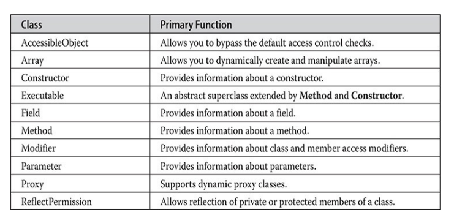

---
title: 'Regular Expressions and Other Packages'
weight: 11
--- 
#Regular Expressions and Other Packages

**********
When Java was originally released, it included a set of eight packages, called the _core API_. Each subsequent release added to the API. Today, the Java API contains a very large number of packages. Many of the packages support areas of specialization that are beyond the scope of this book. However, several packages warrant an examination here. Four are **java.util.regex**, **java.lang.reflect**, **java.rmi**, and **java.text**. They support regular expression processing, reflection, Remote Method Invocation (RMI), and text formatting, respectively. The chapter ends by introducing the date and time API in **java.time** and its subpackages.

The _regular expression_ package lets you perform sophisticated pattern matching operations. This chapter provides an introduction to this package along with extensive examples. Reflection is the ability of software to analyze itself. It is an essential part of the Java Beans technology that is covered in Chapter 37. _Remote Method Invocation (RMI)_ allows you to build Java applications that are distributed among several machines. This chapter provides a simple client/server example that uses RMI. The _text formatting_ capabilities of **java.text** have many uses. The one examined here formats date and time strings. The date and time API supplies an up-to-date approach to handling date and time.

## Regular Expression Processing

 The **java.util.regex** package supports regular expression processing. Beginning with JDK 9, **java.util.regex** is in the **java.base** module. As the term is used here, a _regular expression_ is a string of characters that describes a character sequence. This general description, called a pattern, can then be used to find matches in other character sequences. Regular expressions can specify wildcard characters, sets of characters, and various quantifiers. Thus, you can specify a regular expression that represents a general form that can match several different specific character sequences.  

There are two classes that support regular expression processing: **Pattern** and **Matcher**. These classes work together. Use **Pattern** to define a regular expression. Match the pattern against another sequence using **Matcher**.

### Pattern

 The **Pattern** class defines no constructors. Instead, a pattern is created by calling the **compile()** factory method. One of its forms is shown here:

static Pattern compile(String pattern)

Here, pattern is the regular expression that you want to use. The **compile()** method transforms the string in pattern into a pattern that can be used for pattern matching by the **Matcher** class. It returns a **Pattern** object that contains the pattern.

Once you have created a **Pattern** object, you will use it to create a **Matcher**. This is done by calling the **matcher()** method defined by **Pattern**. It is shown here:

Matcher matcher(CharSequence str)

Here str is the character sequence that the pattern will be matched against. This is called the _input sequence_. **CharSequence** is an interface that defines a read- only set of characters. It is implemented by the **String** class, among others. Thus, you can pass a string to **matcher()**.

### Matcher

 The **Matcher** class has no constructors. Instead, you create a **Matcher** by calling the **matcher()** factory method defined by **Pattern**, as just explained. Once you have created a **Matcher**, you will use its methods to perform various pattern matching operations. Several are described here.

The simplest pattern matching method is **matches()**, which determines whether the character sequence matches the pattern. It is shown here:

boolean matches()

It returns **true** if the sequence and the pattern match, and **false** otherwise. Understand that the entire sequence must match the pattern, not just a subsequence of it.  

To determine if a subsequence of the input sequence matches the pattern, use **find()**. One version is shown here:

boolean find()

It returns **true** if there is a matching subsequence and **false** otherwise. This method can be called repeatedly, allowing it to find all matching subsequences. Each call to **find()** begins where the previous one left off.

You can obtain a string containing the last matching sequence by calling **group()**. One of its forms is shown here:

String group()

The matching string is returned. If no match exists, then an **IllegalStateException** is thrown.

You can obtain the index within the input sequence of the current match by calling **start()**. The index one past the end of the current match is obtained by calling **end()**. The forms used in this chapter are shown here:

int start() int end()

Both throw **IllegalStateException** if no match exists. You can replace all occurrences of a matching sequence with another

sequence by calling **replaceAll()**. One version is shown here:

String replaceAll(String newStr)

Here, newStr specifies the new character sequence that will replace the ones that match the pattern. The updated input sequence is returned as a string.

### Regular Expression Syntax

 Before demonstrating **Pattern** and **Matcher**, it is necessary to explain how to construct a regular expression. Although no rule is complicated by itself, there are a large number of them, and a complete discussion is beyond the scope of this chapter. However, a few of the more commonly used constructs are described here.

In general, a regular expression is comprised of normal characters, character classes (sets of characters), wildcard characters, and quantifiers. A normal  

character is matched as-is. Thus, if a pattern consists of "xy", then the only input sequence that will match it is "xy". Characters such as newline and tab are specified using the standard escape sequences, which begin with a **\** . For example, a newline is specified by **\\n**. In the language of regular expressions, a normal character is also called a literal.

A character class is a set of characters. A character class is specified by putting the characters in the class between brackets. For example, the class [wxyz] matches w, x, y, or z. To specify an inverted set, precede the characters with a **^**. For example, [^wxyz] matches any character except w, x, y, or z. You can specify a range of characters using a hyphen. For example, to specify a character class that will match the digits 1 through 9, use [1-9].

The wildcard character is the **.** (dot) and it matches any character. Thus, a pattern that consists of "." will match these (and other) input sequences: "A", "a", "x", and so on.

A quantifier determines how many times an expression is matched. The basic quantifiers are shown here:

For example, the pattern "x+" will match "x", "xx", and "xxx", among others. As you will see, variations are supported that affect how matching is performed.

One other point: In general, if you specify an invalid expression, a **PatternSyntaxException** will be thrown.

### Demonstrating Pattern Matching

 The best way to understand how regular expression pattern matching operates is to work through some examples. The first, shown here, looks for a match with a literal pattern:  
```java
// A simple pattern matching demo. import java.util.regex.*;
class RegExpr {
public static void main(String args[]) {
Pattern pat;
Matcher mat;
boolean found;
pat Pattern.compile("Java");
mat = pat.matcher ("Java");
found mat.matches(); // check for a match
System.out.println("Testing Java against Java."); if (found) System.out.println("Matches"); else System.out.println("No Match");
System.out.println();
System.out.println("Testing Java against Java SE."); mat = pat.matcher ("Java SE"); // create a new matcher
found mat.matches(); // check for a match
if (found) System.out.println("Matches"); else System.out.println("No Match");
}
}
```
The output from the program is shown here:

Testing Java against Java.

Matches

Testing Java against Java SE.

No Match

Let’s look closely at this program. The program begins by creating the pattern that contains the sequence "Java". Next, a **Matcher** is created for that pattern that has the input sequence "Java". Then, the **matches()** method is called to determine if the input sequence matches the pattern. Because the sequence and the pattern are the same, **matches()** returns **true**. Next, a new **Matcher** is created with the input sequence "Java SE" and **matches()** is called again. In  

this case, the pattern and the input sequence differ, and no match is found. Remember, the **matches()** function returns **true** only when the input sequence precisely matches the pattern. It will not return **true** just because a subsequence matches.

You can use **find()** to determine if the input sequence contains a subsequence that matches the pattern. Consider the following program:
```java
// Use find() to find a subsequence. import java.util.regex.*;
class RegExpr2 {
public static void main(String args[]) { Pattern pat = Pattern.compile("Java"); Matcher mat = pat.matcher ("Java SE");
System.out.println("Looking for Java in Java SE.");
if (mat.find()) System.out.println("subsequence found"); else System.out.println("No Match");
}
}
```
The output is shown here:

Looking for Java in Java SE.

subsequence found

In this case, **find()** finds the subsequence "Java". The **find()** method can be used to search the input sequence for repeated

occurrences of the pattern because each call to **find()** picks up where the previous one left off. For example, the following program finds two occurrences of the pattern "test":  
```java
// Use find() to find multiple subsequences. import java.util.regex.*;
class RegExpr3 {
public static void main(String args[]) {
Pattern pat Pattern.compile("test"); Matcher mat = pat.matcher ("test 1 2 3 test");
while (mat.find()) {
System.out.println("test found at index " + mat.start());
}
}
}
```
The output is shown here:

test found at index 0

test found at index 11

As the output shows, two matches were found. The program uses the **start()** method to obtain the index of each match.

**Using Wildcards and Quantifiers**Although the preceding programs show the general technique for using **Pattern** and **Matcher**, they don’t show their power. The real benefit of regular expression processing is not seen until wildcards and quantifiers are used. To begin, consider the following example that uses the + quantifier to match any arbitrarily long sequence of Ws:  
```java
// Use a quantifier. import java.util.regex.*;
class RegExpr4 {
public static void main(String args[]) { Pattern pat = Pattern.compile("W+");
Matcher mat = pat.matcher ("W WW WWW"); while (mat.find())
System.out.println("Match: " + mat.g
}
}
```
The output from the program is shown here:

Match: W

Match: WW

Match: WWW

As the output shows, the regular expression pattern "W+" matches any arbitrarily long sequence of Ws.

The next program uses a wildcard to create a pattern that will match any sequence that begins with e and ends with d. To do this, it uses the dot wildcard character along with the **+** quantifier.
```java
// Use wildcard and quantifier. import java.util.regex.*;
class RegExpr5 {
public static void main(String args[]) {
Pattern pat = Pattern.compile("e.+d");
Matcher mat = pat.matcher ("extend cup end table");
while (mat.find())
System.out.println("Match: " +mat.group());
}
}
```
You might be surprised by the output produced by the program, which is shown here:

Match: extend cup end

Only one match is found, and it is the longest sequence that begins with e and ends with d. You might have expected two matches: "extend" and "end". The reason that the longer sequence is found is that the pattern "e.+d" matches the longest sequence that fits the pattern. This is called _greedy behavior_. You can specify _reluctant behavior_ by adding the **?** to the pattern, as shown in this version of the program. It causes the shortest matching pattern to be obtained.  
```java
// Use a reluctant quantifier. import java.util.regex.*;
class RegExpr6 {
public static void main(String args[]) { // Use reluctant matching behavior.
Pattern pat = Pattern.compile("e.+?d");
Matcher mat = pat.matcher ("extend cup end table"); while (mat.find())
System.out.println("Match: " + mat.group());
}
}
```
The output from the program is shown here:

Match: extend

Match: end

As the output shows, the pattern "e.+?d" will match the shortest sequence that begins with e and ends with d. Thus, two matches are found.

In general, to convert a greedy quantifier into a reluctant quantifier, add a **?**. You can also specify possessive behavior by appending a **+**. For example, you might want to try the pattern **"e.?+d"** and observe the result. You can also specify a number of times to match by using **{min,** **limit}**, which matches min times, up to limit times. Also supported are **{min}** and **{min,}** which match min times, and min times but possibly more, respectively.

## Working with Classes of Characters

 Sometimes you will want to match any sequence that contains one or more characters, in any order, that are part of a set of characters. For example, to match whole words, you want to match any sequence of the letters of the alphabet. One of the easiest ways to do this is to use a character class, which defines a set of characters. Recall that a character class is created by putting the characters you want to match between brackets. For example, to match the lowercase characters a through z, use **[a-z]**. The following program demonstrates this technique:  
```java
// Use a character class. import java.util.regex.*;
class RegExpr7 {
public static void main(String args[]) { // Match lowercase words.
Pattern pat = Pattern.compile("[a-z]+"); Matcher mat = pat.matcher ("this is a test.");
while (mat.find())
System.out.println("Match: " +mat.group());
}
}
```
The output is shown here:

Match: this

Match: is

Match: a

Match: test

##Using replaceAll()
The **replaceAll()** method supplied by **Matcher** lets you perform powerful search and replace operations that use regular expressions. For example, the following program replaces all occurrences of sequences that begin with "Jon" with "Eric":  
```java
// Use replaceAll(). import java.util.regex.*;
class RegExpr8 {
public static void main(String args[]) { String str = "Jon Jonathan Frank Ken Todd";
Pattern pat = Pattern.compile("Jon. *? "); Matcher mat = pat.matcher (str);
System.out.println("Original sequence: " + str);
str = mat.replaceAll("Eric ");
System.out.println("Modified sequence: + str);
}
}
```
The output is shown here:

Original sequence: Jon Jonathan Frank Ken Todd

Modified sequence: Eric Eric Frank Ken Todd

Because the regular expression "Jon.*? " matches any string that begins with Jon followed by zero or more characters, ending in a space, it can be used to match and replace both Jon and Jonathan with the name Eric. Such a substitution is not easily accomplished without pattern matching capabilities.

## Using split()
 You can reduce an input sequence into its individual tokens by using the **split()** method defined by **Pattern**. One form of the **split()** method is shown here:

String[ ] split(CharSequence str)

It processes the input sequence passed in str, reducing it into tokens based on the delimiters specified by the pattern.

For example, the following program finds tokens that are separated by spaces, commas, periods, and exclamation points:  
```java
// Use split(). import java.util.regex.*;
class RegExpr9 {
public static void main(String args[]) {
// Match lowercase words.
Pattern pat = Pattern.compile("[\, . !] ");
String strs[] = pat.split("one two, alpha9 12! done.");
for (int i=0; i < strs.length; i++) System.out.println("Next token: " + strs[i]);
}
}
```
The output is shown here:

Next token: one

Next token: two

Next token: alpha9

Next token: 12

Next token: done

As the output shows, the input sequence is reduced to its individual tokens. Notice that the delimiters are not included.

## Two Pattern-Matching Options
Although the pattern-matching techniques described in the foregoing offer the greatest flexibility and power, there are two alternatives which you might find useful in some circumstances. If you only need to perform a one-time pattern match, you can use the **matches()** method defined by **Pattern**. It is shown here:

static boolean matches(String pattern, CharSequence str)

It returns **true** if pattern matches str and **false** otherwise. This method automatically compiles pattern and then looks for a match. If you will be using the same pattern repeatedly, then using **matches()** is less efficient than compiling the pattern and using the pattern-matching methods defined by **Matcher**, as described previously.  

You can also perform a pattern match by using the **matches()** method implemented by **String**. It is shown here:

boolean matches(String pattern)

If the invoking string matches the regular expression in pattern, then **matches()** returns **true**. Otherwise, it returns **false**.

### Exploring Regular Expressions

 The overview of regular expressions presented in this section only hints at their power. Since text parsing, manipulation, and tokenization are a large part of programming, you will likely find Java’s regular expression subsystem a powerful tool that you can use to your advantage. It is, therefore, wise to explore the capabilities of regular expressions. Experiment with several different types of patterns and input sequences. Once you understand how regular expression pattern matching works, you will find it useful in many of your programming endeavors.

## Reflection

 Reflection is the ability of software to analyze itself. This is provided by the **java.lang.reflect** package and elements in **Class**. Beginning with JDK 9, **java.lang.reflect** is part of the **java.base** module. Reflection is an important capability, especially when using components called Java Beans. It allows you to analyze a software component and describe its capabilities dynamically, at run time rather than at compile time. For example, by using reflection, you can determine what methods, constructors, and fields a class supports. Reflection was introduced in Chapter 12. It is examined further here.

The package **java.lang.reflect** includes several interfaces. Of special interest is **Member**, which defines methods that allow you to get information about a field, constructor, or method of a class. There are also ten classes in this package. These are listed in Table 30-1.  

**Table 30-1** Classes Defined in **java.lang.reflect**

The following application illustrates a simple use of the Java reflection capabilities. It prints the constructors, fields, and methods of the class **java.awt.Dimension**. The program begins by using the **forName()** method of **Class** to get a class object for **java.awt.Dimension**. Once this is obtained, **getConstructors()**, **getFields()**, and **getMethods()** are used to analyze this class object. They return arrays of **Constructor**, **Field**, and **Method** objects that provide the information about the object. The **Constructor**, **Field**, and **Method** classes define several methods that can be used to obtain information about an object. You will want to explore these on your own. However, each supports the **toString()** method. Therefore, using **Constructor**, **Field**, and **Method** objects as arguments to the **println()** method is straightforward, as shown in the program.  
```java
import java.lang.reflect.*; public class ReflectionDemo1 {
// Demonstrate reflection. public static void main(String args[]) { try {
Class<?> c = Class.forName ("java.awt. Dimension"); System.out.println("Constructors: ");
Constructor<?> constructors [] = c.getConstructors(); for (int i = 0; i < constructors.length; i++) { System.out.println(" "+constructors [i]); }
System.out.println("Fields: "); Field fields[] = c.getFields(); for (int i = 0; i < fields.length; i++) { System.out.println(" "+ fields [i]); }
System.out.println("Methods: ");
Method methods [] = c.getMethods(); for (int i = 0; i < methods.length; i++) { System.out.println(" "+ methods[i]); }
} catch (Exception e) { System.out.println("Exception: " + e);
}
}
}
```
Here is the output from this program. (The output you see when you run the program may differ slightly from that shown.)  
```java
Constructors:
public java.awt. Dimension (int, int)
public java.awt.Dimension() public java.awt. Dimension (java.awt.Dimension) Fields:
public int java.awt.Dimension.width
public int java.awt. Dimension.height Methods:
public int java.awt.Dimension. hashCode()
public boolean java.awt.Dimension.equals(java.lang.Object)
public java.lang.String java.awt.Dimension.toString() public java.awt.Dimension java.awt.Dimension.getSize()
public void java.awt.Dimension.setSize (double, double) public void java.awt.Dimension.setSize(java.awt.Dimension
public void java.awt. Dimension.setSize(int, int)
public double java.awt.Dimension.getHeight()
public double java.awt.Dimension.getWidth()
public java.lang.Object java.awt.geom. Dimension2D.clone()
public void java.awt.geom.
Dimension2D.setSize(java.awt.geom. Dimension2D) public final native java.lang.Class java.lang.Object.getClass() public final native void java.lang.Object.wait (long)
throws java.lang. InterruptedException
public final void java.lang.Object.wait()
throws java.lang. InterruptedException
public final void java.lang.Object.wait (long, int)
throws java.lang.InterruptedException public final native void java.lang.Object.notify() public final native void java.lang.Object.notifyAll()
)
```
The next example uses Java’s reflection capabilities to obtain the public methods of a class. The program begins by instantiating class **A**. The **getClass()** method is applied to this object reference, and it returns the **Class** object for class **A**. The **getDeclaredMethods()** method returns an array of **Method** objects that describe only the methods declared by this class. Methods inherited from superclasses such as **Object** are not included.

Each element of the **methods** array is then processed. The **getModifiers()** method returns an **int** containing flags that describe which modifiers apply for this element. The **Modifier** class provides a set of **isX** methods, shown in Table 30-2, that can be used to examine this value. For example, the static method **isPublic()** returns **true** if its argument includes the **public** modifier. Otherwise, it returns **false**. In the following program, if the method supports  

public access, its name is obtained by the **getName()** method and is then printed.

**Table 30-2** The “is” Methods Defined by **Modifier** That Determine Modifiers  
```java
// Show public methods. import java.lang.reflect.*; public class ReflectionDemo2 { public static void main(String args[]) {
try {
A a new A();
Class<?> c = a.getClass(); System.out.println("Public Methods: ");
Method methods [] c.getDeclaredMethods();
for (int i = 0; i < methods.length; i++) {
int modifiers methods [i].getModifiers (); if (Modifier.isPublic (modifiers)) {
System.out.println(" "+ methods[i].getName());
}
}
}
catch (Exception e) { 
System.out.println("Exception: " + e);
}
}
}
class A {
public void al() {
public void a2() {
} protected void a3() {
} private void a4 () {
}
}
```
Here is the output from this program:

Public Methods:

a1

a2

**Modifier**also includes a set of static methods that return the type of modifiers that can be applied to a specific type of program element. These methods are

static int classModifiers()  

static int classModifiers()

static int constructorModifiers()

static int fieldModifiers()

static int interfaceModifiers()

static int methodModifiers()

static int parameterModifiers()

For example, **methodModifiers()** returns the modifiers that can be applied to a method. Each method returns flags, packed into an **int**, that indicate which modifiers are legal. The modifier values are defined by constants in **Modifier**, which include **PROTECTED**, **PUBLIC**, **PRIVATE**, **STATIC**, **FINAL**, and so on.

## Remote Method Invocation (RMI)

Remote Method Invocation (RMI) allows a Java object that executes on one machine to invoke a method of a Java object that executes on another machine. This is an important feature, because it allows you to build distributed applications. While a complete discussion of RMI is outside the scope of this book, the following simplified example describes the basic principles involved. RMI is supported by the **java.rmi** package. Beginning with JDK 9, it is part of the **java.rmi** module.

**A Simple Client/Server Application Using RMI** This section provides step-by-step directions for building a simple client/server application by using RMI. The server receives a request from a client, processes it, and returns a result. In this example, the request specifies two numbers. The server adds these together and returns the sum.

**Step One: Enter and Compile the Source Code** This application uses four source files. The first file, **AddServerIntf.java**, defines the remote interface that is provided by the server. It contains one method that accepts two **double** arguments and returns their sum. All remote  

interfaces must extend the **Remote** interface, which is part of **java.rmi**. **Remote** defines no members. Its purpose is simply to indicate that an interface uses remote methods. All remote methods can throw a **RemoteException**.
```java
import java.rmi.*;
public interface AddServerIntf extends Remote { double add (double dl, double d2) throws RemoteException; }
```
The second source file, **AddServerImpl.java**, implements the remote interface. The implementation of the **add()** method is straightforward. Remote objects typically extend **UnicastRemoteObject**, which provides functionality that is needed to make objects available from remote machines.
```java
import java.rmi.*;
import java.rmi.server.*;
public class AddServerImpl extends Unicast RemoteObject implements AddServerIntf {
public AddServerImpl() throws RemoteException { }
public double add (double d1, double d2) throws RemoteException { return d1 + d2; }
}
```
The third source file, **AddServer.java**, contains the main program for the server machine. Its primary function is to update the RMI registry on that machine. This is done by using the **rebind()** method of the **Naming** class (found in **java.rmi**). That method associates a name with an object reference. The first argument to the **rebind()** method is a string that names the server as "AddServer". Its second argument is a reference to an instance of **AddServerImpl**.  
```java
import java.net.*; import java.rmi.*;
public class AddServer { public static void main(String args[]) {
try {
AddServerImpl addServerImpl = new AddServerImpl(); Naming.rebind ("AddServer", addServerImpl); }
catch (Exception e) {
System.out.println("Exception: " + e);
}
}
```
The fourth source file, **AddClient.java**, implements the client side of this distributed application. **AddClient.java** requires three command-line arguments. The first is the IP address or name of the server machine. The second and third arguments are the two numbers that are to be summed.

The application begins by forming a string that follows the URL syntax. This URL uses the **rmi** protocol. The string includes the IP address or name of the server and the string "AddServer". The program then invokes the **lookup()** method of the **Naming** class. This method accepts one argument, the **rmi** URL, and returns a reference to an object of type **AddServerIntf**. All remote method invocations can then be directed to this object.

The program continues by displaying its arguments and then invokes the remote **add()** method. The sum is returned from this method and is then printed.  
```java
import java.rmi.*;
public class AddClient {
public static void main(String args[]) {
try {
String addServerURL = "rmi://" + args[0] + "/AddServer";
AddServerIntf addServerIntf =
(AddServerIntf) Naming.lookup (addServerURL); System.out.println("The first number is: " + args[1]); double d1 = Double.valueOf (args [1]).doubleValue(); System.out.println("The second number is: " + args [2]);
double d2 = Double.valueOf(args [2]). doubleValue(); System.out.println("The sum is: " + addServerIntf.add(d1, d2));
} catch (Exception e) {
System.out.println("Exception: " + e);
}
}
}
```
After you enter all the code, use **javac** to compile the four source files that you created.

**Step Two: Manually Generate a Stub if Required** In the context of RMI, a stub is a Java object that resides on the client machine. Its function is to present the same interfaces as the remote server. Remote method calls initiated by the client are actually directed to the stub. The stub works with the other parts of the RMI system to formulate a request that is sent to the remote machine.

A remote method may accept arguments that are simple types or objects. In the latter case, the object may have references to other objects. All of this information must be sent to the remote machine. That is, an object passed as an argument to a remote method call must be serialized and sent to the remote machine. Recall from Chapter 21 that the serialization facilities also recursively process all referenced objects.

If a response must be returned to the client, the process works in reverse. Note that the serialization and deserialization facilities are also used if objects are returned to a client.

Prior to Java 5, stubs needed to be built manually by using **rmic**. This step **is**  

** not required** for modern versions of Java. However, if you are working in a very old legacy environment, then you can use the **rmic** compiler, as shown here, to build a stub:

rmic AddServerImpl

This command generates the file **AddServerImpl_Stub.class**. When using **rmic**, be sure that **CLASSPATH** is set to include the current directory.

**Step Three: Install Files on the Client and Server Machines** Copy **AddClient.class**, **AddServerImpl_Stub.class** (if needed), and **AddServerIntf.class** to a directory on the client machine. Copy **AddServerIntf.class**, **AddServerImpl.class**, **AddServerImpl_Stub.class** (if needed), and **AddServer.class** to a directory on the server machine.

**NOTE** RMI has techniques for dynamic class loading, but they are not used by the example at hand. Instead, all of the files that are used by the client and server applications must be installed manually on those machines.

**Step Four: Start the RMI Registry on the Server Machine** The JDK provides a program called **rmiregistry**, which executes on the server machine. It maps names to object references. First, check that the **CLASSPATH** environment variable includes the directory in which your files are located. Then, start the RMI Registry from the command line, as shown here:

start rmiregistry

When this command returns, you should see that a new window has been created. You need to leave this window open until you are done experimenting with the RMI example.

**Step Five: Start the Server** The server code is started from the command line, as shown here:

java AddServer  

java AddServer

Recall that the **AddServer** code instantiates **AddServerImpl** and registers that object with the name "AddServer".

**Step Six: Start the Client** The **AddClient** software requires three arguments: the name or IP address of the server machine and the two numbers that are to be summed together. You may invoke it from the command line by using one of the two formats shown here:

java AddClient server1 8 9 java AddClient 11.12.13.14 8 9

In the first line, the name of the server is provided. The second line uses its IP address (11.12.13.14).

You can try this example without actually having a remote server. To do so, simply install all of the programs on the same machine, start **rmiregistry**, start **AddServer**, and then execute **AddClient** using this command line:

java AddClient 127.0.0.1 8 9

Here, the address 127.0.0.1 is the “loop back” address for the local machine. Using this address allows you to exercise the entire RMI mechanism without actually having to install the server on a remote computer. (If you are using a firewall, then this approach may not work.)

In either case, sample output from this program is shown here:

The first number is: 8

The second number is: 9

The sum is: 17.0

**NOTE**When working with RMI in the real world, it may be necessary for the server to install a security manager.

## Formatting Date and Time with java.text

The package **java.text** allows you to format, parse, search, and manipulate text. Beginning with JDK 9, **java.text** is part of the **java.base** module. This section  

examines two of **java.text**'s most commonly used classes: those that format date and time information. However, it is important to state at the outset that the new date and time API described later in this chapter offers a modern approach to handling date and time that also supports formatting. Of course, legacy code will continue to use the classes shown here for some time.

## DateFormat Class

DateFormat is an abstract class that provides the ability to format and parse dates and times. The **getDateInstance()** method returns an instance of **DateFormat** that can format date information. It is available in these forms:

static final DateFormat getDateInstance() static final DateFormat getDateInstance(int style) static final DateFormat getDateInstance(int style, Locale locale)

Here, style is one of the following values: **DEFAULT**, **SHORT**, **MEDIUM**, **LONG**, or **FULL**. These are **int** constants defined by **DateFormat**. They cause different details about the date to be presented. The parameter locale specifies the locale (refer to Chapter 20 for details on **Locale**). If the style and/or locale is not specified, defaults are used.

One of the most commonly used methods in this class is **format()**. It has several overloaded forms, one of which is shown here:

final String format(Date d)

The argument is a **Date** object that is to be displayed. The method returns a string containing the formatted information.

The following listing illustrates how to format date information. It begins by creating a **Date** object. This captures the current date and time information. Then it outputs the date information by using different styles and locales.  

Sample output from this program is shown here:

Japan: 2018/06/20

Korea: 2018. 6. 20.

United Kingdom: 20 June 2018

United States: Wednesday, June 20, 2018

The **getTimeInstance()** method returns an instance of **DateFormat** that can format time information. It is available in these versions:

static final DateFormat getTimeInstance() static final DateFormat getTimeInstance(int style) static final DateFormat getTimeInstance(int style, Locale locale)

Here, style is one of the following values: **DEFAULT**, **SHORT**, **MEDIUM**, **LONG**, or **FULL**. These are **int** constants defined by **DateFormat**. They cause different details about the time to be presented. The parameter locale specifies the locale. If the style and/or locale is not specified, defaults are used.

The following listing illustrates how to format time information. It begins by creating a **Date** object. This captures the current date and time information. Then it outputs the time information by using different styles and locales.

```java
// Demonstrate time formats.
import java.text.*;
import java.util.*;
public class Time FormatDemo {
    public static void main(String args[]) {
        Date date = new Date();
        DateFormat df;
df = DateFormat.getTimeInstance (DateFormat. SHORT, Locale.JAPAN);
System.out.println("Japan: " + df. format (date));
df = DateFormat.getTime Instance (DateFormat. LONG, Locale.UK); 
System.out.println("United Kingdom: " + df. format (date));
df = DateFormat.getTimeInstance (DateFormat.FULL, Locale.CANADA);
System.out.println("Canada: " + df. format (date));
}
}
```

Sample output from this program is shown here:

Japan: 13:03

United Kingdom: 13:03:31 GMT-06:00

Canada: 1:03:31 PM Central Daylight Time

The **DateFormat** class also has a **getDateTimeInstance()** method that can format both date and time information. You may wish to experiment with it on your own.

### SimpleDateFormat Class

**SimpleDateFormat** is a concrete subclass of DateFormat. It allows you to
define your own formatting patterns that are used to display date and time
information.
One of its constructors is shown here:
SimpleDateFormat(String formatString)
The argument formatString describes how date and time information is displayed. An example of its use is given here:

SimpleDateFormat sdf = SimpleDateFormat("dd MMM yyyy hh:mm:ss

zzz");

The symbols used in the formatting string determine the information that is displayed. Table 30-3 lists these symbols and gives a description of each.

**Table 30-3** Formatting String Symbols for **SimpleDateFormat**  

In most cases, the number of times a symbol is repeated determines how that data is presented. Text information is displayed in an abbreviated form if the pattern letter is repeated less than four times. Otherwise, the unabbreviated form is used. For example, a zzzz pattern can display Pacific Daylight Time, and a zzz pattern can display PDT.

For numbers, the number of times a pattern letter is repeated determines how many digits are presented. For example, hh:mm:ss can present 01:51:15, but h:m:s displays the same time value as 1:51:15.

Finally, M or MM causes the month to be displayed as one or two digits. However, three or more repetitions of M cause the month to be displayed as a text string.

The following program shows how this class is used:
```java
// Demonstrate SimpleDateFormat. import java.text.*;
import java.util.*;
public class SimpleDateFormat Demo { public static void main(String args[]) {
Date date = new Date();
SimpleDateFormat sdf;
sdf = new SimpleDateFormat ("hh:mm:ss");
System.out.println(sdf. format (date));
sdf = new SimpleDateFormat("dd MMM yyyy hh:mm:ss zzz");
System.out.println(sdf. format (date));
sdf = new SimpleDateFormat ("E MMM dd yyyy");
System.out.println(sdf. format (date)); }
}
```
Sample output from this program is shown here:

01:30:51

20 Jun 2018 01:30:51 CDT

Wed Jun 20 2018

## The java.time Time and Date API

In Chapter 20, Java’s long-standing approach to handling date and time through the use of classes such as **Calendar** and **GregorianCalendar** was discussed. It  

is expected that this traditional approach will remain in widespread use for some time and is, therefore, something that all Java programmers need to be familiar with. However, beginning with JDK 8, Java includes another approach to handling time and date. This new approach is defined in the following packages:

These packages define a large number of classes, interfaces, and enumerations that provide extensive, finely grained support for time and date operations. Because of the number of elements that comprise the new time and date API, it can seem fairly intimidating at first. However, it is well organized and logically structured. Its size reflects the detail of control and flexibility that it provides. Although it is far beyond the scope of this book to examine each element in this extensive API, we will look at several of its main classes. As you will see, these classes are sufficient for many uses. Beginning with JDK 9, these packages are in the **java.base** module.

## Time and Date Fundamentals

 In **java.time** are defined several top-level classes that give you easy access to the time and date. Three of these are **LocalDate**, **LocalTime**, and **LocalDateTime**. They are value-based, and as their names suggest, they encapsulate the local date, time, and date and time. Using these classes, it is easy to obtain the current date and time, format the date and time, and compare dates and times, among other operations.

**LocalDate** encapsulates a date that uses the default Gregorian calendar as specified by ISO 8601. **LocalTime** encapsulates a time, as specified by ISO 8601. **LocalDateTime** encapsulates both date and time. These classes contain a large number of methods that give you access to the date and time components, allow you to compare dates and times, add or subtract date or time components, and so on. Because a common naming convention for methods is employed,  

once you know how to use one of these classes, the others are easy to master. **LocalDate**, **LocalTime**, and **LocalDateTime** do not define public

constructors. Rather, to obtain an instance, you will use a factory method. One very convenient method is **now()**, which is defined for all three classes. It returns the current date and/or time of the system. Each class defines several versions, but we will use its simplest form. Here is the version we will use as defined by **LocalDate**:

static LocalDate now()

The version for **LocalTime** is shown here:

static LocalTime now()

The version for **LocalDateTime** is shown here:

static LocalDateTime now()

As you can see, in each case, an appropriate object is returned. The object returned by **now()** can be displayed in its default, human-readable form by use of a **println()** statement, for example. However, it is also possible to take full control over the formatting of date and time.

The following program uses **LocalDate** and **LocalTime** to obtain the current date and time and then displays them. Notice how **now()** is called to retrieve the current date and time.
```java
// A simple example of Local Date and Local Time. import java.time.*;
class DateTimeDemo { public static void main(String args[]) {
LocalDate curDate = LocalDate.now(); System.out.println(curDate); LocalTime curTime Local Time.now(); System.out.println(curTime); }
}
}
```
Sample output is shown here:  

2018-06-20

17:31:15.274937600

The output reflects the default format that is given to the date and time. (The next section shows how to specify a different format.)

Because the preceding program displays both the current date and the current time, it could have been more easily written using the **LocalDateTime** class. In this approach, only a single instance needs to be created and only a single call to **now()** is required, as shown here:
```java
LocalDateTime curDateTime = LocalDateTime.now();

System.out.println(curDateTime);
```
Using this approach, the default output includes both date and time. Here is a sample:

2018-06-20T17:34:18.991974600

One other point: from a **LocalDateTime** instance, it is possible to obtain a reference to the date or time component by using the **toLocalDate()** and **toLocalTime()** methods, shown here:

LocalDate toLocalDate()

LocalTime toLocalTime()

Each returns a reference to the indicated element.

## Formatting Date and Time

 Although the default formats shown in the preceding examples will be adequate for some uses, often you will want to specify a different format. Fortunately, this is easy to do because **LocalDate**, **LocalTime**, and **LocalDateTime** all provide the **format()** method, shown here:

String format(DateTimeFormatter fmtr)

Here, fmtr specifies the instance of **DateTimeFormatter** that will provide the format.

## DateTimeFormatter

 is packaged in **java.time.format**. To obtain a **DateTimeFormatter** instance, you will typically use one of its factory  

methods. Three are shown here:

Of course, the type of **DateTimeFormatter** that you create will be based on the type of object it will be operating on. For example, if you want to format the date in a **LocalDate** instance, then use **ofLocalizedDate()**. The specific format is specified by the **FormatStyle** parameter.

**FormatStyle**is an enumeration that is packaged in **java.time.format**. It defines the following constants:

FULL

LONG

MEDIUM

SHORT

These specify the level of detail that will be displayed. (Thus, this form of **DateTimeFormatter** works similarly to **java.text.DateFormat**, described earlier in this chapter.)

Here is an example that uses **DateTimeFormatter** to display the current date and time:  
```java
import java.time.*;
// Demonstrate DateTimeFormatter. import java.time.format.*;
class DateTimeDemo2 {
public static void main(String args[]) {
LocalDate curDate LocalDate.now();
System.out.println(curDate.format( DateTimeFormatter. of LocalizedDate (FormatStyle. FULL)));
LocalTime curTime = LocalTime.now();
System.out.println(curTime.format(
DateTimeFormatter.ofLocalizedTime (FormatStyle.SHORT)));
}
}
```
Sample output is shown here:

Wednesday, June 20, 2018

2:16 PM

In some situations, you may want a format different from the ones you can specify by use of **FormatStyle**. One way to accomplish this is to use a predefined formatter, such as **ISO_DATE** or **ISO_TIME**, provided by **DateTimeFormatter**. Another way is to create a custom format by specifying a pattern. To do this, you can use the **ofPattern()** factory method of **DateTimeFormatter**. One version is shown here:

static DateTimeFormatter ofPattern(String fmtPattern)

Here, fmtPattern specifies a string that contains the date and time pattern that you want. It returns a **DateTimeFormatter** that will format according to that pattern. The default locale is used.

In general, a pattern consists of format specifiers, called _pattern letters_. A pattern letter will be replaced by the date or time component that it specifies. The full list of pattern letters is shown in the API documentation for **ofPattern()**. Here is a sampling. Note that the pattern letters are case-sensitive.  

In general, the precise output that you see will be determined by how many times a pattern letter is repeated. (Thus, **DateTimeFormatter** works a bit like **java.text.SimpleDateFormat**, described earlier in this chapter.) For example, assuming that the month is April, the patterns:

M MM MMM MMMM

produce the following formatted output:

4 04 Apr April

Frankly, experimentation is the best way to understand what each pattern letter does and how various repetitions affect the output.

When you want to output a pattern letter as text, enclose the text between single quotation marks. In general, it is a good idea to enclose all non-pattern characters within single quotation marks to avoid problems if the set of pattern letters changes in subsequent versions of Java.

The following program demonstrates the use of a date and time pattern:  

Sample output is shown here:

June 20, 2018 2:22 PM

One other point about creating custom date and time output: **LocalDate**, **LocalTime**, and **LocalDateTime** define methods that let you obtain various date and time components. For example, **getHour()** returns the hour as an **int**; **getMonth()** returns the month in the form of a **Month** enumeration value; and **getYear()** returns the year as an **int**. Using these, and other methods, you can manually construct output. You can also use these values for other purposes, such as when creating specialized timers.

### Parsing Date and Time Strings LocalDate

, **LocalTime**, and **LocalDateTime** provide the ability to parse date and/or time strings. To do this, call **parse()** on an instance of one of those classes. It has two forms. The first uses the default formatter that parses the date and/or time formatted in the standard ISO fashion, such as 03:31 for time and 2020-08-02 for date. The form of this version of **parse()** for **LocalDateTime** is shown here. (Its form for the other classes is similar except for the type of object returned.)

static LocalDateTime parse(CharSequence dateTimeStr)

Here, dateTimeStr is a string that contains the date and time in the proper format. If the format is invalid, an exception will be thrown.

If you want to parse a date and/or time string that is in a format other than ISO format, you can use a second form of **parse()** that lets you specify your  

own formatter. The version specified by **LocalDateTime** is shown next. (The other classes provide a similar form except for the return type.)

Here, dateTimeFmtr specifies the formatter that you want to use. Here is a simple example that parses a date and time string by use of a

custom formatter:
```java
// Parse a date and time. import java.time.*; import java.time. format.*;
class DateTimeDemo4 { public static void main(String args[]) {
// Obtain a LocalDateTime object by parsing a date and time string. LocalDateTime curDateTime =
LocalDateTime.parse("June 21, 2018 12:01 AM",
DateTimeFormatter. of Pattern ("MMMM d, yyyy hh': 'mm a"));
// Now, display the parsed date and time.
System.out.println(curDateTime.format( DateTimeFormatter. of Pattern ("MMMM d', yyyy h': 'mm a"))); }
}
```
Sample output is shown here:

June 21, 2018 12:01 AM

### Other Things to Explore in java.time 
Although you will want to explore all of the date and time packages, a good place to start is with **java.time**. It contains a great deal of functionality that you may find useful. Begin by examining the methods defined by **LocalDate**, **LocalTime**, and **LocalDateTime**. Each has methods that let you add or subtract dates and/or times, adjust dates and/or times by a given component, compare dates and/or times, and create instances based on date and/or time components, among others. Other classes in **java.time** that you may find of particular interest include **Instant**, **Duration**, and **Period**. **Instant** encapsulates an instant  

in time. **Duration** encapsulates a length of time. **Period** encapsulates a length of date.