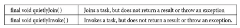

---
title: 'The Concurrency Utilities'
weight: 9
--- 


# CHAPTER 28 The Concurrency Utilities

  

****

From the start, Java has provided built-in support for multithreading and synchronization. For example, new threads can be created by implementing **Runnable** or by extending **Thread**; synchronization is available by use of the **synchronized** keyword; and interthread communication is supported by the **wait()** and **notify()** methods that are defined by **Object**. In general, this built- in support for multithreading was one of Java’s most important innovations and is still one of its major strengths.

However, as conceptually pure as Java’s original support for multithreading is, it is not ideal for all applications—especially those that make intensive use of multiple threads. For example, the original multithreading support does not provide several high-level features, such as semaphores, thread pools, and execution managers, that facilitate the creation of intensively concurrent programs.

It is important to explain at the outset that many Java programs make use of multithreading and are, therefore, “concurrent.” However, as it is used in this chapter, the term _concurrent program_ refers to a program that makes _extensive, integral_ use of concurrently executing threads. An example of such a program is one that uses separate threads to simultaneously compute the partial results of a larger computation. Another example is a program that coordinates the activities of several threads, each of which seeks access to information in a database. In this case, read-only accesses might be handled differently from those that require read/write capabilities.

To begin to handle the needs of a concurrent program, JDK 5 added the _concurrency utilities,_ also commonly referred to as the _concurrent API._ The original set of concurrency utilities supplied many features that had long been wanted by programmers who develop concurrent applications. For example, it offered synchronizers (such as the semaphore), thread pools, execution managers, locks, several concurrent collections, and a streamlined way to use threads to obtain computational results.

Although the original concurrent API was impressive in its own right, it was significantly expanded by JDK 7. The most important addition was the _Fork/Join Framework._ The Fork/Join Framework facilitates the creation of  

programs that make use of multiple processors (such as those found in multicore systems). Thus, it streamlines the development of programs in which two or more pieces execute with true simultaneity (that is, true parallel execution), not just time-slicing. As you can easily imagine, parallel execution can dramatically increase the speed of certain operations. Because multicore systems are now commonplace, the inclusion of the Fork/Join Framework was as timely as it was powerful. With the release of JDK 8, the Fork/Join Framework was further enhanced.

Furthermore, both JDK 8 and JDK 9 have added features related to other parts of the concurrent API. Thus, the concurrent API continues to evolve and expand to meet the needs of the contemporary computing environment.

The original concurrent API was quite large, and the additions made over the years have increased its size substantially. As you might expect, many of the issues surrounding the concurrency utilities are quite complex. It is beyond the scope of this book to discuss all of its facets. The preceding notwithstanding, it is important for all programmers to have a general, working knowledge of key aspects of the concurrent API. Even in programs that are not intensively parallel, features such as synchronizers, callable threads, and executors, are applicable to a wide variety of situations. Perhaps most importantly, because of the rise of multicore computers, solutions involving the Fork/Join Framework are becoming more common. For these reasons, this chapter presents an overview of several core features defined by the concurrency utilities and shows a number of examples that demonstrate their use. It concludes with an introduction to the Fork/Join Framework.

## The Concurrent API Packages

 The concurrency utilities are contained in the **java.util.concurrent** package and in its two subpackages: **java.util.concurrent.atomic** and **java.util.concurrent.locks**. Beginning with JDK 9, all are in the **java.base** module. A brief overview of their contents is given here.

### java.util.concurrent 

**java.util.concurrent** defines the core features that support alternatives to the built-in approaches to synchronization and interthread communication. These include  

- Synchronizers
- Executors
- Concurrent collections
- The Fork/Join Framework

Synchronizers offer high-level ways of synchronizing the interactions between multiple threads. The synchronizer classes defined by **java.util.concurrent** are

Notice that each synchronizer provides a solution to a specific type of synchronization problem. This enables each synchronizer to be optimized for its intended use. In the past, these types of synchronization objects had to be crafted by hand. The concurrent API standardizes them and makes them available to all Java programmers. 

Executors manage thread execution. At the top of the executor hierarchy is the **Executor** interface, which is used to initiate a thread. **ExecutorService** extends **Executor** and provides methods that manage execution. There are three implementations of **ExecutorService**: **ThreadPoolExecutor**, **ScheduledThreadPoolExecutor**, and **ForkJoinPool**. **java.util.concurrent** also defines the **Executors** utility class, which includes a number of static methods that simplify the creation of various executors.

Related to executors are the **Future** and **Callable** interfaces. A **Future** contains a value that is returned by a thread after it executes. Thus, its value becomes defined “in the future,” when the thread terminates. **Callable** defines a thread that returns a value.

**java.util.concurrent** defines several concurrent collection classes, including **ConcurrentHashMap**, **ConcurrentLinkedQueue**, and **CopyOnWriteArrayList**. These offer concurrent alternatives to their related classes defined by the Collections Framework.

The _Fork/Join Framework_ supports parallel programming. Its main classes are **ForkJoinTask**, **ForkJoinPool**, **RecursiveTask**, and **RecursiveAction**.  

To better handle thread timing, **java.util.concurrent** defines the **TimeUnit** enumeration.

Beginning with JDK 9, **java.util.concurrent** also includes a subsystem that offers a means by which the flow of data can be controlled. It is based on the **Flow** class and these nested interfaces: **Flow.Subscriber**, **Flow.Publisher**, **Flow.Processor**, and **Flow.Subscription**. Although a detailed discussion of the **Flow** subsystem is outside the focus of this chapter, here is a brief description. **Flow** and its nested interfaces support the _reactive streams_ specification. This specification defines a means by which a consumer of data can prevent the producer of the data from overrunning the consumer’s ability to process the data. In this approach, data is produced by a publisher and consumed by a subscriber. Control is achieved by implementing a form of _back pressure_.

### java.util.concurrent.atomic 

**java.util.concurrent.atomic** facilitates the use of variables in a concurrent environment. It provides a means of efficiently updating the value of a variable without the use of locks. This is accomplished through the use of classes, such as **AtomicInteger** and **AtomicLong**, and methods, such as **compareAndSet()**, **decrementAndGet()**, and **getAndSet()**. These methods execute as a single, non-interruptible operation.

### java.util.concurrent.locks 

**java.util.concurrent.locks** provides an alternative to the use of synchronized methods. At the core of this alternative is the **Lock** interface, which defines the basic mechanism used to acquire and relinquish access to an object. The key methods are **lock()**, **tryLock()**, and **unlock()**. The advantage to using these methods is greater control over synchronization.

The remainder of this chapter takes a closer look at the constituents of the concurrent API.

## Using Synchronization Objects

 Synchronization objects are supported by the **Semaphore**, **CountDownLatch**, **CyclicBarrier**, **Exchanger**, and **Phaser** classes. Collectively, they enable you to handle several formerly difficult synchronization situations with ease. They are also applicable to a wide range of programs—even those that contain only limited concurrency. Because the synchronization objects will be of interest to nearly all Java programs, each is examined here in some detail.

### Semaphore

The synchronization object that many readers will immediately recognize is **Semaphore**, which implements a classic semaphore. A semaphore controls access to a shared resource through the use of a counter. If the counter is greater than zero, then access is allowed. If it is zero, then access is denied. What the counter is counting are permits that allow access to the shared resource. Thus, to access the resource, a thread must be granted a permit from the semaphore.

In general, to use a semaphore, the thread that wants access to the shared resource tries to acquire a permit. If the semaphore’s count is greater than zero, then the thread acquires a permit, which causes the semaphore’s count to be decremented. Otherwise, the thread will be blocked until a permit can be acquired. When the thread no longer needs access to the shared resource, it releases the permit, which causes the semaphore’s count to be incremented. If there is another thread waiting for a permit, then that thread will acquire a permit at that time. Java’s **Semaphore** class implements this mechanism.

Semaphore has the two constructors shown here:
```
Semaphore(int num)
Semaphore(int num, boolean how)
```
Here, num specifies the initial permit count. Thus, num specifies the number of threads that can access a shared resource at any one time. If num is one, then only one thread can access the resource at any one time. By default, waiting threads are granted a permit in an undefined order. By setting how to **true**, you can ensure that waiting threads are granted a permit in the order in which they requested access.

To acquire a permit, call the **acquire()** method, which has these two forms:

void acquire() throws InterruptedException void acquire(int num) throws InterruptedException

The first form acquires one permit. The second form acquires num permits. Most often, the first form is used. If the permit cannot be granted at the time of the call, then the invoking thread suspends until the permit is available.  

To release a permit, call **release()**, which has these two forms:
```
void release()

void release(int num)
```
The first form releases one permit. The second form releases the number of permits specified by _num._

To use a semaphore to control access to a resource, each thread that wants to use that resource must first call **acquire()** before accessing the resource. When the thread is done with the resource, it must call **release()**. Here is an example that illustrates the use of a semaphore: 
``` 
// A simple semaphore example.
import java.util.concurrent.*;
class SenDeno
{
 public static void main(String args[]) {         
    Semaphore sen new Senaphore (1)
    new Thread (new Inc Thread (sem, "A")).start(); 
    new Thread (new DecThread (am, "")).start();
}
}
// A shared resource. 
class Shared 
{
 static int count=0,
}
// A thread of execution that increments count. class IncThread implements Runnable 
{
 String name;
 Semaphore sem;
 
 IneThread (Semaphore s, String n) 
 {
    sem = s;
    name = n;
    }
 public void run() 
 {
   System.out.println("Starting name);
   try {
     // First, get a permit.
     System.out.println(name is waiting for a permit."); 
     System.out.println(name gets a permit.");
     sem.acquire()
    // Now, access shared resource.
    for (int i=0; i < 5; i++) 
    {
      Shared.count++; System.out.println(name+ Shared.count);
    }
    // Now, allow a context switch --if possible Thread.sleep(10)
}    } catch (InterruptedException ex) { System.out.println(exc)}
// Release the permit.
System.out.println(name releases the permit.");
sen.release()
}
// A thread of execution that decrements count. class DecThread implements Runnable { String name; Semaphore sem
DeeThread (Semaphores, String n) {
sen = 6;
name - ni
public void run() {
System.out.println("Starting name);
// First, get a permit.
System.out.println(name is waiting for a permit."); sem.acquire()
System.out.println(name + gets a permit.");
// Now, access shared resource.
  for (int i=0; i < 5; 1++) 
  { 
    Shared.count--
    System.out.println(name+" + Shared.count)
    // Now, allow a context switch -- if possible Thread.sleep(10); 
}
} catch (InterruptedException ex) 
  { 
    System.out.println(exc);
  }
// Release the permit.
System.out.println(name+" releases the permit.");
sen.release();
  }
} 
```
The output from the program is shown here. (The precise order in which the threads execute may vary.)

Starting A

A is waiting for a permit.

A gets a permit.

A: 1

Starting B

B is waiting for a permit.

A: 2

A: 3

A: 4

A: 5

A releases the permit.

B gets a permit.

B: 4

B: 3

B: 2

B: 1

B: 0

B releases the permit.

The program uses a semaphore to control access to the **count** variable, which is a static variable within the **Shared** class. **Shared.count** is incremented five times by the **run()** method of **IncThread** and decremented five times by **DecThread**. To prevent these two threads from accessing **Shared.count** at the same time, access is allowed only after a permit is acquired from the controlling semaphore. After access is complete, the permit is released. In this way, only one thread at a time will access **Shared.count**, as the output shows.

In both **IncThread** and **DecThread**, notice the call to **sleep()** within **run()**. It is used to “prove” that accesses to **Shared.count** are synchronized by the semaphore. In **run()**, the call to **sleep()** causes the invoking thread to pause between each access to **Shared.count**. This would normally enable the second thread to run. However, because of the semaphore, the second thread must wait until the first has released the permit, which happens only after all accesses by the first thread are complete. Thus, **Shared.count** is incremented five times by **IncThread** and decremented five times by **DecThread**. The increments and decrements are not intermixed.

Without the use of the semaphore, accesses to **Shared.count** by both threads would have occurred simultaneously, and the increments and decrements would be intermixed. To confirm this, try commenting out the calls to **acquire()** and  

**release()**. When you run the program, you will see that access to **Shared.count** is no longer synchronized, and each thread accesses it as soon as it gets a timeslice.

Although many uses of a semaphore are as straightforward as that shown in the preceding program, more intriguing uses are also possible. Here is an example. The following program reworks the producer/consumer program shown in Chapter 11 so that it uses two semaphores to regulate the producer and consumer threads, ensuring that each call to **put()** is followed by a corresponding call to **get()**:  
```
// An implementation of a producer and consumer // that use semaphores to control synchronization.
import java.util.concurrent.Semaphore;
class Q
int n;


// Start with consumer semaphore unavailable.
static Semaphore semCon static Semaphore semProd
void get () {
}
try {
semCon.acquire();
new Semaphore (0);
new Semaphore (1);
} catch (InterruptedException e) {
System.out.println("InterruptedException caught");
System.out.println("Got: " + n);
semProd.release();
void put (int n) {
try {
semProd.acquire();
} catch (InterruptedException e) {
}
System.out.println("InterruptedException caught");
this.n=n;
System.out.println("Put: ");
semCon.release();
}
class Producer implements Runnable { Qq;
Producer (Qq) {
}
this.qq;
public void run() {
for (int i=0; i< 20; i++) q.put(i);
}
}
class Consumer implements Runnable {
}
Qq;
Consumer (Q q) 
}
this.qq;
public void run() {
for (int i=0; i< 20; i++) g.get();}
```
A portion of the output is shown here:

Put: 0

Got: 0

Put: 1

Got: 1

Put: 2

Got: 2

Put: 3

Got: 3

Put: 4

Got: 4

Put: 5

Got: 5

.

.

.

As you can see, the calls to **put()** and **get()** are synchronized. That is, each call to **put()** is followed by a call to **get()** and no values are missed. Without the semaphores, multiple calls to **put()** would have occurred without matching calls to **get()**, resulting in values being missed. (To prove this, remove the semaphore code and observe the results.)

The sequencing of **put()** and **get()** calls is handled by two semaphores: **semProd** and **semCon**. Before **put()** can produce a value, it must acquire a permit from **semProd**. After it has set the value, it releases **semCon**. Before **get()** can consume a value, it must acquire a permit from **semCon**. After it consumes the value, it releases **semProd**. This “give and take” mechanism ensures that each call to **put()** must be followed by a call to **get()**.

Notice that **semCon** is initialized with no available permits. This ensures that **put()** executes first. The ability to set the initial synchronization state is one of the more powerful aspects of a semaphore.

### CountDownLatch

 Sometimes you will want a thread to wait until one or more events have occurred. To handle such a situation, the concurrent API supplies **CountDownLatch**. A **CountDownLatch** is initially created with a count of the number of events that must occur before the latch is released. Each time an event happens, the count is decremented. When the count reaches zero, the latch opens.

**CountDownLatch**has the following constructor:

CountDownLatch(int num)

Here, num specifies the number of events that must occur in order for the latch to open.

To wait on the latch, a thread calls **await()**, which has the forms shown here:

void await() throws InterruptedException boolean await(long wait, TimeUnit tu) throws InterruptedException

The first form waits until the count associated with the invoking **CountDownLatch** reaches zero. The second form waits only for the period of time specified by _wait._ The units represented by wait are specified by _tu,_ which is an object the **TimeUnit** enumeration. (**TimeUnit** is described later in this chapter.) It returns **false** if the time limit is reached and **true** if the countdown reaches zero.

To signal an event, call the **countDown()** method, shown next:

void countDown()

Each call to **countDown()** decrements the count associated with the invoking object.

The following program demonstrates **CountDownLatch**. It creates a latch that requires five events to occur before it opens.  
```
// An example of CountDownLatch.
import java.util.concurrent. Count DownLatch;
class CDLDemo {
public static void main(String args[]) { CountDownLatch cdl= new CountDownLatch (5);
System.out.println("Starting");}}
new Thread (new MyThread (cdl)).start();
try {
cdl.await();
} catch (InterruptedException exe) {
}
System.out.println(exc);
System.out.println("Done");
class MyThread implements Runnable { CountDownLatch latch;
MyThread (Count DownLatch e) { latch = c;
}
public void run() {
for (int i=0; i<5; i++) {
System.out.println(i);
latch.countDown();
 }}} // decrement count
```
The output produced by the program is shown here:

Starting

0

1

2  

3

4

Done

Inside **main()**, a **CountDownLatch** called **cdl** is created with an initial count of five. Next, an instance of **MyThread** is created, which begins execution of a new thread. Notice that **cdl** is passed as a parameter to **MyThread**’s constructor and stored in the **latch** instance variable. Then, the main thread calls **await()** on **cdl**, which causes execution of the main thread to pause until **cdl**’s count has been decremented five times.

Inside the **run()** method of **MyThread**, a loop is created that iterates five times. With each iteration, the **countDown()** method is called on **latch**, which refers to **cdl** in **main()**. After the fifth iteration, the latch opens, which allows the main thread to resume.

**CountDownLatch**is a powerful yet easy-to-use synchronization object that is appropriate whenever a thread must wait for one or more events to occur.


### CyclicBarrier

 A situation not uncommon in concurrent programming occurs when a set of two or more threads must wait at a predetermined execution point until all threads in the set have reached that point. To handle such a situation, the concurrent API supplies the **CyclicBarrier** class. It enables you to define a synchronization object that suspends until the specified number of threads has reached the barrier point.

**CyclicBarrier**has the following two constructors:

CyclicBarrier(int numThreads) CyclicBarrier(int numThreads, Runnable action)

Here, numThreads specifies the number of threads that must reach the barrier before execution continues. In the second form, action specifies a thread that will be executed when the barrier is reached.

Here is the general procedure that you will follow to use **CyclicBarrier**. First, create a **CyclicBarrier** object, specifying the number of threads that you will be waiting for. Next, when each thread reaches the barrier, have it call **await()** on that object. This will pause execution of the thread until all of the other threads also call **await()**. Once the specified number of threads has reached the barrier, **await()** will return and execution will resume. Also, if you  

have specified an action, then that thread is executed. The **await()** method has the following two forms:

int await() throws InterruptedException, BrokenBarrierException

int await(long wait, TimeUnit tu) throws InterruptedException, BrokenBarrierException, TimeoutException

The first form waits until all the threads have reached the barrier point. The second form waits only for the period of time specified by _wait._ The units represented by wait are specified by _tu._ Both forms return a value that indicates the order that the threads arrive at the barrier point. The first thread returns a value equal to the number of threads waited upon minus one. The last thread returns zero.

Here is an example that illustrates **CyclicBarrier**. It waits until a set of three threads has reached the barrier. When that occurs, the thread specified by **BarAction** executes.  

```
// An example of cyclicBarrier.
import java.util.concurrent.*;
class BarDemo {
public static void main(String args[]) {
CyclicBarrier cb= new CyclicBarrier (3, new BarAction());
System.out.println("Starting");
new Thread (new MyThread (cb, "A")).start(); new Thread (new MyThread (cb,
"B")).start();
new Thread(new MyThread (cb, "C")).start();}}
// A thread of execution that uses a CyclicBarrier.
class MyThread implements Runnable { CyclicBarrier cbar;
String name;
MyThread (CyclicBarrier c, String n) { cbar=c
}
name =n
}public void run() {
System.out.println(name);
try {
cbar.await();
} catch (BrokenBarrierException exc) {
System.out.println(exc);
} catch (InterruptedException exc) {
System.out.println(exc);}}
// An object of this class is called when the // CyclicBarrier ends.


class BarAction implements Runnable { public void run() {
System.out.println("Barrier Reached!");}}
```
The output is shown here. (The precise order in which the threads execute may vary.)

Starting

A

B

C

Barrier Reached!

A **CyclicBarrier** can be reused because it will release waiting threads each time the specified number of threads calls **await()**. For example, if you change **main()** in the preceding program so that it looks like this:
```
public static void main(String args[]) { CyclicBarrier cb
{}
new CyclicBarrier (3, new BarAction());
System.out.println("Starting");
new Thread (new MyThread (cb, "A")).start();
new Thread (new MyThread (cb, "B")).start();
new Thread (new MyThread (cb, "C")).start();
new Thread (new MyThread (cb, "X")).start();
new Thread (new MyThread (cb, "Y")).start();
new Thread (new MyThread (cb, "Z")).start();
}
```
the following output will be produced. (The precise order in which the threads execute may vary.)

Starting

A

B

C

Barrier Reached!

X

Y  

Z

Barrier Reached!

As the preceding example shows, the **CyclicBarrier** offers a streamlined solution to what was previously a complicated problem.

### Exchanger

 Perhaps the most interesting of the synchronization classes is **Exchanger**. It is designed to simplify the exchange of data between two threads. The operation of an **Exchanger** is astoundingly simple: it simply waits until two separate threads call its **exchange()** method. When that occurs, it exchanges the data supplied by the threads. This mechanism is both elegant and easy to use. Uses for **Exchanger** are easy to imagine. For example, one thread might prepare a buffer for receiving information over a network connection. Another thread might fill that buffer with the information from the connection. The two threads work together so that each time a new buffer is needed, an exchange is made.


Exchanger is a generic class that is declared as shown here:

Exchanger<V>

Here, **V** specifies the type of the data being exchanged. The only method defined by **Exchanger** is **exchange()**, which has the two

forms shown here:

V exchange(V objRef) throws InterruptedException

V exchange(V objRef, long wait, TimeUnit tu) throws InterruptedException, TimeoutException

Here, objRef is a reference to the data to exchange. The data received from the other thread is returned. The second form of **exchange()** allows a time-out period to be specified. The key point about **exchange()** is that it won’t succeed until it has been called on the same **Exchanger** object by two separate threads. Thus, **exchange()** synchronizes the exchange of the data.

Here is an example that demonstrates **Exchanger**. It creates two threads. One thread creates an empty buffer that will receive the data put into it by the second thread. In this case, the data is a string. Thus, the first thread exchanges an empty string for a full one.  
```
// An example of Exchanger. import java.util.concurrent. Exchanger;
class ExgrDemo {
public static void main(String args[]) { Exchanger<String> exgr = new Exchanger<String>();
new Thread(new UseString (exgr)).start(); new Thread (new MakeString (exgr)).start();}}
// A Thread that constructs a string. class MakeString implements Runnable { Exchanger<String> ex;
String str;
MakeString (Exchanger<String> e) {
}
ex = c;
str = new String();}

public void run() { char ch 'A';
for (int i=0; i < 3; i++) {
// Fill Buffer
for (int j=0; j < 5; j++)
str +=ch++;
try {
// Exchange a full buffer for an empty one. strex.exchange (str);
} catch (InterruptedException exc) { System.out.println(exe);}}}
// A Thread that uses a string. class UseString implements Runnable { Exchanger<String> ex;
String str;
UseString (Exchanger<String> c) { ex = c;
}
public void run() {
for (int i=0; i < 3; i++) {
try {
// Exchange an empty buffer for a full one. strex.exchange (new String()); System.out.println("Got:" + str);
} catch (InterruptedException exc) { System.out.println(exc);}}}}
```
Here is the output produced by the program:  

Got: ABCDE

Got: FGHIJ

Got: KLMNO

In the program, the **main()** method creates an **Exchanger** for strings. This object is then used to synchronize the exchange of strings between the **MakeString** and **UseString** classes. The **MakeString** class fills a string with data. The **UseString** exchanges an empty string for a full one. It then displays the contents of the newly constructed string. The exchange of empty and full buffers is synchronized by the **exchange()** method, which is called by both classes’ **run()** method.

### Phaser

 Another synchronization class is called **Phaser**. Its primary purpose is to enable the synchronization of threads that represent one or more phases of activity. For example, you might have a set of threads that implement three phases of an order-processing application. In the first phase, separate threads are used to validate customer information, check inventory, and confirm pricing. When that phase is complete, the second phase has two threads that compute shipping costs and all applicable tax. After that, a final phase confirms payment and determines estimated shipping time. In the past, to synchronize the multiple threads that comprise this scenario would require a bit of work on your part. With the inclusion of **Phaser**, the process is now much easier.

To begin, it helps to know that a **Phaser** works a bit like a **CyclicBarrier**, described earlier, except that it supports multiple phases. As a result, **Phaser** lets you define a synchronization object that waits until a specific phase has completed. It then advances to the next phase, again waiting until that phase concludes. It is important to understand that **Phaser** can also be used to synchronize only a single phase. In this regard, it acts much like a **CyclicBarrier**. However, its primary use is to synchronize multiple phases.

**Phaser**defines four constructors. Here are the two used in this section:

Phaser()

Phaser(int numParties)

The first creates a phaser that has a registration count of zero. The second sets the registration count to numParties. The term party is often applied to the objects that register with a phaser. Although typically there is a one-to-  

correspondence between the number of registrants and the number of threads being synchronized, this is not required. In both cases, the current phase is zero. That is, when a **Phaser** is created, it is initially at phase zero.

In general, here is how you use **Phaser**. First, create a new instance of **Phaser**. Next, register one or more parties with the phaser, either by calling **register()** or by specifying the number of parties in the constructor. For each registered party, have the phaser wait until all registered parties complete a phase. A party signals this by calling one of a variety of methods supplied by **Phaser**, such as **arrive()** or **arriveAndAwaitAdvance()**. After all parties have arrived, the phase is complete, and the phaser can move on to the next phase (if there is one), or terminate. The following sections explain the process in detail.

To register parties after a **Phaser** has been constructed, call **register()**. It is shown here:

int register()

It returns the phase number of the phase to which it is registered. To signal that a party has completed a phase, it must call **arrive()** or some variation of **arrive()**. When the number of arrivals equals the number of registered parties, the phase is completed and the **Phaser** moves on to the next phase (if there is one). The **arrive()** method has this general form:

int arrive()

This method signals that a party (normally a thread of execution) has completed some task (or portion of a task). It returns the current phase number. If the phaser has been terminated, then it returns a negative value. The **arrive()** method does not suspend execution of the calling thread. This means that it does not wait for the phase to be completed. This method should be called only by a registered party.

If you want to indicate the completion of a phase and then wait until all other registrants have also completed that phase, use **arriveAndAwaitAdvance()**. It is shown here:

int arriveAndAwaitAdvance()

It waits until all parties have arrived. It returns the next phase number or a negative value if the phaser has been terminated. This method should be called only by a registered party.  

A thread can arrive and then deregister itself by calling **arriveAndDeregister()**. It is shown here:

int arriveAndDeregister()

It returns the current phase number or a negative value if the phaser has been terminated. It does not wait until the phase is complete. This method should be called only by a registered party.

To obtain the current phase number, call **getPhase()**, which is shown here:

final int getPhase()

When a **Phaser** is created, the first phase will be 0, the second phase 1, the third phase 2, and so on. A negative value is returned if the invoking **Phaser** has been terminated.

Here is an example that shows **Phaser** in action. It creates three threads, each of which have three phases. It uses a **Phaser** to synchronize each phase.  
```
// An example of Phaser.
import java.util.concurrent.*;
class PhaserDemo {
public static void main(String args[]) { Phaser phar = new Phaser (1); int curPhase;
System.out.println("Starting");
new Thread (new MyThread (phar, new Thread (new MyThread (phar, new Thread (new MyThread (phsr,
"A")).start(); "B")).start(); "C")).start();
// Wait for all threads to complete phase one. curPhase phsr.getPhase();
phsr.arriveAndAwaitAdvance();
System.out.println("Phase curPhase "Complete");
// Wait for all threads to complete phase two. cur Phase phsr.getPhase();
phsr.arriveAndAwaitAdvance ();
System.out.println("Phase curPhase Complete");
cur Phase phar.getPhase();
pher.arriveAndAwaitAdvance();
System.out.println("Phase curPhase Complete");
// Deregister the main thread. pher.arriveAndDeregister();
if (pher.isTerminated())
System.out.println("The Phaser is terminated");}}
// A thread of execution that uses a Phaser.
class MyThread implements Runnable {
Phaser phar
String name;
MyThread (Phaser p, String n) {
pher - pi namen
phar.register();
public void run() {
System.out.println("Thread name Beginning Phase One");} phar.arriveAndAwaitAdvance(); // Signal arrival.
// Pause a bit to prevent jumbled output. This is for illustration // only. It is not required for the proper operation of the phaser. try {
Thread.sleep(100);
} catch (InterruptedException e) {
}
System.out.println(e);
System.out.println("Thread name Beginning Phase Two"); phar.arriveAndAwaitAdvance(); // Signal arrival.
// Pause a bit to prevent jumbled output. This is for illustration // only. It is not required for the proper operation of the phaser. try {
Thread.sleep(100);
} catch (InterruptedException e) {
}
System.out.println(e);
System.out.println("Thread. +name+Beginning Phase Three"); phar.arriveAndDeregister(); }}// Signal arrival and deregister.
```
Sample output is shown here. (Your output may vary.)
```
Starting
Thread A Beginning Phase One Thread C Beginning Phase One Thread B Beginning Phase One Phase 0 Complete
Thread B Beginning Phase Two Thread C Beginning Phase Two Thread A Beginning Phase Two Phase 1 Complete
Thread C Beginning Phase Three Thread B Beginning Phase Three Thread A Beginning Phase Three Phase 2 Complete
The Phaser is terminated
```
Let’s look closely at the key sections of the program. First, in **main()**, a **Phaser** called **phsr** is created with an initial party count of 1 (which corresponds to the main thread). Then three threads are started by creating three **MyThread** objects. Notice that **MyThread** is passed a reference to **phsr** (the phaser). The **MyThread** objects use this phaser to synchronize their activities. Next, **main()** calls **getPhase()** to obtain the current phase number (which is initially zero) and then calls **arriveAndAwaitAdvance()**. This causes **main()** to suspend until phase zero has completed. This won’t happen until all **MyThread**s also call **arriveAndAwaitAdvance()**. When this occurs, **main()** will resume execution, at which point it displays that phase zero has completed, and it moves on to the next phase. This process repeats until all three phases have finished. Then, **main()** calls **arriveAndDeregister()**. At that point, all three **MyThread**s have also deregistered. Since this results in there being no registered parties when the phaser advances to the next phase, the phaser is terminated.

Now look at **MyThread**. First, notice that the constructor is passed a reference to the phaser that it will use and then registers with the new thread as a party on that phaser. Thus, each new **MyThread** becomes a party registered with the passed-in phaser. Also notice that each thread has three phases. In this example, each phase consists of a placeholder that simply displays the name of the thread and what it is doing. Obviously, in real-world code, the thread would be performing more meaningful actions. Between the first two phases, the thread calls **arriveAndAwaitAdvance()**. Thus, each thread waits until all threads have completed the phase (and the main thread is ready). After all threads have arrived (including the main thread), the phaser moves on to the next phase. After the third phase, each thread deregisters itself with a call to **arriveAndDeregister()**. As the comments in **MyThread** explain, the calls to **sleep()** are used for the purposes of illustration to ensure that the output is not jumbled because of the multithreading. They are not needed to make the phaser work properly. If you remove them, the output may look a bit jumbled, but the phases will still be synchronized correctly.

One other point: Although the preceding example used three threads that were all of the same type, this is not a requirement. Each party that uses a phaser can be unique, with each performing some separate task.

It is possible to take control of precisely what happens when a phase advance occurs. To do this, you must override the **onAdvance()** method. This method is called by the run time when a **Phaser** advances from one phase to the next. It is shown here:

protected boolean onAdvance(int phase, int numParties)

Here, phase will contain the current phase number prior to being incremented and numParties will contain the number of registered parties. To terminate the phaser, **onAdvance()** must return **true**. To keep the phaser alive, **onAdvance()** must return **false**. The default version of **onAdvance()** returns **true** (thus terminating the phaser) when there are no registered parties. As a general rule, your override should also follow this practice.

One reason to override **onAdvance()** is to enable a phaser to execute a specific number of phases and then stop. The following example gives you the flavor of this usage. It creates a class called **MyPhaser** that extends **Phaser** so that it will run a specified number of phases. It does this by overriding the **onAdvance()** method. The **MyPhaser** constructor accepts one argument, which specifies the number of phases to execute. Notice that **MyPhaser** automatically registers one party. This behavior is useful in this example, but the needs of your own applications may differ.  
```
// Extend Phaser and override onAdvance() so that only a specific // number of phases are executed.
import java.util.concurrent.*;
// Extend MyPhaser to allow only a specific number of phases // to be executed.
class MyPhaser extends Phaser {
int numPhases;
MyPhaser (int parties, int phaseCount) {
}
super (parties);
numPhases phaseCount = 1;
// Override onAdvance () to execute the specified // number of phases.
protected boolean onAdvance (int p, int regParties) { // This println() statement is for illustration only. // Normally, onAdvance() will not display output. System.out.println("Phase + p completed.\n");
// If all phases have completed, return true if (pnumPhases || regParties 0) return true;
// Otherwise, return false.
return false;
}}
class Phaser Demo2 {
public static void main(String args[]) {
MyPhaser pher new MyPhaser (1, 4);
System.out.println("Starting\n");
new Thread (new MyThread (phsr, "A")).start(); new Thread(new MyThread (phar, "B")).start(); new Thread (new MyThread (phar, "C")).start();
// Wait for the specified number of phases to complete. while (!phsr.isTerminated()) }
}
phar.arriveAndAwaitAdvance();
System.out.println("The Phaser is terminated");
// A thread of execution that uses a Phaser. class MyThread implements Runnable {
Phaser pher; String name;
MyThread (Phaser p, String n) {
}
pher - pi
namen;
pher.register();
public void run() {
while (!phar.isTerminated()) {
System.out.println("Thread name Beginning Phase phsr.getPhase());
pher.arriveAndAwaitAdvance();
// Pause a bit to prevent jumbled output. This is for illustration // only. It is not required for the proper operation of the phaser. try {
Thread.sleep(100);
} catch (InterruptedException e) {
System.out.println(e);}}}}
```
The output from the program is shown here:  
```
Starting
Thread B Beginning Phase 0 Thread A Beginning Phase 0 Thread C Beginning Phase 0 Phase 0 completed.
Thread A Beginning Phase 1 Thread B Beginning Phase 1 Thread C Beginning Phase 1 Phase 1 completed.
Thread C Beginning Phase 2 Thread B Beginning Phase 2 Thread A Beginning Phase 2 Phase 2 completed.
Thread C Beginning Phase 3 Thread B Beginning Phase 3 Thread A Beginning Phase 3 Phase 3 completed.
The Phaser is terminated
```
Inside **main()**, one instance of **Phaser** is created. It is passed 4 as an argument, which means that it will execute four phases and then stop. Next, three threads are created and then the following loop is entered:

This loop simply calls **arriveAndAwaitAdvance()** until the phaser is terminated. The phaser won’t terminate until the specified number of phases have been executed. In this case, the loop continues to execute until four phases have run. Next, notice that the threads also call **arriveAndAwaitAdvance()** within a loop that runs until the phaser is terminated. This means that they will execute until the specified number of phases has been completed.

Now, look closely at the code for **onAdvance()**. Each time **onAdvance()** is called, it is passed the current phase and the number of registered parties. If the current phase equals the specified phase, or if the number of registered parties is zero, **onAdvance()** returns **true**, thus stopping the phaser. This is accomplished with this line of code:

As you can see, very little code is needed to accommodate the desired outcome. Before moving on, it is useful to point out that you don’t necessarily need to explicitly extend **Phaser** as the previous example does to simply override **onAdvance()**. In some cases, more compact code can be created by using an anonymous inner class to override **onAdvance()**.

**Phaser** has additional capabilities that may be of use in your applications. You can wait for a specific phase by calling **awaitAdvance()**, which is shown here:

int awaitAdvance(int phase)

Here, phase indicates the phase number on which **awaitAdvance()** will wait until a transition to the next phase takes place. It will return immediately if the argument passed to phase is not equal to the current phase. It will also return immediately if the phaser is terminated. However, if phase is passed the current phase, then it will wait until the phase increments. This method should be called only by a registered party. There is also an interruptible version of this method called **awaitAdvanceInterruptibly()**.

To register more than one party, call **bulkRegister()**. To obtain the number of registered parties, call **getRegisteredParties()**. You can also obtain the number of arrived parties and unarrived parties by calling **getArrivedParties()** and **getUnarrivedParties()**, respectively. To force the phaser to enter a terminated state, call **forceTermination()**.

**Phaser**also lets you create a tree of phasers. This is supported by two additional constructors, which let you specify the parent, and the **getParent()** method.

## Using an Executor

 The concurrent API supplies a feature called an executor that initiates and controls the execution of threads. As such, an executor offers an alternative to managing threads through the **Thread** class.  

At the core of an executor is the **Executor** interface. It defines the following method:

void execute(Runnable thread)

The thread specified by thread is executed. Thus, **execute()** starts the specified thread.

The **ExecutorService** interface extends **Executor** by adding methods that help manage and control the execution of threads. For example, **ExecutorService** defines **shutdown()**, shown here, which stops the invoking **ExecutorService**.

void shutdown()

**ExecutorService** also defines methods that execute threads that return results, that execute a set of threads, and that determine the shutdown status. We will look at several of these methods a little later.

Also defined is the interface **ScheduledExecutorService**, which extends **ExecutorService** to support the scheduling of threads.

The concurrent API defines three predefined executor classes: **ThreadPoolExecutor** and **ScheduledThreadPoolExecutor**, and **ForkJoinPool**. **ThreadPoolExecutor** implements the **Executor** and **ExecutorService** interfaces and provides support for a managed pool of threads. **ScheduledThreadPoolExecutor** also implements the **ScheduledExecutorService** interface to allow a pool of threads to be scheduled. **ForkJoinPool** implements the **Executor** and **ExecutorService** interfaces and is used by the Fork/Join Framework. It is described later in this chapter.

A thread pool provides a set of threads that is used to execute various tasks. Instead of each task using its own thread, the threads in the pool are used. This reduces the overhead associated with creating many separate threads. Although you can use **ThreadPoolExecutor** and **ScheduledThreadPoolExecutor** directly, most often you will want to obtain an executor by calling one of the static factory methods defined by the **Executors** utility class. Here are some examples:

static ExecutorService newCachedThreadPool() static ExecutorService newFixedThreadPool(int numThreads) static ScheduledExecutorService newScheduledThreadPool(int numThreads)  

**newCachedThreadPool()** creates a thread pool that adds threads as needed but reuses threads if possible. **newFixedThreadPool()** creates a thread pool that consists of a specified number of threads. **newScheduledThreadPool()** creates a thread pool that supports thread scheduling. Each returns a reference to an **ExecutorService** that can be used to manage the pool.

### A Simple Executor Example

 Before going any further, a simple example that uses an executor will be of value. The following program creates a fixed thread pool that contains two threads. It then uses that pool to execute four tasks. Thus, four tasks share the two threads that are in the pool. After the tasks finish, the pool is shut down and the program ends.  
```
// A simple example that uses an Executor.
import java.util.concurrent.*;
class SimpExec
public static void main(String args[]) {
}
Count DownLatch cdl Count DownLatch ed12 Count DownLatch od13 Count DownLatch ed14 ExecutorService es
new Count DownLatch (5); new Count DownLatch (5) new Count DownLatch(5); new Count DownLatch (5); Executors.new?ixedThreadPool (2);
System.out.println("Starting"),
// Start the threads.
es.execute(new MyThread (odl, "A")); es.execute(new MyThread(cd12, "")); es.execute(new MyThread (ed13, "C")); es.execute(new MyThread(cd14, "D"));
try {
edl.avait();
cd12.await();
ed13.await();
cd14. await();
} catch (InterruptedException ex) {
}
System.out.println(exe)
es.shutdown();
System.out.println("Done");
class MyThread implements Runnable { String name;
CountDownLatch latch;
MyThread (Count DownLatch e, String n) { latche
}
name = n;
public void run() {
for (int i=0; i < 5; i++) {
System.out.println(name);
latch.countDown();}}}
```
The output from the program is shown here. (The precise order in which the threads execute may vary.)

Starting

A: 0

A: 1

A: 2

A: 3

A: 4

C: 0

C: 1

C: 2

C: 3

C: 4

D: 0

D: 1

D: 2

D: 3

D: 4

B: 0

B: 1

B: 2

B: 3

B: 4

Done

As the output shows, even though the thread pool contains only two threads, all four tasks are still executed. However, only two can run at the same time. The others must wait until one of the pooled threads is available for use.

The call to **shutdown()** is important. If it were not present in the program, then the program would not terminate because the executor would remain active. To try this for yourself, simply comment out the call to **shutdown()** and observe the result.

### Using Callable and Future

 One of the most interesting features of the concurrent API is the **Callable** interface. This interface represents a thread that returns a value. An application can use **Callable** objects to compute results that are then returned to the invoking thread. This is a powerful mechanism because it facilitates the coding of many types of numerical computations in which partial results are computed simultaneously. It can also be used to run a thread that returns a status code that indicates the successful completion of the thread.

**Callable** is a generic interface that is defined like this:

interface Callable<V>

Here, **V** indicates the type of data returned by the task. **Callable** defines only one method, **call()**, which is shown here:

V call() throws Exception

Inside **call()**, you define the task that you want performed. After that task completes, you return the result. If the result cannot be computed, **call()** must throw an exception.

A **Callable** task is executed by an **ExecutorService**, by calling its **submit()** method. There are three forms of **submit()**, but only one is used to execute a **Callable**. It is shown here:

<T> Future<T> submit(Callable<T> task)

Here, task is the **Callable** object that will be executed in its own thread. The result is returned through an object of type **Future**.

**Future** is a generic interface that represents the value that will be returned by a **Callable** object. Because this value is obtained at some future time, the name **Future** is appropriate. **Future** is defined like this:

interface Future<V>

Here, **V** specifies the type of the result. To obtain the returned value, you will call **Future**’s **get()** method, which

has these two forms:

V get() throws InterruptedException, ExecutionException  

V get(long wait, TimeUnit tu) throws InterruptedException, ExecutionException, TimeoutException

The first form waits for the result indefinitely. The second form allows you to specify a timeout period in _wait._ The units of wait are passed in _tu,_ which is an object of the **TimeUnit** enumeration, described later in this chapter.

The following program illustrates **Callable** and **Future** by creating three tasks that perform three different computations. The first returns the summation of a value, the second computes the length of the hypotenuse of a right triangle given the length of its sides, and the third computes the factorial of a value. All three computations occur simultaneously.  
```
// An example that uses a Callable.
import java.util.concurrent.*;
class CallableDemo {
public static void main(String args[]) {
ExecutorService es
Future<Integer> f;
Future<Double> f2;
Future<Integer> £3;
Executors.newFixedThreadPool (3);
System.out.println("Starting");
}
}
fes.submit (new Sum (10)); £2es.submit (new Hypot (3, 4)); 13 es.submit (new Factorial (5));
try {
System.out.println(f.get()); System.out.println(f2.get()); System.out.println(f3.get());
} catch (InterruptedException exc) {
}
System.out.println(exc);
catch (ExecutionException exc) {
}
System.out.println(exc);
es.shutdown();
System.out.println("Done");
// Following are three computational threads.
class Sum implements Callable<Integer> {
int stop
Sum (int v) {stop
v;}
public Integer call() {
int sum
0;
for (int i=1; i < stop; i++) {
sum+=i;}
return sum;
}}
class Hypot implements Callable<Double> {
double sidel, side2;
Hypot (double sl, double s2) {
}
sidel 81;
side2s2;
public Double call() {
return Math.sqrt((sidel sidel) + (side2*side2));
}
}
class Factorial implements Callable<Integer> {
int
stop:
Factorial (int v) { stop v; }
public Integer call() {
int fact 1;
for (int i= 2; i < stop; i++) {
}
fact
i;
return fact;}}
```
The output is shown here:

Starting

55

5.0

120

Done

## The TimeUnit Enumeration

 The concurrent API defines several methods that take an argument of type **TimeUnit**, which indicates a time-out period. **TimeUnit** is an enumeration that is used to specify the granularity (or resolution) of the timing. **TimeUnit** is defined within **java.util.concurrent**. It can be one of the following values:

DAYS 
HOURS 
MINUTES 
SECONDS 
MICROSECONDS 
MILLISECONDS 
NANOSECONDS

Although **TimeUnit** lets you specify any of these values in calls to methods that take a timing argument, there is no guarantee that the system is capable of the specified resolution.

Here is an example that uses **TimeUnit**. The **CallableDemo** class, shown in the previous section, is modified as shown next to use the second form of **get()** that takes a **TimeUnit** argument.
```
try {
System.out.println (f.get (10, TimeUnit.MILLISECONDS)); System.out.println (f2.get (10,
TimeUnit.MILLISECONDS)); System.out.println (f3.get (10, TimeUnit.MILLISECONDS));
} catch (InterruptedException exc) {
}
System.out.println(exc);
catch (ExecutionException exc) {
System.out.println(exc);
} catch (TimeoutException exc) { System.out.println(exc);
}
```
In this version, no call to **get()** will wait more than 10 milliseconds. The **TimeUnit** enumeration defines various methods that convert between units. Those originally defined by **TimeUnit** are shown here:

long convert(long tval, TimeUnit tu) 
long toMicros(long tval) 
long toMillis(long tval) 
long toNanos(long tval) 
long toSeconds(long tval) 
long toDays(long tval) 
long toHours(long tval) 
long toMinutes(long tval)

The **convert()** method converts tval into the specified unit and returns the result. The **to** methods perform the indicated conversion and return the result. To these methods, JDK 9 added the methods **toChronoUnit()** and **of()**, which convert between **java.time.temporal.ChronoUnit**s and **TimeUnit**s. JDK 11 adds another version of **convert()** that converts a **java.time.Duration** object into a **long**.

**TimeUnit** also defines the following timing methods:

void sleep(long delay) throws InterruptedExecution void timedJoin(Thread thrd, long delay) throws InterruptedExecution void timedWait(Object obj, long delay) throws InterruptedExecution

Here, **sleep()** pauses execution for the specified delay period, which is specified in terms of the invoking enumeration constant. It translates into a call  

to **Thread.sleep()**. The **timedJoin()** method is a specialized version of **Thread.join()** in which thrd pauses for the time period specified by _delay,_ which is described in terms of the invoking time unit. The **timedWait()** method is a specialized version of **Object.wait()** in which obj is waited on for the period of time specified by _delay,_ which is described in terms of the invoking time unit.

## The Concurrent Collections

 As explained, the concurrent API defines several collection classes that have been engineered for concurrent operation. They include:

ArrayBlockingQueue 
ConcurrentHashMap 
ConcurrentLinkedDeque 
ConcurrentLinkedQueue 
ConcurrentSkipListMap 
ConcurrentSkipListSet 
CopyOnWriteArrayList 
CopyOnWriteArraySet 
DelayQueue 
LinkedBlockingDeque 
LinkedBlockingQueue 
LinkedTransferQueue 
PriorityBlockingQueue 
SynchronousQueue

These offer concurrent alternatives to their related classes defined by the Collections Framework. These collections work much like the other collections except that they provide concurrency support. Programmers familiar with the Collections Framework will have no trouble using these concurrent collections.

## Locks

 The **java.util.concurrent.locks** package provides support for _locks,_ which are objects that offer an alternative to using **synchronized** to control access to a shared resource. In general, here is how a lock works. Before accessing a shared resource, the lock that protects that resource is acquired. When access to the resource is complete, the lock is released. If a second thread attempts to acquire the lock when it is in use by another thread, the second thread will suspend until the lock is released. In this way, conflicting access to a shared resource is prevented.

Locks are particularly useful when multiple threads need to access the value of shared data. For example, an inventory application might have a thread that first confirms that an item is in stock and then decreases the number of items on hand as each sale occurs. If two or more of these threads are running, then without some form of synchronization, it would be possible for one thread to be in the middle of a transaction when the second thread begins its transaction. The result could be that both threads would assume that adequate inventory exists, even if there is only sufficient inventory on hand to satisfy one sale. In this type of situation, a lock offers a convenient means of handling the needed synchronization.

The **Lock** interface defines a lock. The methods defined by **Lock** are shown in Table 28-1. In general, to acquire a lock, call **lock()**. If the lock is unavailable, **lock()** will wait. To release a lock, call **unlock()**. To see if a lock is available, and to acquire it if it is, call **tryLock(** **)**. This method will not wait for the lock if it is unavailable. Instead, it returns **true** if the lock is acquired and **false** otherwise. The **newCondition()** method returns a **Condition** object associated with the lock. Using a **Condition**, you gain detailed control of the lock through methods such as **await()** and **signal()**, which provide functionality similar to **Object.wait()** and **Object.notify()**.  

**Table 28-1** The **Lock** Methods

**java.util.concurrent.locks** supplies an implementation of **Lock** called **ReentrantLock**. **ReentrantLock** implements a _reentrant lock,_ which is a lock that can be repeatedly entered by the thread that currently holds the lock. Of course, in the case of a thread reentering a lock, all calls to **lock()** must be offset by an equal number of calls to **unlock()**. Otherwise, a thread seeking to acquire the lock will suspend until the lock is not in use.

The following program demonstrates the use of a lock. It creates two threads that access a shared resource called **Shared.count**. Before a thread can access **Shared.count**, it must obtain a lock. After obtaining the lock, **Shared.count** is incremented and then, before releasing the lock, the thread sleeps. This causes the second thread to attempt to obtain the lock. However, because the lock is still held by the first thread, the second thread must wait until the first thread stops sleeping and releases the lock. The output shows that access to **Shared.count** is, indeed, synchronized by the lock.  
```
// A simple lock example.
import java.util.concurrent locks.
class Lockdemo{
public static void main(String args[1]) { Reentrantlock lock = new Reentrant Lock();
new Thread(new LockThread (leek, "A")).start() 
new Thread(new LockThread(lock, "B")).start()}}
//A shared resource.
class Shared
{
static int count = 0;}
// A thread of exertion that increments count class LockThread implements Runnable {
String name
ReentrantLock lock;
LockThread (Reentrantlock lk, String n) {
  lock =lk;
  name =n;
} 
public void run() {
System.out.println("starting name);
try { // Pirat, lock count.
system.out.println(name is waiting to lock count.");
lock.lock();
System.out.println(name is locking count.");
Shared.count++;
System.out.println(name+
// Now, allow a context switch
Shared.count),
if possible.
System.out.println(name in leping.");
Thread.sleep(10001);
}catch (InterruptedException ex) {
system.out.println(exc);
}finally {
// Unlock
system.out.printlname is unlocking count."
lock.unlock();}}}
```
The output is shown here. (The precise order in which the threads execute may vary.)

Starting A

A is waiting to lock count.

A is locking count.

A: 1

A is sleeping.

Starting B

B is waiting to lock count.

A is unlocking count.

B is locking count.

B: 2

B is sleeping.

B is unlocking count.

**java.util.concurrent.locks** also defines the **ReadWriteLock** interface. This interface specifies a lock that maintains separate locks for read and write access. This enables multiple locks to be granted for readers of a resource as long as the resource is not being written. **ReentrantReadWriteLock** provides an implementation of **ReadWriteLock**.  

**NOTE**
There is a specialized lock called **StampedLock**. It does not implement the **Lock** or **ReadWriteLock** interfaces. It does, however, provide a mechanism that enables aspects of it to be used like a **Lock** or **ReadWriteLock**.

## Atomic Operations 
java.util.concurrent.atomic** offers an alternative to the other synchronization features when reading or writing the value of some types of variables. This package offers methods that get, set, or compare the value of a variable in one uninterruptible (that is, atomic) operation. This means that no lock or other synchronization mechanism is required.

Atomic operations are accomplished through the use of classes, such as **AtomicInteger** and **AtomicLong**, and methods such as **get()**, **set()**, **compareAndSet()**, **decrementAndGet()**, and **getAndSet()**, which perform the action indicated by their names.

Here is an example that demonstrates how access to a shared integer can be synchronized by the use of **AtomicInteger**:  
```
// A simple example of Atomic.
import java.util.concurrent.atomic.*;
class AtomicDemo {
public static void main(String args[]) { new Thread (new AtomThread ("A")).start(); new Thread (new AtomThread ("B")).start(); new Thread (new AtomThread ("C")).start();
}}class Shared {
}
static Atomic Integer ai= new Atomic Integer(0);
// A thread of execution that increments count. class AtomThread implements Runnable {
String name;
AtomThread (String n) {
name n;
}
public void run() {
System.out.println("Starting " + name);
for(int i=1; i <= 3; i++)
System.out.println (name + " got:
Shared.ai.getAndSet (i));
}}
```
In the program, a static **AtomicInteger** named **ai** is created by **Shared**. Then, three threads of type **AtomThread** are created. Inside **run()**, **Shared.ai** is modified by calling **getAndSet()**. This method returns the previous value and then sets the value to the one passed as an argument. The use of **AtomicInteger** prevents two threads from writing to **ai** at the same time.

In general, the atomic operations offer a convenient (and possibly more efficient) alternative to the other synchronization mechanisms when only a  

single variable is involved. Among other features, **java.util.concurrent.atomic** also provides four classes that support lock-free cumulative operations. These are **DoubleAccumulator**, **DoubleAdder**, **LongAccumulator**, and **LongAdder**. The accumulator classes support a series of user-specified operations. The adder classes maintain a cumulative sum.

## Parallel Programming via the Fork/Join Framework 
In recent years, an important trend has emerged in software development: _parallel programming_. Parallel programming is the name commonly given to the techniques that take advantage of computers that contain two or more processors (multicore). As most readers will know, multicore computers have become commonplace. The advantage that multi-processor environments offer is the ability to significantly increase program performance. As a result, there had been a growing need for a mechanism that gives Java programmers a simple, yet effective way to make use of multiple processors in a clean, scalable manner. To answer this need, JDK 7 added several new classes and interfaces that support parallel programming. They are commonly referred to as the _Fork/Join Framework_. The Fork/Join Framework is defined in the **java.util.concurrent** package.

The Fork/Join Framework enhances multithreaded programming in two important ways. First, it simplifies the creation and use of multiple threads. Second, it automatically makes use of multiple processors. In other words, by using the Fork/Join Framework you enable your applications to automatically scale to make use of the number of available processors. These two features make the Fork/Join Framework the recommended approach to multithreading when parallel processing is desired.

Before continuing, it is important to point out the distinction between traditional multithreading and parallel programming. In the past, most computers had a single CPU and multithreading was primarily used to take advantage of idle time, such as when a program is waiting for user input. Using this approach, one thread can execute while another is waiting. In other words, on a single-CPU system, multithreading is used to allow two or more tasks to share the CPU. This type of multithreading is typically supported by an object of type **Thread** (as described in Chapter 11). Although this type of multithreading will always remain quite useful, it was not optimized for  situations in which two or more CPUs are available (multicore computers). When multiple CPUs are present, a second type of multithreading capability
that supports true parallel execution is required. With two or more CPUs, it is possible to execute portions of a program simultaneously, with each part executing on its own CPU. This can be used to significantly speed up the execution of some types of operations, such as sorting, transforming, or searching a large array. In many cases, these types of operations can be broken down into smaller pieces (each acting on a portion of the array), and each piece can be run on its own CPU. As you can imagine, the gain in efficiency can be enormous. Simply put: Parallel programming will be part of nearly every programmer’s future because it offers a way to dramatically improve program performance.

### The Main Fork/Join Classes 
The Fork/Join Framework is packaged in **java.util.concurrent**. At the core of the Fork/Join Framework are the following four classes:

Here is how they relate. A **ForkJoinPool** manages the execution of **ForkJoinTask**s. **ForkJoinTask** is an abstract class that is extended by the abstract classes **RecursiveAction** and **RecursiveTask**. Typically, your code will extend these classes to create a task. Before looking at the process in detail, an overview of the key aspects of each class will be helpful.

**NOTE**

 The class **CountedCompleter** also extends **ForkJoinTask**. However, a discussion of **CountedCompleter** is beyond the scope of this book.

**ForkJoinTask<V> ForkJoinTask<V>** is an abstract class that defines a task that can be managed by a **ForkJoinPool**. The type parameter **V** specifies the result type of the task. **ForkJoinTask** differs from **Thread** in that **ForkJoinTask** represents lightweight abstraction of a task, rather than a thread of execution. **ForkJoinTask**s are executed by threads managed by a thread pool of type  

 **ForkJoinPool**
This mechanism allows a large number of tasks to be managed by a small number of actual threads. Thus, **ForkJoinTask**s are very efficient when compared to threads.

**ForkJoinTask**defines many methods. At the core are **fork()** and **join()**, shown here:

final ForkJoinTask<V> fork()

final V join()

The **fork()** method submits the invoking task for asynchronous execution of the invoking task. This means that the thread that calls **fork()** continues to run. The **fork()** method returns **this** after the task is scheduled for execution. Prior to JDK 8, **fork()** could be executed only from within the computational portion of another **ForkJoinTask**, which is running within a **ForkJoinPool**. (You will see how to create the computational portion of a task shortly.) However, with the advent of JDK 8, if **fork()** is not called while executing within a **ForkJoinPool**, then a common pool is automatically used. The **join()** method waits until the task on which it is called terminates. The result of the task is returned. Thus, through the use of **fork()** and **join()**, you can start one or more new tasks and then wait for them to finish.

Another important **ForkJoinTask** method is **invoke()**. It combines the fork and join operations into a single call because it begins a task and then waits for it to end. It is shown here:

final V invoke()

The result of the invoking task is returned. You can invoke more than one task at a time by using **invokeAll()**. Two of

its forms are shown here:

static void invokeAll(ForkJoinTask<?> taskA, ForkJoinTask<?> taskB)

static void invokeAll(ForkJoinTask<?> ... taskList)

In the first case, taskA and taskB are executed. In the second case, all specified tasks are executed. In both cases, the calling thread waits until all of the specified tasks have terminated. Prior to JDK 8, the **invokeAll()** method could be executed only from within the computational portion of another  

**ForkJoinTask**, which is running within a **ForkJoinPool**. JDK 8’s inclusion of the common pool relaxed this requirement.


**RecursiveAction**

 A subclass of **ForkJoinTask** is **RecursiveAction**. This class encapsulates a task that does not return a result. Typically, your code will extend **RecursiveAction** to create a task that has a **void** return type. **RecursiveAction** specifies four methods, but only one is usually of interest: the abstract method called **compute()**. When you extend **RecursiveAction** to create a concrete class, you will put the code that defines the task inside **compute()**. The **compute()** method represents the computational portion of the task.

The **compute()** method is defined by **RecursiveAction** like this:

protected abstract void compute()

Notice that **compute()** is **protected** and **abstract**. This means that it must be implemented by a subclass (unless that subclass is also abstract).

In general, **RecursiveAction** is used to implement a recursive, divide-and- conquer strategy for tasks that don’t return results. (See “The Divide-and- Conquer Strategy” later in this chapter.)

**RecursiveTask<V>** Another subclass of **ForkJoinTask** is **RecursiveTask<V>**. This class encapsulates a task that returns a result. The result type is specified by **V**. Typically, your code will extend **RecursiveTask<V>** to create a task that returns a value. Like **RecursiveAction**, its abstract **compute()** method is often of the greatest interest because it represents the computational portion of the task. When you extend **RecursiveTask<V>** to create a concrete class, put the code that represents the task inside **compute()**. This code must also return the result of the task.

The **compute()** method is defined by **RecursiveTask<V>** like this:

protected abstract V compute()

Notice that **compute()** is **protected** and **abstract**. This means that it must be implemented by a subclass. When implemented, it must return the result of the task.  

In general, **RecursiveTask** is used to implement a recursive, divide-and- conquer strategy for tasks that return results. (See “The Divide-and-Conquer Strategy” later in this chapter.)

**ForkJoinPool**

 The execution of **ForkJoinTask**s takes place within a **ForkJoinPool**, which also manages the execution of the tasks. Therefore, in order to execute a **ForkJoinTask**, you must first have a **ForkJoinPool**. Beginning with JDK 8, there are two ways to acquire a **ForkJoinPool**. First, you can explicitly create one by using a **ForkJoinPool** constructor. Second, you can use what is referred to as the _common pool_. The common pool (which was added by JDK 8) is a static **ForkJoinPool** that is automatically available for your use. Each method is introduced here, beginning with manually constructing a pool.

**ForkJoinPool**defines several constructors. Here are two commonly used ones:

ForkJoinPool()

ForkJoinPool(int pLevel)

The first creates a default pool that supports a level of parallelism equal to the number of processors available in the system. The second lets you specify the level of parallelism. Its value must be greater than zero and not more than the limits of the implementation. The level of parallelism determines the number of threads that can execute concurrently. As a result, the level of parallelism effectively determines the number of tasks that can be executed simultaneously. (Of course, the number of tasks that can execute simultaneously cannot exceed the number of processors.) It is important to understand that the level of parallelism _does not,_ however, limit the number of tasks that can be managed by the pool. A **ForkJoinPool** can manage many more tasks than its level of parallelism. Also, the level of parallelism is only a target. It is not a guarantee.

After you have created an instance of **ForkJoinPool**, you can start a task in a number of different ways. The first task started is often thought of as the main task. Frequently, the main task begins subtasks that are also managed by the pool. One common way to begin a main task is to call **invoke()** on the **ForkJoinPool**. It is shown here:  

<T> T invoke(ForkJoinTask<T> task)

This method begins the task specified by task, and it returns the result of the task. This means that the calling code waits until **invoke()** returns.

To start a task without waiting for its completion, you can use **execute()**. Here is one of its forms:

void execute(ForkJoinTask<?> task)

In this case, task is started, but the calling code does not wait for its completion. Rather, the calling code continues execution asynchronously.

Beginning with JDK 8, it is not necessary to explicitly construct a **ForkJoinPool** because a common pool is available for your use. In general, if you are not using a pool that you explicitly created, then the common pool will automatically be used. Although it won’t always be necessary, you can obtain a reference to the common pool by calling **commonPool()**, which is defined by **ForkJoinPool**. It is shown here:

static ForkJoinPool commonPool()

A reference to the common pool is returned. The common pool provides a default level of parallelism. It can be set by use of a system property. (See the API documentation for details.) Typically, the default common pool is a good choice for many applications. Of course, you can always construct your own pool.

There are two basic ways to start a task using the common pool. First, you can obtain a reference to the pool by calling **commonPool()** and then use that reference to call **invoke()** or **execute()**, as just described. Second, you can call **ForkJoinTask** methods such as **fork()** or **invoke()** on the task from outside its computational portion. In this case, the common pool will automatically be used. In other words, **fork()** and **invoke()** will start a task using the common pool if the task is not already running within a **ForkJoinPool**.

**ForkJoinPool**manages the execution of its threads using an approach called _work-stealing_. Each worker thread maintains a queue of tasks. If one worker thread’s queue is empty, it will take a task from another worker thread. This adds to overall efficiency and helps maintain a balanced load. (Because of demands on CPU time by other processes in the system, even two worker threads with identical tasks in their respective queues may not complete at the same time.)  

One other point: **ForkJoinPool** uses daemon threads. A daemon thread is automatically terminated when all user threads have terminated. Thus, there is no need to explicitly shut down a **ForkJoinPool**. However, with the exception of the common pool, it is possible to do so by calling **shutdown()**. The **shutdown()** method has no effect on the common pool.

### The Divide-and-Conquer Strategy 
As a general rule, users of the Fork/Join Framework will employ a _divide-and- conquer_ strategy that is based on recursion. This is why the two subclasses of **ForkJoinTask** are called **RecursiveAction** and **RecursiveTask**. It is anticipated that you will extend one of these classes when creating your own fork/join task.

The divide-and-conquer strategy is based on recursively dividing a task into smaller subtasks until the size of a subtask is small enough to be handled sequentially. For example, a task that applies a transform to each element in an array of N integers can be broken down into two subtasks in which each transforms half the elements in the array. That is, one subtask transforms the elements 0 to N/2, and the other transforms the elements N/2 to N. In turn, each subtask can be reduced to another set of subtasks, each transforming half of the remaining elements. This process of dividing the array will continue until a threshold is reached in which a sequential solution is faster than creating another division.

The advantage of the divide-and-conquer strategy is that the processing can occur in parallel. Therefore, instead of cycling through an entire array using a single thread, pieces of the array can be processed simultaneously. Of course, the divide-and-conquer approach works in many cases in which an array (or collection) is not present, but the most common uses involve some type of array, collection, or grouping of data.

One of the keys to best employing the divide-and-conquer strategy is correctly selecting the threshold at which sequential processing (rather than further division) is used. Typically, an optimal threshold is obtained through profiling the execution characteristics. However, very significant speed-ups will still occur even when a less-than-optimal threshold is used. It is, however, best to avoid overly large or overly small thresholds. At the time of this writing, the Java API documentation for **ForkJoinTask<T>** states that, as a rule-of-thumb, a task should perform somewhere between 100 and 10,000 computational steps.

It is also important to understand that the optimal threshold value is also  

It is also important to understand that the optimal threshold value is also affected by how much time the computation takes. If each computational step is fairly long, then smaller thresholds might be better. Conversely, if each computational step is quite short, then larger thresholds could yield better results. For applications that are to be run on a known system, with a known number of processors, you can use the number of processors to make informed decisions about the threshold value. However, for applications that will be running on a variety of systems, the capabilities of which are not known in advance, you can make no assumptions about the execution environment.

One other point: Although multiple processors may be available on a system, other tasks (and the operating system, itself) will be competing with your application for CPU time. Thus, it is important not to assume that your program will have unrestricted access to all CPUs. Furthermore, different runs of the same program may display different run time characteristics because of varying task loads.

### A Simple First Fork/Join Example 
At this point, a simple example that demonstrates the Fork/Join Framework and the divide-and-conquer strategy will be helpful. Following is a program that transforms the elements in an array of **double** into their square roots. It does so via a subclass of **RecursiveAction**. Notice that it creates its own **ForkJoinPool**.  
```
// A simple example of the basic divide-and-conquer strategy. // In this case, RecursiveAction is used.
import java.util.concurrent.*;
import java.util.*;
// A ForkJoinTask (via RecursiveAction) that transforms
// the elements in an array of doubles into their square roots. class SqrtTransform extends RecursiveAction {
// The threshold value is arbitrarily set at 1,000 in this example. // In real-world code, its optimal value can be determined by
// profiling and experimentation.
final int seqThreshold 1000;
// Array to be accessed. double[] data;
// Determines what part of data to process. int start, end;
SqrtTransform (double [] vals, int s, int e) {
}
data vals;
start = s;
ende;
// This is the method in which parallel computation will occur. protected void compute() {
// If number of elements is below the sequential threshold, // then process sequentially.
if((end
start) <seqThreshold) {
// Transform each element into its square root.
for (int i start; i < end; i++) {
data[i]
}}
Math.sqrt(data[i]);
else {
// Otherwise, continue to break the data into smaller pieces.
// Find the midpoint.
int middle
(start end) / 2;
// Invoke new tasks, using the subdivided data. invokeAll (new Sqrt Transform (data, start, middle), new SqrtTransform (data, middle, end));
}}}// Demonstrate parallel execution. class ForkJoinDemo {
public static void main(String args[]) { // Create a task pool.
ForkJoinPool fjp = new ForkJoinPool();
double[] nums = new double [100000];
// Give nums some values.
for (int i = 0; i < nums.length; i++) nums[i]= (double) i;
System.out.println("A portion of the original sequence: ");
for (int i=0; i < 10; i++)
System.out.print (nums [1]+" "); System.out.println("\n");
Sqrt Transform task= new SqrtTransform (nums, 0, nums.length);
// Start the main ForkJoinTask.
fjp.invoke(task);
System.out.println("A portion of the transformed sequence" + (to four decimal places):");
for (int i=0; i < 10; i++)
System.out.format("%.4f", nums[i]);
System.out.println();}}
```
The output from the program is shown here:  

A portion of the original sequence:
0.0 1.0 2.0 3.0 4.0 5.0 6.0 7.0 8.0 9.0
A portion of the transformed sequence (to four decimal places):
0.0000 1.0000 1.4142 1.7321 2.0000 2.2361 2.4495 2.6458 2.8284 3.0000
As you can see, the values of the array elements have been transformed into their square roots.

Let’s look closely at how this program works. First, notice that **SqrtTransform** is a class that extends **RecursiveAction**. As explained, **RecursiveAction** extends **ForkJoinTask** for tasks that do not return results. Next, notice the **final** variable **seqThreshold**. This is the value that determines when sequential processing will take place. This value is set (somewhat arbitrarily) to 1,000. Next, notice that a reference to the array to be processed is stored in **data** and that the fields **start** and **end** are used to indicate the boundaries of the elements to be accessed.

The main action of the program takes place in **compute()**. It begins by checking if the number of elements to be processed is below the sequential processing threshold. If it is, then those elements are processed (by computing their square root in this example). If the sequential processing threshold has not been reached, then two new tasks are started by calling **invokeAll()**. In this case, each subtask processes half the elements. As explained earlier, **invokeAll()** waits until both tasks return. After all of the recursive calls unwind, each element in the array will have been modified, with much of the action taking place in parallel (if multiple processors are available).

As mentioned, beginning with JDK 8, it is not necessary to explicitly construct a **ForkJoinPool** because a common pool is available for your use. Furthermore, using the common pool is a simple matter. For example, you can obtain a reference to the common pool by calling the static **commonPool()** method defined by **ForkJoinPool**. Therefore, the preceding program could be rewritten to use the common pool by replacing the call to the **ForkJoinPool** constructor with a call to **commonPool()**, as shown here:

ForkJoinPool fjp = ForkJoinPool.commonPool();

Alternatively, there is no need to explicitly obtain a reference to the common pool because calling the **ForkJoinTask** methods **invoke()** or **fork()** on a task that is not already part of a pool will cause it to execute within the common pool automatically. For example, in the preceding program, you can eliminate the **fjp** variable entirely and start the task using this line:  

task.invoke();

As this discussion shows, the common pool can be easier to use than creating your own pool. Furthermore, in many cases, the common pool is the preferable approach.

### Understanding the Impact of the Level of Parallelism

 Before moving on, it is important to understand the impact that the level of parallelism has on the performance of a fork/join task and how the parallelism and the threshold interact. The program shown in this section lets you experiment with different degrees of parallelism and threshold values. Assuming that you are using a multicore computer, you can interactively observe the effect of these values.

In the preceding example, the default level of parallelism was used. However, you can specify the level of parallelism that you want. One way is to specify it when you create a **ForkJoinPool** using this constructor:

ForkJoinPool(int pLevel)

Here, pLevel specifies the level of parallelism, which must be greater than zero and less than the implementation defined limit.

The following program creates a fork/join task that transforms an array of **double**s. The transformation is arbitrary, but it is designed to consume several CPU cycles. This was done to ensure that the effects of changing the threshold or the level of parallelism would be more clearly displayed. To use the program, specify the threshold value and the level of parallelism on the command line. The program then runs the tasks. It also displays the amount of time it takes the tasks to run. To do this, it uses **System.nanoTime()**, which returns the value of the JVM’s high-resolution timer.  
```
// A simple program that lets you experiment with the effects of // changing the threshold and parallelism of a ForkJoinTask. import java.util.concurrent.*;
// A ForkJoinTask (via RecursiveAction) that performs a // a transform on the elements of an array of doubles. class Transform extends RecursiveAction {
// Sequential threshold, which is set by the constructor. int seqThreshold;
// Array to be accessed. double[] data;
// Determines what part of data to process. int start, end;
Transform (double[] vals, int s, int e, int t) {
data vals;
starts;
ende;
seqThreshold = t;
}
// This is the method in which parallel computation will occur. protected void compute () {
// If number of elements is below the sequential threshold, // then process sequentially.
if((end
start) <seqThreshold) {
// The following code assigns an element at an even index the // square root of its original value. An element at an odd
// index is assigned its cube root. This code is designed
// to simply consume CPU time so that the effects of concurrent // execution are more readily observable.
for (int i = start; i < end; i++) {
}
if((data[i] 2)==0)
data[i]= Math.sqrt(data[i]);
else
else {
data[i]= Math.cbrt (data[i]);
// Otherwise, continue to break the data into smaller pieces.
// Find the midpoint.
int middle (start end) / 2;
// Invoke new tasks, using the subdivided data.
invokeAll(new Transform (data, start, middle, seqThreshold), new Transform(data, middle, end, seqThreshold));
}}}// Demonstrate parallel execution.
class FJExperiment {
public static void main(String args[]) {
int pLevel;
int threshold,
if (args.length = 2) {
}
System.out.println("Usage: FJExperiment parallelism threshold ");
return;
pLevel Integer.parseInt(args[0]);
threshold Integer.parseInt(args[1]);
// These variables are used to time the task.
long beginT, endT,
// Create a task pool. Notice that the parallelism level is set. ForkJoinPool fjp new ForkJoinPool (pLevel);
double[] nums = new double [1000000];
for (int i=0; i < nums.length; i++)
nums [1] (double) 1;
Transform task new Transform (nums, 0, nums.length, threshold);
// Starting timing.
begint
System.nanoTime();
// Start the main ForkJoinTask.
fjp.invoke(task);
// End timing.
endT
System. nanoTime();
System.out.println("Level of parallelism: System.out.println("Sequential threshold: System.out.println("Elapsed time: (endT System.out.println();
pLevel); threshold); beginT) +
ns");}}
```
To use the program, specify the level of parallelism followed by the threshold limit. You should try experimenting with different values for each, observing the results. Remember, to be effective, you must run the code on a computer with at least two processors. Also, understand that two different runs may (almost certainly will) produce different results because of the effect of other processes in the system consuming CPU time.

To give you an idea of the difference that parallelism makes, try this experiment. First, execute the program like this:

java FJExperiment 1 1000

This requests 1 level of parallelism (essentially sequential execution) with a threshold of 1,000. Here is a sample run produced on a dual-core computer:

Level of parallelism: 1

Sequential threshold: 1000

Elapsed time: 259677487 ns

Now, specify 2 levels of parallelism like this:

java FJExperiment 2 1000

Here is sample output from this run produced by the same dual-core computer:

Level of parallelism: 2

Sequential threshold: 1000

Elapsed time: 169254472 ns

As is evident, adding parallelism substantially decreases execution time, thus increasing the speed of the program. You should experiment with varying the threshold and parallelism on your own computer. The results may surprise you.

Here are two other methods that you might find useful when experimenting with the execution characteristics of a fork/join program. First, you can obtain the level of parallelism by calling **getParallelism()**, which is defined by **ForkJoinPool**. It is shown here:

int getParallelism()

It returns the parallelism level currently in effect. Recall that for pools that you create, by default, this value will equal the number of available processors. (To  

obtain the parallelism level for the common pool, you can also use **getCommonPoolParallelism()**. Second, you can obtain the number of processors available in the system by calling **availableProcessors()**, which is defined by the **Runtime** class. It is shown here:

int availableProcessors()

The value returned may change from one call to the next because of other system demands.

### An Example that Uses RecursiveTask<V> 
The two preceding examples are based on **RecursiveAction**, which means that they concurrently execute tasks that do not return results. To create a task that returns a result, use **RecursiveTask**. In general, solutions are designed in the same manner as just shown. The key difference is that the **compute()** method returns a result. Thus, you must aggregate the results, so that when the first invocation finishes, it returns the overall result. Another difference is that you will typically start a subtask by calling **fork()** and **join()** explicitly (rather than implicitly by calling **invokeAll()**, for example).

The following program demonstrates **RecursiveTask**. It creates a task called **Sum** that returns the summation of the values in an array of **double**. In this example, the array consists of 5,000 elements. However, every other value is negative. Thus, the first values in the array are 0, –1, 2, –3, 4, and so on. (Notice that this example creates its own pool. You might try changing it to use the common pool as an exercise.)  
```
// A simple example that uses RecursiveTask<V>.
import java.util.concurrent.*;
// A RecursiveTask that computes the summation of an array of doubles. class Sum extends RecursiveTask<Double> 
// The sequential threshold value.
final int seqThreshold = 500;
// Array to be accessed.
double[] data;
// Determines what part of data to process. int start, end;
Sum (double[] vals, int s, int e) {
}
data
vals;
starts;
end = e;
// Find the summation of an array of doubles.
protected Double compute () {
double sum = 0;
// If number of elements is below the sequential threshold, // then process sequentially.
if((end start) seqThresHold) {
}
// Sum the elements.
for (int i start; i < end; i++) sum += data[i];
else {
// Otherwise, continue to break the data into smaller pieces.
// Find the midpoint.
int middle (start + end) / 2;
// Invoke new tasks, using the subdivided data.
Sum subTaskA= new Sum (data, start, middle);
Sum subTaskB = new Sum (data, middle, end);
}
// Start each subtask by forking.
subTaskA. fork();
subTaskB. fork();
// Wait for the subtasks to return, and aggregate the results. sum subTaskA.join()+ subTaskB.join();
// Return the final sum.
return sum;
// Demonstrate parallel execution. class RecurTaskDemo {
public static void main(String args[]) // Create a task pool.
ForkJoinPool fjp new ForkJoinPool();
double[] nums = new double[5000];
// Initialize nums with values that alternate between // positive and negative.
for (int i=0; i < nums.length; i++)
nums[i]= (double) (((12) == 0)? i-i);
Sum task new Sum (nums, 0, nums.length);
// Start the ForkJoinTasks. Notice that, in this case, // invoke() returns a result.
double summation fjp.invoke (task);
System.out.println("Summation" summation);}}
```
Here’s the output from the program:

Summation -2500.0

There are a couple of interesting items in this program. First, notice that the two subtasks are executed by calling **fork()**, as shown here:

subTaskA.fork();  

subTaskB.fork();

In this case, **fork()** is used because it starts a task but does not wait for it to finish. (Thus, it asynchronously runs the task.) The result of each task is obtained by calling **join()**, as shown here:

sum = subTaskA.join() + subTaskB.join();

This statement waits until each task ends. It then adds the results of each and assigns the total to **sum**. Thus, the summation of each subtask is added to the running total. Finally, **compute()** ends by returning **sum**, which will be the final total when the first invocation returns.

There are other ways to approach the handling of the asynchronous execution of the subtasks. For example, the following sequence uses **fork()** to start **subTaskA** and uses **invoke()** to start and wait for **subTaskB**:

subTaskA.fork();

sum = subTaskB.invoke() + subTaskA.join();

Another alternative is to have **subTaskB** call **compute()** directly, as shown here:

subTaskA.fork();

sum = subTaskB.compute() + subTaskA.join();

### Executing a Task Asynchronously

 The preceding programs have called **invoke()** on a **ForkJoinPool** to initiate a task. This approach is commonly used when the calling thread must wait until the task has completed (which is often the case) because **invoke()** does not return until the task has terminated. However, you can start a task asynchronously. In this approach, the calling thread continues to execute. Thus, both the calling thread and the task execute simultaneously. To start a task asynchronously, use **execute()**, which is also defined by **ForkJoinPool**. It has the two forms shown here:

void execute(ForkJoinTask<?> task)

void execute(Runnable task)

In both forms, task specifies the task to run. Notice that the second form lets  

you specify a **Runnable** rather than a **ForkJoinTask** task. Thus, it forms a bridge between Java’s traditional approach to multithreading and the Fork/Join Framework. It is important to remember that the threads used by a **ForkJoinPool** are daemon. Thus, they will end when the main thread ends. As a result, you may need to keep the main thread alive until the tasks have finished.

### Cancelling a Task

 A task can be cancelled by calling **cancel()**, which is defined by **ForkJoinTask**. It has this general form:

boolean cancel(boolean interuptOK)

It returns **true** if the task on which it was called is cancelled. It returns **false** if the task has ended or can’t be cancelled. At this time, the interruptOK parameter is not used by the default implementation. In general, **cancel()** is intended to be called from code outside the task because a task can easily cancel itself by returning.

You can determine if a task has been cancelled by calling **isCancelled()**, as shown here:

final boolean isCancelled()

It returns **true** if the invoking task has been cancelled prior to completion and **false** otherwise.

### Determining a Task’s Completion Status 
In addition to **isCancelled()**, which was just described, **ForkJoinTask** includes two other methods that you can use to determine a task’s completion status. The first is **isCompletedNormally()**, which is shown here:

final boolean isCompletedNormally()

It returns **true** if the invoking task completed normally, that is, if it did not throw an exception and it was not cancelled via a call to **cancel()**. It returns **false** otherwise.

The second is **isCompletedAbnormally()**, which is shown here:

final boolean isCompletedAbnormally()  

It returns **true** if the invoking task completed because it was cancelled or because it threw an exception. It returns **false** otherwise.

### Restarting a Task

 Normally, you cannot rerun a task. In other words, once a task completes, it cannot be restarted. However, you can reinitialize the state of the task (after it has completed) so it can be run again. This is done by calling **reinitialize()**, as shown here:

void reinitialize()

This method resets the state of the invoking task. However, any modification made to any persistent data that is operated upon by the task will not be undone. For example, if the task modifies an array, then those modifications are not undone by calling **reinitialize()**.

### Things to Explore

 The preceding discussion presented the fundamentals of the Fork/Join Framework and described several commonly used methods. However, Fork/Join is a rich framework that includes additional capabilities that give you extended control over concurrency. Although it is far beyond the scope of this book to examine all of the issues and nuances surrounding parallel programming and the Fork/Join Framework, a sampling of the other features are mentioned here.

**A Sampling of Other ForkJoinTask Features**

 In some cases, you will want to ensure that methods such as **invokeAll()** and **fork()** are called only from within a **ForkJoinTask**. This is usually a simple matter, but occasionally, you may have code that can be executed from either inside or outside a task. You can determine if your code is executing inside a task by calling **inForkJoinPool()**.

You can convert a **Runnable** or **Callable** object into a **ForkJoinTask** by using the **adapt()** method defined by **ForkJoinTask**. It has three forms, one for converting a **Callable**, one for a **Runnable** that does not return a result, and one for a **Runnable** that does return a result. In the case of a **Callable**, the **call()** method is run. In the case of **Runnable**, the **run()** method is run.  

You can obtain an approximate count of the number of tasks that are in the queue of the invoking thread by calling **getQueuedTaskCount()**. You can obtain an approximate count of how many tasks the invoking thread has in its queue that are in excess of the number of other threads in the pool that might “steal” them, by calling **getSurplusQueuedTaskCount()**. Remember, in the Fork/Join Framework, work-stealing is one way in which a high level of efficiency is obtained. Although this process is automatic, in some cases, the information may prove helpful in optimizing through-put.

**ForkJoinTask** defines the following variants of **join()** and **invoke()** that begin with the prefix **quietly**. They are shown here:

In essence, these methods are similar to their non-quiet counterparts except they don’t return values or throw exceptions.

You can attempt to “un-invoke” (in other words, unschedule) a task by calling **tryUnfork()**.

Several methods, such as **getForkJoinTaskTag()** and **setForkJoinTaskTag()**, support tags. Tags are short integer values that are linked with a task. They may be useful in specialized applications.

**ForkJoinTask**implements **Serializable**. Thus, it can be serialized. However, serialization is not used during execution.

**A Sampling of Other ForkJoinPool Features**

 One method that is quite useful when tuning fork/join applications is **ForkJoinPool**’s override of **toString()**. It displays a “user-friendly” synopsis of the state of the pool. To see it in action, use this sequence to start and then wait for the task in the **FJExperiment** class of the task experimenter program shown earlier:  

When you run the program, you will see a series of messages on the screen that describe the state of the pool. Here is an example of one. Of course, your output may vary, based on the number of processors, threshold values, task load, and so on.

java.util.concurrent.ForkJoinPool@141d683[Running, parallelism =

2,

size = 2, active = 0, running = 2, steals = 0, tasks = 0,

submissions = 1]

You can determine if a pool is currently idle by calling **isQuiescent()**. It returns **true** if the pool has no active threads and **false** otherwise.

You can obtain the number of worker threads currently in the pool by calling **getPoolSize()**. You can obtain an approximate count of the active threads in the pool by calling **getActiveThreadCount()**.

To shut down a pool, call **shutdown()**. Currently active tasks will still be executed, but no new tasks can be started. To stop a pool immediately, call **shutdownNow()**. In this case, an attempt is made to cancel currently active tasks. (It is important to point out, however, that neither of these methods affects the common pool.) You can determine if a pool is shut down by calling **isShutdown()**. It returns **true** if the pool has been shut down and **false** otherwise. To determine if the pool has been shut down and all tasks have been completed, call **isTerminated()**.

### Some Fork/Join Tips
 Here are a few tips to help you avoid some of the more troublesome pitfalls associated with using the Fork/Join Framework. First, avoid using a sequential threshold that is too low. In general, erring on the high side is better than erring on the low side. If the threshold is too low, more time can be consumed generating and switching tasks than in processing the tasks. Second, usually it is best to use the default level of parallelism. If you specify a smaller number, it may significantly reduce the benefits of using the Fork/Join Framework.

In general, a **ForkJoinTask** should not use synchronized methods or synchronized blocks of code. Also, you will not normally want to have the **compute()** method use other types of synchronization, such as a semaphore. (The **Phaser** can, however, be used when appropriate because it is compatible with the fork/join mechanism.) Remember, the main idea behind a **ForkJoinTask** is the divide-and-conquer strategy. Such an approach does not normally lend itself to situations in which outside synchronization is needed.  

Also, avoid situations in which substantial blocking will occur through I/O. Therefore, in general, a **ForkJoinTask** will not perform I/O. Simply put, to best utilize the Fork/Join Framework, a task should perform a computation that can run without outside blocking or synchronization.

One last point: Except under unusual circumstances, do not make assumptions about the execution environment that your code will run in. This means you should not assume that some specific number of processors will be available, or that the execution characteristics of your program won’t be affected by other processes running at the same time.

## The Concurrency Utilities Versus Java’s Traditional Approach 
Given the power and flexibility found in the concurrency utilities, it is natural to ask the following question: Do they replace Java’s traditional approach to multithreading and synchronization? The answer is a resounding no! The original support for multithreading and the built-in synchronization features are still the mechanism that should be employed for many, many Java programs. For example, **synchronized**, **wait()**, and **notify()** offer elegant solutions to a wide range of problems. However, when extra control is needed, the concurrency utilities are available to handle the chore. Furthermore, the Fork/Join Framework offers a powerful way to integrate parallel programming techniques into your more sophisticated applications.  