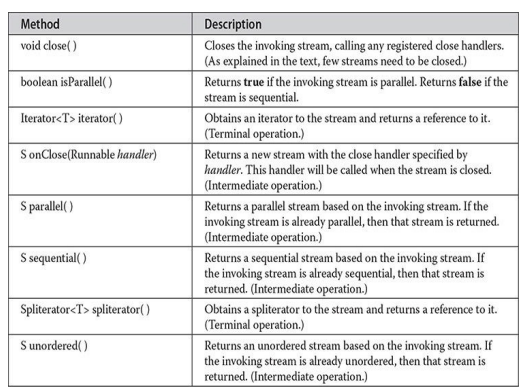
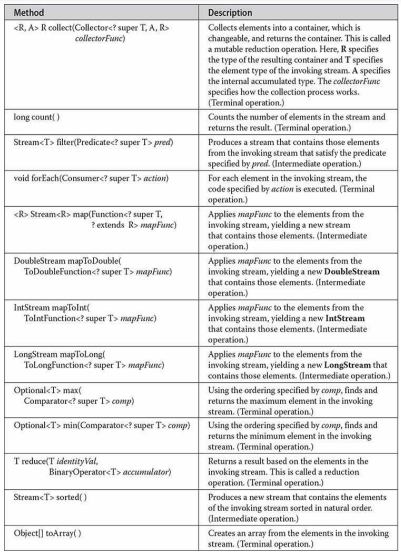

---
title: 'The Stream API'
weight: 10
--- 


# CHAPTER 29 The Stream API


****

Of the many new features recently added to Java, two of the most important are lambda expressions and the stream API. Lambda expressions were described in Chapter 15. The stream API is described here. As you will see, the stream API is designed with lambda expressions in mind. Moreover, the stream API provides some of the most significant demonstrations of the power that lambdas bring to Java.

Although its design compatibility with lambda expressions is impressive, the key aspect of the stream API is its ability to perform very sophisticated operations that search, filter, map, or otherwise manipulate data. For example, using the stream API, you can construct sequences of actions that resemble, in concept, the type of database queries for which you might use SQL. Furthermore, in many cases, such actions can be performed in parallel, thus providing a high level of efficiency, especially when large data sets are involved. Put simply, the stream API provides a powerful means of handling data in an efficient, yet easy to use way.

Before continuing, an important point needs to be made: The stream API uses some of Java’s most advanced features. To fully understand and utilize it requires a solid understanding of generics and lambda expressions. The basic concepts of parallel execution and a working knowledge of the Collections Framework are also needed. (See Chapters 14, 15, 19, and 28.)

## Stream Basics

 Let’s begin by defining the term stream as it applies to the stream API: a stream is a conduit for data. Thus, a stream represents a sequence of objects. A stream operates on a data source, such as an array or a collection. A stream, itself, never provides storage for the data. It simply moves data, possibly filtering, sorting, or otherwise operating on that data in the process. As a general rule, however, a stream operation by itself does not modify the data source. For example, sorting a stream does not change the order of the source. Rather, sorting a stream results in the creation of a new stream that produces the sorted result.  

**NOTE**

 It is necessary to state that the term stream as used here differs from the use of stream when the I/O classes were described earlier in this book. Although an I/O stream can act conceptually much like one of the streams defined by **java.util.stream**, they are not the same. Thus, throughout this chapter, when the term stream is used, it refers to objects based on one of the stream types described here.

### Stream Interfaces

 The stream API defines several stream interfaces, which are packaged in **java.util.stream** and contained in the **java.base** module. At the foundation is **BaseStream**, which defines the basic functionality available in all streams. **BaseStream** is a generic interface declared like this:

interface BaseStream<T, S extends BaseStream<T, S>>

Here, **T** specifies the type of the elements in the stream, and **S** specifies the type of stream that extends **BaseStream**. **BaseStream** extends the **AutoCloseable** interface; thus, a stream can be managed in a **try**\-with- resources statement. In general, however, only those streams whose data source requires closing (such as those connected to a file) will need to be closed. In most cases, such as those in which the data source is a collection, there is no need to close the stream. The methods declared by **BaseStream** are shown in Table 29-1.  

**Table 29-1** The Methods Declared by **BaseStream**

From **BaseStream** are derived several types of stream interfaces. The most general of these is **Stream**. It is declared as shown here:

interface Stream<T>

Here, **T** specifies the type of the elements in the stream. Because it is generic, **Stream** is used for all reference types. In addition to the methods that it inherits from **BaseStream**, the **Stream** interface adds several of its own, a sampling of which is shown in Table 29-2.  

**Table 29-2** A Sampling of Methods Declared by **Stream**

In both tables, notice that many of the methods are notated as being either terminal or intermediate. The difference between the two is very important. A terminal operation consumes the stream. It is used to produce a result, such as finding the minimum value in the stream, or to execute some action, as is the case with the **forEach()** method. Once a stream has been consumed, it cannot be reused. Intermediate operations produce another stream. Thus, intermediate operations can be used to create a pipeline that performs a sequence of actions. One other point: intermediate operations do not take place immediately. Instead, the specified action is performed when a terminal operation is executed on the new stream created by an intermediate operation. This mechanism is referred to as _lazy behavior,_ and the intermediate operations are referred to as _lazy._ The use of lazy behavior enables the stream API to perform more efficiently.

Another key aspect of streams is that some intermediate operations are stateless and some are stateful. In a stateless operation, each element is processed independently of the others. In a stateful operation, the processing of an element may depend on aspects of the other elements. For example, sorting is a stateful operation because an element’s order depends on the values of the other elements. Thus, the **sorted()** method is stateful. However, filtering elements based on a stateless predicate is stateless because each element is handled individually. Thus, **filter()** can (and should be) stateless. The difference between stateless and stateful operations is especially important when parallel processing of a stream is desired because a stateful operation may require more than one pass to complete.

Because **Stream** operates on object references, it can’t operate directly on primitive types. To handle primitive type streams, the stream API defines the following interfaces:

DoubleStream

IntStream

LongStream

These streams all extend **BaseStream** and have capabilities similar to **Stream** except that they operate on primitive types rather than reference types. They also provide some convenience methods, such as **boxed()**, that facilitate  

their use. Because streams of objects are the most common, **Stream** is the primary focus of this chapter, but the primitive type streams can be used in much the same way.

### How to Obtain a Stream

 You can obtain a stream in a number of ways. Perhaps the most common is when a stream is obtained for a collection. Beginning with JDK 8, the **Collection** interface was expanded to include two methods that obtain a stream from a collection. The first is **stream()**, shown here:

default Stream<E> stream()

Its default implementation returns a sequential stream. The second method is **parallelStream()**, shown next:

default Stream<E> parallelStream()

Its default implementation returns a parallel stream, if possible. (If a parallel stream can not be obtained, a sequential stream may be returned instead.) Parallel streams support parallel execution of stream operations. Because **Collection** is implemented by every collection, these methods can be used to obtain a stream from any collection class, such as **ArrayList** or **HashSet**.

A stream can also be obtained from an array by use of the static **stream()** method, which was added to the **Arrays** class. One of its forms is shown here:

static <T> Stream<T> stream(T[ ] array)

This method returns a sequential stream to the elements in array. For example, given an array called **addresses** of type **Address**, the following obtains a stream to it:

Stream<Address> addrStrm = Arrays.stream(addresses);

Several overloads of the **stream()** method are also defined, such as those that handle arrays of the primitive types. They return a stream of type **IntStream**, **DoubleStream**, or **LongStream**.

Streams can be obtained in a variety of other ways. For example, many stream operations return a new stream, and a stream to an I/O source can be obtained by calling **lines()** on a **BufferedReader**. However a stream is obtained, it can be used in the same way as any other stream.  

### A Simple Stream Example

 Before going any further, let’s work through an example that uses streams. The following program creates an **ArrayList** called **myList** that holds a collection of integers (which are automatically boxed into the **Integer** reference type). Next, it obtains a stream that uses **myList** as a source. It then demonstrates various stream operations.  
```
// Demonstrate several stream operations.
import java.util.*;
import
java.util.stream.*;
class StreamDemo {
public static void main(String[] args) {
// Create a list of Integer values. ArrayList<Integer> myList
new ArrayList<>();
myList.add(7);
myList.add(18);
myList.add(10);
myList.add(24);
myList.add(17);
myList.add(5);
System.out.println("Original list: + myList);
// Obtain a Stream to the array list.
Stream<Integer> mystream
myList.stream();
// Obtain the minimum and maximum value by use of min(), //max(), isPresent (), and get ().
Optional<Integer> minVal myStream.min (Integer::compare); if (minVal.isPresent (1)) System.out.println("Minimum value: " + minVal.get());
// Must obtain a new stream because previous call to min() // is a terminal operation that consumed the stream. myStream myList.stream();
Optional<Integer> maxValmyStream.max (Integer: : compare); if (maxVal.isPresent()) System.out.println("Maximum value: " maxVal.get());
// Sort the stream by use of sorted().
Stream<Integer> sortedStream myList.stream().sorted();
// Display the sorted stream by use of forEach(). System.out.print ("Sorted stream: ");
sortedStream.forEach((n)-> System.out.print (n + ")); System.out.println();
// Display only the odd values by use of filter(). Stream<Integer> oddVals-
myList.stream().sorted().filter((n)-> (n = 2) == 1);
System.out.print ("Odd values: ");
oddVals.forEach((n) -> System.out.print ("")); System.out.println();
// Display only the odd values that are greater than 5. Notice that // two filter operations are pipelined.
oddVals
myList.stream().filter( (n) ->(n 2) 1) .filter((n)->n> 5);
System.out.print ("Odd values greater than 5: ");
oddVals.forEach((n) -> System.out.println();
System.out.print (n + " "));}}
```
The output is shown here:

Original list: [7, 18, 10, 24, 17, 5]

Minimum value: 5

Maximum value: 24

Sorted stream: 5 7 10 17 18 24

Odd values: 5 7 17

Odd values greater than 5: 7 17

Let’s look closely at each stream operation. After creating an **ArrayList**, the program obtains a stream for the list by calling **stream()**, as shown here:
```
Stream<Integer> myStream = myList.stream();
```
As explained, the **Collection** interface defines the **stream()** method, which obtains a stream from the invoking collection. Because **Collection** is implemented by every collection class, **stream()** can be used to obtain a stream for any type of collection, including the **ArrayList** used here. In this case, a reference to the stream is assigned to **myStream**.

Next, the program obtains the minimum value in the stream (which is, of course, also the minimum value in the data source) and displays it, as shown here:
```
Optional<Integer> minVal = myStream.min (Integer::compare); if (minVal.isPresent ()) System.out.println("Minimum value: minVal.get());
```
Recall from Table 29-2 that **min()** is declared like this:

Optional<T> min(Comparator<? super T> comp)

First, notice that the type of **min()’**s parameter is a **Comparator**. This comparator is used to compare two elements in the stream. In the example, **min()** is passed a method reference to **Integer**’s **compare()** method, which is used to implement a **Comparator** capable of comparing two **Integer**s. Next, notice that the return type of **min()** is **Optional**. The **Optional** class is  

described in Chapter 20, but briefly, here is how it works. **Optional** is a generic class packaged in **java.util** and declared like this:

class Optional<T>

Here, **T** specifies the element type. An **Optional** instance can either contain a value of type **T** or be empty. You can use **isPresent()** to determine if a value is present. Assuming that a value is available, it can be obtained by calling **get()**, or if you are using JDK 10 or later, **orElseThrow()**. Here, **get()** is used. In this example, the object returned will hold the minimum value of the stream as an **Integer** object.

One other point about the preceding line: **min()** is a terminal operation that consumes the stream. Thus, **myStream** cannot be used again after **min()** executes.

The next lines obtain and display the maximum value in the stream:
```
myStream myList.stream();
Optional <Integer> maxVal = myStream.max (Integer::compare);
if (maxVal.isPresent()) System.out.println("Maximum value: " + maxVal.get());
```
First, **myStream** is once again assigned the stream returned by **myList.stream()**. As just explained, this is necessary because the previous call to **min()** consumed the previous stream. Thus, a new one is needed. Next, the **max()** method is called to obtain the maximum value. Like **min()**, **max()** returns an **Optional** object. Its value is obtained by calling **get()**.

The program then obtains a sorted stream through the use of this line:
```
Stream<Integer> sortedStream = myList.stream().sorted();
```
Here, the **sorted()** method is called on the stream returned by **myList.stream()**. Because **sorted()** is an intermediate operation, its result is a new stream, and this is the stream assigned to **sortedStream**. The contents of the sorted stream are displayed by use of **forEach()**:
```
sortedStream.forEach((n) -> System.out.print(n + " "));
```
Here, the **forEach()** method executes an operation on each element in the stream. In this case, it simply calls **System.out.print()** for each element in **sortedStream**. This is accomplished by use of a lambda expression. The  

**forEach()** method has this general form:

void forEach(Consumer<? super T> action)

**Consumer**is a generic functional interface declared in **java.util.function**. Its abstract method is **accept()**, shown here:

void accept(T objRef)

The lambda expression in the call to **forEach()** provides the implementation of **accept()**. The **forEach()** method is a terminal operation. Thus, after it completes, the stream has been consumed.

Next, a sorted stream is filtered by **filter()** so that it contains only odd values:
```
Stream<Integer> oddVals=
myList.stream().sorted().filter((n)-> (2) ==
1);
```
The **filter()** method filters a stream based on a predicate. It returns a new stream that contains only those elements that satisfy the predicate. It is shown here:

Stream<T> filter(Predicate<? super T> pred)

**Predicate**is a generic functional interface defined in **java.util.function**. Its abstract method is **test()**, which is shown here:

boolean test(T objRef)

It returns **true** if the object referred to by objRef satisfies the predicate, and **false** otherwise. The lambda expression passed to **filter()** implements this method. Because **filter()** is an intermediate operation, it returns a new stream that contains filtered values, which, in this case, are the odd numbers. These elements are then displayed via **forEach()** as before.

Because **filter()**, or any other intermediate operation, returns a new stream, it is possible to filter a filtered stream a second time. This is demonstrated by the following line, which produces a stream that contains only those odd values greater than 5:  
```
oddVals myList.stream().filter((n) -> (n = 2) == 1)
.filter((n)->n> 5);
```
Notice that lambda expressions are passed to both filters.

## Reduction Operations

 Consider the **min()** and **max()** methods in the preceding example program. Both are terminal operations that return a result based on the elements in the stream. In the language of the stream API, they represent _reduction operations_ because each reduces a stream to a single value—in this case, the minimum and maximum. The stream API refers to these as _special case_ reductions because they perform a specific function. In addition to **min()** and **max()**, other special case reductions are also available, such as **count()**, which counts the number of elements in a stream. However, the stream API generalizes this concept by providing the **reduce()** method. By using **reduce()**, you can return a value from a stream based on any arbitrary criteria. By definition, all reduction operations are terminal operations.

**Stream**defines three versions of **reduce()**. The two we will use first are shown here:

Optional<T> reduce(BinaryOperator<T> accumulator)

T reduce(T identityVal, BinaryOperator<T> accumulator)

The first form returns an object of type **Optional**, which contains the result. The second form returns an object of type **T** (which is the element type of the stream). In both forms, accumulator is a function that operates on two values and produces a result. In the second form, identityVal is a value such that an accumulator operation involving identityVal and any element of the stream yields that element, unchanged. For example, if the operation is addition, then the identity value will be 0 because 0 + x is x. For multiplication, the value will be 1, because 1 * x is x.

**BinaryOperator**is a functional interface declared in **java.util.function** that extends the **BiFunction** functional interface. **BiFunction** defines this abstract method:

R apply(T val, U _val2_)

Here, **R** specifies the result type, **T** is the type of the first operand, and **U** is the type of second operand. Thus, **apply()** applies a function to its two operands (val and _val2_) and returns the result. When **BinaryOperator** extends  

**BiFunction**, it specifies the same type for all the type parameters. Thus, as it relates to **BinaryOperator**, **apply()** looks like this:

T apply(T val, T _val2_)

Furthermore, as it relates to **reduce()**, val will contain the previous result and _val2_ will contain the next element. In its first invocation, val will contain either the identity value or the first element, depending on which version of **reduce()** is used.

It is important to understand that the accumulator operation must satisfy three constraints. It must be

- Stateless
- Non-interfering
- Associative

As explained earlier, stateless means that the operation does not rely on any state information. Thus, each element is processed independently. _Non- interfering_ means that the data source is not modified by the operation. Finally, the operation must be associative. Here, the term associative is used in its normal, arithmetic sense, which means that, given an associative operator used in a sequence of operations, it does not matter which pair of operands are processed first. For example,

(10 * 2) * 7

yields the same result as

10 * (2 * 7)

Associativity is of particular importance to the use of reduction operations on parallel streams, discussed in the next section.

The following program demonstrates the versions of **reduce()** just described:  
```
// Demonstrate the reduce () method.
import java.util.*;
import java.util.stream.*;
class StreamDemo2 {
public static void main(String[] args) {
// Create a list of Integer values. ArrayList<Integer> myList = new ArrayList<>();
myList.add(7);
myList.add(18);
myList.add(10);
myList.add(24);
myList.add(17);
myList.add(5);
// Two ways to obtain the integer product of the elements // in myList by use of reduce().
Optional<Integer> productObj = myList.stream().reduce((a, b) -> a+b);
if (productObj.isPresent())
System.out.println("Product as Optional:
productObj.get());
int product myList.stream().reduce (1, (a, b) -> a+b); System.out.println("Product as int: " + product);}}
```
As the output here shows, both uses of **reduce()** produce the same result:

Product as Optional: 2570400

Product as int: 2570400

In the program, the first version of **reduce()** uses the lambda expression to produce a product of two values. In this case, because the stream contains **Integer** values, the **Integer** objects are automatically unboxed for the multiplication and reboxed to return the result. The two values represent the current value of the running result and the next element in the stream. The final result is returned in an object of type **Optional**. The value is obtained by calling **get()** on the returned object.

In the second version, the identity value is explicitly specified, which for  

multiplication is 1. Notice that the result is returned as an object of the element type, which is **Integer** in this case.

Although simple reduction operations such as multiplication are useful for examples, reductions are not limited in this regard. For example, assuming the preceding program, the following obtains the product of only the even values:
```
int evenProduct myList.stream().reduce (1, (a, b) -> { if (b2 0) return a*b; else return a;
});
```
Pay special attention to the lambda expression. If **b** is even, then **a** * **b** is returned. Otherwise, **a** is returned. This works because **a** holds the current result and **b** holds the next element, as explained earlier.

## Using Parallel Streams

 Before exploring any more of the stream API, it will be helpful to discuss parallel streams. As has been pointed out previously in this book, the parallel execution of code via multicore processors can result in a substantial increase in performance. Because of this, parallel programming has become an important part of the modern programmer’s job. However, parallel programming can be complex and error-prone. One of the benefits that the stream library offers is the ability to easily—and reliably—parallel process certain operations.

Parallel processing of a stream is quite simple to request: just use a parallel stream. As mentioned earlier, one way to obtain a parallel stream is to use the **parallelStream()** method defined by **Collection**. Another way to obtain a parallel stream is to call the **parallel()** method on a sequential stream. The **parallel()** method is defined by **BaseStream**, as shown here:

S parallel()

It returns a parallel stream based on the sequential stream that invokes it. (If it is called on a stream that is already parallel, then the invoking stream is returned.) Understand, of course, that even with a parallel stream, parallelism will be achieved only if the environment supports it.

Once a parallel stream has been obtained, operations on the stream can occur in parallel, assuming that parallelism is supported by the environment. For example, the first **reduce()** operation in the preceding program can be  

parallelized by substituting **parallelStream()** for the call to **stream()**:
```
Optional<Integer> productObj =

myList.parallelStream().reduce((a,b) -> a*b);
```
The results will be the same, but the multiplications can occur in different threads.

As a general rule, any operation applied to a parallel stream must be stateless. It should also be non-interfering and associative. This ensures that the results obtained by executing operations on a parallel stream are the same as those obtained from executing the same operations on a sequential stream.

When using parallel streams, you might find the following version of **reduce()** especially helpful. It gives you a way to specify how partial results are combined:

 U reduce(U identity Val, BiFunction,? super T,  accumulator BinaryOperator combiner)

In this version, combiner defines the function that combines two values that have been produced by the accumulator function. Assuming the preceding program, the following statement computes the product of the elements in **myList** by use of a parallel stream:
```
int parallel Product myList.parallelStream().reduce(1, (a,b) ->
a*b, (a,b) -> a+b);
```
As you can see, in this example, both the accumulator and combiner perform the same function. However, there are cases in which the actions of the accumulator must differ from those of the combiner. For example, consider the following program. Here, **myList** contains a list of **double** values. It then uses the combiner version of **reduce()** to compute the product of the _square roots_ of each element in the list.  
```
// Demonstrate the use of a combiner with reduce()
import java.util.*;
import java.util.stream.*;
class StreamDemo 3 {
public static void main(String[] args) {
// This is now a list of double values. ArrayList<Double> myList = new ArrayList<>();
myList.add(7.0);
myList.add(18.0);
myList.add(10.0);
myList.add(24.0);
myList.add(17.0);
myList.add(5.0);
double product of SqrRoots = myList.parallelStream().reduce(
1.0, (a, b) (a, b) -> a
a
Math.sqrt(b),
b
);
System.out.println("Product of square roots: " + productof SqrRoots);}}
```
Notice that the accumulator function multiplies the square roots of two elements, but the combiner multiplies the partial results. Thus, the two functions differ. Moreover, for this computation to work correctly, they must differ. For example, if you tried to obtain the product of the square roots of the elements by using the following statement, an error would result:
```
// This won't work.
double product of SqrRoots2= myList.parallelStream().reduce(
1.0,
(a, b) a Math.sqrt(b));
```
In this version of **reduce()**, the accumulator and the combiner function are one and the same. This results in an error because when two partial results are combined, their square roots are multiplied together rather than the partial  
results, themselves. As a point of interest, if the stream in the preceding call to **reduce()** had been changed to a sequential stream, then the operation would yield the correct answer because there would have been no need to combine two partial results. The problem occurs when a parallel stream is used.

You can switch a parallel stream to sequential by calling the **sequential()** method, which is specified by **BaseStream**. It is shown here:

S sequential()

In general, a stream can be switched between parallel and sequential on an as- needed basis.

There is one other aspect of a stream to keep in mind when using parallel execution: the order of the elements. Streams can be either ordered or unordered. In general, if the data source is ordered, then the stream will also be ordered. However, when using a parallel stream, a performance boost can sometimes be obtained by allowing a stream to be unordered. When a parallel stream is unordered, each partition of the stream can be operated on independently, without having to coordinate with the others. In cases in which the order of the operations does not matter, it is possible to specify unordered behavior by calling the **unordered()** method, shown here:

S unordered()

One other point: the **forEach()** method may not preserve the ordering of a parallel stream. If you want to perform an operation on each element in a parallel stream while preserving the order, consider using **forEachOrdered()**. It is used just like **forEach()**.

## Mapping

 Often it is useful to map the elements of one stream to another. For example, a stream that contains a database of name, telephone, and e-mail address information might map only the name and e-mail address portions to another stream. As another example, you might want to apply some transformation to the elements in a stream. To do this, you could map the transformed elements to a new stream. Because mapping operations are quite common, the stream API provides built-in support for them. The most general mapping method is  

**map()**. It is shown here:

<R> Stream<R> map(Function<? super T, ? extends R> mapFunc)

Here, **R** specifies the type of elements of the new stream; **T** is the type of elements of the invoking stream; and mapFunc is an instance of **Function**, which does the mapping. The map function must be stateless and non- interfering. Since a new stream is returned, **map()** is an intermediate method.

**Function**is a functional interface declared in **java.util.function**. It is declared as shown here:

Function<T, R>

As it relates to **map()**, **T** is the element type and **R** is the result of the mapping. **Function** has the abstract method shown here:

R apply(T val)

Here, val is a reference to the object being mapped. The mapped result is returned.

The following is a simple example of **map()**. It provides a variation on the previous example program. As before, the program computes the product of the square roots of the values in an **ArrayList**. In this version, however, the square roots of the elements are first mapped to a new stream. Then, **reduce()** is employed to compute the product.  
```
// Map one stream to another.
import java.util.*;
import java.util.stream.*;
class StreamDemo4 {
public static void main(String[] args) {
// A list of double values.
ArrayList<Double> myList = new ArrayList<>();
myList.add(7.0);
myList.add(18.0);
myList.add(10.0);
myList.add(24.0);
myList.add(17.0);
myList.add(5.0);
// Map the square root of the elements in myList to a new stream. Stream<Double> sqrtRootStrm myList.stream().map((a)-> Math.sqrt(a));
// Find the product of the square roots.
double productOfSqrRoots = sqrtRootStrm. reduce (1.0, (a, b) -> a+b);
System.out.println("Product of square roots is product of SqrRoots);}}
```
The output is the same as before. The difference between this version and the previous is simply that the transformation (i.e., the computation of the square roots) occurs during mapping, rather than during the reduction. Because of this, it is possible to use the two-parameter form of **reduce()** to compute the product because it is no longer necessary to provide a separate combiner function.

Here is an example that uses **map()** to create a new stream that contains only selected fields from the original stream. In this case, the original stream contains objects of type **NamePhoneEmail**, which contains names, phone numbers, and e-mail addresses. The program then maps only the names and phone numbers to a new stream of **NamePhone** objects. The e-mail addresses are discarded.  
```
// Use map() to create a new stream that contains only // selected aspects of the original stream.
import java.util.*;
import java.util.stream.*;
class Name Phone Email {
String name;
String phonenum;
String email;
Name Phone Email (String n, String p, String e) {
name = n;
phonenum p; email e;}}
class Name Phone {
String name;
String phonenum;
Name Phone (String n, String p) {
name = n; phonenum p;}}

class StreamDemo5 {
public static void main(String[] args) {
// A list of names, phone numbers, and e-mail addresses. ArrayList<NamePhoneEmail> myList new ArrayList<>();
myList.add(new Name Phone Email ("Larry", "555-5555",
"Larry HerbSchildt.com")); myList.add(new Name Phone Email ("James", "555-4444", "James@HerbSchildt.com"));
myList.add(new Name Phone Email ("Mary", "555-3333",
"Mary HerbSchildt.com"));
System.out.println("Original values in myList: "); myList.stream().forEach( (a)->{
System.out.println(a.name + a.phonenuma.email);
});
System.out.println();
// Map just the names and phone numbers to a new stream. Stream<NamePhone> nameAndPhone = myList.stream().map(
(a) -> new Name Phone (a.name, a.phonenum) );
System.out.println("List of names and phone numbers: "); nameAndPhone.forEach( (a) -> {
System.out.println(a.name" + a.phonenum);
});}}
```
The output, shown here, verifies the mapping:

Because you can pipeline more than one intermediate operation together,  

you can easily create very powerful actions. For example, the following statement uses **filter()** and then **map()** to produce a new stream that contains only the name and phone number of the elements with the name "James":
```
Stream<Name Phone> nameAndPhone myList.stream().
filter((a)
a.name.equals("James")). map ((a) -> new Name Phone (a.name, a.phonenum));
```
This type of filter operation is very common when creating database-style queries. As you gain experience with the stream API, you will find that such chains of operations can be used to create very sophisticated queries, merges, and selections on a data stream.

In addition to the version just described, three other versions of **map()** are provided. They return a primitive stream, as shown here:

IntStream mapToInt(ToIntFunction<? super T> mapFunc)

LongStream mapToLong(ToLongFunction<? super T> mapFunc)

DoubleStream mapToDouble(ToDoubleFunction<? super T> mapFunc)

Each mapFunc must implement the abstract method defined by the specified interface, returning a value of the indicated type. For example, **ToDoubleFunction** specifies the **applyAsDouble(T** **val** **)** method, which must return the value of its parameter as a **double**.

Here is an example that uses a primitive stream. It first creates an **ArrayList** of **Double** values. It then uses **stream()** followed by **mapToInt()** to create an **IntStream** that contains the ceiling of each value.  
```
// Map a Stream to an IntStream.
import java.util.*;
import java.util.stream.*;
class StreamDemo6 {
public static void main(String[] args) {
// A list of double values.
ArrayList<Double> myList = new ArrayList<>();
myList.add(1.1);
myList.add(3.6);
myList.add(9.2);
myList.add(4.7);
myList.add(12.1);
myList.add(5.0);
System.out.print ("Original values in myList: "); myList.stream().forEach((a) -> { System.out.print (a+" ");
System.out.println();
// Map the ceiling of the elements in myList to an IntStream. IntStream cStrm
myList.stream().mapToInt((a)-> (int) Math.ceil(a));
System.out.print ("The ceilings of the values in myList: "); cStrm.forEach((a)-> )
System.out.print (a + " ");
});}}
```
The output is shown here:

Original values in myList: 1.1 3.6 9.2 4.7 12.1 5.0

The ceilings of the values in myList: 2 4 10 5 13 5

The stream produced by **mapToInt()** contains the ceiling values of the original elements in **myList**.

Before leaving the topic of mapping, it is necessary to point out that the  

stream API also provides methods that support _flat maps_. These are **flatMap()**, **flatMapToInt()**, **flatMapToLong()**, and **flatMapToDouble()**. The flat map methods are designed to handle situations in which each element in the original stream is mapped to more than one element in the resulting stream.

## Collecting

 As the preceding examples have shown, it is possible (indeed, common) to obtain a stream from a collection. Sometimes it is desirable to obtain the opposite: to obtain a collection from a stream. To perform such an action, the stream API provides the **collect()** method. It has two forms. The one we will use first is shown here:

<R, A> R collect(Collector<? super T, A, R> collectorFunc)

Here, **R** specifies the type of the result, and **T** specifies the element type of the invoking stream. The internal accumulated type is specified by **A**. The collectorFunc specifies how the collection process works. The **collect()** method is a terminal operation.

The **Collector** interface is declared in **java.util.stream**, as shown here:

interface Collector<T, A, R>

**T**, **A**, and **R** have the same meanings as just described. **Collector** specifies several methods, but for the purposes of this chapter, we won’t need to implement them. Instead, we will use two of the predefined collectors that are provided by the **Collectors** class, which is packaged in **java.util.stream**.

The **Collectors** class defines a number of static collector methods that you can use as-is. The two we will use are **toList()** and **toSet()**, shown here:

static <T> Collector<T, ?, List<T>> toList()

static <T> Collector<T, ?, Set<T>> toSet()

The **toList()** method returns a collector that can be used to collect elements into a **List**. The **toSet()** method returns a collector that can be used to collect elements into a **Set**. For example, to collect elements into a **List**, you can call **collect()** like this:  
```
collect(Collectors.toList())
```
The following program puts the preceding discussion into action. It reworks the example in the previous section so that it collects the names and phone numbers into a **List** and a **Set**.  
```
// Use collect() to create a List and a Set from a stream.
import java.util.*;
import java.util.stream.*;
class Name Phone Email {
String name;
String phonenum;
String email;
Name Phone Email (String n, String p, String e) {
name =n;
phonenum = P; email e;}}
class Name Phone {
String name;
String phonenum;
Name Phone (String n, String p) {
namen; phonenum P:}}
class StreamDemo7 {
public static void main(String[] args) {
// A list of names, phone numbers, and e-mail addresses. ArrayList<Name PhoneEmail> myList = new ArrayList<>();
myList.add(new Name Phone Email ("Larry", "555-5555",
"Larry HerbSchildt.com")); myList.add(new Name PhoneEmail ("James", "555-4444", "James@HerbSchildt.com"));
myList.add(new Name PhoneEmail ("Mary", "555-3333", "Mary@HerbSchildt.com"));
// Map just the names and phone numbers to a new stream. Stream<NamePhone> nameAndPhone myList.stream().map(
(a) new Name Phone (a.name, a.phonenum));
// Use collect to create a List of the names and phone numbers. List<NamePhone> npList nameAndPhone.collect (Collectors.toList());
System.out.println("Names and phone numbers in a List:"); for (Name Phone e npList)
System.out.println(e.name+":"+e.phonenum);
// Obtain another mapping of the names and phone numbers. nameAndPhone myList.stream().map(
(a)-> new Name Phone (a.name, a.phonenum)
);
// Now, create a Set by use of collect().
Set<Name Phone> npSet
nameAndPhone.collect (Collectors.toSet());
System.out.println("\nNames and phone numbers in a Set: ");
for (Name Phone e npset)
System.out.println(e.name+":"+e.phonenum);}}
```
The output is shown here:

Names and phone numbers in a List: Larry: 555-5555
James: 555-4444 Mary: 555-3333
Names and phone numbers in a Set:
James: 555-4444
Larry: 555-5555 Mary: 555-3333

In the program, the following line collects the name and phone numbers into a **List** by using **toList()**:

List<NamePhone> npList =

nameAndPhone.collect(Collectors.toList());

After this line executes, the collection referred to by **npList** can be used like any other **List** collection. For example, it can be cycled through by using a for- each **for** loop, as shown in the next line:  
```
for (Name Phone e npList)
System.out.println(e.name + ": +e.phonenum);
```
The creation of a **Set** via **collect(Collectors.toSet())** works in the same way. The ability to move data from a collection to a stream, and then back to a collection again is a very powerful attribute of the stream API. It gives you the ability to operate on a collection through a stream, but then repackage it as a collection. Furthermore, the stream operations can, if appropriate, occur in parallel.

The version of **collect()** used by the previous example is quite convenient, and often the one you want, but there is a second version that gives you more control over the collection process. It is shown here:

Here, target specifies how the object that holds the result is created. For example, to use a **LinkedList** as the result collection, you would specify its constructor. The accumulator function adds an element to the result and combiner combines two partial results. Thus, these functions work similarly to the way they do in **reduce()**. For both, they must be stateless and non- interfering. They must also be associative.

Note that the target parameter is of type **Supplier**. It is a functional interface declared in **java.util.function**. It specifies only the **get()** method, which has no parameters and, in this case, returns an object of type **R**. Thus, as it relates to **collect()**, **get()** returns a reference to a mutable storage object, such as a collection.

Note also that the types of accumulator and combiner are **BiConsumer**. This is a functional interface defined in **java.util.function**. It specifies the abstract method **accept()** that is shown here:

void accept(T obj, U _obj2_)

This method performs some type of operation on obj and _obj2_. As it relates to accumulator, obj specifies the target collection, and _obj2_ specifies the element to add to that collection. As it relates to _combiner, obj_ and _obj2_ specify two collections that will be combined.

Using the version of **collect()** just described, you could use a **LinkedList** as the target in the preceding program, as shown here:  
```
LinkedList<NamePhone> npList nameAndPhone.collect( ()->new LinkedList<>(),
(list, element) -> list.add(element),
(listA, listB) -> listA.addAll(list));
```
Notice that the first argument to **collect()** is a lambda expression that returns a new **LinkedList**. The second argument uses the standard collection method **add()** to add an element to the list. The third element uses **addAll()** to combine two linked lists. As a point of interest, you can use any method defined by **LinkedList** to add an element to the list. For example, you could use **addFirst()** to add elements to the start of the list, as shown here:

(list, element) -> list.addFirst(element)

As you may have guessed, it is not always necessary to specify a lambda expression for the arguments to **collect()**. Often, method and/or constructor references will suffice. For example, again assuming the preceding program, this statement creates a **HashSet** that contains all of the elements in the **nameAndPhone** stream:
```
HashSet<NamePhone> npset nameAndPhone.collect (HashSet::new,
HashSet::add,
HashSet::addAll);
```
Notice that the first argument specifies the **HashSet** constructor reference. The second and third specify method references to **HashSet**’s **add()** and **addAll()** methods.

One last point: In the language of the stream API, the **collect()** method performs what is called a _mutable reduction_. This is because the result of the reduction is a mutable (i.e., changeable) storage object, such as a collection.

## Iterators and Streams

 Although a stream is not a data storage object, you can still use an iterator to cycle through its elements in much the same way as you would use an iterator to cycle through the elements of a collection. The stream API supports two types of iterators. The first is the traditional **Iterator**. The second is **Spliterator**, which was added by JDK 8. It provides significant advantages in certain situations when used with parallel streams.

### Use an Iterator with a Stream

 As just mentioned, you can use an iterator with a stream in just the same way that you do with a collection. Iterators are discussed in Chapter 19, but a brief review will be useful here. Iterators are objects that implement the **Iterator** interface declared in **java.util**. Its two key methods are **hasNext()** and **next()**. If there is another element to iterate, **hasNext()** returns **true**, and **false** otherwise. The **next()** method returns the next element in the iteration.

**NOTE**

 There are additional iterator types that handle the primitive streams: **PrimitiveIterator**, **PrimitiveIterator.OfDouble**, **PrimitiveIterator.OfLong**, and **PrimitiveIterator.OfInt**. These iterators all extend the **Iterator** interface and work in the same general way as those based directly on **Iterator**.

To obtain an iterator to a stream, call **iterator()** on the stream. The version used by **Stream** is shown here.

Iterator<T> iterator()

Here, **T** specifies the element type. (The primitive streams return iterators of the appropriate primitive type.)

The following program shows how to iterate through the elements of a stream. In this case, the strings in an **ArrayList** are iterated, but the process is the same for any type of stream.  
```
// Use an iterator with a stream.
import java.util.*;
import java.util.stream.*;
class StreamDemo8 {
public static void main(String[] args) {
// Create a list of Strings.
ArrayList<String> myList = new ArrayList<>();
myList.add("Alpha");
myList.add("Beta");
myList.add("Gamma");
myList.add("Delta");
myList.add("Phi");
myList.add("Omega");
// Obtain a Stream to the array list. Stream<String> myStream = myList.stream();
// Obtain an iterator to the stream. Iterator<String> itr myStream.iterator();
// Iterate the elements in the stream. while (itr.hasNext())
System.out.println(itr.next());}}
```
The output is shown here:

Alpha

Beta

Gamma

Delta

Phi

Omega

### Use Spliterator 

Spliterator offers an alternative to **Iterator**, especially when parallel processing is involved. In general, **Spliterator** is more sophisticated than  

**Iterator**, and a discussion of **Spliterator** is found in Chapter 19. However, it will be useful to review its key features here. **Spliterator** defines several methods, but we only need to use three. The first is **tryAdvance()**. It performs an action on the next element and then advances the iterator. It is shown here:

boolean tryAdvance(Consumer<? super T> action)

Here, action specifies the action that is executed on the next element in the iteration. **tryAdvance()** returns **true** if there is a next element. It returns **false** if no elements remain. As discussed earlier in this chapter, **Consumer** declares one method called **accept()** that receives an element of type **T** as an argument and returns **void**.

Because **tryAdvance()** returns **false** when there are no more elements to process, it makes the iteration loop construct very simple, for example:

while(splitItr.tryAdvance( // perform action here);

As long as **tryAdvance()** returns **true**, the action is applied to the next element. When **tryAdvance()** returns **false**, the iteration is complete. Notice how **tryAdvance()** consolidates the purposes of **hasNext()** and **next()** provided by **Iterator** into a single method. This improves the efficiency of the iteration process.

The following version of the preceding program substitutes a **Spliterator** for the **Iterator**:  
```
// Use a Spliterator.
import
import
java.util.*; java.util.stream.*;
class StreamDemo9 {
}
public static void main(String[] args) {
// Create a list of Strings.
ArrayList<String> myList = new ArrayList<>();
myList.add("Alpha");
myList.add("Beta");
myList.add("Gamma");
myList.add("Delta");
myList.add("Phi");
}
myList.add("Omega");
// Obtain a Stream to the array list. Stream<String> myStream = myList.stream();
// Obtain a Spliterator.
Spliterator<String> split Itr = myStream.spliterator();
// Iterate the elements of the stream.
while (splitItr.tryAdvance ((n) -> System.out.println(n)));
```
The output is the same as before. In some cases, you might want to perform some action on each element

collectively, rather than one at a time. To handle this type of situation, **Spliterator** provides the **forEachRemaining()** method, shown here:

default void forEachRemaining(Consumer<? super T> action)

This method applies action to each unprocessed element and then returns. For example, assuming the preceding program, the following displays the strings remaining in the stream:

splitItr.forEachRemaining((n) -> System.out.println(n));

Notice how this method eliminates the need to provide a loop to cycle through the elements one at a time. This is another advantage of **Spliterator**.

One other **Spliterator** method of particular interest is **trySplit()**. It splits the elements being iterated in two, returning a new **Spliterator** to one of the partitions. The other partition remains accessible by the original **Spliterator**. It is shown here:  

Spliterator<T> trySplit()

If it is not possible to split the invoking **Spliterator**, **null** is returned. Otherwise, a reference to the partition is returned. For example, here is another version of the preceding program that demonstrates **trySplit()**:  
```
// Demonstrate trySplit().
import java.util.*;
import
java.util.stream.*;

class StreamDemo10 {
public static void main(String[] args) {
// Create a list of Strings.
ArrayList<String> myList = new ArrayList<>();
myList.add("Alpha");
myList.add("Beta");
myList.add("Gamma");
myList.add("Delta");
myList.add("Phi");
myList.add("Omega");
// Obtain a Stream to the array list. Stream<String> myStream = myList.stream();
// Obtain a Spliterator.
Spliterator<String> splitItr = myStream.spliterator();
// Now, split the first iterator.
Spliterator<String> split Itr2 split Itr.trySplit();
// If splitItr could be split, use splitItr2 first. if (splitItr2 = null) {
}
System.out.println("Output from split Itr2: ");
split Itr2.forEachRemaining ((n) -> System.out.println(n));
// Now, use the splittr.
System.out.println("\noutput from splitItr: ");
splitItr.forEachRemaining ((n) -> System.out.println(n));}}
```
The output is shown here:

Output from splitItr2:

Alpha

Beta

Gamma

Output from splitItr:

Delta  

Phi

Omega

Although splitting the **Spliterator** in this simple illustration is of no practical value, splitting can be of _great value_ when parallel processing over large data sets. However, in many cases, it is better to use one of the other **Stream** methods in conjunction with a parallel stream, rather than manually handling these details with **Spliterator**. **Spliterator** is primarily for the cases in which none of the predefined methods seems appropriate.

## More to Explore in the Stream API

 This chapter has discussed several key aspects of the stream API and introduced the techniques required to use them, but the stream API has much more to offer. To begin, here are a few of the other methods provided by **Stream** that you will find helpful:

- To determine if one or more elements in a stream satisfy a specified predicate, use **allMatch()**, **anyMatch()**, or **noneMatch()**.

- To obtain the number of elements in the stream, call **count()**.
- To obtain a stream that contains only unique elements, use **distinct()**.
- To create a stream that contains a specified set of elements, use **of()**.

One last point: the stream API is a powerful addition to Java. You will want to explore all of the capabilities that **java.util.stream** has to offer.  